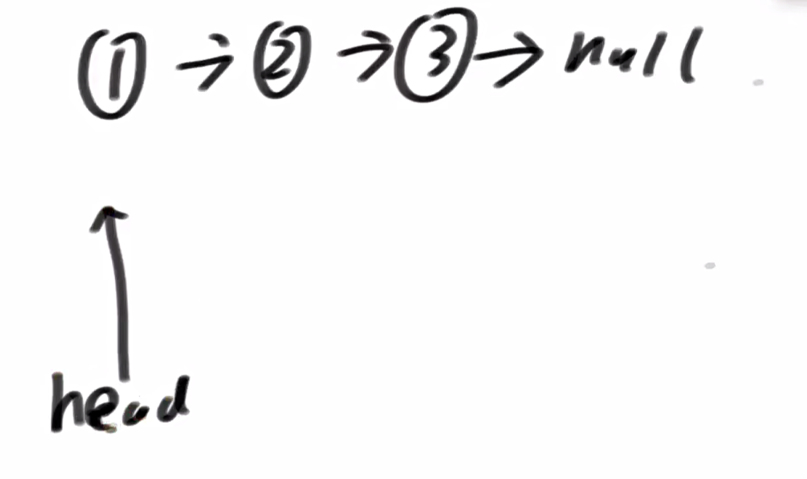
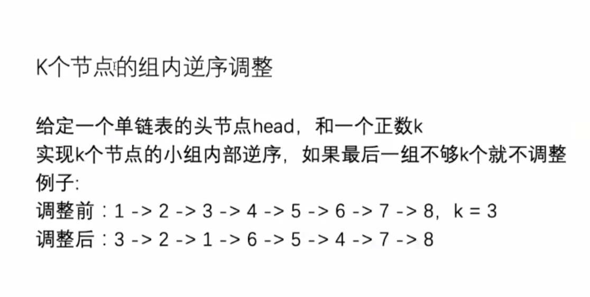
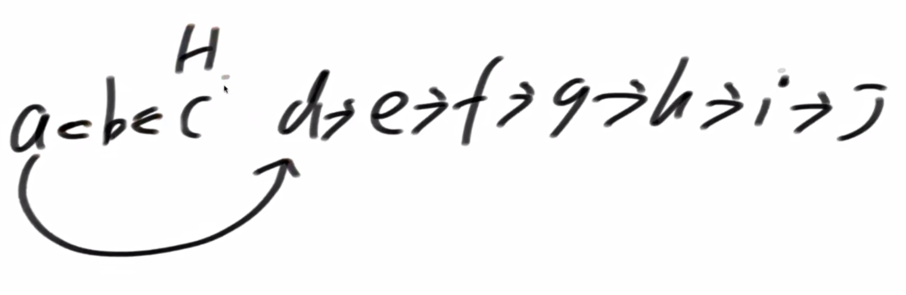
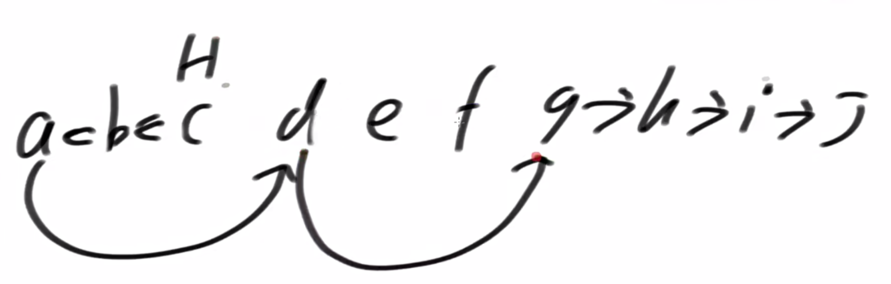
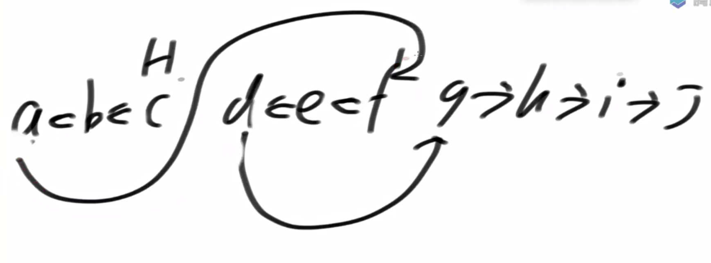
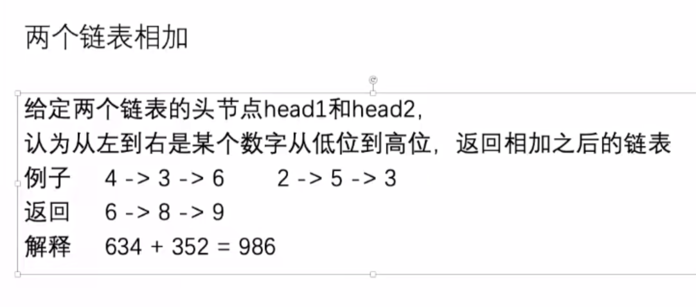
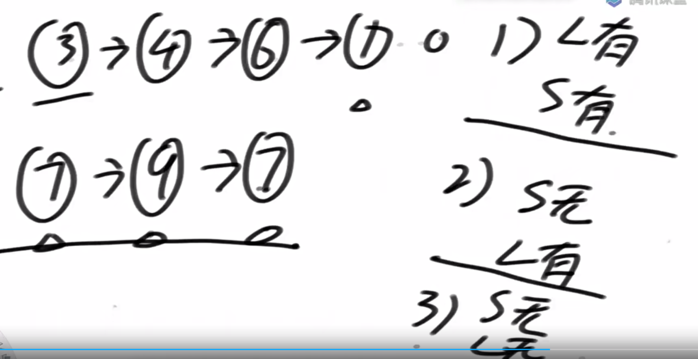
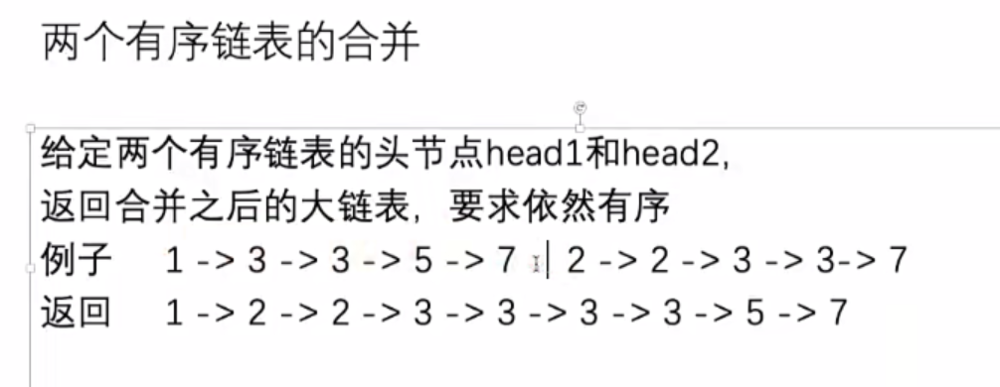
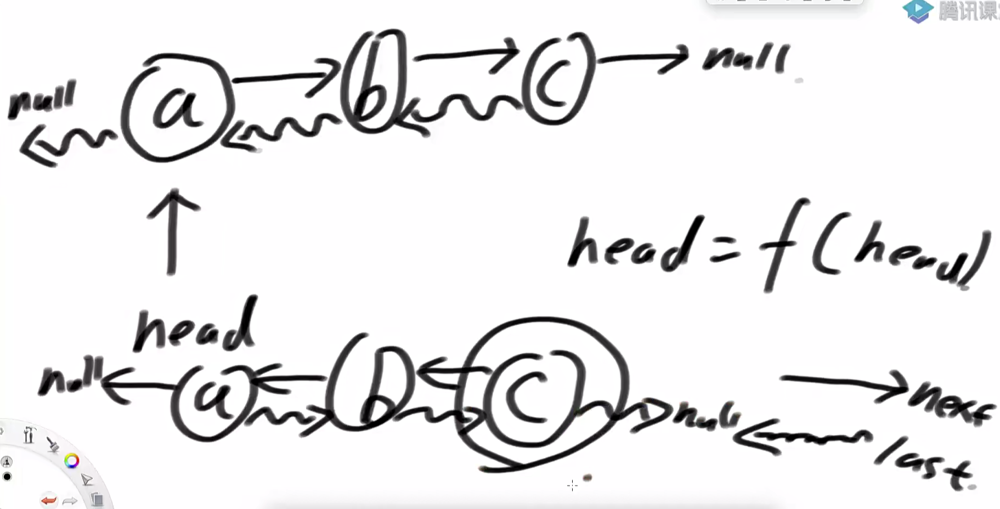
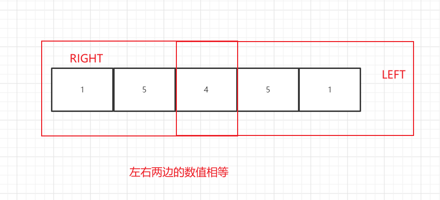

# Algorithm

- [基础知识](#基础知识)
    - [程序打印某个int数字的32bit字符](#程序打印某个int数字的32bit字符)
    - [计算阶乘](#计算阶乘)
    - [选择排序](#选择排序)
    - [冒泡排序](#冒泡排序)
    - [插入排序](#插入排序)
- [题目](#题目)
    - [二分查找算法](#二分查找算法)
    - [原地算法对单链表进行重排序](#原地算法对单链表进行重排序)

## 基础知识

- int类型用的是32bit进行存储，32位存储一个整形，最高位是符号位，1表示负数，0表示正数；负数的值是剩余31位数取反加一。

- 运算符

    - 左移：<<
    - 右移：>>
    - 取反：~

- 补码

    - 一个数取反加一，即相反数
    - 但是负数的值比正数多一个，因此整数类型的最小数取反就是它自己。0取反加一也是自己；
    - **符号位也要用于计算也需要取反**

- 带符号右移动

    - ```
        >> ： 用符号位来补
        ```

- 不带符号右移

    - ```
        >>>：用0来补
        ```

### 时间复杂度

- 最坏的情况下需要的**操作次数**，只看最高阶的
- 选择排序，插入，冒泡排序时间复杂度O(n^2)
- 二分查找算法时间复杂度O(logN)
- 常数操作时间复杂度是O(1) 

### 数组

- 内存地址连续，便于寻址，通过偏移量查询数据很方便，但是对于插入和删除数据不方便
- 插入和删除数据需要大量元素挪动位置

### TreeMap

- 有序表
- 红黑树

### 链表

- 内存地址不连续，因此查询不方便，需要一个一个结点遍历，适合删除和添加元素

#### 单链表



- 值 + next指针
- **构造单链表一定要返回head结点，不能是void**，如果是void返回值，那么JVM会把没有引用到的结点全部回收掉

##### 单链表反转

- 口诀：先留个备胎(next) -> 在断掉上一任(pre)的联系 -》前一任在脑海里挥之不去 -》 不行，得重新开始

    -  next = head.next;

    - head.next = pre;

    - pre = head; 

    - head = next;

        ```java
        package basic.class4;
        
        import util.SingleNode;
        import util.Util;
        
        public class SingleLinkedList
        {
            public static void main(String[] args)
            {
                SingleNode<Integer> head = constructLinkedList(10);
                Util.loopLinkedList(head);
        
                SingleNode newHead = reverseSingleLinkedList(head);
                Util.loopLinkedList(newHead);
            }
        
            public static SingleNode<Integer> constructLinkedList(final int LENGTH)
            {
                SingleNode<Integer> tail = null;
                SingleNode<Integer> head = null;
                for(int i=0;i<LENGTH;i++)
                {
                    SingleNode<Integer> newNode = new SingleNode(i);
                    if (head == null)
                    {
                        head = newNode;
                        tail = newNode;
                        continue;
                    }
        
                    //tail永远指向最后一个结点，添加新的元素只需要移动尾指针即可。
                    tail.next = new SingleNode<>(i);
                    tail = tail.next;
                }
                return head;
            }
        
            public static SingleNode<Integer> reverseSingleLinkedList(SingleNode<Integer> head)
            {
        
                SingleNode<Integer> pre = null;
                SingleNode<Integer> next = null;
                while(head != null)
                {
                    //保留备胎
                    next = head.next;
                    //断掉联系
                    head.next = pre;
                    //前任在脑海里挥之不去
                    pre = head;
                    //还是的重新开始
                    head = next;
                }
                return pre;
            }
        
        
        }
        
        ```

        ```
        0 1 2 3 4 5 6 7 8 9 
        9 8 7 6 5 4 3 2 1 0 
        ```

        

##### 单链表实现队列

- 实现队列功能

    - 判空 -> isEmpty
    - 队列中的元素个数 -> size
    - 入队 -> offer
    - 出队 -> poll
    - 队列第一个元素是谁 -> peak

- 思路

    - **队列有头有尾，因此需要两个结点**，初始值head ->null ; tail -> null

    - 队列所有元素出队之后，tail & head  -> null

    - ```java
        package basic.class4;
        
        import com.sap.jvm.profiling.snapshot.gc.GcReportNode;
        import com.sun.org.apache.xml.internal.dtm.ref.DTMAxisIterNodeList;
        import util.SingleNode;
        
        public class LinkedListQueue<V>
        {
            private SingleNode<V> head;
            private SingleNode<V> tail;
            private static int size;
        
            public LinkedListQueue()
            {
                this.head = null;
                this.tail = null;
                this.size = 0;
            }
        
            public static void main(String[] args)
            {
                LinkedListQueue<Integer> linkedListQueue = new LinkedListQueue<>();
                linkedListQueue.offer(1);
                linkedListQueue.offer(3);
                linkedListQueue.offer(2);
        
                System.out.println(linkedListQueue.peek());
                System.out.println(linkedListQueue.poll());
                System.out.println(linkedListQueue.poll());
                System.out.println(linkedListQueue.poll());
        
                System.out.println(linkedListQueue.count());
                System.out.println(linkedListQueue.isEmpty());
            }
        
            public boolean isEmpty()
            {
                return 0 == size;
            }
        
            public int count()
            {
                return size;
            }
        
            public void offer(V value)
            {
                SingleNode singleNode = new SingleNode(value);
        
                if (head == null)
                {
                    head = singleNode;
                    tail = singleNode;
                }
                else
                {
                    tail.next = singleNode;
                    tail = singleNode;
                }
                size++;
            }
        
            public V poll()
            {
                V value = null;
                //队头元素出队之后，没有指针指向它，会被JVM回收掉
                if (head != null)
                {
                    value = head.value;
                    head = head.next;
                }
                //队列中没有元素，头部和尾部都指向空
                if (head == null)
                {
                    tail = null;
                }
                size--;
                return value;
            }
        
            public V peek()
            {
                if (head != null)
                {
                    return head.value;
                }
                return null;
            }
        }
        
        ```

        ```
        1
        1
        3
        2
        0
        true
        ```

##### 单链表实现栈

- 思路

    - 一个单链表结点即可实现

        - 添加元素head往后移，head永远指向最后一个元素

    - ```java
        package basic.class4;
        
        import util.SingleNode;
        
        public class LinkedListStack<V>
        {
            private SingleNode<V> head;
            private int size;
        
            public static void main(String[] args)
            {
                LinkedListStack linkedListStack = new LinkedListStack();
                linkedListStack.offer("bitch");
                linkedListStack.offer("a");
                linkedListStack.offer("of");
                linkedListStack.offer("son");
        
                while(linkedListStack.size-->0)
                {
                    System.out.print(linkedListStack.poll() + " ");
                }
            }
        
            public LinkedListStack()
            {
                head = null;
                size = 0;
            }
        
            public boolean isEmpty()
            {
                return size == 0;
            }
        
            public int count()
            {
                return this.size;
            }
        
            public void offer(V data)
            {
                SingleNode<V> singleNode = new SingleNode<>(data);
                if(null == head)
                {
                    head = singleNode;
                }
                else
                {
                    singleNode.next = head;
                    head = singleNode;
                }
                size++;
            }
        
            public V peek()
            {
                V value = null;
                if(head != null)
                {
                    value = head.value;
                }
                return value;
            }
        
            public V poll()
            {
                V value = null;
                if(head != null)
                {
                    value = head.value;
                    head = head.next;
                }
                return value;
            }
        
        }
        ```

##### K个结点组内逆序调整

- 

- 思路
    - 按照k个结点进行分组，返回k个元素最后一个元素，如果不能凑齐k个元素则返回null -> Node getKGroup(Node start, int k)
    - 每组逆序，数量不够则不逆序，返回头结点 ->void reverse(Node start, Node end)
    - 头结点指向下一个元素，循环分组逆序
    - 
    - 
    - 
    
    ```java
    public static class ReverseGroup
        {
            public static void main(String[] args)
            {
                Node head = Node.constructNode(10);
                Node.loopNode(head);
    
                Node newHead = reverseGroup(head, 3);
                Node.loopNode(newHead);
            }
    
            //得到k分组最后一个元素，如果没空则返回null
            public static Node getKGroup(Node start, int k)
            {
                while(--k > 0 && start != null)
                {
                    start = start.next;
                }
                return start;
            }
    
            // 1->2->3->4  -> 3 -> 2 -> 1 ->4
            public static void reverse(Node start, Node end)
            {
                Node tail = end.next;
                Node next = null;
                Node pre = null;
                Node cur = start;
    
                while(cur != tail)
                {
                    next = cur.next;
                    cur.next = pre;
                    pre = cur;
                    cur = next;
                }
                start.next = tail;
            }
    
            public static Node reverseGroup(Node head, int k)
            {
                Node start = head;
                Node end = getKGroup(start, k);
                //第一组凑不齐，直接返回head
                if(null == end)
                {
                    return head;
                }
                //以end为头进行分组反转
                head = end;
    
                Node lastEndStart = start;
                reverse(start, end);
    
                while(null != lastEndStart.next)
                {
                    start = lastEndStart.next;
                    end = getKGroup(start, k);
                    if(null == end)
                    {
                        return head;
                    }
                    else
                    {
                        reverse(start, end);
                        lastEndStart.next = end;
                        lastEndStart = start;
                    }
                }
                return head;
            }
        }
    ```
    
    ```
    0 1 2 3 4 5 6 7 8 9 
    2 1 0 5 4 3 8 7 6 9 
    ```
    
    

##### 链表相加

- 
- 思路
    - 谁更长，在更长的链表中更新运算后的值
    - 运算需要考虑进位，设置进位符
    - 长结点最后一个是9，前面相加之后再来一个进位符，因此需要记录长链表最后一个结点是谁，由它链接一个进位的结点
    - 

##### 有序链表合并

- 
- 思路
    - 

#### 双链表



- 值 + last + next指针

##### 双链表反转

- 在单链表基础上多加一步，head.last = next;

- ```java
    package util;
    
    public class DoubleLinkedListNode<V>
    {
        public DoubleLinkedListNode<V> last;
        public DoubleLinkedListNode<V> next;
        public V value;
    
        public DoubleLinkedListNode(V value)
        {
            this.value = value;
        }
    }
    ```

- ```java
    package basic.class4;
    
    import util.DoubleLinkedListNode;
    import util.Util;
    
    public class DoubleLinkedList
    {
        public static void main(String[] args)
        {
            DoubleLinkedListNode head = constructDoubleLinkedList();
            Util.loopDoubleLinkedList(head);
            DoubleLinkedListNode newHead = reverseDoubleLinkedList(head);
            Util.loopDoubleLinkedList(newHead);
    
        }
    
        public static DoubleLinkedListNode constructDoubleLinkedList()
        {
            DoubleLinkedListNode doubleLinkedListNode0 = new DoubleLinkedListNode(0);
            DoubleLinkedListNode doubleLinkedListNode1 = new DoubleLinkedListNode(1);
            DoubleLinkedListNode doubleLinkedListNode2 = new DoubleLinkedListNode(2);
            doubleLinkedListNode0.last = null;
            doubleLinkedListNode0.next = doubleLinkedListNode1;
            doubleLinkedListNode1.last = doubleLinkedListNode0;
            doubleLinkedListNode1.next = doubleLinkedListNode2;
            doubleLinkedListNode2.last = doubleLinkedListNode1;
            doubleLinkedListNode2.next = null;
            return doubleLinkedListNode0;
        }
    
        public static DoubleLinkedListNode reverseDoubleLinkedList(DoubleLinkedListNode head)
        {
            DoubleLinkedListNode pre = null;
            DoubleLinkedListNode next = null;
    
            while (head != null)
            {
                next = head.next;
                head.next = pre;
                //多加一步
                head.last = next;
                pre = head;
                head = next;
            }
            return pre;
        }
    }
    
    ```

    ```
    0 1 2 
    2 1 0 
    ```

##### 双向链表实现双端队列

- 思路

    - 利用双向链表头尾指针即可实现

    - 无非就是在头部和尾部添加或者删除元素，后面再修改head & tail

    - ```java
        package basic.class4;
        
        import util.DoubleLinkedListNode;
        import util.Util;
        
        public class Deque<V>
        {
            private DoubleLinkedListNode<V> head;
            private DoubleLinkedListNode<V> tail;
            private int size;
        
            public Deque()
            {
                head = null;
                tail = null;
                size = 0;
            }
        
            public static void main(String[] args)
            {
                Deque deque = new Deque();
                deque.insertElement(deque);
                System.out.print("插入元素 ");
                Util.loopDoubleLinkedList(deque.head);
        
                final int LENGTH = deque.size;
                System.out.print("头出队 ");
                for(int i=LENGTH;i>0 ;i--)
                {
                    System.out.print(deque.headDeque() + " ");
                }
        
                System.out.print("\n插入元素 ");
                deque.insertElement(deque);
                Util.loopDoubleLinkedList(deque.head);
        
                System.out.print("尾出队 ");
                for(int i=LENGTH;i>0 ;i--)
                {
                    System.out.print(deque.tailDeque() + " ");
                }
            }
        
            public DoubleLinkedListNode insertHead(V value)
            {
                DoubleLinkedListNode node = new DoubleLinkedListNode(value);
        
                if(head == null)
                {
                    head = node;
                    tail = node;
                }
                else
                {
                    node.next = head;
                    head.last = node;
                    head = node;
                }
                size++;
                return head;
            }
        
            public DoubleLinkedListNode insertTail(V value)
            {
                DoubleLinkedListNode node = new DoubleLinkedListNode(value);
        
                if(head == null)
                {
                    head = node;
                    tail = node;
                }
                else
                {
                    tail.next = node;
                    node.last = tail;
                    tail = node;
                }
                size++;
                return head;
            }
        
            public V headDeque()
            {
                V value = null;
        
                if(null != head)
                {
                    value = head.value;
                    head = head.next;
                    if(null == head)
                    {
                        tail.last = null;
                    }
                    else
                    {
                        head.last = null;
                    }
                }
                else
                {
                    tail = null;
                }
                size--;
                return value;
            }
        
            public V tailDeque()
            {
                V value = null;
        
                if(tail != null)
                {
                    value = tail.value;
                    tail = tail.last;
                    if(null != tail)
                    {
                        tail.next = null;
                    }
                    else
                    {
                        head = null;
                    }
                }
                else
                {
                    head = null;
                }
                size--;
                return value;
            }
        
            public void insertElement(Deque deque)
            {
                //往头部插入元素
                for (int i=0;i<3;i++)
                {
                    deque.insertHead(i);
                }
        
                //往尾部插入元素
                for (int i=3;i<6;i++)
                {
                    deque.insertTail(i);
                }
            }
        
        }
        
        ```

        ```
        插入元素 2 1 0 3 4 5 
        头出队 2 1 0 3 4 5 
        插入元素 2 1 0 3 4 5 
        尾出队 5 4 3 0 1 2 
        ```

        

## Java中的Math.Random函数

- 返回一个[0,1)的随机数，但是随机数落在某个区间确实固定的
- 比如落在[0,01]概率是0.1,落在[0,02]概率是0.2以此类推
- 因此随机数落在[0,x)概率就是x

## 基础题目

### 程序打印某个int数字的32bit字符

- ```java
    public class BitPrint
    {
        public static void main(String[] args)
        {
            BitPrint bitPrint = new BitPrint();
            bitPrint.print(1);
            bitPrint.print(3);
        }
    
        public void print(int num)
        {
            for(int i=31;i>=0;i--)
            {
                //1左移多少位和num进行与操作
                if( (num & 1<<i) == 0)
                {
                    System.out.print("0");
                }
                else
                {
                    System.out.print("1");
                }
            }
            System.out.println();
        }
    }
    ```

### 计算阶乘

- 请计算1！+2！+3！+ ... + n！

  - 思路：sumAll = **当前阶乘的值**和前一个阶乘的值相加，依次累加

      - 当前阶乘的值 = 当前值 * 前一个阶乘的值
  
  - ```java
    package algorithm.basic;
    
    public class Factorial
    {
        public static void main(String[] args)
        {
            int data = 1;
            int result = factorial(data);
            System.out.println(result);
        }
    
        public static int factorial(int data)
        {
            int sum = 0;
            int temp = 1;
            for(int i=1;i<=data;i++)
            {
                temp = temp * i; //表示当前的阶乘的值
                sum += temp;
            }
            return sum;
        }
  }
    ```
  
    

### 选择排序

- 给定一个无序数组，请进行有序排列

  - 思路

    - 确定边界：数组为空或者长度小于2不需要排列

    - 算法：一组数里面以第一个为基准，依次从后面取数和第一个数相比，如果比第一个数小，那么交换值，否则一直往下走，第一趟走完找出一个最小数放在第一位，以此类推

      - 走完第1圈，外层0-n-1
      - 走完第2圈，外层1-n-1
      - 走完第3圈，外层2-n-1
      - 内层跟外层一样的逻辑

    - 时间复杂度O(n^2)

    - ```java
      package algorithm.basic;
      
      import java.util.Arrays;
      
      public class ChooseSort
      {
          public static void main(String[] args)
          {
              int[] array = {5,7,1,2,10,9};
              System.out.print(Arrays.toString(array));
              chooseSort(array);
              System.out.println();
              System.out.print(Arrays.toString(array));
          }
      
          public static void chooseSort(int[] array)
          {
              //确立边界
              int length = array.length;
              if(null == array || length < 2)
              {
                  return;
              }
      
              for(int i=0;i<length;i++)
              {
                  for(int j=i+1;j<length;j++)
                  {
                      if(array[i] > array[j])
                      {
                          //交换彼此的值
                          int temp = 0;
                          temp = array[i]; //被赋值的先赋值
                          array[i] = array[j];
                          array[j] = temp;
                      }
                  }
              }
      
          }
      }
      ```

      

### 冒泡排序

- 给定一个无序数组，请进行有序排列

  - 思路：两数相比较依次，大的放后面，依次类推，走完第一趟，最大的数在尾部，依次类推。

    - 边界限定
    - 算法
      - 走完第1圈，外层0-n-1
      - 走完第2圈，外层0-n-2
      - 走完第3圈，外层0-n-3
      - 外层相减，内层相加，依次比较

  - 时间复杂度O(n^2)

  - ```java
    package algorithm.basic;
    
    import java.util.Arrays;
    
    public class BubbleSort
    {
        public static void main(String[] args)
        {
            int[]  array= {10,34,2,6,9,1,6,7,7,7};
            bubbleSort(array);
            System.out.println(Arrays.toString(array));
        }
    
        public static void bubbleSort(int[] array)
        {
            final int LENGTH = array.length;
            if( null == array || LENGTH<2)
            {
                return ;
            }
    
            for(int i=LENGTH-1;i>=0;i--)
            {
                for(int j=0;j<i;j++)
                {
                    if(array[j]>array[j+1])
                    {
                        int temp = 0;
                        temp = array[j+1];
                        array[j+1] = array[j];
                        array[j]=temp;
                    }
                }
            }
    
        }
    }
    /*
    输出：
    [10, 34, 2, 6, 9, 1, 6, 7, 7, 7]
    [1, 2, 6, 6, 7, 7, 7, 9, 10, 34]
    */
    ```

    

### 插入排序

- 给定一个无序数组，请进行有序排列

- 思路：从数组里面从左往右依次挑选一个数，插入到原数组，比左边小的则交换，比左边大的不交换

  - 边界限定

  - 数要一个一个取，外圈层0-n-1

  - 当前数的位置是end，前一个数的位置是pre，互相比较，满足条件则交换，否则挑选下一个数目

  - ```java
    package algorithm.basic;
    
    import java.util.Arrays;
    
    public class InsertSort
    {
        public static void main(String[] args)
        {
            int[] array = {10,34,2,6,9,1,6,7,7,7};
            System.out.println(Arrays.toString(array));
            insertSort(null);
            System.out.println(Arrays.toString(array));
        }
    
        public static void insertSort(int[] array)
        {
            if(null == array || array.length < 2)
            {
                return;
            }
    
            final int LENGTH = array.length;
    
             for (int i = 0; i < LENGTH; i++)
            {
                int j = i;
                while (j >= 0 && j < LENGTH - 1 && array[j] > array[j + 1])
                {
                    int temp = 0;
                    temp = array[j];
                    array[j] = array[j + 1];
                    array[j + 1] = temp;
                    j--;
                }
            }
        }
    }
    ```
    
    ```
    /*
    输出
    [10, 34, 2, 6, 9, 1, 6, 7, 7, 7]
    [1, 2, 6, 6, 7, 7, 7, 9, 10, 34]
    */
    ```
```
    
    

### 数组范围求和

- 给定一个数组，计算出从L到R的和

- 思路

    - 创建一个相同长度的数组preSum

    - 新数组当前位置的值等于旧数组当前位置的值+之前所有位置的值的总和

    - ```
        [2,5,1,-7,10]
        [2,7,8,-1,9]
```

        ```java
        package class2;
        
        import util.Util;
        
        public class SumArrayPosition
        {
            public static void main(String[] args) throws Exception
            {
                int[] array = Util.generateRandomArray(50,100);
                Util.loopArray(array);
                System.out.println(calculateRangeValue(array, 1, 5));
            }
        
            //计算L - R范围的累加和
            public static int calculateRangeValue(int[] array, int left, int right) throws Exception
            {
                if (null == array)
                {
                    throw new Exception("no array found");
                }
                final int LENGTH = array.length;
                if (left < 0 || right > LENGTH - 1 || left > right)
                {
                    throw new Exception("Please input correct parameter.");
                }
        
                int leftSum = sum(array, left-1);
                int rightSum = sum(array, right);
                return rightSum - leftSum;
            }
        
            public static int sum(int[]  array, int position)
            {
                int sum = 0;
                for(int i=0;i<=position;i++)
                {
                    sum = sum + array[i];
                }
                return sum;
            }
        
        }
        ```
    
        ```
        /*
        output:
        57 44 83 68 47 73 48 20 30 56 
        195
        */
        ```

### 等概率

- 给定一个函数f(x),它等概率返回1,2,3,4,5；请问怎么**通过f(x)等概率返回1-7上的数字**

- 思路

    - f(x)是个黑盒，想办法把f(x)做成一个等概率的0,1发生器

    - 遇到1和2返回0，遇到4,5返回1，遇到3就重做

    - 1-7需要3个二进制位来生成，2^2+2^1+2^0=7

        - 000;001;010;011;100;101;111等概率生成 -》[0,7]
        - 当遇到7的时候丢弃掉，重新生成其他数字 -》等概率生成[0,6]
        - 上述等概率生成的结果+1-》等概率生成[1,7]

    - ```java
        package class2;
        
        public class SamePossibility
        {
            static final int TIMES = 1000000;
            public static void main(String[] args)
            {
        
                //calculateF1(TIMES);
                //calculateF2(TIMES);
                //calculateF3(TIMES);
                calculateF4(TIMES);
            }
        
            public static void calculateF1(final int times)
            {
                int array[] = new int[times];
        
                for(int i=0;i< times; i++)
                {
                    int value = f1();
                    //统计每个数字出现的次数
                    array[value]++;
                }
                for(int i=1;i<=5; i++)
                {
                    System.out.println( i + "出现了+ " + array[i] + "次");
                }
            }
        
            public static void calculateF2(final int times)
            {
                int array[] = new int[times];
                for(int i=0;i< times; i++)
                {
                    int value = f2();
                    //统计每个数字出现的次数
                    array[value]++;
                }
        
                for(int i=0;i<=1; i++)
                {
                    System.out.println( i + "出现了+ " + array[i] + "次");
                }
            }
        
            public static void calculateF3(final int times)
            {
                int array[] = new int[times];
                for(int i=0;i< times; i++)
                {
                    int value = f3();
                    //统计每个数字出现的次数
                    array[value]++;
                }
        
                for(int i=0;i<=6; i++)
                {
                    System.out.println( i + "出现了+ " + array[i] + "次");
                }
            }
        
            public static void calculateF4(final int times)
            {
                int array[] = new int[times];
                for(int i=0;i< times; i++)
                {
                    int value = f4();
                    //统计每个数字出现的次数
                    array[value]++;
                }
        
                for(int i=1;i<=7; i++)
                {
                    System.out.println( i + "出现了+ " + array[i] + "次");
                }
            }
        
            //等概率生成 1-5
            public static int f1()
            {
                int data = (int)(Math.random() * 5)  + 1;
                return data;
            }
        
            //等概率0,1发生器
            public static int f2()
            {
                int value = 0;
                do
                {
                    value = f1();
                    if(1==value || 2 == value)
                    {
                        value = 0;
                    }
                    else if(4==value || 5 == value)
                    {
                        value = 1;
                    }
                }while(value == 3);
        
                return value;
            }
        
            //等概率返回[0,6]
            public static int f3()
            {
                int value = -1;
                do
                {
                    value = f2() + (f2()<<1) + (f2()<<2);
                }while(value  == 7);
                return value;
            }
        
            //等概率返回[1,7]
            public static int f4()
            {
                return f3() + 1;
            }
        
        }
        
        ```

        ```
        1出现了+ 142932次
        2出现了+ 142666次
        3出现了+ 142535次
        4出现了+ 142687次
        5出现了+ 143336次
        6出现了+ 142961次
        7出现了+ 142883次
        ```

### 二分查找

- 针对有序数组，查找value在数组中的位置，找到返回该数的位置，否则返回-1

    - 思路

        - 一直递归二分查找

        - int mid = (left + right)/2

        - ```java
            public class Search
            {
                public static void main(String[] args)
                {
                    int[] array = Util.generateRandomArray(20,50);
                    Util.quickSort(array);
                    Util.loopArray(array);
                    System.out.println(binarySearch(array, 10));
                }
            
                public static int binarySearch(int[] array, int value)
                {
            
                    if (null == array)
                    {
                        return -1;
                    }
            
                    final int LENGTH = array.length;
                    int left = 0;
                    int right = LENGTH - 1;
                    while (left <= right)
                    {
                        int middle = (left + right) / 2;
                        if (value == array[middle])
                        {
                            return middle;
                        }
                        else if (value > array[middle])
                        {
                            left = middle + 1;
                        }
                        else
                        {
                            right = middle - 1;
                        }
                    }
                    return -1;
                }
            }
            ```

            ```
            1 2 3 11 14 17 20 23 25 27 29 31 37 38 38 40 42 43 
            -1
            ```

#### 有序数组中找到大于等于num的最左数

- 针对有序数组，找到大于等于num的最左边数的位置局部最小值，没找到返回-1

    - eg：[1,2,4,4,7,9,10]，找4，返回结果是2

    - 思路

        - 利用二分法查找，找到值相等则记录该位置

        - 继续向左二分查找，直到整个数组查找完，返回该位置，如果没有找到则返回-1

        - ```java
            public static int greaterThanOrEqualLeftValue(int[] array, int num)
                {
                    if(null == array)
                    {
                        return -1;
                    }
            
                    int position = -1;
                    final int LENGTH = array.length;
                    int left = 0;
                    int right = LENGTH - 1;
            
                    while(left <= right)
                    {
                        int middle = (left + right)/2;
                        if(array[middle] == num)
                        {
                            position = middle;
                        }
                        //因为是找最左边，因此相等的时候还需要往左走
                        if(num <= array[middle])
                        {
                            right = middle - 1;
                        }
                        if(num > array[middle])
                        {
                            left = middle + 1;
                        }
                    }
                    return position;
                }
            ```


#### 局部最小值

- 给定一个**无序数组,且左右两边值不相等**,请找出一个局部最小值的位置，该值小于相邻左边的值且小于右边相邻的值

    - eg：[1,2,1,3] ->局部最小值的位置是2

    - 思路

        - 利用二分查找算法，长度为1和2单独判断

        - ```java
            package class3;
            
            public class Search
            {
                public static void main(String[] args)
                {
                    int[] array = { 3,2,3,4,5};
                    System.out.println(numLocal(array));
                }
            
                public static int numLocal(int[] array)
                {
            
                    if (null == array || array.length == 0)
                    {
                        return -1;
                    }
            
                    final int LENGTH = array.length;
                    if (LENGTH == 1)
                    {
                        return 0;
                    }
                    if (array[0] < array[1])
                    {
                        return 0;
                    }
                    if (array[LENGTH - 2] > array[LENGTH - 1])
                    {
                        return LENGTH - 1;
                    }
            
                    int left = 0;
                    int right = LENGTH - 1;
                    while (left <= right)
                    {
                        int middle = (left + right) / 2;
            
                        if (array[middle] < array[middle + 1] && array[middle] < array[middle - 1])
                        {
                            return middle;
                        }
                        else
                        {
                            //不满足条件
                            //middle > middle + 1 || middle > middle-1
                            //middle> middle + 1 || middle < middle -1
                            //middle < middle + 1 || middle > middle -1
                            if (array[middle] > array[middle + 1])
                            {
                                left = middle + 1;
                            }
                            else if (array[middle] > array[middle - 1])
                            {
                                right = middle - 1;
                            }
                        }
            
                    }
                    return -1;
                }
            }
            
            ```

            

## 题目

### 二分查找算法

- 利用二分查找算法，查找一个有序列表，找到则返回该元素所在位置，没找到则返回-1。

    ```java
    public class Test
    {
        public static void main(String[] args)
        {
            int[] array = {1,2,4,5,7,8,10};
            System.out.println(binarySearch(array, 9));
        }
    
        public static int binarySearch(int[] array, int value)
        {
            //定死左边和右边值
            int left = 0; 
            int right = array.length;
    
            while(left < right)
            {
                int mid = (left + right)/2; //中间数一定要写在while循环里面
    
                if(value > array[mid]) // 传入值比中间值大，那么就在右边找，即left = mid + 1;
                {
                    left = mid + 1;
                }
                if(value < array[mid]) // 传入值比中间值小，那么就在左边找，即right = mid - 1;
                {
                    right = mid -1;
                }
                if(array[mid] == value) //直到找到，返回下标
                {
                    return mid;
                }
            }
            return -1; //没找到返回-1
        }
    }
    ```


### 原地算法对单链表进行重排序

**问题描述：**

将给定的单链表L： L 0→L 1→…→L n-1→L n,

重新排序为： L 0→L n →L 1→L n-1→L 2→L n-2→…

要求使用原地算法，并且不改变节点的值

例如：

对于给定的单链表{1,2,3,4}，将其重新排序为{1,4,2,3}.

Given a singly linked list L: L 0→L 1→…→L n-1→L n,

reorder it to: L 0→L n →L 1→L n-1→L 2→L n-2→…

You must do this in-place without altering the nodes' values.

For example,
Given{1,2,3,4}, reorder it to{1,4,2,3}.

 

**解题思路：考虑把原始链表拆分为两个，利用快慢指针可以找到链表的中间节点**

　　　　**再把后面部分的链表实现翻转，使用原地算法**

　　　　**再把两个链表合并为一个链表即实现上述要求**

```java
package com.sap.springcloud;


public class Test
{
    public static void main(String[] args)
    {
        ListNode head = constructListNode();
        reorderList(head);
        while(head != null)
        {
            System.out.print(head.value+ " ");
            head = head.next;
        }

    }

    public static ListNode constructListNode()
    {
        Test test = new Test();
        ListNode head = test.new ListNode(1);
        ListNode second = test.new ListNode(2);
        ListNode third = test.new ListNode(3);
        ListNode fourth = test.new ListNode(4);
        ListNode fifth = test.new ListNode(5);
        ListNode sixth = test.new ListNode(6);
        head.next = second;
        second.next = third;
        third.next = fourth;
        fourth.next = fifth;
        fifth.next = sixth;

        return head;
    }

    public static ListNode reorderList(ListNode head) //head就是1
    {
        //1.判断链表是否为空
        if(null == head || null == head.next)
        {
            return head;
        }

        //2.利用快慢指针找到链表后半部分元素
        ListNode slow = head;
        ListNode fast = head;
        while(fast.next != null && fast.next.next != null)
        {
            slow = slow.next;
            fast = fast.next.next;
        }

        ListNode after = slow.next; // 获取到后半部分链表头第一个元素
        slow.next = null; //前面部分链表断掉
        ListNode afterReversed = null; //
        //3.链表后半部分元素进行反转
        while(after != null)  //把反转后的元素转到afterReversed
        {
            ListNode temp = after.next;
            after.next = afterReversed;
            afterReversed = after;
            after = temp;

        }

        //4.利用原地算法（即空间复杂度为O(1)，不需要借助额外的数据结构）：重新链接整个链表，链表合并
        while(head != null && afterReversed != null)
        {
            ListNode ftemp =  head.next;
            ListNode atemp = afterReversed.next;

            head.next = afterReversed;
            head = ftemp;
            afterReversed.next = head;
            afterReversed = atemp;
        }

        return head;
    }

    class ListNode
    {
        Integer value;
        ListNode next;
        public ListNode(Integer value)
        {
            this.value = value;
            next = null;
        }

        public ListNode()
        {

        }
    }
}

```

### 查找给定数值以内的素数

#### 暴力解法

- 思路

  - 两层遍历 + isPrime 标记

  - 从2到n遍历一次，第二次遍历从2开始，到第一次遍历的值结束，如果找到，则素数加1，没找到就轮询一次。

    ```java
    public class PrimeCount //暴力解法
    {
        public static void main(String[] args)
        {
            System.out.println(countPrime(1000));
        }
    
        public static int countPrime(int number)
        {
    
            if(0 > number)
            {
                System.out.println("Please input positive number");
                return 0;
            }
            if(number == 1 || number == 0)
            {
                return 0;
            }
    
            int primeNumber = 0;
            for (int i = 2; i < number; i++)
            {
                boolean isPrime = true; //i default is prime number;
                for(int j=2; j < i; j++)
                {
                    if(i%j == 0)
                    {
                        isPrime = false;
                        break;
                    }
                }
                if(isPrime)
                {
                    primeNumber++;
                }
            }
    
            return primeNumber;
        }
    
    }
    ```

  - 时间复杂度：

#### 埃式筛选法

- 思路

  - **从2到n之间，找到合数（非素数），并把它剔除掉，统计素数的个数**

  - 怎么找合数：2 * 2；2 * 3；2*4... 数值小于n; 3 * 3; 3 * 4...数值小于n

    ```java
    public static int eratosthenes(int n)
    {
        //true 代表素数
        boolean[] isPrime = new boolean[n];
        Arrays.fill(isPrime, true);
    
        int count = 0;
        for(int i=2; i<n; i++)
        {
            if(isPrime[i])
            {
                count++;
                for(int j=i * i; j<n; j+=i)
                {
                	isPrime[j] = false;
                }
            }
        }
        return count;
    }
    ```

### 删除排序数组中的重复项（原地删除）

- 题目：一个有序数组nums, 原地删除重复出现的元素，使每个元素只出现一次，返回删除后数组的新长度。

- 思路：采用双指针算法来实现功能
  - i & j 两个指针，i 从0开始，j从1开始，如果num[i] == num[j] 那么j++
  - 如果num[i] != num[j] 那么 i++ 然后把num[i] = num[j];
  - 最后肯定j先达到数组末尾，返回i+1的值就是元素个数
  - 

```java
public class RemoveDuplicateNumber
{
    public static void main(String[] args)
    {
        System.out.println(removeDuplicateNumber(new int[]{0, 1, 2, 2, 3, 4}));
    }

    public static int removeDuplicateNumber(int[] array)
    {
        if(0 == array.length)
        {
            return 0;
        }

        int i = 0;
        for(int j=1; j<array.length; j++)
        {
            if(array[j] != array[i])
            {
                i++;
                array[i] = array[j];
            }
        }
        return i+1;
    }
}
```

### 寻找数组中心下标

- 题目：给定一个整数数组，请编写一个能够返回的数组的“中心下标”的方法，中心下标，左侧所有元素相加的和等于右侧所有元素相加的和，如果数组不存在**中心下标**，则返回-1，如果有多个中心下标则返回最靠近左边的那一个。

- 思路：利用对称性，先计算出数组总和sum，设置total从左往右累加，sum递减，直到左边部分 == 右边部分，求出中心位置

  - 

  ```java
  package algorithm.array;
  
  import java.util.Arrays;
  
  public class CentralIndex
  {
      public static void main(String[] args)
      {
          int[] input = new int[]{1,1,1,2};
          //int[] data = {1,3,4,5,8};
  
          System.out.println(getIndex(input));
      }
  
      public static int getIndex(int[] num)
      {
          int sum = 0;
          int total = 0;
          sum = Arrays.stream(num).sum();
  
          if(num.length > 2)
          {
              for(int i=0;i<num.length;i++)
              {
                  total += num[i];
                  if(total == sum)
                  {
                      return i;
                  }
                  else
                  {
                      sum -= num[i];
                  }
              }
          }
          return -1;
      }
  }
  
  ```

  

### X的平方根

- 题目：在不适用sqrt(x)函数的情况下，得到x的平方根的整数部分

  - 解法1：二分查找

  - 思路：双重指针，left = 0 & right = input

    - 时间复杂度log(n)

    ```java
    public class Sqrt
    {
        public static void main(String[] args)
        {
            System.out.println(binarySearch(2));
        }
    
        public static int binarySearch(int input)
        {
            int left = 0; 
            int right = input;
            int index = -1;
            while(left <= right)
            {
                int mid = left + (right -left)/2;
                if( mid * mid <= input)
                {
                    //因为要找小的值，因此index在这里赋值
                    index = mid;
                    left = mid + 1;
                }
                else
                {
                    right = mid - 1;
                }
            }
            return index;
        }
    }
    ```

  - 解法二：牛顿迭代

  - 思路：**input = n * n ->  (n + input/n)/2 不停递归，值最终会趋近于其平方根**

  - ```java
    public static int newtonIterate(int input, int n)
    {
        int index = (input/n + n)/2;
        if(0 == input)
        {
            return input;
        }
        if(index == n) //这里终止预期值和最终值相等
        {
            return n;
        }
        return newtonIterate(input, index);
    }
    ```

### 斐波那契数列

- 题目：求给定斐波那契数列第n位的值；1,1,2,3,5,8...

  - 解法一：暴力递归

    ```java
    
    ```
  ```
  
  
  ```
  
- 解法二：去重递归
  
  - 解法三：双指针迭代
