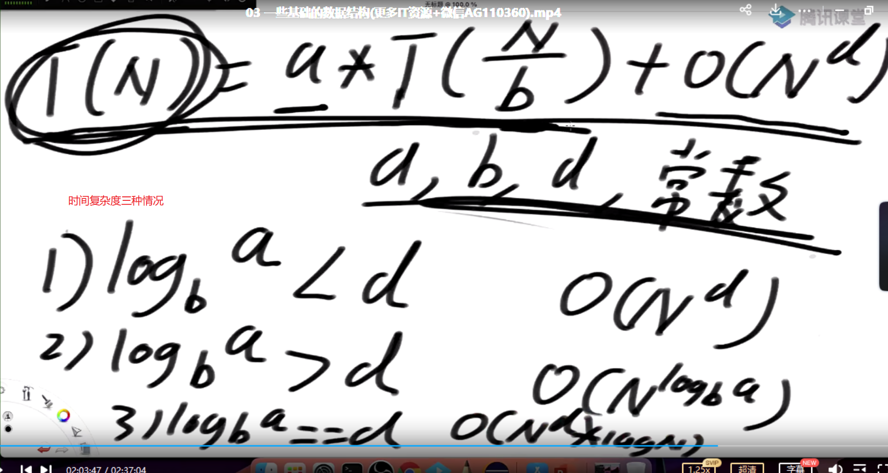
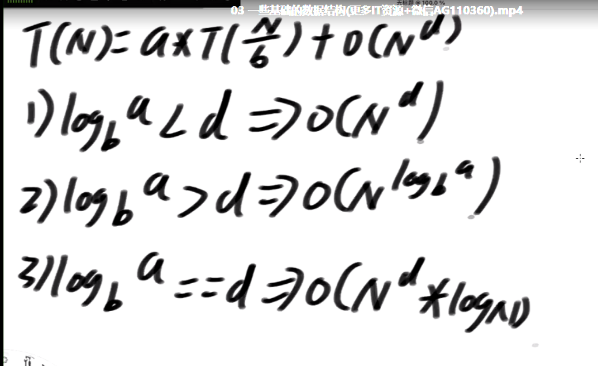
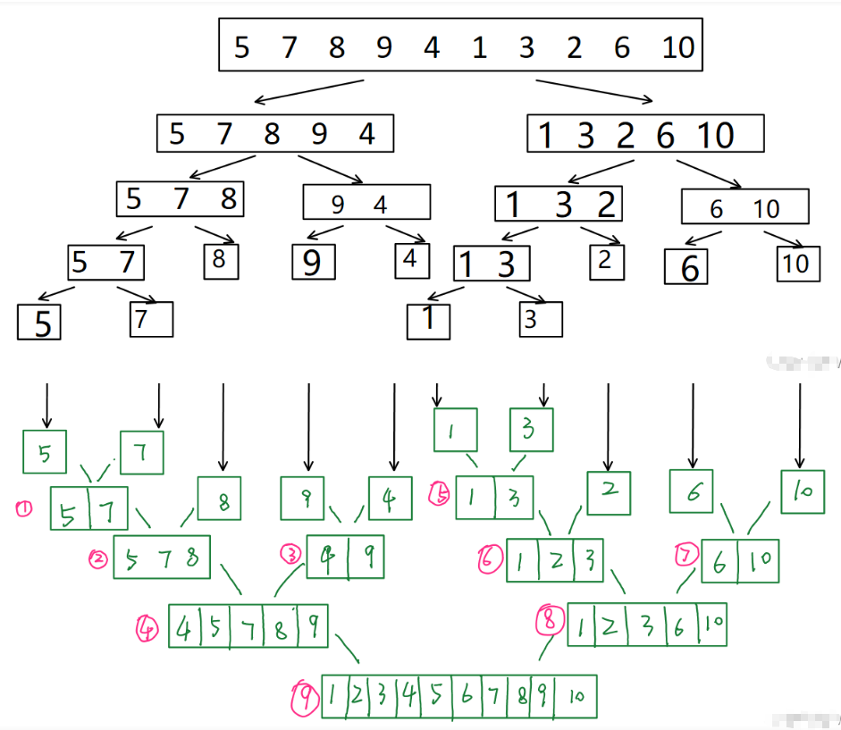
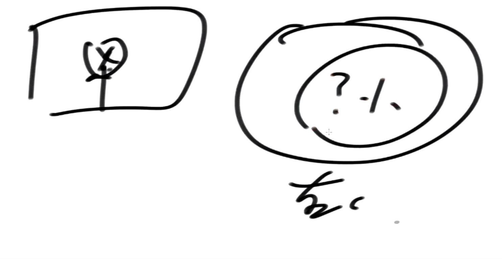
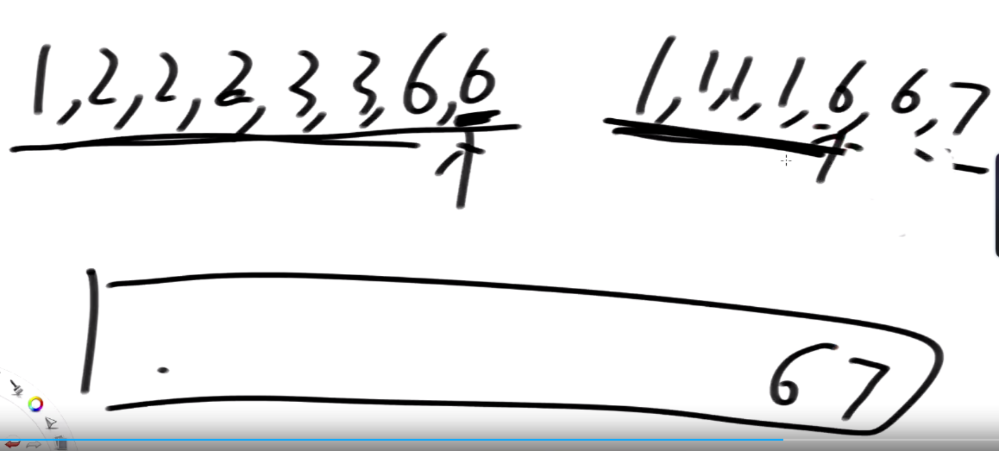
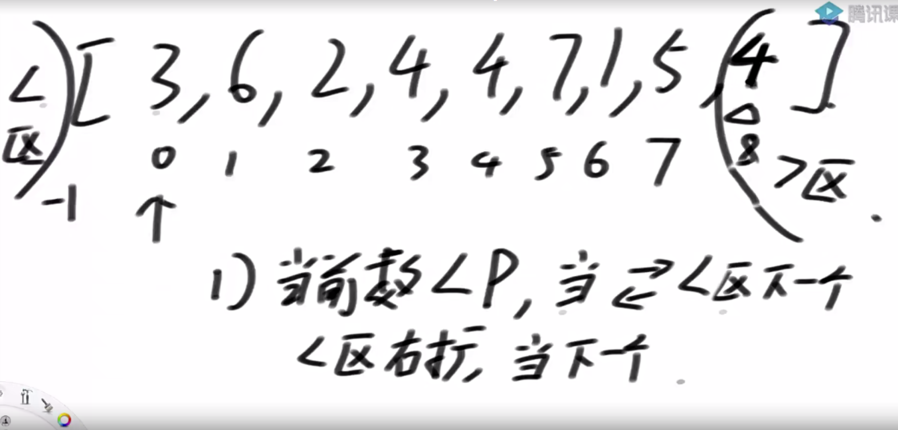
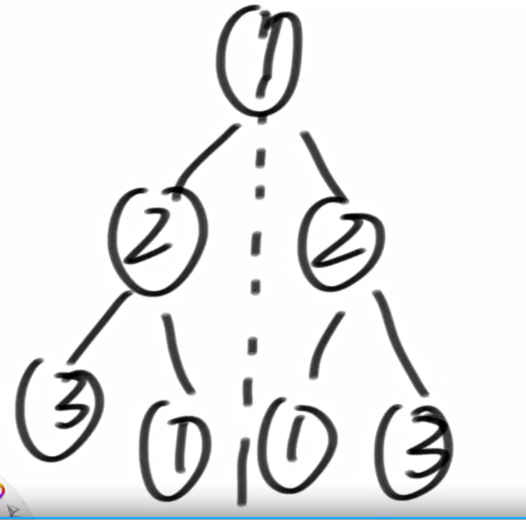
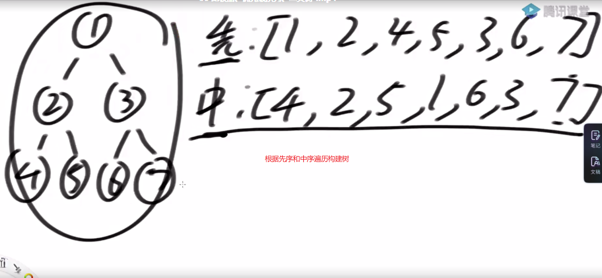
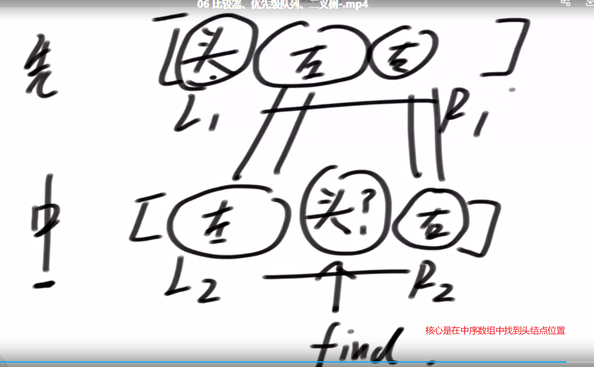
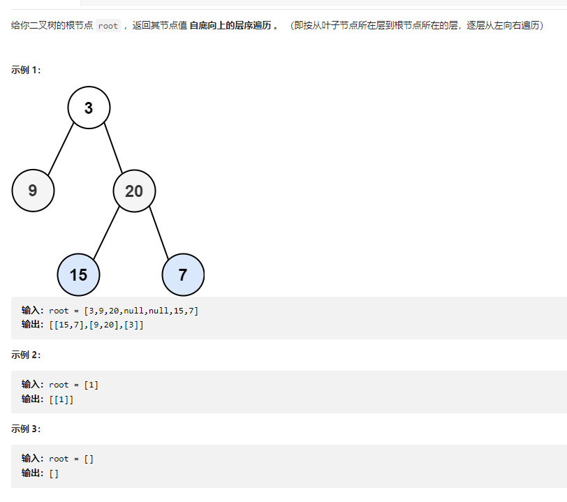

Algorithm

- [基础知识](#基础知识)
    - [时间复杂度](#时间复杂度)
    - [数组](#数组)
    - [TreeMap](#TreeMap)
    - [Java中的Math.Random函数](#Java中的Math.Random函数)
    - [排序](#排序)
        - [选择排序](#选择排序)
        - [冒泡排序](#冒泡排序)
        - [插入排序](#插入排序)
        - [归并排序](归并排序)
        - [快速排序](#快速排序)
    - [搜索](#搜索)
        - [二分查找](#二分查找)
    - [数组](#数组)
        - [数组实现栈](#数组实现栈)
        - [数组实现队列](#数组实现队列)
    - [链表](#链表)
        - [单链表](#单链表)
            - [单链表反转](#单链表反转)
            - [单链表实现队列](#单链表实现队列)
            - [单链表实现栈](#单链表实现栈)
            - [K个结点组内逆序调整](#K个结点组内逆序调整)
            - [链表相加](#链表相加)
            - [有序链表合并](#有序链表合并)
            - [删除指定值](#删除指定值)
    - [双链表](#双链表)
        - [双链表反转](#双链表反转)
        - [双链表实现双端队列](#双链表实现双端队列)
    - [二叉树](#二叉树)
        - [判断两棵树是否相同](#判断两棵树是否相同)
        - [判断两棵树是否是镜面树](#判断两棵树是否是镜面树)
        - [树的最大深度或者高度](#树的最大深度或者高度)
        - [通过先序和中序遍历的位置构造一棵树](#通过先序和中序遍历的位置构造一棵树)
    - [基础题目](#基础题目)
        - [Java中的Math.Random函数](#Java中的Math.Random函数)
        - [程序打印某个int数字的32bit字符](#程序打印某个int数字的32bit字符)
        - [计算阶乘](#计算阶乘)
        - [选择排序](#选择排序)
        - [冒泡排序](#冒泡排序)
        - [插入排序](#插入排序)
- [题目](#题目)
    - [二分查找算法](#二分查找算法)
    - [原地算法对单链表进行重排序](#原地算法对单链表进行重排序)

## 基础知识

- int类型用的是32bit进行存储，32位存储一个整形，最高位是符号位，1表示负数，0表示正数；负数的值是剩余31位数取反加一。

- 运算符

    - 左移：<<

    - 右移：>>

    - 取反：~

    - 异或：^

        - 无进位相加

            - ```
                00100110
                01110111
                结果
                01010001
                ```

                

- 补码

    - 一个数取反加一，即相反数
    - 但是负数的值比正数多一个，因此整数类型的最小数取反就是它自己。0取反加一也是自己；
    - **符号位也要用于计算也需要取反**

- 带符号右移动

    - ```
        >> ： 用符号位来补
        ```

- 不带符号右移

    - ```
        >>>：用0来补
        ```

### 时间复杂度

- 最坏的情况下需要的**操作次数**，只看最高阶的
- 选择排序，插入，冒泡排序时间复杂度O(n^2)
- 二分查找算法时间复杂度O(logN)
- 常数操作时间复杂度是O(1) 

### 数组

- 内存地址连续，便于寻址，通过偏移量查询数据很方便，但是对于插入和删除数据不方便
- 插入和删除数据需要大量元素挪动位置

### TreeMap

- 有序表
- 红黑树

### Java中的Math.Random函数

- 返回一个[0,1)的随机数，但是随机数落在某个区间确实固定的
- 比如落在[0,01]概率是0.1,落在[0,0.2]概率是0.2以此类推
- 因此随机数落在[0,x)概率就是x

### 递归

- 任何递归都可以通过非递归的方式实现
- Master公式估算时间复杂度
    - T(N) = a * T(N/b) + O(N^d)
        - a,b,d均为常数,子任务规模一样
        - 
        - 时间复杂度
            - )

## 排序

### 选择排序

- 给定一个无序数组，请进行有序排列

    - 思路

        - 确定边界：数组为空或者长度小于2不需要排列

        - 算法：一组数里面以第一个为基准，依次从后面取数和第一个数相比，如果比第一个数小，那么交换值，否则一直往下走，第一趟走完找出一个最小数放在第一位，以此类推

            - 走完第1圈，外层0-n-1
            - 走完第2圈，外层1-n-1
            - 走完第3圈，外层2-n-1
            - 内层跟外层一样的逻辑

        - 时间复杂度O(n^2)

        - ```java
            package algorithm.basic;
            
            import java.util.Arrays;
            
            public class ChooseSort
            {
                public static void main(String[] args)
                {
                    int[] array = {5,7,1,2,10,9};
                    System.out.print(Arrays.toString(array));
                    chooseSort(array);
                    System.out.println();
                    System.out.print(Arrays.toString(array));
                }
            
                public static void chooseSort(int[] array)
                {
                    //确立边界
                    int length = array.length;
                    if(null == array || length < 2)
                    {
                        return;
                    }
            
                    for(int i=0;i<length;i++)
                    {
                        for(int j=i+1;j<length;j++)
                        {
                            if(array[i] > array[j])
                            {
                                //交换彼此的值
                                int temp = 0;
                                temp = array[i]; //被赋值的先赋值
                                array[i] = array[j];
                                array[j] = temp;
                            }
                        }
                    }
            
                }
            }
            ```

            

### 冒泡排序

- 给定一个无序数组，请进行有序排列

    - 思路：两数相比较依次，大的放后面，依次类推，走完第一趟，最大的数在尾部，依次类推。

        - 边界限定
        - 算法
            - 走完第1圈，外层0-n-1
            - 走完第2圈，外层0-n-2
            - 走完第3圈，外层0-n-3
            - 外层相减，内层相加，依次比较

    - 时间复杂度O(n^2)

    - ```java
        package algorithm.basic;
        
        import java.util.Arrays;
        
        public class BubbleSort
        {
            public static void main(String[] args)
            {
                int[]  array= {10,34,2,6,9,1,6,7,7,7};
                bubbleSort(array);
                System.out.println(Arrays.toString(array));
            }
        
            public static void bubbleSort(int[] array)
            {
                final int LENGTH = array.length;
                if( null == array || LENGTH<2)
                {
                    return ;
                }
        
                for(int i=LENGTH-1;i>=0;i--)
                {
                    for(int j=0;j<i;j++)
                    {
                        if(array[j]>array[j+1])
                        {
                            int temp = 0;
                            temp = array[j+1];
                            array[j+1] = array[j];
                            array[j]=temp;
                        }
                    }
                }
        
            }
        }
        
        ```

        ```
        [10, 34, 2, 6, 9, 1, 6, 7, 7, 7]
        [1, 2, 6, 6, 7, 7, 7, 9, 10, 34]
        ```

### 插入排序

- 给定一个无序数组，请进行有序排列

- 思路：从数组里面从左往右依次挑选一个数，插入到原数组，比左边小的则交换，比左边大的不交换

    - 边界限定
- 数要一个一个取，外圈层0-n-1
    - 当前数的位置是end，前一个数的位置是pre，互相比较，满足条件则交换，否则挑选下一个数目
- 时间复杂度O(n^2)

```java
    package algorithm.basic;
    
    import java.util.Arrays;
    
    public class InsertSort
    {
        public static void main(String[] args)
        {
            int[] array = {10,34,2,6,9,1,6,7,7,7};
            System.out.println(Arrays.toString(array));
            insertSort(null);
            System.out.println(Arrays.toString(array));
        }
    
        public static void insertSort(int[] array)
        {
            if(null == array || array.length < 2)
            {
                return;
            }
    
            final int LENGTH = array.length;
    
             for (int i = 0; i < LENGTH; i++)
            {
                int j = i;
                while (j >= 0 && j < LENGTH - 1 && array[j] > array[j + 1])
                {
                    int temp = 0;
                    temp = array[j];
                    array[j] = array[j + 1];
                    array[j + 1] = temp;
                    j--;
                }
            }
        }
    }
```

    [10, 34, 2, 6, 9, 1, 6, 7, 7, 7]
    [1, 2, 6, 6, 7, 7, 7, 9, 10, 34]

### 归并排序

#### 递归版

- 将数组/2进行拆分，递归，拆分到只剩下单个元素为止，最后两个数组进行merge

    - 时间复杂度O(N*logn)

- 

- ```java
    package basic.class8;
    
    import util.Util;
    
    public class Sort
    {
    
        public static void main(String[] args)
        {
            //int[] array = Util.generateRandomArray(10, 50);
            int[] array = {1,6,3,6};
            Util.loopArray(array);
            mergeSort(array, 0, array.length - 1);
            Util.loopArray(array);
        }
    
        public static void mergeSort(int array[], int left, int right)
        {
            if (left == right)
            {
                return;
            }
            int middle = (left + right) / 2;
            mergeSort(array, left, middle);
            mergeSort(array, middle + 1, right);
            merge(array, left, middle, right);
        }
    
        //两个数组merge，左边数组是left开始，右边数组是middle + 1开始
        public static void merge(int array[], int left, int middle, int right)
        {
            int[] help = new int[right - left + 1];
    
            int i = 0;
            int p1 = left;
            int p2 = middle + 1;
            while (p1 <= middle && p2 <= right)
            {
                if (array[p1] <= array[p2])
                {
                    help[i++] = array[p1++];
                }
                else
                {
                    help[i++] = array[p2++];
                }
            }
    
            while (p1 <= middle)
            {
                help[i++] = array[p1++];
            }
    
            while (p2 <= right)
            {
                help[i++] = array[p2++];
            }
    
            for(int j = 0; j< help.length; j++)
            {
                array[left++] = help[j];
            }
        }
    }
    
    ```

#### 非递归版

- 用步长来做，step从1开始，相邻两个数作为一组比较大小，小的放左边，大的放右边
- 依次step = step*2，两组元素比较，依次排序
- 直到step超过数组长度立即停止循环

#### 小和问题

- 描述：在一个数组中，把比当前数小的所有的左边的数累加

- 例子

    - ```
        [1,3,4,2,5]
        1左边比1小的数：0
        3左边比3小的数：1
        4左边比4小的数：1,3
        2左边比2小的数：1
        5左边比5小的数：1,3,4,2
        所以小和为0+1+1+3+1+1+3+4+2=16
        ```

    - 思路
        - **本质就是求右边有多少个数比左边的数大**
        - 利用递归版归并排序来做
        - 左边p位置数比右边q位置数小,那么记录右边数组个数:r - q + 1
        - 记录累加和result += (r-q+1)*array[p]

#### 数组中的逆序对

- 
- 
- 排好序的左组和右组
- 从右往左，找右组里面比左组x小的有几个
    - 右边元素大或者相等，直接把右边的放入到结果集数据中,右边元素往前移
    
    - 右边元素小于左边元素，直接统计右边小于的元素个数，左边元素往前移
    
    - ```java
        package systematic.class4;
        
        import util.Util;
        
        public class MergeSort
        {
            private int result = 0;
        
            public static void main(String[] args)
            {
                MergeSort mergeSort = new MergeSort();
                //int[] array = Util.generateRandomArray(10, 50);
                int[] array = { 1,3,2,3,1 };
                Util.loopArray(array);
                System.out.println(mergeSort.reversePairs(array));
                Util.loopArray(array);
            }
        
            //计算数组中有多少个逆序对
            public int reversePairs(int[] nums)
            {
                if (null == nums || nums.length < 2)
                {
                    return 0;
                }
                reversePairsProcess(nums, 0, nums.length - 1);
                return result;
            }
        
            public void reversePairsProcess(int[] nums, int left, int right)
            {
                if (left == right)
                {
                    return;
                }
        
                int middle = (left + right) / 2;
                reversePairsProcess(nums, left, middle);
                reversePairsProcess(nums, middle + 1, right);
                reversePairsMerge(nums, left, middle, right);
            }
        
            public void reversePairsMerge(int[] array, int left, int middle, int right)
            {
                int[] help = new int[right - left + 1];
                int length = help.length - 1;
                int p = middle;
                int q = right;
        
                while (p >= left && q > middle)
                {
                    if (array[p] < array[q])
                    {
                        help[length--] = array[q--];
                    }
                    else if (array[p] > array[q])
                    {
                        result += q - middle;
                        help[length--] = array[p--];
                    }
                    else
                    {
                        help[length--] = array[q--];
                    }
                }
        
                while (p >= left)
                {
                    help[length--] = array[p--];
                }
        
                while (q > middle)
                {
                    help[length--] = array[q--];
                }
        
                for (int j = help.length - 1; j >= 0; j--)
                {
                    array[right--] = help[j];
                }
            }
        }
        
        ```
    
        ```
        1 3 2 3 1 
        4
        1 1 2 3 3 
        ```

#### 合并两个有序数组

- ```
    给你两个按 非递减顺序 排列的整数数组 nums1 和 nums2，另有两个整数 m 和 n ，分别表示 nums1 和 nums2 中的元素数目。
    请你 合并 nums2 到 nums1 中，使合并后的数组同样按 非递减顺序 排列。
    注意：最终，合并后数组不应由函数返回，而是存储在数组 nums1 中。为了应对这种情况，nums1 的初始长度为 m + n，其中前 m 个元素表示应合并的元素，后 n 个元素为 0 ，应忽略。nums2 的长度为 n 。
    
    ```

- ```
    输入：nums1 = [1,2,3,0,0,0], m = 3, nums2 = [2,5,6], n = 3
    输出：[1,2,2,3,5,6]
    解释：需要合并 [1,2,3] 和 [2,5,6] 。
    合并结果是 [1,2,2,3,5,6] ，其中斜体加粗标注的为 nums1 中的元素。
    ```

    - 思路

        - 通过归并排序解决即可

        - ```java
            public void merge(int[] nums1, int m, int[] nums2, int n)
            {
                int[] help = new int[m + n];
                int i = 0;
                int p = 0;
                int q = 0;
            
                while (p < m && q < n)
                {
                    if (nums1[p] < nums2[q])
                    {
                        help[i++] = nums1[p++];
                    }
                    else
                    {
                        help[i++] = nums2[q++];
                    }
                }
            
                while (p < m)
                {
                    help[i++] = nums1[p++];
                }
            
                while (q < n)
                {
                    help[i++] = nums2[q++];
                }
            
                for (int j = 0; j < help.length; j++)
                {
                    nums1[j] = help[j];
                }
            }
            ```

            

### 快速排序

- 思路：数组最后一个元素作为比较数，小于区域从-1开始，大于区域从array.length - 1位置开始（大于区域要罩住最后一个元素），当前位置index从0开始
    - **小于区域初始位置(lessRegion)，大于区域初始位置(moreRegion)，当前元素位置，比较数（数组最后一个元素）**
    - 如果当前位置的元素**小于比较数**，当前数和小于区域下一个数交换，小于区域往右扩一个位置，当前位置加一
    - 如果当前位置的元素**大于比较数**，当前数和大于区域前一个位置的元素交换，大于区域往左扩一个位置，当前位置不动
    - 如果当前位置的元素和比较数**相等**，**当前位置直接加一**
    - 当前数和大于区域的边界相遇的时候，停止遍历
    - 停止遍历之后需要大于区域第一个元素和比较数交换才算完成
    - 走完这一趟仅仅让比较数相同部分有序（int[lessRegion, moreRegion]），还需要找到
    - z递归
        - 时间复杂度O(logn*N)
- 
  
- ```java
    public static void quickSort(int[] array)
        {
            if(null == array || array.length < 2)
            {
                return ;
            }
            process(array, 0, array.length - 1);
        }
    
        public static void process(int[] array, int left, int right)
        {
            if(left >= right)
            {
                return;
            }
            int[] data = partition(array, left, right);
            process(array, left, data[0] - 1);
            process(array, data[1] + 1, right);
        }
    
    public static int[] partition(int[] array, int left, int right)
        {
            int lessRegion = left - 1;
            int moreRegion = right;
            int index = left;
            int p = array[right];
    
            while(index < moreRegion)
            {
                if(array[index] < p)
                {
                    swap(array, index, lessRegion + 1);
                    lessRegion++;
                    index++;
                }
                else if(array[index] > p)
                {
                    swap(array, index, moreRegion - 1);
                    moreRegion--;
                }
                else
                {
                    index++;
                }
            }
            swap(array, moreRegion, right);
            return new int[]{lessRegion + 1, moreRegion};
        }
    ```

    ```
    16 7 34 32 28 6 43 4 
    4 6 7 16 28 32 34 43 
    ```
    
    


## 搜索

### 二分查找

- 针对有序数组，查找value在数组中的位置，找到返回该数的位置，否则返回-1

    - 思路

        - 一直递归二分查找

        - int mid = (left + right)/2

        - ```java
            public class Search
            {
                public static void main(String[] args)
                {
                    int[] array = Util.generateRandomArray(20,50);
                    Util.quickSort(array);
                    Util.loopArray(array);
                    System.out.println(binarySearch(array, 10));
                }
            
                public static int binarySearch(int[] array, int value)
                {
            
                    if (null == array)
                    {
                        return -1;
                    }
            
                    final int LENGTH = array.length;
                    int left = 0;
                    int right = LENGTH - 1;
                    while (left <= right)
                    {
                        int middle = (left + right) / 2;
                        if (value == array[middle])
                        {
                            return middle;
                        }
                        else if (value > array[middle])
                        {
                            left = middle + 1;
                        }
                        else
                        {
                            right = middle - 1;
                        }
                    }
                    return -1;
                }
            }
            ```

            ```
            1 2 3 11 14 17 20 23 25 27 29 31 37 38 38 40 42 43 
            -1
            ```

## 数组

### 数组实现栈

- 思路

    - 通过数组index来实现

    - ```java
        public class DataStructure
        {
            private List<Integer> stack = new ArrayList<>();
            
            public void pop()
            {
            int index = stack.size() - 1;
            System.out.print(stack.get(index) + " ");
            stack.remove(index);
            }
        
            public void peek()
            {
                int index = stack.size() - 1;
                System.out.print(stack.get(index) + " ");
            }
        
            public void poll(int value)
            {
                int index = stack.size();
                stack.add(index, value);
            }
            
            public static void main(String[] args)
            {
        		DataStructure dataStructure = new DataStructure();
                for(int i=0;i<10;i++)
                {
                    dataStructure.poll(i);
                }
        
                for(int j=dataStructure.stack.size();j>0;j--)
                {
                    dataStructure.pop();
                }
        
            }
        
        }
        ```

        

### 数组实现队列

- 给定大小的数组，需要起始位置（start），结束位置(end)，队列的大小(size)

    - 起始位置是队头，用来出队的

    - 结束位置是队尾，队尾后面添加新的元素

    - 当起始位置和结束位置相同的时候需要判断队列大小

        - 如果队列满了，那么不能添加新的元素
        - 队列为空

    - ```java
        
        
        public class DataStructure
        {
        	//队列固定大小是5
            private int[] array = new int[5];
            //队列的头
            private int start = -1;
            //队列的尾
            private int end = -1;
            //队列的容量
            private int size = 0;
            
            public void queuePop()
            {
                if(size ==  0)
                {
                    System.out.println("queue is empty...");
                    return;
                }
                else
                {
                    System.out.print(array[start] + " ");
                    array[start] = 0;
                    if(start == array.length - 1)
                    {
                        start = 0;
                    }
                    else
                    {
                        start++;
                    }
                    size--;
                    if(size == 0)
                    {
                        //队列为空设置初始状态
                        start = -1;
                        end = -1;
                    }
                }
        
            }
        
            public void queuePoll(int value)
            {
                if(start == -1 && end == -1 && size == 0)
                {
                    array[++start] = value;
                    array[++end] = value;
                    size++;
                }
                else
                {
                    if( size == array.length)
                    {
                        System.out.println("queue is full");
                        return;
                    }
                    else
                    {
                        if(end == array.length - 1)
                        {
                            end = 0;
                            array[end] = value;
                        }
                        else
                        {
                            array[++end] = value;
                        }
                        size++;
                    }
                }
            }
        
            public void queuePeek()
            {
                if(size == 0)
                {
                    System.out.println("Queue is empty...");
                    return;
                }
                else
                {
                    System.out.print(array[start] + " ");
                }
            }
        }
        
        public static void main(String[] args)
            {
                DataStructure dataStructure = new DataStructure();
                for(int i=0;i<5;i++)
                {
                    dataStructure.queuePoll(i);
                }
                System.out.println();
                for(int i=dataStructure.size;i>0;i--)
                {
                    dataStructure.queuePop();
                }
                dataStructure.queuePeek();
            }
        ```

        ```
        0 1 2 3 4 Queue is empty...
        ```

## 栈

### 如何用栈结构实现队列

- 思路

    - 采用两个栈，push & pop栈，push栈添加数据，pop栈弹出数据

        - push栈数据推往pop栈

            - **pop空**的时候才可以让**push栈一次性全部推完**数据

            - ```java
                package systematic.class3;
                
                import java.util.Stack;
                
                public class MyQueue
                {
                    private Stack<Integer> pushStack;
                    private Stack<Integer> popStack;
                
                    //["MyQueue", "push", "push", "peek", "pop", "empty"]
                    //[[],[1],[2],[],[],[]]
                    //["MyQueue","push","push","pop","peek"]
                    //[[],[1],[2],[],[]]
                    public static void main(String[] args)
                    {
                        MyQueue myQueue = new MyQueue();
                        myQueue.push(1);
                        myQueue.push(2);
                        System.out.println(myQueue.pop());
                        System.out.println(myQueue.peek());
                    }
                
                    public MyQueue()
                    {
                        pushStack = new Stack<>();
                        popStack = new Stack<>();
                    }
                
                    public void pushToPop()
                    {
                        //只有popStack为空的时候才可以往里面添加元素
                        if(popStack.isEmpty())
                        {
                            //把pushStack里面元素一次性全部push到popStack
                            while(!pushStack.empty())
                            {
                                popStack.push(pushStack.pop());
                            }
                        }
                    }
                
                    public void push(Integer x)
                    {
                        pushStack.push(x);
                        pushToPop();
                    }
                
                    public int pop()
                    {
                        if(popStack.isEmpty() && pushStack.isEmpty())
                        {
                            System.out.println("Queue is empty.");
                            return -1;
                        }
                        pushToPop();
                        return popStack.pop();
                    }
                
                    public int peek()
                    {
                        if(popStack.isEmpty() && pushStack.isEmpty())
                        {
                            System.out.println("Queue is empty");
                            return -1;
                        }
                        pushToPop();
                        return popStack.peek();
                    }
                
                    public boolean empty()
                    {
                        return popStack.empty() && pushStack.isEmpty();
                    }
                }
                
                ```

                

## 队列

### 如何用队列结构实现栈

- 思路

    - 用两个队列，其中队列1往队列2挪动元素，队列1只保留一个元素出队

    - 队列2往队列1挪动元素，只保留一个元素出队，依次循环，知道两边队列都为空

    - 不空的队列加入元素，重复上述操作

    - ```java
        package systematic.class3;
        
        import java.util.LinkedList;
        import java.util.Queue;
        
        public class MyStack
        {
        
            //用来存储元素的
            private Queue<Integer> queue;
            //负责队列，用来暂存元素的
            private Queue<Integer> help;
        
            public MyStack()
            {
                queue = new LinkedList<>();
                help = new LinkedList<>();
            }
        
            public void push(int x)
            {
                queue.add(x);
            }
        
            public int pop()
            {
                if (queue.isEmpty())
                {
                    System.out.println("Stack is Empty");
                    return -1;
                }
                else
                {
        
                    while (queue.size() > 1)
                    {
                        help.offer(queue.poll());
                    }
                    int value = queue.poll();
                    //queue和help互换
                    Queue temp = null;
                    temp = queue;
                    queue = help;
                    help = temp;
                    return value;
                }
            }
        
            public int top()
            {
                if (queue.isEmpty())
                {
                    System.out.println("Stack is Empty");
                    return -1;
                }
                else
                {
                    while (queue.size() > 1)
                    {
                        help.offer(queue.poll());
                    }
                    int value = queue.poll();
                    help.offer(value);
                    //queue和help互换
                    Queue temp = null;
                    temp = queue;
                    queue = help;
                    help = temp;
                    return value;
                }
            }
        
            public boolean empty()
            {
                return queue.isEmpty();
            }
        }
        ```

        

## 链表

- 内存地址不连续，因此查询不方便，需要一个一个结点遍历，适合删除和添加元素

#### 单链表


- 值 + next指针
- **构造单链表一定要返回head结点，不能是void**，如果是void返回值，那么JVM会把没有引用到的结点全部回收掉

##### 单链表反转

- 口诀：先留个备胎(next) -> 在断掉上一任(pre)的联系 -》前一任在脑海里挥之不去 -》 不行，得重新开始

    -  next = head.next;

    - head.next = pre;

    - pre = head; 

    - head = next;

        ```java
        package basic.class4;
        
        import util.SingleNode;
        import util.Util;
        
        public class SingleLinkedList
        {
            public static void main(String[] args)
            {
                SingleNode<Integer> head = constructLinkedList(10);
                Util.loopLinkedList(head);
        
                SingleNode newHead = reverseSingleLinkedList(head);
                Util.loopLinkedList(newHead);
            }
        
            public static SingleNode<Integer> constructLinkedList(final int LENGTH)
            {
                SingleNode<Integer> tail = null;
                SingleNode<Integer> head = null;
                for(int i=0;i<LENGTH;i++)
                {
                    SingleNode<Integer> newNode = new SingleNode(i);
                    if (head == null)
                    {
                        head = newNode;
                        tail = newNode;
                        continue;
                    }
        
                    //tail永远指向最后一个结点，添加新的元素只需要移动尾指针即可。
                    tail.next = new SingleNode<>(i);
                    tail = tail.next;
                }
                return head;
            }
        
            public static SingleNode<Integer> reverseSingleLinkedList(SingleNode<Integer> head)
            {
        
                SingleNode<Integer> pre = null;
                SingleNode<Integer> next = null;
                while(head != null)
                {
                    //保留备胎
                    next = head.next;
                    //断掉联系
                    head.next = pre;
                    //前任在脑海里挥之不去
                    pre = head;
                    //还是的重新开始
                    head = next;
                }
                return pre;
            }
        
        
        }
        
        ```

        ```
        0 1 2 3 4 5 6 7 8 9 
        9 8 7 6 5 4 3 2 1 0 
        ```

        

##### 单链表实现队列

- 实现队列功能

    - 判空 -> isEmpty
    - 队列中的元素个数 -> size
    - 入队 -> offer
    - 出队 -> poll
    - 队列第一个元素是谁 -> peak

- 思路

    - **队列有头有尾，因此需要两个结点**，初始值head ->null ; tail -> null

    - 队列所有元素出队之后，tail & head  -> null

    - ```java
        package basic.class4;
        
        import com.sap.jvm.profiling.snapshot.gc.GcReportNode;
        import com.sun.org.apache.xml.internal.dtm.ref.DTMAxisIterNodeList;
        import util.SingleNode;
        
        public class LinkedListQueue<V>
        {
            private SingleNode<V> head;
            private SingleNode<V> tail;
            private static int size;
        
            public LinkedListQueue()
            {
                this.head = null;
                this.tail = null;
                this.size = 0;
            }
        
            public static void main(String[] args)
            {
                LinkedListQueue<Integer> linkedListQueue = new LinkedListQueue<>();
                linkedListQueue.offer(1);
                linkedListQueue.offer(3);
                linkedListQueue.offer(2);
        
                System.out.println(linkedListQueue.peek());
                System.out.println(linkedListQueue.poll());
                System.out.println(linkedListQueue.poll());
                System.out.println(linkedListQueue.poll());
        
                System.out.println(linkedListQueue.count());
                System.out.println(linkedListQueue.isEmpty());
            }
        
            public boolean isEmpty()
            {
                return 0 == size;
            }
        
            public int count()
            {
                return size;
            }
        
            public void offer(V value)
            {
                SingleNode singleNode = new SingleNode(value);
        
                if (head == null)
                {
                    head = singleNode;
                    tail = singleNode;
                }
                else
                {
                    tail.next = singleNode;
                    tail = singleNode;
                }
                size++;
            }
        
            public V poll()
            {
                V value = null;
                //队头元素出队之后，没有指针指向它，会被JVM回收掉
                if (head != null)
                {
                    value = head.value;
                    head = head.next;
                }
                //队列中没有元素，头部和尾部都指向空
                if (head == null)
                {
                    tail = null;
                }
                size--;
                return value;
            }
        
            public V peek()
            {
                if (head != null)
                {
                    return head.value;
                }
                return null;
            }
        }
        
        ```

        ```
        1
        1
        3
        2
        0
        true
        ```

##### 单链表实现栈

- 思路

    - 一个单链表结点即可实现

        - 添加元素head往后移，head永远指向最后一个元素

    - ```java
        package basic.class4;
        
        import util.SingleNode;
        
        public class LinkedListStack<V>
        {
            private SingleNode<V> head;
            private int size;
        
            public static void main(String[] args)
            {
                LinkedListStack linkedListStack = new LinkedListStack();
                linkedListStack.offer("bitch");
                linkedListStack.offer("a");
                linkedListStack.offer("of");
                linkedListStack.offer("son");
        
                while(linkedListStack.size-->0)
                {
                    System.out.print(linkedListStack.poll() + " ");
                }
            }
        
            public LinkedListStack()
            {
                head = null;
                size = 0;
            }
        
            public boolean isEmpty()
            {
                return size == 0;
            }
        
            public int count()
            {
                return this.size;
            }
        
            public void offer(V data)
            {
                SingleNode<V> singleNode = new SingleNode<>(data);
                if(null == head)
                {
                    head = singleNode;
                }
                else
                {
                    singleNode.next = head;
                    head = singleNode;
                }
                size++;
            }
        
            public V peek()
            {
                V value = null;
                if(head != null)
                {
                    value = head.value;
                }
                return value;
            }
        
            public V poll()
            {
                V value = null;
                if(head != null)
                {
                    value = head.value;
                    head = head.next;
                }
                return value;
            }
        
        }
        ```

##### K个结点组内逆序调整

- 

- 思路
    - 按照k个结点进行**分组**，返回k个元素最后一个元素，如果不能凑齐k个元素则返回null -> Node getKGroup(Node start, int k)
    - 每组**逆序**，数量不够则不逆序，返回头结点 ->void reverse(Node start, Node end)
        - 逆序的时候记录最后一个元素的下一个元素，这样下一组元素不够，可以直接返回
    - 头结点指向下一个元素，循环分组逆序
    - 
    - 
    - 

    ```java
    public static class ReverseGroup
    {
        public static void main(String[] args)
        {
            Node head = Node.constructNode(10);
            Node.loopNode(head);
    
            Node newHead = reverseGroup(head, 3);
            Node.loopNode(newHead);
        }
    
        //得到k分组最后一个元素，如果没空则返回null
        public static Node getKGroup(Node start, int k)
        {
            while(--k > 0 && start != null)
            {
                start = start.next;
            }
            return start;
        }
    
        // 1->2->3->4  -> 3 -> 2 -> 1 ->4
        public static void reverse(Node start, Node end)
        {
            Node tail = end.next;
            Node next = null;
            Node pre = null;
            Node cur = start;
    
            while(cur != tail)
            {
                next = cur.next;
                cur.next = pre;
                pre = cur;
                cur = next;
            }
            start.next = tail;
        }
    
        public static Node reverseGroup(Node head, int k)
        {
            Node start = head;
            Node end = getKGroup(start, k);
            //第一组凑不齐，直接返回head
            if(null == end)
            {
                return head;
            }
            //以end为头进行分组反转
            head = end;
    
            Node lastEndStart = start;
            reverse(start, end);
    
            while(null != lastEndStart.next)
            {
                start = lastEndStart.next;
                end = getKGroup(start, k);
                if(null == end)
                {
                    return head;
                }
                else
                {
                    reverse(start, end);
                    lastEndStart.next = end;
                    lastEndStart = start;
                }
            }
            return head;
        }
    }
    ```

    ```
    0 1 2 3 4 5 6 7 8 9 
    2 1 0 5 4 3 8 7 6 9 
    ```

    

##### 链表相加

- 
- 思路
    - 谁更长，在更长的链表中更新运算后的值
        - L & S链表都有元素
        - L有S没有元素
        - L和S都没有元素，只计算进位符
    - 设置进位符
    - 长结点最后一个是9，前面相加之后再来一个进位符，因此需要记录长链表最后一个结点是谁，由它链接一个进位的结点
    - 

```java
package basic.class4;

import util.SingleNode;
import util.Util;

public class PlusTwoLinkedList
{
    public static void main(String[] args)
    {
        SingleNode headOne = Util.generateRandomSingleLinkedList(10);
        Util.loopLinkedList(headOne);
        SingleNode headTwo = Util.generateRandomSingleLinkedList(20);
        Util.loopLinkedList(headTwo);

        SingleNode newHead = plusTwoSingleLinkedList(headOne, headTwo);
        Util.loopLinkedList(newHead);

    }

    public static int getSingleLinkedListLength(SingleNode head)
    {
        int length = 0;
        while (head != null)
        {
            head = head.next;
            length++;
        }
        return length;
    }

    public static SingleNode plusTwoSingleLinkedList(SingleNode headOne, SingleNode headTwo)
    {
        SingleNode<Integer> longSingleLinkedList = getSingleLinkedListLength(headOne) >= getSingleLinkedListLength(headTwo) ? headOne : headTwo;
        SingleNode<Integer> shortSingleLinkedList = getSingleLinkedListLength(headOne) < getSingleLinkedListLength(headTwo) ? headOne : headTwo;

        //进位符
        int carry = 0;
        //记录最后一个元素的位置，如果最终要生成一个新的元素，那么需要该元素指向新结点
        SingleNode lastEnd = null;
        //副本，通过副本遍历cur，最终求和的值覆盖longSingleLinkedList
        //让longSingleLinkedList位置在head，这样可以最后遍历其得到最终结果
        SingleNode<Integer> curL = longSingleLinkedList;
        SingleNode<Integer> curS = shortSingleLinkedList;

        //第一阶段长短量表都有元素，遍历到短链表没有元素位置
        while (null != curS)
        {
            int value = curL.value + curS.value + carry;
            curL.value = value % 10;
            carry = value / 10;
            //记录最后一个元素
            lastEnd = curL;
            curL = curL.next;
            curS = curS.next;
        }

        //第二阶段长链表有元素，短链表没有
        while (null != curL)
        {
            int value = curL.value + carry;
            curL.value = value % 10;
            carry = value / 10;

            lastEnd = curL;
            curL = curL.next;
        }

        //第三阶段只有进位符
        if (carry != 0)
        {
            lastEnd.next = new SingleNode(carry);
        }

        return longSingleLinkedList;
    }

}
```

```
5 7 3 5 3 3 5 5 
9 9 7 9 8 8 4 
4 7 1 5 2 2 0 6 
```


##### 有序链表合并

- 
- 思路
  
    - 创建head结点记录返回结果，其指向第一个元素最小的链表
    
    - pre,cur1 & cur2用来遍历，cur1是head.next
    
    - 当cur1&&cur2都不空的时候，遍历两者;否则退出, pre.next指向不空的结点
    
        - ```java
            package basic.class4;
            
            import util.SingleNode;
            import util.Util;
            
            public class CombineTwoLinkedList
            {
                public static void main(String[] args)
                {
                    SingleNode head1 = constructSingleNode1();
                    Util.loopLinkedList(head1);
                    SingleNode head2 = constructSingleNode2();
                    Util.loopLinkedList(head2);
            
                    SingleNode newHead = combineTwoLinkedList(head1, head2);
                    Util.loopLinkedList(newHead);
                }
            
                public static SingleNode constructSingleNode1()
                {
                    SingleNode head = new SingleNode(1);
                    SingleNode node1 = new SingleNode(2);
                    SingleNode node2 = new SingleNode(4);
                    head.next = node1;
                    node1.next = node2;
                    return head;
                }
            
                public static SingleNode constructSingleNode2()
                {
                    SingleNode head = new SingleNode(2);
                    SingleNode node1 = new SingleNode(2);
                    SingleNode node2 = new SingleNode(4);
                    SingleNode node3 = new SingleNode(5);
                    head.next = node1;
                    node1.next = node2;
                    node2.next = node3;
                    return head;
                }
            
                public static SingleNode combineTwoLinkedList(SingleNode<Integer> head1, SingleNode<Integer> head2)
                {
                    if(null == head1)
                    {
                        return head2;
                    }
                    if(null == head2)
                    {
                        return head1;
                    }
            
                    SingleNode<Integer> head = head1.value <= head2.value ? head1 : head2;
                    SingleNode<Integer> cur1 = head1.next;
                    SingleNode<Integer> cur2 = head2;
                    SingleNode<Integer> pre = head;
            
                    while(cur1 != null && cur2 != null)
                    {
                        if(cur1.value <= cur2.value)
                        {
                            pre.next = cur1;
                            cur1 = cur1.next;
                        }
                        else
                        {
                            pre.next = cur2;
                            cur2 = cur2.next;
                        }
                        pre = pre.next;
                    }
                    if(cur1 == null)
                    {
                        pre.next = cur2;
                    }
                    else if(null == cur2)
                    {
                        pre.next = cur1;
                    }
            
                    return head;
                }
            
            
            
            }
            	
            ```
    
            ```
            1 2 4 
            2 2 4 5 
            1 2 2 2 4 4 5 
            ```

##### 删除指定值

- 思路

    - 删除指定元素的值，那么要需要找前一个元素，当前元素和下一个元素

    - 因此准备好pre,cur,next,newHead指针，pre,cur,next都是操作的，而newHead是用来返回删除的结果的

    - 注意删除头结点的时候，newHead -> cur，其余情况newHead不用修改

    - ```java
        package systematic.class3;
        
        public class DataStructure
        {
            static class SingleNode
            {
                private SingleNode next;
                private int val;
        
                public SingleNode(int val)
                {
                    this.val = val;
                }
        
                public static SingleNode constructSingleNode(int length)
                {
                    /*SingleNode head = null;
                    SingleNode tail = null;
                    for(int i=0;i<length;i++)
                    {
                        if(null == head)
                        {
                            SingleNode node = new SingleNode((int)(Math.random()*10));
                            head = node;
                            tail = node;
                        }
                        else
                        {
                            tail.next = new SingleNode((int)(Math.random()*10));
                            tail = tail.next;
                        }
                    }*/
        
                    SingleNode head = null;
                    SingleNode tail = null;
                    SingleNode node = new SingleNode(-3);
                    head = node;
                    tail = node;
                    tail.next = new SingleNode(5);
                    tail = tail.next;
                    tail.next = new SingleNode(-99);
                    tail = tail.next;
                    return head;
                }
        
                public static void loopSingleNode(SingleNode head)
                {
                    while(head != null)
                    {
                        System.out.print(head.val + " ");
                        head = head.next;
                    }
                }
            }
        
            public static void main(String[] args)
            {
                SingleNode head = SingleNode.constructSingleNode(10);
                SingleNode.loopSingleNode(head);
                System.out.println();
        
                SingleNode newHead = deleteSpecificValue(head, -3);
                SingleNode.loopSingleNode(newHead);
            }
        
            public static SingleNode deleteSpecificValue(SingleNode head, int val)
            {
                SingleNode newHead = head;
                SingleNode cur = head;
                SingleNode pre = null;
                if(null == head)
                {
                    return null;
                }
        
                while(cur != null)
                {
        
                    SingleNode next = cur.next;
                    if(cur.val == val)
                    {
                        if(null != pre)
                        {
                            pre.next = next;
                            cur.next = null;
                            cur = next;
                        }
                        else
                        {
                            cur.next = null;
                            cur = next;
                            newHead = cur;
                        }
        
        
                    }
                    else
                    {
                        pre = cur;
                        cur = cur.next;
                    }
                }
                return newHead;
            }
        
        
        }
        
        ```

        ```
        [4,5,1,9]
        5
        
        [4,1,9]
        ```

        ```
        [-3 5 -99]
        -3
        
        
        [5 -99]
        ```

        

#### 双链表


- 值 + last + next指针

##### 双链表反转

- 在单链表基础上多加一步，head.last = next;

- ```java
    package util;
    
    public class DoubleLinkedListNode<V>
    {
        public DoubleLinkedListNode<V> last;
        public DoubleLinkedListNode<V> next;
        public V value;
    
        public DoubleLinkedListNode(V value)
        {
            this.value = value;
        }
    }
    ```

- ```java
    package basic.class4;
    
    import util.DoubleLinkedListNode;
    import util.Util;
    
    public class DoubleLinkedList
    {
        public static void main(String[] args)
        {
            DoubleLinkedListNode head = constructDoubleLinkedList();
            Util.loopDoubleLinkedList(head);
            DoubleLinkedListNode newHead = reverseDoubleLinkedList(head);
            Util.loopDoubleLinkedList(newHead);
    
        }
    
        public static DoubleLinkedListNode constructDoubleLinkedList()
        {
            DoubleLinkedListNode doubleLinkedListNode0 = new DoubleLinkedListNode(0);
            DoubleLinkedListNode doubleLinkedListNode1 = new DoubleLinkedListNode(1);
            DoubleLinkedListNode doubleLinkedListNode2 = new DoubleLinkedListNode(2);
            doubleLinkedListNode0.last = null;
            doubleLinkedListNode0.next = doubleLinkedListNode1;
            doubleLinkedListNode1.last = doubleLinkedListNode0;
            doubleLinkedListNode1.next = doubleLinkedListNode2;
            doubleLinkedListNode2.last = doubleLinkedListNode1;
            doubleLinkedListNode2.next = null;
            return doubleLinkedListNode0;
        }
    
        public static DoubleLinkedListNode reverseDoubleLinkedList(DoubleLinkedListNode head)
        {
            DoubleLinkedListNode pre = null;
            DoubleLinkedListNode next = null;
    
            while (head != null)
            {
                next = head.next;
                head.next = pre;
                //多加一步
                head.last = next;
                pre = head;
                head = next;
            }
            return pre;
        }
    }
    
    ```

    ```
    0 1 2 
    2 1 0 
    ```

##### 双向链表实现双端队列

- 思路

    - 利用双向链表头尾指针即可实现

    - 无非就是在头部和尾部添加或者删除元素，后面再修改head & tail

    - ```java
        package basic.class4;
        
        import util.DoubleLinkedListNode;
        import util.Util;
        
        public class Deque<V>
        {
            private DoubleLinkedListNode<V> head;
            private DoubleLinkedListNode<V> tail;
            private int size;
        
            public Deque()
            {
                head = null;
                tail = null;
                size = 0;
            }
        
            public static void main(String[] args)
            {
                Deque deque = new Deque();
                deque.insertElement(deque);
                System.out.print("插入元素 ");
                Util.loopDoubleLinkedList(deque.head);
        
                final int LENGTH = deque.size;
                System.out.print("头出队 ");
                for(int i=LENGTH;i>0 ;i--)
                {
                    System.out.print(deque.headDeque() + " ");
                }
        
                System.out.print("\n插入元素 ");
                deque.insertElement(deque);
                Util.loopDoubleLinkedList(deque.head);
        
                System.out.print("尾出队 ");
                for(int i=LENGTH;i>0 ;i--)
                {
                    System.out.print(deque.tailDeque() + " ");
                }
            }
        
            public DoubleLinkedListNode insertHead(V value)
            {
                DoubleLinkedListNode node = new DoubleLinkedListNode(value);
        
                if(head == null)
                {
                    head = node;
                    tail = node;
                }
                else
                {
                    node.next = head;
                    head.last = node;
                    head = node;
                }
                size++;
                return head;
            }
        
            public DoubleLinkedListNode insertTail(V value)
            {
                DoubleLinkedListNode node = new DoubleLinkedListNode(value);
        
                if(head == null)
                {
                    head = node;
                    tail = node;
                }
                else
                {
                    tail.next = node;
                    node.last = tail;
                    tail = node;
                }
                size++;
                return head;
            }
        
            public V headDeque()
            {
                V value = null;
        
                if(null != head)
                {
                    value = head.value;
                    head = head.next;
                    if(null == head)
                    {
                        tail.last = null;
                    }
                    else
                    {
                        head.last = null;
                    }
                }
                else
                {
                    tail = null;
                }
                size--;
                return value;
            }
        
            public V tailDeque()
            {
                V value = null;
        
                if(tail != null)
                {
                    value = tail.value;
                    tail = tail.last;
                    if(null != tail)
                    {
                        tail.next = null;
                    }
                    else
                    {
                        head = null;
                    }
                }
                else
                {
                    head = null;
                }
                size--;
                return value;
            }
        
            public void insertElement(Deque deque)
            {
                //往头部插入元素
                for (int i=0;i<3;i++)
                {
                    deque.insertHead(i);
                }
        
                //往尾部插入元素
                for (int i=3;i<6;i++)
                {
                    deque.insertTail(i);
                }
            }
        
        }
        
        ```

        ```
        插入元素 2 1 0 3 4 5 
        头出队 2 1 0 3 4 5 
        插入元素 2 1 0 3 4 5 
        尾出队 5 4 3 0 1 2 
        ```

## 二叉树

- 先序遍历：根-》左-》右

- 中序遍历：左-》根-》右

- 后序遍历：左-》右-》根

    - 先序，中序，后续遍历

    - ```java
        package basic.class6;
        
        public class BinaryTree
        {
            public static class BTree
            {
                private int value;
                private BTree lChild;
                private BTree rChild;
        
                public BTree(int value)
                {
                    this.value = value;
                }
        
                public static void preLoop(BTree bTree)
                {
                    if(null == bTree)
                    {
                        return;
                    }
                    System.out.print(bTree.value + " ");
                    preLoop(bTree.lChild);
                    preLoop(bTree.rChild);
                }
        
                public static void middleLoop(BTree bTree)
                {
                    if(null == bTree)
                    {
                        return;
                    }
                    middleLoop(bTree.lChild);
                    System.out.print(bTree.value + " ");
                    middleLoop(bTree.rChild);
                }
        
                public static void postLoop(BTree bTree)
                {
                    if(null == bTree)
                    {
                        return;
                    }
                    postLoop(bTree.lChild);
                    postLoop(bTree.rChild);
                    System.out.print(bTree.value + " ");
                }
            }
        
            public static void main(String[] args)
            {
                BTree root = new BTree(1);
                root.lChild = new BTree(2);
                root.rChild = new BTree(3);
                root.lChild.lChild = new BTree(4);
                root.lChild.rChild = new BTree(5);
                root.rChild.lChild = new BTree(6);
                root.rChild.rChild = new BTree(7);
                System.out.println("preLoop...");
                BTree.preLoop(root);
                System.out.println("\nmiddleLoop...");
                BTree.middleLoop(root);
                System.out.println("\npostLoop...");
                BTree.postLoop(root);
            }
        }
        
        ```

        ```
        preLoop...
        1 2 4 5 3 6 7 
        middleLoop...
        4 2 5 1 6 3 7 
        postLoop...
        4 5 2 6 7 3 1
        ```

### 判断两棵树是否相同

- 思路

    - 采用先序递归比较每个结点的值，如果发现有不同的返回false，如果相同则递归，一直递归到二者都没有结点

    - ```java
        package basic.class6;
        
        public class BinaryTree
        {
            public static class BTree
            {
                private int value;
                private BTree lChild;
                private BTree rChild;
        
                public BTree(int value)
                {
                    this.value = value;
                }
        
                public static boolean isSameTree(BTree p, BTree q)
                {
                    if((p == null) ^ (q == null))
                    {
                        return false;
                    }
        
                    if(null == p && q == null)
                    {
                        return true;
                    }
        
                    return p.value == q.value && isSameTree(p.lChild, q.lChild) && isSameTree(p.rChild, q.rChild);
                }
            }
        
            public static void main(String[] args)
            {
                BTree root = new BTree(1);
                root.lChild = new BTree(2);
                root.rChild = new BTree(3);
                root.lChild.lChild = new BTree(4);
                root.lChild.rChild = new BTree(5);
                root.rChild.lChild = new BTree(6);
                root.rChild.rChild = new BTree(7);
               
                BTree root2 = new BTree(1);
                root2.lChild = new BTree(2);
                root2.rChild = new BTree(3);
                root2.lChild.lChild = new BTree(4);
                root2.lChild.rChild = new BTree(5);
                root2.rChild.lChild = new BTree(6);
                root2.rChild.rChild = new BTree(7);
                
                System.out.println(BTree.isSameTree(root, root2));
            }
        }
        
        ```

        ```
        true
        ```

### 判断两棵树是否是镜面树



- 思路

    - 递归思想，把一棵树拆成两棵树进行比较，p.lChild 和q.rChild比较，p.rChild和q.lChild比较

    - ```java
        package basic.class6;
        
        public class BinaryTree
        {
            public static class BTree
            {
                private int value;
                private BTree lChild;
                private BTree rChild;
        
                public BTree(int value)
                {
                    this.value = value;
                }
        
                public static boolean isSymmetric(BTree root)
                {
                    return isMirror(root, root);
                }
        
                public static boolean isMirror(BTree p, BTree q)
                {
                    if(null == p ^ null == q)
                    {
                        return false;
                    }
                    if(null == p && null == q)
                    {
                        return true;
                    }
        
                    return p.value == q.value && isMirror(p.lChild, q.rChild) && isMirror(p.rChild, q.lChild);
                }
            }
        
            public static void main(String[] args)
            {
                BTree root2 = new BTree(1);
                root2.lChild = new BTree(2);
                root2.rChild = new BTree(2);
                root2.lChild.lChild = new BTree(4);
                root2.lChild.rChild = new BTree(5);
                root2.rChild.lChild = new BTree(5);
                root2.rChild.rChild = new BTree(4);
                System.out.println(BTree.isSymmetric(root2));
            }
        }
        
        ```

        ```
        true
        ```

### 树的最大深度或者高度

- 采用递归，树的最大深度=max(maxDepth(左树) , maxDepth(右树)) + 1

- ```java
    package basic.class6;
    
    public class BinaryTree
    {
        public static class BTree
        {
            private int value;
            private BTree lChild;
            private BTree rChild;
    
            public BTree(int value)
            {
                this.value = value;
            }
    
           
            public static int maxDepth(BTree root)
            {
                if(root == null)
                {
                    return 0;
                }
    
                return Math.max(maxDepth(root.lChild), maxDepth(root.rChild)) + 1;
            }
        }
    
        public static void main(String[] args)
        {
            BTree root = new BTree(1);
            root.lChild = new BTree(2);
            root.rChild = new BTree(3);
            root.lChild.lChild = new BTree(4);
            root.lChild.rChild = new BTree(5);
            root.rChild.lChild = new BTree(6);
            root.rChild.rChild = new BTree(7);
            root.rChild.rChild.rChild = new BTree(8);
            
            System.out.println(BTree.maxDepth(root));
        }
    }
    
    ```

    ```
    4
    ```

### 通过先序和中序遍历的位置构造一棵树





- 采用递归思想

    - 给定一个f(先序数组,0,LENGTH-1,中序数组,0,LENGTH-1)，返回树的头结点

    - 确定左树，图中左树用一个函数确定f(先序数组,1,3,中序数组,0,2)

    - 确定右树，图中右树用一个函数确定f(先序数组,4,6,中序数组,4,6)

    - ```java
        public static BTree buildTree(int[] p, int[] q)
        {
            if(null == p || null ==q || q.length != p.length)
            {
                return null;
            }
            return buildSubTree(p, 0, p.length -1 , q, 0, q.length -1 );
        }
        
        //p是先序遍历的数组
        //q是中序遍历的数组
        public static BTree buildSubTree(int[] p, int l1, int r1, int[] q, int l2, int r2)
        {
            if(l1 > r1)
            {
                return null;
            }
        
            BTree root = new BTree(p[l1]);
            if(l1 == r1)
            {
                return root;
            }
        
            //在中序遍历的数组中找到根结点find的位置
            int find = l1;
            while(q[find] != p[l1])
            {
                find++;
            }
        
            root.lChild = buildSubTree(p, l1+1, find - l2 + l1, q, l2, find-1);
            root.rChild = buildSubTree(p, find - l2 + l1 + 1, r1, q, find + 1, r2);
            return root;
        }
        
        public static void main(String[] args)
        {
        
            //先序数组
            int[] p = {1,2,4,5,3,6,7};
        	//+中序数组
            int[] q = {4,2,5,1,6,3,7};
            BTree tree = BTree.buildTree(p, q);
            BTree.preLoop(tree);
            BTree.middleLoop(tree);
        
        }
        ```

### 按层次遍历收集结点



- 题目：给定二叉树root结点，返回自底向上层次遍历结果，从左往右的结果

- 思路

    - leetcode:https://leetcode.cn/problems/binary-tree-level-order-traversal-ii/

    -  队列来做，根结点先入队

    - 只要队列不空，队列元素出队，之后把根结点左孩子和有孩子入队

    - ```java
        package basic.class7;
        
        import basic.class6.BinaryTree;
        import org.apache.poi.ss.formula.functions.T;
        
        import java.util.ArrayList;
        import java.util.LinkedList;
        import java.util.List;
        import java.util.Queue;
        
        public class BinaryTreeMore
        {
            public static class TreeNode
            {
                private int value;
                private TreeNode lChild;
                private TreeNode rChild;
        
                public TreeNode(int value)
                {
                    this.value = value;
                }
        
                public static List<List<Integer>> levelOrderBottom(TreeNode root)
                {
                    List<List<Integer>> response = new ArrayList<>();
                    if(null == root)
                    {
                        return response;
                    }
                    //根结点入队
                    Queue<TreeNode> queue = new LinkedList<>();
                    queue.add(root);
        
                    //只要队列不空，就让元素出队
                    while(!queue.isEmpty())
                    {
                        List<Integer> result = new ArrayList<>();
                        int size = queue.size();
                        for(int i=0; i<size; i++)
                        {
                            TreeNode element = queue.poll();
                            result.add(element.value);
                            if(null != element.lChild)
                            {
                                queue.add(element.lChild);
                            }
                            if(null != element.rChild)
                            {
                                queue.add(element.rChild);
                            }
                        }
                        response.add(0, result);
                    }
                    return response;
                }
            }
        
            public static void main(String[] args)
            {
                TreeNode root = new TreeNode(3);
                root.lChild = new TreeNode(9);
                root.rChild = new TreeNode(20);
                root.rChild.lChild = new TreeNode(15);
                root.rChild.rChild = new TreeNode(7);
        
                List<List<Integer>> response = TreeNode.levelOrderBottom(root);
            }
        
        }
        
        ```

        

### 判断是否是平衡搜索二叉树

- 平衡树：每一颗子树的左右高度差不超过1，

    - 结构是Info(boolean isBalanced, int height)

- 搜索树：每一颗树的左树比它小，右树比它大 

    - 递归，左树是搜索二叉树且最大值< x, 右树是搜索二叉树且最小值> x.

        - 结构是Info(boolean isSearchedTree, int min, int max)

    - leetcode 98题: https://leetcode.cn/problems/validate-binary-search-tree/submissions/
    
       
      
      ```java
      
      package basic.class7;
      class BalanceSearchBinaryTree
      {
          public static class TreeNode
          {
              private int val;
              private TreeNode left;
              private TreeNode right;
              public TreeNode(int value)
              {
                  this.val = value;
              }
          }
      
          public static class Info
          {
              private boolean isBalanced;
      
              private boolean isSearched;
      
              private int max;
      
              private int min;
              private int height;
      
      
              public Info(boolean isBalanced, int height)
              {
                  this.isBalanced = isBalanced;
                  this.height = height;
              }
      
              public Info(boolean isSearched, int max, int min)
              {
                  this.isSearched = isSearched;
                  this.max = max;
                  this.min = min;
              }
      
      
          }
      
          public static boolean isBalanced(TreeNode root)
          {
              return process(root).isBalanced;
          }
          public static Info process(TreeNode root)
          {
              boolean isBalanced = true;
              if(null == root)
              {
                  return new Info(true, 0);
              }
      
              Info left = process(root.left);
              Info right = process(root.right);
              int height  = Math.max(left.height, right.height) + 1;
              if(!left.isBalanced || !right.isBalanced || Math.abs(left.height - right.height) >= 2)
              {
                  isBalanced = false;
              }
              return new Info(isBalanced, height);
          }
      
          //左边结点最大值小于root.val,右边最小值大于root.val
          public static Info isSearchedTree(TreeNode root)
          {
              boolean isSearchedTree = true;
              if(null == root)
              {
                  return null;
              }
      
              Info left = isSearchedTree(root.left);
              Info right = isSearchedTree(root.right);
      
              int max = root.val;
              int min = root.val;
      
              if(null != left)
              {
                  max = Math.max(max, left.max);
                  min = Math.min(min, left.min);
              }
              if(null != right)
              {
                  min = Math.min(min, right.min);
                  max = Math.max(max, right.max);
              }
      
              if(null != left && !left.isSearched)
              {
                  isSearchedTree = false;
              }
              if(null != right && !right.isSearched)
              {
                  isSearchedTree = false;
              }
      
              if(left != null && left.max >= root.val )
              {
                  isSearchedTree = false;
              }
              if(null != right && right.min <= root.val)
              {
                  isSearchedTree = false;
              }
      
              return new Info(isSearchedTree, max, min);
          }
      
          public static void main(String[] args)
          {
              TreeNode root = new TreeNode(2);
              root.left = new TreeNode(1);
              root.right = new TreeNode(3);
              System.out.println(BalanceSearchBinaryTree.isSearchedTree(root).isSearched && BalanceSearchBinaryTree.isBalanced(root));
          }
      }
      
      ```
      
      ```
      true
      ```
      
      

### 路径累加和

- leetcode: https://leetcode.cn/problems/path-sum/

- 能否找到二叉树中任意路径和等于指定值
    - 思路：递归找到叶子结点，计算出累加和，判断累加和时候是否等于指定值，相等就返回true，找到了，反之。
    
    - 注意：函数递归的基准是叶子结点，因此不能够传空节点进来，不然会报空指针
    
    - ```java
        public static boolean hasPathSum(TreeNode root, int targetSum)
            {
                List<Boolean> pathFound = new ArrayList<>(1);
                if (null == root)
                {
                    return false;
                }
                processHasPathSum(root, 0, targetSum, pathFound);
                if(!pathFound.isEmpty())
                {
                    return pathFound.get(0).booleanValue();
                }
                return false;
            }
        
            public static TreeNode processHasPathSum(TreeNode root, int preSum, int targetSum, List<Boolean> pathFound)
            {
                if(root == null)
                {
                    return null;
                }
        
                //非叶子结点累加和
                preSum += root.val;
                TreeNode left = processHasPathSum(root.left, preSum, targetSum, pathFound);
                TreeNode right = processHasPathSum(root.right, preSum, targetSum, pathFound);
        
                //只有到叶子结点才判断累加和是否等于target,否则累加
                if(null == left && null == right)
                {
                    if(preSum == targetSum)
                    {
                        pathFound.add(true);
                        return root;
                    }
                }
                return root;
            }
            
            public static void main(String[] args)
            {
                TreeNode root = new TreeNode(1);
                root.left = new TreeNode(2);
                root.right = new TreeNode(3);
        
                System.out.println(BalanceSearchBinaryTree.hasPathSum(root, 5));
            }
        ```
    
        

### 收集达标路径和

- 收集所有达标的路劲

- leetcode 113: https://leetcode.cn/problems/path-sum-ii

- 思路

    - 先找到达标的路径

    - copy该路径的内容

    - 递归返回的时候需要从结果集里面删除叶子结点和非叶子结点

    - ```java
        public static List<List<Integer>> processAllPathSum(TreeNode root, int target)
            {
                //存储所有路径命中
                List<List<Integer>> response = new ArrayList<>();
                if(null == root)
                {
                    return response;
                }
        
                //记录哪些路径命中
                List<Integer> result = new ArrayList<>();
                subProcessAllPathSum(root,0, target, response, result);
                return response;
            }
        
            public static void subProcessAllPathSum(TreeNode root, int preSum, int target, List<List<Integer>> response, List<Integer> result)
            {
                if (null == root)
                {
                    return;
                }
                result.add(root.val);
                preSum += root.val;
                subProcessAllPathSum(root.left, preSum, target, response, result);
                subProcessAllPathSum(root.right, preSum, target, response, result);
                if (null == root.left && null == root.right)
                {
                    if (target == preSum)
                    {
                        response.add(copyList(result));
                    }
                }
                //叶子和非叶子结点往回走的时候要把自己从结果集里面删除掉
                result.remove(result.toArray().length - 1);
            }
            public static List<Integer> copyList(List<Integer> source)
            {
                List<Integer> target = new ArrayList<>();
                for (Integer data : source)
                {
                    target.add(data);
                }
                return target;
            }
            
            public static void main(String[] args)
            {
                TreeNode root = new TreeNode(5);
                root.left = new TreeNode(3);
                root.right = new TreeNode(6);
                root.left.left = new TreeNode(2);
                root.left.left.left = new TreeNode(1);
                root.left.right = new TreeNode(4);
        
                System.out.println(BalanceSearchBinaryTree.processAllPathSum(root, 11));
            }
        ```

        ```
        [[5, 3, 2, 1], [5, 6]]
        ```

        

- 

## 基础题目

### 程序打印某个int数字的32bit字符

- ```java
    public class BitPrint
    {
        public static void main(String[] args)
        {
            BitPrint bitPrint = new BitPrint();
            bitPrint.print(1);
            bitPrint.print(3);
        }
    
        public void print(int num)
        {
            for(int i=31;i>=0;i--)
            {
                //1左移多少位和num进行与操作
                if( (num & 1<<i) == 0)
                {
                    System.out.print("0");
                }
                else
                {
                    System.out.print("1");
                }
            }
            System.out.println();
        }
    }
    ```

### 计算阶乘

- 请计算1！+2！+3！+ ... + n！

  - 思路：sumAll = **当前阶乘的值**和前一个阶乘的值相加，依次累加

      - 当前阶乘的值 = 当前值 * 前一个阶乘的值
  
  - ```java
    package algorithm.basic;
    
    public class Factorial
    {
        public static void main(String[] args)
        {
            int data = 1;
            int result = factorial(data);
            System.out.println(result);
        }
    
        public static int factorial(int data)
        {
            int sum = 0;
            int temp = 1;
            for(int i=1;i<=data;i++)
            {
                temp = temp * i; //表示当前的阶乘的值
                sum += temp;
            }
            return sum;
        }
  }
    ```
  
    

### 数组范围求和

-  给定一个数组，计算出从L到R的和
- 思路
    - 创建一个相同长度的数组preSum
    - 新数组当前位置的值等于旧数组当前位置的值+之前所有位置的值的总和

```java
package class2;
import util.Util;

public class SumArrayPosition
{
    public static void main(String[] args) throws Exception
    {
        int[] array = Util.generateRandomArray(50,100);
        Util.loopArray(array);
        System.out.println(calculateRangeValue(array, 1, 5));
    }

//计算L - R范围的累加和
public static int calculateRangeValue(int[] array, int left, int right) throws Exception
{
    if (null == array)
    {
    	throw new Exception("no array found");
    }
    final int LENGTH = array.length;
    if (left < 0 || right > LENGTH - 1 || left > right)
    {
    	throw new Exception("Please input correct parameter.");
    }

    int leftSum = sum(array, left-1);
    int rightSum = sum(array, right);
    return rightSum - leftSum;
}

    public static int sum(int[]  array, int position)
    {
        int sum = 0;
        for(int i=0;i<=position;i++)
        {
            sum = sum + array[i];
        }
        return sum;
    }

}
```

```
57 44 83 68 47 73 48 20 30 56 
195
```


### 等概率

- 给定一个函数f(x),它等概率返回1,2,3,4,5；请问怎么**通过f(x)等概率返回1-7上的数字**

- 思路

    - f(x)是个黑盒，想办法把f(x)做成一个等概率的0,1发生器

    - 遇到1和2返回0，遇到4,5返回1，遇到3就重做

    - 1-7需要3个二进制位来生成，2^2+2^1+2^0=7

        - 000;001;010;011;100;101;111等概率生成 -》[0,7]
        - 当遇到7的时候丢弃掉，重新生成其他数字 -》等概率生成[0,6]
        - 上述等概率生成的结果+1-》等概率生成[1,7]

    - ```java
        package class2;
        
        public class SamePossibility
        {
            static final int TIMES = 1000000;
            public static void main(String[] args)
            {
        
                //calculateF1(TIMES);
                //calculateF2(TIMES);
                //calculateF3(TIMES);
                calculateF4(TIMES);
            }
        
            public static void calculateF1(final int times)
            {
                int array[] = new int[times];
        
                for(int i=0;i< times; i++)
                {
                    int value = f1();
                    //统计每个数字出现的次数
                    array[value]++;
                }
                for(int i=1;i<=5; i++)
                {
                    System.out.println( i + "出现了+ " + array[i] + "次");
                }
            }
        
            public static void calculateF2(final int times)
            {
                int array[] = new int[times];
                for(int i=0;i< times; i++)
                {
                    int value = f2();
                    //统计每个数字出现的次数
                    array[value]++;
                }
        
                for(int i=0;i<=1; i++)
                {
                    System.out.println( i + "出现了+ " + array[i] + "次");
                }
            }
        
            public static void calculateF3(final int times)
            {
                int array[] = new int[times];
                for(int i=0;i< times; i++)
                {
                    int value = f3();
                    //统计每个数字出现的次数
                    array[value]++;
                }
        
                for(int i=0;i<=6; i++)
                {
                    System.out.println( i + "出现了+ " + array[i] + "次");
                }
            }
        
            public static void calculateF4(final int times)
            {
                int array[] = new int[times];
                for(int i=0;i< times; i++)
                {
                    int value = f4();
                    //统计每个数字出现的次数
                    array[value]++;
                }
        
                for(int i=1;i<=7; i++)
                {
                    System.out.println( i + "出现了+ " + array[i] + "次");
                }
            }
        
            //等概率生成 1-5
            public static int f1()
            {
                int data = (int)(Math.random() * 5)  + 1;
                return data;
            }
        
            //等概率0,1发生器
            public static int f2()
            {
                int value = 0;
                do
                {
                    value = f1();
                    if(1==value || 2 == value)
                    {
                        value = 0;
                    }
                    else if(4==value || 5 == value)
                    {
                        value = 1;
                    }
                }while(value == 3);
        
                return value;
            }
        
            //等概率返回[0,6]
            public static int f3()
            {
                int value = -1;
                do
                {
                    value = f2() + (f2()<<1) + (f2()<<2);
                }while(value  == 7);
                return value;
            }
        
            //等概率返回[1,7]
            public static int f4()
            {
                return f3() + 1;
            }
        
        }
        
        ```

        ```
        1出现了+ 142932次
        2出现了+ 142666次
        3出现了+ 142535次
        4出现了+ 142687次
        5出现了+ 143336次
        6出现了+ 142961次
        7出现了+ 142883次
        ```

#### 有序数组中找到大于等于num的最左数

- 针对有序数组，找到大于等于num的最左边数的位置局部最小值，没找到返回-1

    - eg：[1,2,4,4,7,9,10]，找4，返回结果是2

    - 思路

        - 利用二分法查找，找到值相等则记录该位置

        - 继续向左二分查找，直到整个数组查找完，返回该位置，如果没有找到则返回-1

        - ```java
            public static int greaterThanOrEqualLeftValue(int[] array, int num)
                {
                    if(null == array)
                    {
                        return -1;
                    }
            
                    int position = -1;
                    final int LENGTH = array.length;
                    int left = 0;
                    int right = LENGTH - 1;
            
                    while(left <= right)
                    {
                        int middle = (left + right)/2;
                        if(array[middle] == num)
                        {
                            position = middle;
                        }
                        //因为是找最左边，因此相等的时候还需要往左走
                        if(num <= array[middle])
                        {
                            right = middle - 1;
                        }
                        if(num > array[middle])
                        {
                            left = middle + 1;
                        }
                    }
                    return position;
                }
            ```


#### 局部最小值

- 给定一个**无序数组,且左右两边值不相等**,请找出一个局部最小值的位置，该值小于相邻左边的值且小于右边相邻的值

    - eg：[1,2,1,3] ->局部最小值的位置是2

    - 思路

        - 利用二分查找算法，长度为1和2单独判断

        - ```java
            package class3;
            
            public class Search
            {
                public static void main(String[] args)
                {
                    int[] array = { 3,2,3,4,5};
                    System.out.println(numLocal(array));
                }
            
                public static int numLocal(int[] array)
                {
            
                    if (null == array || array.length == 0)
                    {
                        return -1;
                    }
            
                    final int LENGTH = array.length;
                    if (LENGTH == 1)
                    {
                        return 0;
                    }
                    if (array[0] < array[1])
                    {
                        return 0;
                    }
                    if (array[LENGTH - 2] > array[LENGTH - 1])
                    {
                        return LENGTH - 1;
                    }
            
                    int left = 0;
                    int right = LENGTH - 1;
                    while (left <= right)
                    {
                        int middle = (left + right) / 2;
            
                        if (array[middle] < array[middle + 1] && array[middle] < array[middle - 1])
                        {
                            return middle;
                        }
                        else
                        {
                            //不满足条件
                            //middle > middle + 1 || middle > middle-1
                            //middle> middle + 1 || middle < middle -1
                            //middle < middle + 1 || middle > middle -1
                            if (array[middle] > array[middle + 1])
                            {
                                left = middle + 1;
                            }
                            else if (array[middle] > array[middle - 1])
                            {
                                right = middle - 1;
                            }
                        }
            
                    }
                    return -1;
                }
            }
            
            ```

### 优先级队列

- 给定3个链表，请把它们按照值的大小排好序串起来。

## 题目

### 二分查找算法

- 利用二分查找算法，查找一个有序列表，找到则返回该元素所在位置，没找到则返回-1。

    ```java
    public class Test
    {
        public static void main(String[] args)
        {
            int[] array = {1,2,4,5,7,8,10};
            System.out.println(binarySearch(array, 9));
        }
    
        public static int binarySearch(int[] array, int value)
        {
            //定死左边和右边值
            int left = 0; 
            int right = array.length;
    
            while(left < right)
            {
                int mid = (left + right)/2; //中间数一定要写在while循环里面
    
                if(value > array[mid]) // 传入值比中间值大，那么就在右边找，即left = mid + 1;
                {
                    left = mid + 1;
                }
                if(value < array[mid]) // 传入值比中间值小，那么就在左边找，即right = mid - 1;
                {
                    right = mid -1;
                }
                if(array[mid] == value) //直到找到，返回下标
                {
                    return mid;
                }
            }
            return -1; //没找到返回-1
        }
    }
    ```


### 原地算法对单链表进行重排序

**问题描述：**

将给定的单链表L： L 0→L 1→…→L n-1→L n,

重新排序为： L 0→L n →L 1→L n-1→L 2→L n-2→…

要求使用原地算法，并且不改变节点的值

例如：

对于给定的单链表{1,2,3,4}，将其重新排序为{1,4,2,3}.

Given a singly linked list L: L 0→L 1→…→L n-1→L n,

reorder it to: L 0→L n →L 1→L n-1→L 2→L n-2→…

You must do this in-place without altering the nodes' values.

For example,
Given{1,2,3,4}, reorder it to{1,4,2,3}.

 

**解题思路：考虑把原始链表拆分为两个，利用快慢指针可以找到链表的中间节点**

　　　　**再把后面部分的链表实现翻转，使用原地算法**

　　　　**再把两个链表合并为一个链表即实现上述要求**

```java
package com.sap.springcloud;


public class Test
{
    public static void main(String[] args)
    {
        ListNode head = constructListNode();
        reorderList(head);
        while(head != null)
        {
            System.out.print(head.value+ " ");
            head = head.next;
        }

    }

    public static ListNode constructListNode()
    {
        Test test = new Test();
        ListNode head = test.new ListNode(1);
        ListNode second = test.new ListNode(2);
        ListNode third = test.new ListNode(3);
        ListNode fourth = test.new ListNode(4);
        ListNode fifth = test.new ListNode(5);
        ListNode sixth = test.new ListNode(6);
        head.next = second;
        second.next = third;
        third.next = fourth;
        fourth.next = fifth;
        fifth.next = sixth;

        return head;
    }

    public static ListNode reorderList(ListNode head) //head就是1
    {
        //1.判断链表是否为空
        if(null == head || null == head.next)
        {
            return head;
        }

        //2.利用快慢指针找到链表后半部分元素
        ListNode slow = head;
        ListNode fast = head;
        while(fast.next != null && fast.next.next != null)
        {
            slow = slow.next;
            fast = fast.next.next;
        }

        ListNode after = slow.next; // 获取到后半部分链表头第一个元素
        slow.next = null; //前面部分链表断掉
        ListNode afterReversed = null; //
        //3.链表后半部分元素进行反转
        while(after != null)  //把反转后的元素转到afterReversed
        {
            ListNode temp = after.next;
            after.next = afterReversed;
            afterReversed = after;
            after = temp;

        }

        //4.利用原地算法（即空间复杂度为O(1)，不需要借助额外的数据结构）：重新链接整个链表，链表合并
        while(head != null && afterReversed != null)
        {
            ListNode ftemp =  head.next;
            ListNode atemp = afterReversed.next;

            head.next = afterReversed;
            head = ftemp;
            afterReversed.next = head;
            afterReversed = atemp;
        }

        return head;
    }

    class ListNode
    {
        Integer value;
        ListNode next;
        public ListNode(Integer value)
        {
            this.value = value;
            next = null;
        }

        public ListNode()
        {

        }
    }
}

```

### 查找给定数值以内的素数

#### 暴力解法

- 思路

  - 两层遍历 + isPrime 标记

  - 从2到n遍历一次，第二次遍历从2开始，到第一次遍历的值结束，如果找到，则素数加1，没找到就轮询一次。

    ```java
    public class PrimeCount //暴力解法
    {
        public static void main(String[] args)
        {
            System.out.println(countPrime(1000));
        }
    
        public static int countPrime(int number)
        {
    
            if(0 > number)
            {
                System.out.println("Please input positive number");
                return 0;
            }
            if(number == 1 || number == 0)
            {
                return 0;
            }
    
            int primeNumber = 0;
            for (int i = 2; i < number; i++)
            {
                boolean isPrime = true; //i default is prime number;
                for(int j=2; j < i; j++)
                {
                    if(i%j == 0)
                    {
                        isPrime = false;
                        break;
                    }
                }
                if(isPrime)
                {
                    primeNumber++;
                }
            }
    
            return primeNumber;
        }
    
    }
    ```

  - 时间复杂度：

#### 埃式筛选法

- 思路

  - **从2到n之间，找到合数（非素数），并把它剔除掉，统计素数的个数**

  - 怎么找合数：2 * 2；2 * 3；2*4... 数值小于n; 3 * 3; 3 * 4...数值小于n

    ```java
    public static int eratosthenes(int n)
    {
        //true 代表素数
        boolean[] isPrime = new boolean[n];
        Arrays.fill(isPrime, true);
    
        int count = 0;
        for(int i=2; i<n; i++)
        {
            if(isPrime[i])
            {
                count++;
                for(int j=i * i; j<n; j+=i)
                {
                	isPrime[j] = false;
                }
            }
        }
        return count;
    }
    ```

### 删除排序数组中的重复项（原地删除）

- 题目：一个有序数组nums, 原地删除重复出现的元素，使每个元素只出现一次，返回删除后数组的新长度。

- 思路：采用双指针算法来实现功能
  - i & j 两个指针，i 从0开始，j从1开始，如果num[i] == num[j] 那么j++
  - 如果num[i] != num[j] 那么 i++ 然后把num[i] = num[j];
  - 最后肯定j先达到数组末尾，返回i+1的值就是元素个数
  - 

```java
public class RemoveDuplicateNumber
{
    public static void main(String[] args)
    {
        System.out.println(removeDuplicateNumber(new int[]{0, 1, 2, 2, 3, 4}));
    }

    public static int removeDuplicateNumber(int[] array)
    {
        if(0 == array.length)
        {
            return 0;
        }

        int i = 0;
        for(int j=1; j<array.length; j++)
        {
            if(array[j] != array[i])
            {
                i++;
                array[i] = array[j];
            }
        }
        return i+1;
    }
}
```

### 寻找数组中心下标

- 题目：给定一个整数数组，请编写一个能够返回的数组的“中心下标”的方法，中心下标，左侧所有元素相加的和等于右侧所有元素相加的和，如果数组不存在**中心下标**，则返回-1，如果有多个中心下标则返回最靠近左边的那一个。

- 思路：利用对称性，先计算出数组总和sum，设置total从左往右累加，sum递减，直到左边部分 == 右边部分，求出中心位置

  - 

  ```java
  package algorithm.array;
  
  import java.util.Arrays;
  
  public class CentralIndex
  {
      public static void main(String[] args)
      {
          int[] input = new int[]{1,1,1,2};
          //int[] data = {1,3,4,5,8};
  
          System.out.println(getIndex(input));
      }
  
      public static int getIndex(int[] num)
      {
          int sum = 0;
          int total = 0;
          sum = Arrays.stream(num).sum();
  
          if(num.length > 2)
          {
              for(int i=0;i<num.length;i++)
              {
                  total += num[i];
                  if(total == sum)
                  {
                      return i;
                  }
                  else
                  {
                      sum -= num[i];
                  }
              }
          }
          return -1;
      }
  }
  
  ```

  

### X的平方根

- 题目：在不适用sqrt(x)函数的情况下，得到x的平方根的整数部分

  - 解法1：二分查找

  - 思路：双重指针，left = 0 & right = input

    - 时间复杂度log(n)

    ```java
    public class Sqrt
    {
        public static void main(String[] args)
        {
            System.out.println(binarySearch(2));
        }
    
        public static int binarySearch(int input)
        {
            int left = 0; 
            int right = input;
            int index = -1;
            while(left <= right)
            {
                int mid = left + (right -left)/2;
                if( mid * mid <= input)
                {
                    //因为要找小的值，因此index在这里赋值
                    index = mid;
                    left = mid + 1;
                }
                else
                {
                    right = mid - 1;
                }
            }
            return index;
        }
    }
    ```

  - 解法二：牛顿迭代

  - 思路：**input = n * n ->  (n + input/n)/2 不停递归，值最终会趋近于其平方根**

  - ```java
    public static int newtonIterate(int input, int n)
    {
        int index = (input/n + n)/2;
        if(0 == input)
        {
            return input;
        }
        if(index == n) //这里终止预期值和最终值相等
        {
            return n;
        }
        return newtonIterate(input, index);
    }
    ```

### 斐波那契数列

- 题目：求给定斐波那契数列第n位的值；1,1,2,3,5,8...

  - 解法一：暴力递归

    ```java
    
    ```
  ```
  
  
  ```
  
- 解法二：去重递归
  
  - 解法三：双指针迭代
