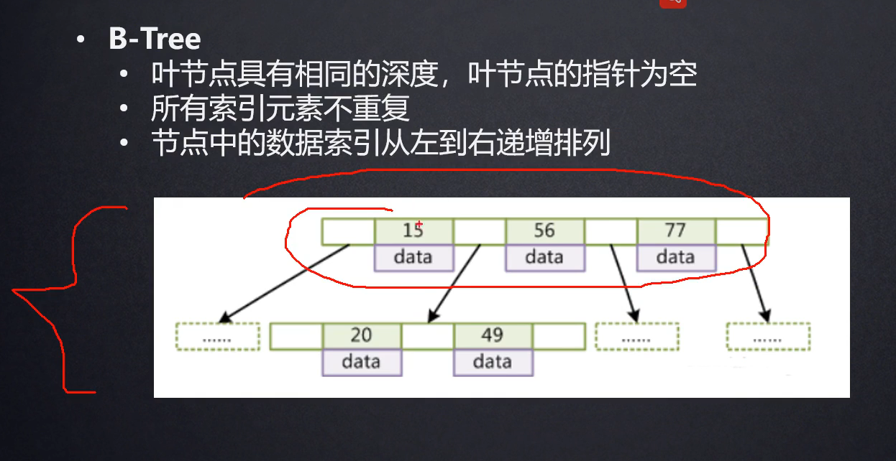
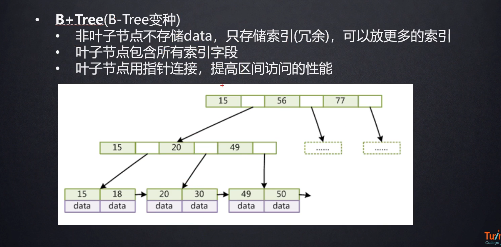
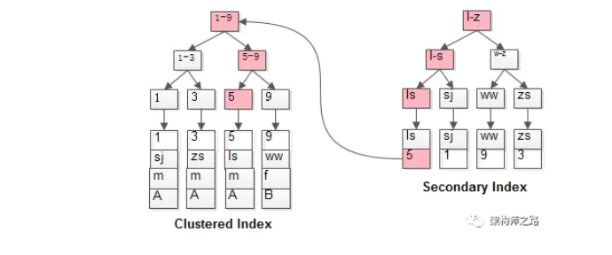
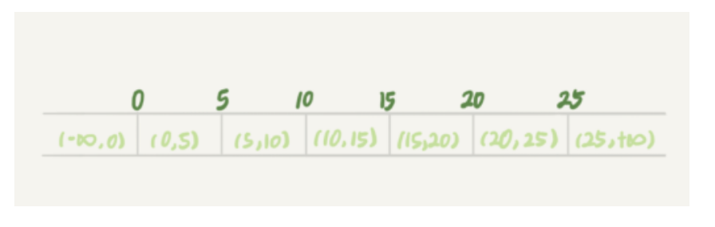
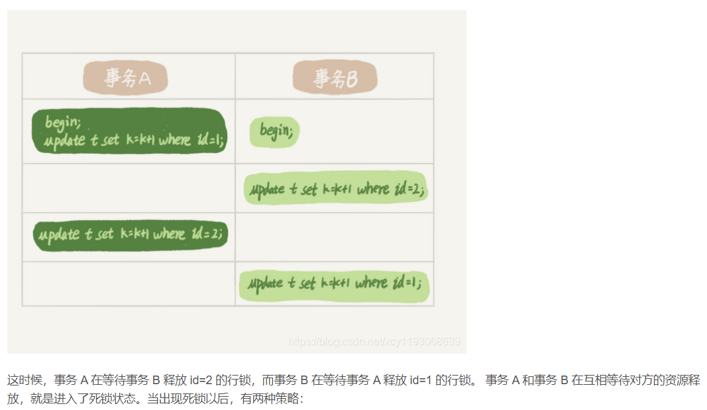
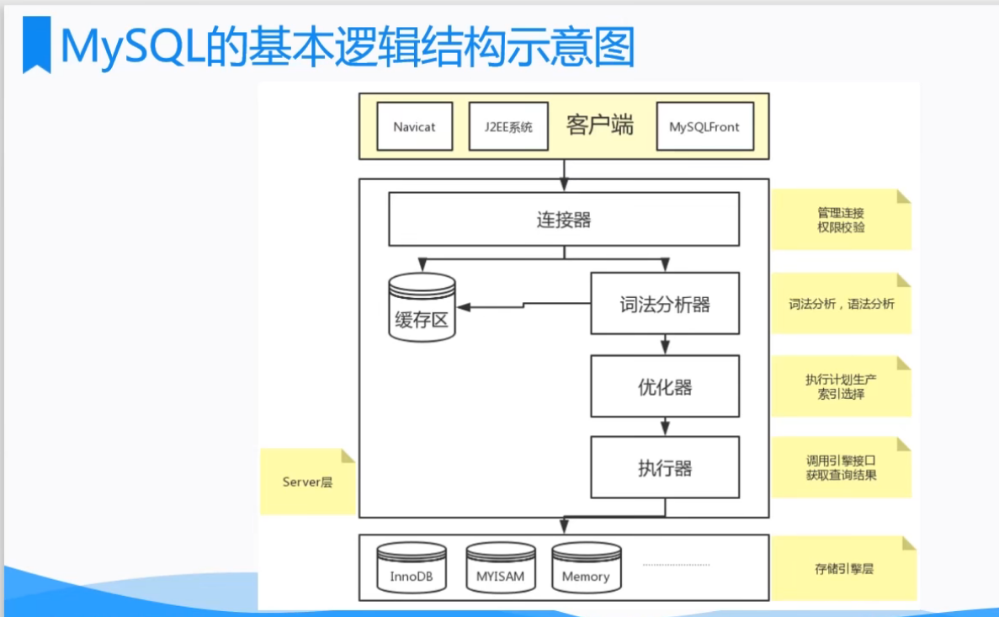
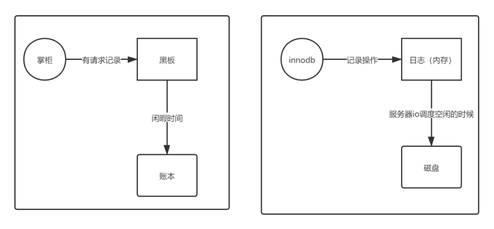
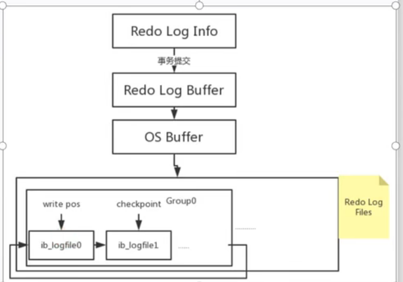
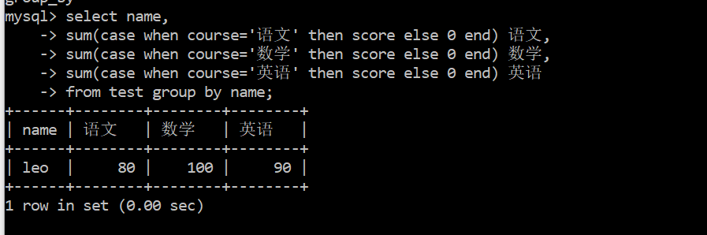

# Mysql

## Mysql索引

- 索引：排好序的数据结构

### 索引结构

#### 二叉树

- 为什么没有用二叉树作为索引？
    - 因为二叉树为了满足其特性，右孩子的值大于父节点大于左孩子结点元素的值，**在极端情况下会退化成链表**，**查询的时间复杂度是O(n)**，这跟表逐行扫描没区别，这显然不是我们期望的。

#### 红黑树

- 为什么没有用红黑树？
    - **红黑树查找效率要比二叉树高(会进行自旋，从而保证左右孩子高度差不会太大)**，但是呢在大数据量的情况下，树的高度太大，还是会导致很多次磁盘IO（每一次比较比较都是一次IO），效率还是不高。

#### Hash表

- 为什么不用Hash表
    - **因为不适合范围查找。**
- Hash索引适合等值查询

#### B-Tree

- 
- 为什么没有用B-Tree?
    - 因为每个结点里面**不仅要存储索引值还要存储数据所在的地址**，因此每个结点能够存储的索引个数相比于B+Tree而言就更少，因此树的高度就比B+Tree更高，磁盘IO就会更多，效率更低。

- B+Tree

    - 
    - 特性
        - 每一层所有结点，从左往右一次有序。
        - 非叶子结点之存储索引
        - 叶子结点存储索引和数据域的指针。
        - 每个结点大小是16KB

    - 查询过程
        - 查询30结点：先把根结点加载到内存，根据查找算法找到30所在位置，从左往右从上往下一次查找，最终找到索引所在的数据域的指针。

查看数据结构的网站 https://www.cs.usfca.edu/~galles/visualization/RedBlack.html

### 什么时候需要创建索引

- 主键外键创建索引
- 频繁需要查询的字段

### 什么时候不需要创建索引

- 需要频繁做更新或者删除操作的字段
    - 更新和删除结点会导致B+树结构发生变化，会大大降低数据库的性能
- 表的数据量小

### 什么字段适合做索引

- 离散度高（值不同）
- 经常用来做查询的字段


### 索引缺点

- 哪些字段作为索引，如果没有选择好。如果索引字段**频繁的更新和删除操作**，那么B+树需要重新的维护，**降低了数据库的性能**。
- 索引需要额外的**存储空间**。

### 索引命中

- 通过explain 来分析SQL的执行计划

### 是否用过Explain执行计划

- explain select * from table_name where id=1
- 有两个参数很重要
    - type
        - ALL：全表扫描
        - index：索引树扫描
        - range: 索引树上的范围扫描 (where id>4)
    - Extra
        - Using Where: 使用where条件过滤数据，查询的列没有被索引覆盖。
        - Using index: 索引命中，无需回表
        - Using index condition: 索引命中，但还需要一次回表查询。

### limit怎么保证后面的查询快

- LIMIT 子句可以被用于强制 SELECT 语句返回指定的记录数。LIMIT 接受一个或两个数字参数。参数必须是一个整数常量。如果给定两个参数，第一个参数指定**第一个返回记录行的偏移量**，**第二个参数指定返回记录行的最大数目**。初始记录行的偏移量是 0(而不是 1)： 为了与 PostgreSQL 兼容，MySQL 也支持句法： LIMIT # OFFSET #。

```mysql
mysql> SELECT * FROM table LIMIT 5,10; // 检索记录行 6-15   
  
//为了检索从某一个偏移量到记录集的结束所有的记录行，可以指定第二个参数为 -1：    
mysql> SELECT * FROM table LIMIT 95,-1; // 检索记录行 96-last.   
  
//如果只给定一个参数，它表示返回最大的记录行数目：    
mysql> SELECT * FROM table LIMIT 5; //检索前 5 个记录行   
  
//换句话说，LIMIT n 等价于 LIMIT 0,n。  
```

- 优化limit语句
    - 数据量大的情况下，就越往后分页，limit的偏移量就越大，查询速度就越慢，怎么解决？
        - **查询条件或者order by中使用索引字段**
        - **子查询的方式来提高分页效率（想办法降低它的偏移量）**

### 聚簇索引和非聚簇索引（普通索引）

- 聚簇索引：**索引和数据文件存放在一起的**。比如InnotDB存储引擎创建的表。

- 非聚簇索引：数据和索引文件是分开存储的。比如MyISAM存储引擎创建的表

    

### B+ Tree的叶子节点都可以存哪些东西

- 主键的值
- 整行数据

#### 这两者有什么区别

- 存储了整行数据的主键索引被称为聚簇索引；聚簇索引查询更快，因为通过索引可以直接获取到整行数据
- 存储了主键的值是非聚簇索引；非聚簇索引查询到的是主键的值，需要回表在查询一次数据，多一次IO，性能更低。

### 最左匹配原则

- 概念: 最左优先，在**检索数据时从联合索引的最左边开始匹配**
- 创建**联合索引(a,b,c)**：创建索引的时候先按照最左边第一个字段排序，在第一个字段相同的情况下，在按照第二个字段进行排序，一次类推。必须得有a，因此(a),(a,b),(a,b,c)可以命中索引，而(b),(c)没有命中索引。
- **当遇到范围查询(>,<,like,between)就停止匹配**，比如：(a,b,c)联合索引，a=1 and b>10 and c=3。这里a,b会走索引，c不会走索引。
- **=和in可以乱序：Mysql优化器会优化查询条件。**

### 覆盖索引

- **查询的字段在当前索引的叶子结点上，不需要回表。**

## 存储引擎

**表级别的，建表的时候需要选择存储引擎**

### MyISam & InnoDB

|                                 | MyISAM                                            | InnoDB                                                       |
| ------------------------------- | ------------------------------------------------- | ------------------------------------------------------------ |
| 组成上区别                      | 由3个文件构成：表结构文件，索引文件，数据文件构成 | 2个文件构成：表结构文件，索引文件和数据文件放在一起的        |
| 事务支持                        | MyISAM创建的表注重的是性能，不支持事务            | InnoDB支持事务，四种隔离级别                                 |
| Select,Update,Delete,Insert操作 | Select多的场景                                    | Insert和Update多的场景                                       |
| 锁                              | 表锁                                              | 行锁。<br />如果在执行SQL的过程中，不能够确定扫描的范围，那么还是会进行表锁。例如update table set num=1 where name like "%aaa%" |
| 外键支持                        | 不支持                                            | 支持                                                         |
| 默认引擎                        | 5.5.5版本之前是MyISAM                             | 5.5.5版本之后是InnoDB                                        |


## 数据类型

### 数值型

- TINYINT
- SMALLINT
- MEDIUMINT
- INT
- BIGINT
- FLOUT
- DOUBLE
- DECIMAL

### 日期类型

- DATE
- TIME
- YEAR
- DATETIME
- TIMESTAMP

### 字符串类型

- CHAR: 0-255字节;定长字符串
- VARCHAR: 0-65535字节；变长字符串
- BLOB：0-65535字节；二进制存储的长文本
- TEXT：0-65535字节；长文本数据

### char和varchar的区别

#### char

- 长度固定
- char(n)：存储的数据长度不够n，前面用空格填充
- 末尾有空格，自动截取掉空格

#### varchar

- 长度不固定
- varchar(n):实际字符串的长度+1个字节来记录字符串长度

## 数据库事务

```sql
# 开启事务
begin;

# 或者下面这条命令
start transaction;

# 提交
commit;

# 回滚
rollback;
```


- 什么是数据库事务：对数据库操作的集合
- 事务特性：ACID
    - A：原子性；要么全部成功，要么全部失败
    - C：一致性；数值的一致性
    - I：事务之间互相隔离
    - D：持久性；事务结束，对数据的修改是永久性的。

### ACID是靠什么保证的

- A（原子性）是通过Undo Log来保证的，Undo Log记录的需要回滚的日志信息，事务回滚是撤销已经执行成功的sql
- C（一致性）：有其他三大特性来保证
- I（隔离性）：由MVCC来保证
- D（持久性）：内存（Buffer Pool）+Redo Log来保证。修改数据会在内存和Redo Log记录这次操作，事务提交那么Redo Log日志和Buffer Pool中的数据持久化到磁盘。宕机的时候从Redo Log中恢复数据。

### 事务并发带来的问题

- 脏读（读的脏数据）
    - 事务A读取到事务B修改的数据，但是事务B中程序异常发生了回滚，因此事务A读取到的数据就是脏数据。
- 幻读
    - 事务A（同一个事务里面）第一次查询之后，事务B insert了一条数据 ，事务A第二次相同的条件进行查询，得到的结果不一致。**幻读的重点在于insert**。
- 不可重复读
    - 事务A两次查询结果不一致，两次查询区间事务B修改了查询后的数据。**重点在于update & delete。**

### 事务隔离级别

- 读取未提交内容
    - 不同事务之间可以读取未提交的内容；最低的隔离级别。
    - 问题：**脏读，不可重复读，幻读**
- 读取已提交内容
    - 只能读取已经提交的内容
    - 问题：**幻读，不可重复读。**
    - eg: 事务A一开始读取了卡里有2000元，这个时候事务B把卡里的钱花完了，事务A最终再确认余额的时候发现卡里已经没有钱了。很显然，读提交能解决脏读问题，但是解决不了不可重复读。**强调update操作**
- 可重复读
    - 默认隔离级别。同一个事务中多次相同查询条件的结果一致。
    - 问题：**幻读**
    - eg:事务A一旦开始执行，无论事务B怎么改数据，事务A永远读到的就是它刚开始读的值。那么问题就来了，假设事务B把id为1的数据改成了2，事务A并不知道id发生了变化，当事务A新增数据的时候却发现为2的id已经存在了，这就是幻读。**强调insert操作**
    - **MySQL的默认隔离级别就是Repeatable read。**
- 串行化
    - 事务之间串行执行，效率低。

### 怎么避免脏读幻读不可重复读问题

- 解决脏读：
    - **读的时候加共享锁**：事务读取数据的时候，其他事务不能够修改该数据。添加共享锁语句：**查询语句后面添加LOCK IN SHARE MODE**
    - **修改的时候加排它锁**：事务A修改数据时加排它锁，直到事务提交之后才释放，其他事务才可以获取到锁进行修改相应记录。**查询语句后面添加for update。**
    - 问题：还是会出现不可重复读的问题。
- 解决幻读和不可重复读

    - **加间隙锁**

### 事务传播机制

- PROPAGATION_REQUIRED（默认传播属性）：有事务，就用已经有的，当前没有事务就创建一个事务。
- PROPAGATION_SUPPORTS：有事务，就以事务方式运行，没有事务就以非事务方式运行。
- PROPAGATION_NOT_SUPPORTED：当前有事务，则挂起事务，执行当前逻辑，执行完之后再恢复上下文事务。
- PROPAGATION_MANDATORY： 支持当前事务，没有事务会抛异常。
- PROPAGATION_REQUIRESNEW：不管当前是否存在事务，自己会新创建一个事务
- PROPAGATION_NEVER：以非事务方式运行，如果有事务会抛异常
- PROPAGATION_NESTED：
    - 有父事务，则嵌套在父事务中运行
    - 没有父事务，则创建一个子事务运行
    - 父事务回滚，子事务回滚
    - 子事务回滚，父事务不会滚

### MVCC

- 多版本并发控制
- 

## 锁

### 行锁

- 锁住一行或者多行记录
- 条件：**开启事务，更新操作基于索引**
- 优缺点：并发高，锁冲突概率低，其他行的记录可以进行操作。**会出现死锁情况。**
- **共享锁和排它锁都属于行锁**

### 表锁

- 事务操作期间，对整张表加锁，其他事务不能够对该表进行操作，知道当前事务释放锁。
- 开启事务，更新操作中的查询条件是**基于非索引字段则会锁表**; update set where c(非索引字段)=1
- 优缺点：并发低，表锁的冲突特别大。但是不会出现死锁。

### 间隙锁

- 是在**可重复读的隔离级别**上加的锁

- 对一定**范围的数据加锁**，左开右闭。

- **有可能发生死锁，引入死锁检测机制，或者把数据库隔离级别设置成提交读**

- 

    - 比如说数据库里面有id=0/5/10 三条记录，

        ```sql
        begin;//事务A
        select * from t where id = 7 for update; //主键索引没有命中，会锁住(5,10]范围的记录
        select * from t where id>7 and id<10 for update; //主键索引没有7-10之间的记录，触发间隙锁，
        
        insert into t values(8,0,0)//事务B  会被锁住
        insert into t values(10,0,0)//事务B 会被锁住
        
        
        
        ```

### 逻辑层面的锁

#### 乐观锁

- 并不会真正锁某行记录，而是通过版本号来实现

#### 悲观锁

- 行锁和表锁都属于悲观锁。

### 死锁

- 比如说两个进程之间互相等待对方释放资源，获取到资源才能往下执行。**一种相互等待的状态。**
- 
- 解决死锁
    - InnoDB**开启死锁检测**，但是会有性能开销
    - 控制对相同资源的访问进行并发数量的控制

### 快照读

- 读取的是可见版本，有可能是历史版本，不用加锁。比如简单的select xxx from table where语句

### 当前读

- 读取的时候当前最新的记录，需要加锁。select for update; select  lock in share mode.

## 一条SQL在数据库中是如何执行的



- 连接器
    - 客户端通过**连接器（管理连接）**和MySql进行连接，通过查询用户表得知当前用户具有哪些权限，从而做接下来的操作。
    - 如果修改了用户权限，需要断开连接再重新建立连接，新的权限才会生效。

- 缓存区
    - **缓存了SQL语句，key-value形式存储**，key是SQL语句，value是查询后的值。
    - **适合读多写少的场景**；因为每次更新语句执行完之后，都会去缓存区里面更新结果，这样加重了数据库的负担。
    - 如何开启缓存：配置文件里面query_cache_type -> 0(关闭缓存)/1(开启缓存)/2（按照需要决定是否去缓存区里面查询）
        - 按照需要去缓存里面查询：select **SQL_CACHE** * from test;
    - **查询缓存在5.7之后被移除了**
- 词法分析器
    - 分析SQL语句语法是否正确
- 优化器
    - 优化SQL语句，使得其查询效率更高

- 执行器
    - 调用存储引擎去磁盘查询数据，把查询出来的结果返回给缓存区进行缓存。

## MySql慢查询该如何优化

- 检查查询是否走了索引，没有则利用索引优化SQL语句？
- 有索引，是否是主键索引/最优索引，还是普通索引？
    - 主键索引对应的是整行数据块，通过主键索引查询只需要查询一次
    - 普通索引查询到数据块记录的是主键索引，再通过主键索引查询到记录的过程叫回表
- 查询的字段是否过多？
- 表中数据是否过多（超过千万条），是否需要分库分表？
- **硬件方面**：数据库实例所在机器上的配置是否过低，增加CPU，Memory，Disk等。

## MySql分层

- Server层
    - 连接器，缓存区，词法分析器，优化器，执行器
- 存储引擎层
    - InnoDB（5.5.5版本之后默认存储引擎），MyISAM，Memory

## 日志模块

### Bin Log（归档日志）

- 二进制日志
- **Mysql的Server层实现（所有引擎共用）**
- 是**逻辑日志，记录的SQL的DML操作语句**
- 不限大小，**追加写入**，不会覆盖以前的日志，写满一个文件之后，创建一个新的文件继续写
- 数据恢复
    - 可以通过指定归档日志文件来恢复数据
    - 指定文件里面的位置或者timestamp来恢复数据
- 模式
    - statement模式：记录的SQL语句
    - row模式：记录行的内容，记两条，更新前后各一条

#### Bin Log为什么没有crash safe的功能

- 因为Bin Log记录的是全量的日志，数据库挂了，不知道数据从哪个地方开始恢复。而Redo Log里面只记录未被刷盘的日志。

### Redo Log（重做日志）



- 作用
  
  - 更新操作如果直接写入磁盘，那么需要查找当前记录在磁盘上哪个位置，然后再更新，**整个过程中磁盘IO和查找的成本很高**，因此引入了Redo Log(日志重做)来提升效率
  - 根据Redo Log恢复数据
  
- 怎么提升了效率

    - 通过WAL（Write-Ahead Logging）先写日志再写磁盘。

    - 具体来说：先把更新的记录写到Redo Log Buffer -> 磁盘

        

        - Redo Log文件是有限定大小的，如果write pos（文件写入位置） 和 checkpoint （文件擦除位置）相遇，**那么停止数据库语句的执行，把redo log日志同步到磁盘上，之后对redo log做擦除**。**它只记录未刷盘的日志。**
        - 有了Redo Log日志，数据库异常重启的时候，可以根据Redo Log日志里面的内容从而恢复相应的数据。
        - **InnoDB引擎层特有的功能。**

#### Redo Log一般设置多大

- 如果是几个T的磁盘，可以Redo Log设置为4个文件，每个文件1G

### 线上数据误删怎么办

- 比如说有5个Bin log文件(mysql-bin.00001~mysql-bin.00005)，第五个文件里面记录了最近一次误删的操作。
- 先通过前面4个Big Log文件恢复部分数据到临时库临时表
- 找到第五个Bin Log文件误删操作所在行，从头到误删行的内容复制到一个新的Bin Log文件，之后通过这个新的Bin Log文件恢复数据。这样临时表的数据就是误删前的数据
- 再把临时表里面的数据导入到线上的数据库表中即可

### MySql两阶段提交-2PC

- 概念：把一个事务分成两个阶段来提交；
- 目的：为了保证Redo Log和Bin Log的逻辑一致性。不然数据库挂了，从Redo Log和Bin Log恢复回来的**数据会出现不一致**的情况。
- 阶段：
    - 准备阶段：Redo Log写盘，事务进入prepare状态
    - 提交阶段：prepare成功之后，Bin Log写盘，如果写盘成功，事务进入commit状态（Redo Log里面写一个commit记录）。

### 怎么判断事务执行成功了

- Redo Log里面是否有commit记录？有就成功了，有，说并Bin Log持久化到磁盘一定成功。

### 怎么判断Redo Log和Bin Log逻辑上是一致呢

- Redo Log和Bin Log中有一个字段叫做XID，如果XID字段是一致的，那么Bin Log和Redo Log在逻辑上就是一致的，否则MySql就会回滚。

### Redo log buffer 是什么？是先修改内存，还是先写 Redo Log 文件

- 比如表中更新记录，会生成日志，但是事务还没有commit，因此不能直接写入Redo Log文件中。这个时候就引入了Redo Log Buffer, 用来存储更新的日志。然后执行了commit语句以后，才会从Redo Log Buffer里面把日志内容写到Redo Log文件中。

### InnoDB是如何实现事务的

- 通过Redo Log, Undo Log, Redo Log Buffer, Buffer Pool来实现的。
- 以一条update语句为例，通过条件找到数据所在页，并将该页缓存在**Buffer Pool中**，并修改Buffer Pool中的数据。
- 同时update语句执行中会生成**Redo Log对象**，并存入到**Redo Log Buffer**中
- 同时update语句也会生成**Undo Log**日志，用于事务回滚
    - 如果事务提交，则对Redo Log对象进行持久化操作，Buffer Pool中的数据也会持久化到磁盘
    - 如果事务回滚，可以通过**Undo Log进行回滚**

## Redis和Mysql如何保证数据一致性

- **Redisson的读写锁**
  - 多线程之间可以加多个读锁（可重入），底层通过Lua脚本来实现，通过mode->read,如果都是加读锁，都可以成功，执行完释放掉锁
  - 多线程可以并发读，读写不可以，写写也不可以并发。

## SQL列转行

```sql
name,course,score
leo,语文，100
leo,数学，90
leo,英语，80
转成
name,语文,数学,英语
leo,100,90,80
```

```sql
select name,
	sum(case when course='语文' then score else 0 end) 语文,
	sum(case when course='数学' then score else 0 end) 数学,
	case when course='英语' then score else 0 end) 英语
from test group by name;
```




# 面试题目

## 索引是什么

- 底层数据结构是B+树，从左往右从上往下一次有序
- 非叶子节点存储索引信息和下一层节点的指针信息
- 叶子结点存储数据域和指针域

## 什么字段不适合做索引

- 频繁更新和删除的字段，因为会导致B+树的调整，对性能有损耗
- 表数据量小

## 索引设计原则

- 经常用来做查询的字段
- 索引字段的值离散度高

## 聚簇索引和非聚簇索引

- 聚簇索引
  - 数据域和指针域在一个文件里面，比如InnoDB存储引擎创建的表
- 非聚簇索引 -》普通索引
  - 数据和指针分离，比如MyISAM存储引擎创建的表

## 事务隔离级别

- 读未提交
  - 脏读
- 读已提交
  - 不可重复读
- 可重复读
  - 幻读
- 串行化
  - 没有并发，性能大大降低

## Mysql默认隔离级别为什么要设置成可重复读而Sql-server设置成读已提交


## 你们的DB隔离级别设置成什么

- 查看数据库事务隔离级别

  ```sql
  show variables like 'tx_isolation';
  SELECT @@tx_isolation;
  ```

  


