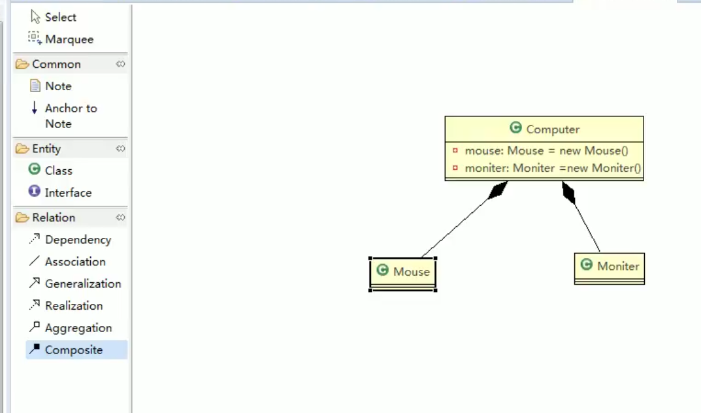
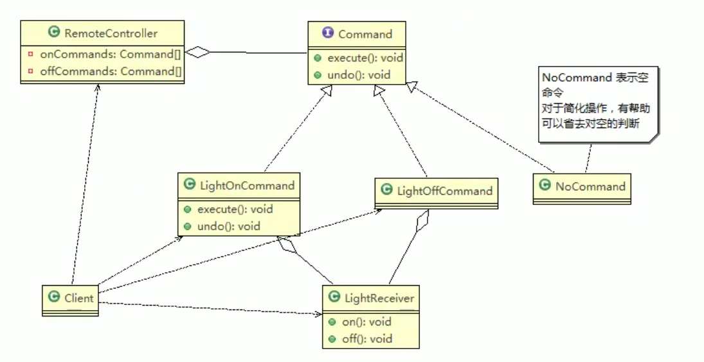

# 设计模式

- 作用：程序具备可扩展性

## 7大原则

### 单一职责

- 一个类或者一个对象只负责某一个功能，否则就需要进行拆分

### 接口隔离

- 一个类如果通过接口依赖于另外一个类，那么需要将接口尽可能的拆分的小，降低系统的耦合度。

### 里式替换

- 子类继承父类，但是尽可能不要重写父类的方法。
- 如果一定要重写，那么应该通过组合，聚合等方式来实现。

### 依赖倒置

- 面向接口编程，让依赖尽可能的抽象，不要把依赖写死成一个具体的抽象类。

### 开闭原则

- **OCP**: **对扩展开放，对修改关闭**
- 当需求发生变化的时候，尽可能少的修改源代码，只需要增强新增模块，可以根据需求进行扩展。

### 迪米特法则

- 又叫：**最少知道原则**
- **类之间的耦合度尽可能的小**
- **直接朋友**：A 依赖于B，B如果是A的**成员变量，方法参数，方法返回值**那么B是A的直接朋友。
  - **局部变量**：但是B如果是是A的局部变量，那么应该尽量避免这种方式。

### 合成复用原则

- 采用组合或者聚合的方法来实现，而不是采用继承。

## SOLID原则

- 单一职责（SRP）
- 开闭原则(OCP)
- 里式替换(LSP)
- 接口隔离(ISP)
- 依赖倒置(DIP)

## UML


- 统一建模语言

### 分类

- 用例图
- 静态结构图：**类图**，顺序图，用例图，对象图，包图，组件图，部署图
  - 类图：描述类于类之间的关系的，是UML最核心的部分
- 动态行为图：交互图，状态图，活动图

#### 类图之间的关系

- 依赖

- 泛化（继承）

- 实现

- 关联

  - 类于类之间的联系

    

- 聚合于组合

  - 聚合：整体和部分可以分离

    ```java
    public class Computer
    {
        private Monitor monitor;
        private Mouse mouse;
        
       	//setter
        
    }
    ```

    - 比如我们认为，电脑和鼠标，以及电脑和显示器是可以分离的。

      

  - 组合：整体和部分是不可以分离的。Comupter一创建就会有monitor & mouse

    ```java
    public class Computer
    {
        private Monitor monitor =  new Monitor();
        private Mouse mouse =  new Mouse();
        
       	//setter & getter
        
    }
    ```

    


## 设计模式类型

### 创建型

#### 单例

- 只提供一个方法（静态方法）来获取对象的同一个实例

##### 饿汉式（静态常量）

```java
public class Singleton
{
    //类加载的时候就创建该对象
    private final static Singleton instance = new Singleton();

    private Singleton()
    {

    }

    public static Singleton getInstance()
    {
        return instance;
    }
}
```

- 优点：线程安全
- 缺点：由于在类加载的时候就创建该实例，如果后期不用的话，会是一种资源的浪费。

##### 饿汉式（静态代码块）

```java
package root.design.singleton;

public class StaticSingleton
{
    private static StaticSingleton instance;

    //类加载的时候执行，且只执行一次
    static
    {
        instance = new StaticSingleton();
    }

    private StaticSingleton()
    {

    }

    public static StaticSingleton getInstance()
    {
        return instance;
    }
}

```

##### 懒汉式（线程不安全）

```java
package root.design.singleton;

public class LazySingleton
{
    private static LazySingleton instance;

    private LazySingleton()
    {

    }

    //用到的时候才加载
    public static LazySingleton getInstance()
    {
        if(null == instance)
        {
            instance = new LazySingleton();
        }
        return instance;
    }
}

```

- 缺点：线程不安全

##### 懒汉式（线程安全，同步方法）

- 加同步就安全了

- 缺点：锁的粒度太大

  ```java
  package root.design.singleton;
  
  public class LazySynchronizeSingleton
  {
      private static LazySynchronizeSingleton instance;
  
      private LazySynchronizeSingleton()
      {
  
      }
  
      //用到的时候才加载
      public synchronized LazySynchronizeSingleton getInstance()
      {
          if(null == instance)
          {
              instance = new LazySynchronizeSingleton();
          }
          return instance;
      }
  }
  
  ```

  

##### 懒汉式（线程安全，同步代码块）

- 不推荐，有问题的，它会创建多个实例

##### 双重检查（DCL-双重校验锁）

- **实际开发中推荐使用**

  - 优点：懒加载，多线程环境线程安全

  ```java
  public class DCLSingleton
  {
      private static volatile DCLSingleton instance; //目的是为了保证内存可见，和防止指令重拍
  
      private DCLSingleton()
      {
  
      }
  
      public static DCLSingleton getInstance()
      {
          if(null == instance)
          {
              synchronized (DCLSingleton.class)
              {
                  if(null == instance)
                  {
                      instance = new DCLSingleton();
                  }
              }
          }
  
          return instance;
      }
  }
  
  ```

  

##### 静态内部类

- **外部类加载的时候，静态内部类不会被加载**，从而达到懒加载的效果

- **通过对外的方法去获取静态内部类的成员变量，此时静态内部类会被加载，里面的属性会被实例化一次，且仅一次**。

- 根据JVM类加载机制特性：只有一个线程

  ```java
  public class LazySynchronizeSingleton
  {
      private static LazySynchronizeSingleton instance;
  
      private LazySynchronizeSingleton()
      {
  
      }
  
      public synchronized LazySynchronizeSingleton getInstance()
      {
          if(null == instance)
          {
              instance = new LazySynchronizeSingleton();
          }
          return instance;
      }
  }
  ```

  

##### 枚举

- 推荐使用，内部都是常量

- 线程安全

  ```java
  public enum EnumSingleton
  {
      INSTANCE;
      
      private EnumSingleton()
      {
  
      }
  
  }
  ```

  


#### 工厂

##### 简单工厂

- 通过工厂来创建某一类对象的实例

  - 比如通过工厂来统一创建自定义的Pizza

    ```java
    public class SimpleFactory
    {
    
        public Pizza createPizza(Pizza pizzas)
        {
            Pizza pizza = null;
            if(pizzas instanceof GreekPizza)
            {
                pizza = new GreekPizza("Greek");
            }
            if(pizzas instanceof Pepper)
            {
                pizza = new GreekPizza("Pepper");
            }
            return pizza;
        }
    }
    ```

- 局限性：在于只能生产某一个维度的产品，比如Pizza

##### 抽象工厂

- 能够生产多维度的产品，组成产品簇

- 比如：我有一个工厂，能够生产**商品，商品的颜色和形状**

  - PizzaFactory用来创建Pizza，指定其颜色和形状
  - IceCreamFactory用来创建IceCream

  ```java
  public interface Factory
  {
      Object createObject(Object object);
  
      Shape createShape(Shape shape);
  
      Color createColor(Color color);
  }
  
  ```

  ```JAVA
  public abstract class AbstractFactory implements Factory
  {
      
  }
  ```

  ```java
  
  public class PizzaFactory extends AbstractFactory
  {
      @Override
      public Object createObject(Object object)
      {
          Pizza pizza = null;
          if(object instanceof GreekPizza)
          {
              pizza = new GreekPizza("Greek Pizza");
          }
          return pizza;
      }
  
      @Override
      public Shape createShape(Shape shape)
      {
          Shape realShape = null;
          if(shape instanceof Square)
          {
              realShape = new Square("Square");
          }
          return realShape;
      }
  
      @Override
      public Color createColor(Color color)
      {
          Color realColor = null;
          if(color instanceof Red)
          {
              realColor = new Red("Red");
          }
          return color;
      }
  }
  ```

  

#### 原型

- **默认是浅拷贝，只会进行值传递**

  ```java
  public class Sheep implements Cloneable
  {
      private String name;
      private Sheep friend;
  
      public String getName()
      {
          return name;
      }
  
      public void setName(String name)
      {
          this.name = name;
      }
  
      public Sheep getFriend()
      {
          return friend;
      }
  
      public void setFriend(Sheep friend)
      {
          this.friend = friend;
      }
  
      public Sheep()
      {
      }
  
      public Sheep(String name, Sheep friend)
      {
          this.name = name;
          this.friend = friend;
      }
  
      @Override
      public Object clone()
      {
          Sheep sheep = null;
          try
          {
              sheep = (Sheep) super.clone();
          } catch (CloneNotSupportedException e)
          {
              e.printStackTrace();
          }
          return sheep;
      }
  
  }
  ```

- 深拷贝：Class里面的的**引用对象也实现了clone方法**

  ```java
  public class Sheep implements Cloneable
  {
      private String name;
      private Sheep friend;
  
      public String getName()
      {
          return name;
      }
  
      public void setName(String name)
      {
          this.name = name;
      }
  
      public Sheep getFriend()
      {
          return friend;
      }
  
      public void setFriend(Sheep friend)
      {
          this.friend = friend;
      }
  
      public Sheep()
      {
      }
  
      public Sheep(String name, Sheep friend)
      {
          this.name = name;
          this.friend = friend;
      }
  
      @Override
      public Object clone()
      {
          Sheep sheep = null;
          try
          {
              sheep = (Sheep) super.clone();
              if(this.friend != null)
              {
                  friend = (Sheep)this.friend.clone(); //引用对象也实现了clone方法
              }
              //friend = (Sheep) super.clone();
          } catch (CloneNotSupportedException e)
          {
              e.printStackTrace();
          }
          return sheep;
      }
  
  }
  ```

- 深拷贝方式二：**实现Serializable接口，通过输入流和输出流**来实现。

- 应用场景
  - 创建相同内容的对象比较麻烦，可以使用原型模式

#### 建造者


- 场景：盖房子，过程包括打桩，砌墙，封顶。不管是楼房还是别墅还是什么，都要经历这些过程，请用建造者模式来设计

  


##### 抽象工厂和建造者模式之间的差别

- 抽象工厂：创建产品簇，一系列产品，不关心产品创建过程，只关心什么产品由什么工厂创建而来

- 建造者：侧重点在于通过哪些步骤把产品创建出来

  ```java
  public abstract class HouseBuilder
  {
      private House house;
  
      public abstract void buildBase();
  
      public abstract void buildWall();
  
      public abstract void buildRoof();
  
      public HouseBuilder(House house)
      {
          this.house = house;
      }
  
      public House buildHouse()
      {
          return this.house;
      }
  }
  ```

  ```java
  public class HouseDirector //包工头儿
  {
      private HouseBuilder houseBuilder; //交给谁来创建什么样的房子
  
      public HouseDirector(HouseBuilder houseBuilder)
      {
          this.houseBuilder = houseBuilder;
      }
  
      public House buildHouse()
      {
          this.houseBuilder.buildBase();
          this.houseBuilder.buildWall();
          this.houseBuilder.buildRoof();
          return this.houseBuilder.buildHouse();
      }
  }
  ```

  

### 结构型

#### 适配器

- A类想要调用B类的目标方法，但是又不能直接调用，于是中间可以加一个适配器，通过适配器来调用B中的方法

  - 220V电压不能直接给手机充电，手机只能接收5V的电压，因此中间通过适配器来完成手机充电的功能。

    

  - 类适配器
  
    - 通过继承来实现，但是违反了里式替换原则

    ```java
    
    public class Voltage220V
    {
        public int output220V()
        {
            return 220;
        }
    }
    ```
  
    ```java
    public interface IVoltage5V
    {
        public int output5V();
    }
    ```
  
    ```java
    public class VoltageAdapter extends Voltage220V implements IVoltage5V
    {
        @Override
        public int output5V()
        {
            int srcVoltage = this.output220V();
            int targetVoltage = srcVoltage/44;
            return targetVoltage;
        }
    }
    ```
  
    ```java
    public class Phone
    {
        public void charge(IVoltage5V iVoltage5V)
        {
            int output = iVoltage5V.output5V();
            if(5 == output)
            {
                System.out.println(" I can change.");
            }
            else
            {
                System.out.println(" I can not work.");
            }
        }
    }
    ```
  
    ```java
    public class AdapterTest
    {
        public static void main(String[] args)
        {
            VoltageAdapter voltageAdapter = new VoltageAdapter();
            Phone phone = new Phone();
            phone.charge(voltageAdapter);
        }
    }
    ```
  
  - **对象适配器**
  
    - 通过**聚合**来实现
  
      ```java
      public class VoltageAdapter implements IVoltage5V
      {
          private Voltage220V voltage220V; //通过聚合的方式来实现
      
          @Override
          public int output5V()
          {
              int src = this.voltage220V.output220V();
              return src/44;
          }
      
          public VoltageAdapter()
          {
      
          }
      
          public VoltageAdapter(Voltage220V voltage220V)
          {
              this.voltage220V = voltage220V;
          }
      }
      ```
  
      
  
  - 接口适配器
    - **通过抽象类默认实现（空实现）全部的接口方法，子类或者匿名内部类根据需要重写抽象类中的方法**
  
  

#### 桥接

- 应用场景

  - 存在两个及其以上的维度需要调整的时候，可以通过桥接模式来解耦多个维度

    

- 案例：

  - 选购包包，有不同颜色（黄色，红色），有不同用途（钱包，双肩背包）

  ```java
  public interface IBagUsage
  {
      public void usage();
  }
  ```

  ```java
  public abstract class Color
  {
      protected IBagUsage bagUsage; //组合的方式引入
  
      public Color(IBagUsage bagUsage)
      {
          this.bagUsage = bagUsage;
      }
  
      public abstract void printColor();
  }
  ```

  ```java
  public class RedColor extends Color
  {
      public RedColor(IBagUsage bagUsage)
      {
          super(bagUsage);
      }
  
      @Override
      public void printColor()
      {
          System.out.println("Red");
          bagUsage.usage();
      }
  }
  ```

  ```java
  public class BackpackUsageImpl implements IBagUsage
  {
      @Override
      public void usage()
      {
          System.out.println("Backpack usage");
      }
  }
  ```

  ```java
  public class BridgeTest
  {
      public static void main(String[] args)
      {
          IBagUsage bagUsage = new BackpackUsageImpl();
          Color color = new YellowColor(bagUsage);
          color.printColor();
      }
  }
  ```

  

#### 装饰者

- **动态的将新功能添加到对象上**，体现了OCP的原则。

- 场景：咖啡种类有：卡布奇洛，摩卡，拿铁，调料有牛奶，巧克力，豆浆。两类都可以单卖，请用装饰着模式进行设计。

  

  

  

- 注意点：

  - 谁是Base(Drink:Latte)，(MilkDecorator,SoyDecorator装饰者)装饰谁（drink）？？

    ```java
    
    public abstract class Drink
    {
        public abstract String getDescription();
    
        public abstract double getCost();
    }
    ```

    ```java
    public class Cappuccino extends Drink
    {
        @Override
        public String getDescription()
        {
            return "add one Cappuccino and cost is 12";
        }
    
        @Override
        public double getCost()
        {
            return 12.0;
        }
    }
    ```

    ```java
    public class Latte extends Drink
    {
        @Override
        public String getDescription()
        {
            return "add one Latte and cost is 8";
        }
    
        @Override
        public double getCost()
        {
            return 8.0;
        }
    }
    ```

    ```java
    public class Decorator extends Drink
    {
        private Drink drink;
    
        public Decorator()
        {
    
        }
        public Decorator(Drink drink)
        {
            this.drink = drink;
        }
    
        @Override
        public String getDescription()
        {
            return drink.getDescription();
        }
    
        @Override
        public double getCost()
        {
            return drink.getCost();
        }
    }
    ```

    ```java
    public class MilkDecorator extends Decorator
    {
        public MilkDecorator()
        {
    
        }
    
        public MilkDecorator(Drink drink)
        {
            super(drink);
        }
    
        @Override
        public String getDescription()
        {
            System.out.println(super.getDescription());
            return "add one Milk and cost is 5";
        }
    
        @Override
        public double getCost()
        {
            return super.getCost() + 5;
        }
    
    }
    ```

    ```java
    public class SoyBeanDecorator extends Decorator
    {
        public SoyBeanDecorator(Drink drink)
        {
            super(drink);
        }
    
    
        @Override
        public String getDescription()
        {
            System.out.println(super.getDescription());
            return "add one SoyBean and cost is 3";
        }
    
        @Override
        public double getCost()
        {
            return super.getCost() + 3;
        }
    
    }
    ```

    ```java
    public class DecoratorTest
    {
        public static void main(String[] args)
        {
            Drink latte = new Latte();
            Drink milk = new MilkDecorator(latte);
    
            System.out.println(milk.getDescription());
            System.out.println(milk.getCost());
    
            Drink soy = new SoyBeanDecorator(milk);
            System.out.println(soy.getDescription());
            System.out.println(soy.getCost());
    
        }
    }
    ```

    

##### 底层应用

- FileInputStream就是一个装饰者

#### 组合


- 场景：大学下面有多个学院，学院下面有多个专业，请通过组合模式来实现，添加删除展示的操作

  ```java
  public abstract class OrganizationComponent
  {
      private String name;
      private String description;
  
      public String getName()
      {
          return name;
      }
  
      public void setName(String name)
      {
          this.name = name;
      }
  
      public String getDescription()
      {
          return description;
      }
  
      public void setDescription(String description)
      {
          this.description = description;
      }
  
      public OrganizationComponent(String name, String description)
      {
          this.name = name;
          this.description = description;
      }
  
      protected void add(OrganizationComponent organizationComponent)
      {
              throw new UnsupportedOperationException();
      }
  
      protected void remove(OrganizationComponent organizationComponent)
      {
          throw new UnsupportedOperationException();
      }
  
  
      protected void display()
      {
          throw new UnsupportedOperationException();
      }
  }
  
  ```

  ```java
  public class University extends OrganizationComponent
  {
      List<OrganizationComponent> organizationComponentList = new ArrayList<>();
  
      public University(String name, String description)
      {
          super(name, description);
      }
  
      @Override
      protected void add(OrganizationComponent organizationComponent)
      {
          organizationComponentList.add(organizationComponent);
      }
  
      @Override
      protected void remove(OrganizationComponent organizationComponent)
      {
          organizationComponentList.remove(organizationComponent);
      }
  
  
      @Override
      public String getName()
      {
          return super.getName();
      }
  
      @Override
      public String getDescription()
      {
          return super.getDescription();
      }
  
      @Override
      protected void display()
      {
          System.out.println(getName() +"\t" + getDescription());
          for (OrganizationComponent organizationComponent : organizationComponentList)
          {
              organizationComponent.display();;
          }
      }
  }
  
  ```

  ```java
  public class Institute extends OrganizationComponent
  {
      List<OrganizationComponent> organizationComponentList = new ArrayList<>();
  
      public Institute(String name, String description)
      {
          super(name, description);
      }
  
      @Override
      protected void add(OrganizationComponent organizationComponent)
      {
          organizationComponentList.add(organizationComponent);
      }
  
      @Override
      protected void remove(OrganizationComponent organizationComponent)
      {
          organizationComponentList.remove(organizationComponent);
      }
  
      @Override
      public String getName()
      {
          return super.getName();
      }
  
      @Override
      public String getDescription()
      {
          return super.getDescription();
      }
  
      @Override
      protected void display()
      {
          System.out.println(getName() +"\t" + getDescription());
          for (OrganizationComponent organizationComponent : organizationComponentList)
          {
              organizationComponent.display();;
          }
      }
  }
  ```

  ```java
  public class Major extends OrganizationComponent
  {
      public Major(String name, String description)
      {
          super(name, description);
      }
  
      @Override
      public String getName()
      {
          return super.getName();
      }
  
      @Override
      public String getDescription()
      {
          return super.getDescription();
      }
  
      @Override
      protected void display()
      {
          System.out.println(getName() + "\t" + getDescription());;
      }
  }
  ```

  ```java
  public class CompositeTest
  {
      public static void main(String[] args)
      {
          OrganizationComponent university = new University("Chengdu University", "chengdu university");
  
          OrganizationComponent computerInstitute = new Institute("Computer Institute", "computer institute");
          OrganizationComponent economyInstitute = new Institute("Economy Institute", "economy institute");
  
          OrganizationComponent networkMajor = new Major("Network Engineering","network engineering");
          OrganizationComponent softwareMajor = new Major("Software Engineering", "software engineering");
          OrganizationComponent publicManagementMajor = new Major("Public Management", "public management");
  
  
  
          computerInstitute.add(networkMajor);
          computerInstitute.add(softwareMajor);
          economyInstitute.add(publicManagementMajor);
          university.add(computerInstitute);
          university.add(economyInstitute);
  
          university.display();;
          System.out.println("*************************");
          computerInstitute.display();;
      }
  }
  ```

  

#### 外观

- 一个类或者多个类需要和多个类打交道，耦合太大，因此引入外观模式，外观类作为统一的入口，来处理类之间的关系

  - 

  - 场景：入职体检，需要身高，体重，血常规，视力检查，请用Facade模式来实现

    ```java
    public class General
    {
        public void height()
        {
            System.out.println("test height");
        }
    
        public void weight()
        {
            System.out.println("test weight");
        }
    }
    ```

    ```java
    public class BloodGeneral
    {
        public void inspect()
        {
            System.out.println("test blood");
        }
    }
    
    ```

    ```java
    public class SightGeneral
    {
        public void inspect()
        {
            System.out.println("test eye sight.");
        }
    }
    
    ```

    ```java
    public class GeneralFacade
    {
        General general = new General();
        SightGeneral sightGeneral = new SightGeneral();
        BloodGeneral bloodGeneral = new BloodGeneral();
    
        public void generalInspect()
        {
            general.height();
            general.weight();
        }
    
        public void sightInspect()
        {
            sightGeneral.inspect();;
        }
    
        public void bloodInspect()
        {
            bloodGeneral.inspect();
        }
    }
    ```

    ```java
    public class FacadeTest
    {
        public static void main(String[] args)
        {
            GeneralFacade facade = new GeneralFacade();
    
            facade.generalInspect();
            facade.bloodInspect();
            facade.sightInspect();
        }
    }
    ```

    

#### 享元


- 优点：**本质通过缓存来减少相同对象的创建**，节约内存空间

  ```java
  public interface Shape
  {
      public void draw();
  }
  
  ```

  ```java
  public class Circle implements Shape
  {
      private String color;
  
      public Circle(String color)
      {
          this.color = color;
      }
  
      @Override
      public void draw()
      {
          System.out.println("draw circle");
      }
  }
  
  ```

  ```java
  public class ShapeFactory
  {
      private static Map<String, Shape> cache = new HashMap<>();
  
      public static Shape createShape(String color)
      {
          Shape shape = cache.get(color);
          if(null == shape)
          {
              shape = new Shape()
              {
                  @Override
                  public void draw()
                  {
  
                  }
              };
              cache.put(color, shape);
          }
          return shape;
      }
  
      public static int getShapeSize()
      {
          return cache.size();
      }
  }
  ```

  ```java
  public class FlyWeightTest
  {
  
      public static void main(String[] args)
      {
          ShapeFactory.createShape("Red");
          ShapeFactory.createShape("Green");
          ShapeFactory.createShape("Red");
          ShapeFactory.createShape("Red");
          ShapeFactory.createShape("Red");
          ShapeFactory.createShape("Red");
          System.out.println(ShapeFactory.getShapeSize());
      }
  }
  ```

  

#### 代理

### 行为型

#### 模板


- 共同的行为放在抽象类中实现，子类不同的特点根据各自情况来实现。

- 案例：出国留学手续一般经过以下流程：索取学校资料，提出入学申请，办理因私出国护照、出境卡和公证，申请签证，体检、订机票、准备行装，抵达目标学校等，其中有些业务对各个学校是一样的，但有些业务因学校不同而不同，所以比较适合用模板方法模式来实现。

  - 我们先定义一个出国留学的抽象类 StudyAbroad，里面包含了一个模板方法 TemplateMethod()，该方法中包含了办理出国留学手续流程中的各个基本方法，其中有些方法的处理由于各国都一样，所以在抽象类中就可以实现，但有些方法的处理各国是不同的，必须在其具体子类（如美国留学类 StudyInAmerica）中实现。如果再增加一个国家，只要增加一个子类就可以了

  ```java
  package root.design.template;
  
  public abstract class StudyAbroad
  {
      public void TemplateMethod() //模板方法
      {
          LookingForSchool(); //索取学校资料
          ApplyForEnrol();    //入学申请
          ApplyForPassport(); //办理因私出国护照、出境卡和公证
          ApplyForVisa();     //申请签证
          ReadyGoAbroad();    //体检、订机票、准备行装
          Arriving();         //抵达
      }
  
      public void ApplyForPassport() {
          System.out.println("三.办理因私出国护照、出境卡和公证：");
          System.out.println("  1）持录取通知书、本人户口簿或身份证向户口所在地公安机关申请办理因私出国护照和出境卡。");
          System.out.println("  2）办理出生公证书，学历、学位和成绩公证，经历证书，亲属关系公证，经济担保公证。");
      }
      public void ApplyForVisa() {
          System.out.println("四.申请签证：");
          System.out.println("  1）准备申请国外境签证所需的各种资料，包括个人学历、成绩单、工作经历的证明；个人及家庭收入、资金和财产证明；家庭成员的关系证明等；");
          System.out.println("  2）向拟留学国家驻华使(领)馆申请入境签证。申请时需按要求填写有关表格，递交必需的证明材料，缴纳签证。有的国家(比如美国、英国、加拿大等)在申请签证时会要求申请人前往使(领)馆进行面试。");
      }
      public void ReadyGoAbroad() {
          System.out.println("五.体检、订机票、准备行装：");
          System.out.println("  1）进行身体检查、免疫检查和接种传染病疫苗；");
          System.out.println("  2）确定机票时间、航班和转机地点。");
      }
      public abstract void LookingForSchool();//索取学校资料
      public abstract void ApplyForEnrol();   //入学申请
      public abstract void Arriving();        //抵达
  }
  
  ```

  ```java
  public class StudyInAmerica extends StudyAbroad {
      @Override
      public void LookingForSchool() {
          System.out.println("一.索取学校以下资料：");
          System.out.println("  1）对留学意向国家的政治、经济、文化背景和教育体制、学术水平进行较为全面的了解；");
          System.out.println("  2）全面了解和掌握国外学校的情况，包括历史、学费、学制、专业、师资配备、教学设施、学术地位、学生人数等；");
          System.out.println("  3）了解该学校的住宿、交通、医疗保险情况如何；");
          System.out.println("  4）该学校在中国是否有授权代理招生的留学中介公司？");
          System.out.println("  5）掌握留学签证情况；");
          System.out.println("  6）该国政府是否允许留学生合法打工？");
          System.out.println("  8）毕业之后可否移民？");
          System.out.println("  9）文凭是否受到我国认可？");
      }
      @Override
      public void ApplyForEnrol() {
          System.out.println("二.入学申请：");
          System.out.println("  1）填写报名表；");
          System.out.println("  2）将报名表、个人学历证明、最近的学习成绩单、推荐信、个人简历、托福或雅思语言考试成绩单等资料寄往所申请的学校；");
          System.out.println("  3）为了给签证办理留有充裕的时间，建议越早申请越好，一般提前1年就比较从容。");
      }
      @Override
      public void Arriving() {
          System.out.println("六.抵达目标学校：");
          System.out.println("  1）安排住宿；");
          System.out.println("  2）了解校园及周边环境。");
      }
  }
  ```

  ```java
  public class StudyAbroadProcess {
      public static void main(String[] args) {
          StudyAbroad tm = new StudyInAmerica();
          tm.TemplateMethod();
      }
  }
  ```

#### 命令模式


- 把调用者，被调用者，命令区分开，降低系统耦合，扩展性高。

- 优点：来一个新的调用者只需要新增class，不需要修改原来的逻辑。

- 场景：家里的遥控器，可以通过开关命令控制灯，空调的开与关，请通过命令模式来进行设计。

  - 分析：遥控器是调用者，灯和空调是命令接受者，命令包括开与关以及撤销操作。

    

  ```java
  public interface Command
  {
      public void execute();
      public void undo();
  
  }
  ```

  ```java
  public class LightReceiver
  {
      public void on()
      {
          System.out.println("turn light on...");
      }
  
      public void off()
      {
          System.out.println("turn light off...");
      }
  }
  ```

  ```java
  public class LightOffCommand implements Command
  {
      private LightReceiver lightReceiver;
  
      public LightOffCommand(LightReceiver lightReceiver)
      {
          this.lightReceiver = lightReceiver;
      }
  
      @Override
      public void execute()
      {
          lightReceiver.off();
      }
  
      @Override
      public void undo()
      {
          lightReceiver.on();
      }
  }
  ```

  ```java
  public class LightOnCommand implements Command
  {
      private LightReceiver lightReceiver;
  
      public LightOnCommand(LightReceiver lightReceiver)
      {
          this.lightReceiver = lightReceiver;
      }
  
      @Override
      public void execute()
      {
          lightReceiver.on();
      }
  
      @Override
      public void undo()
      {
          lightReceiver.off();
      }
  }
  ```

  ```java
  public class NoCommand implements Command
  {
      @Override
      public void execute()
      {
  
      }
  
      @Override
      public void undo()
      {
  
      }
  }
  ```

  ```java
  public class RemoteController
  {
      private Command[] onCommands;
  
      private Command[] offCommands;
  
      private Command undoCommand;
  
      public RemoteController()
      {
          onCommands = new Command[5];
          offCommands = new Command[5];
          undoCommand = new NoCommand();
  
          for(int i=0;i<5;i++)
          {
              onCommands[i] = new NoCommand();
              offCommands[i] = new NoCommand();
          }
      }
  
      public void setCommands(int no, Command onCommand, Command offCommand)
      {
          onCommands[no] = onCommand;
          offCommands[no] = offCommand;
      }
  
      public void callOnCommand(int no)
      {
          onCommands[no].execute();
          undoCommand = onCommands[no];
      }
  
      public void callOffCommand(int no)
      {
          offCommands[no].execute();
          undoCommand = offCommands[no];
      }
  
      public void callUndoCommand()
      {
          undoCommand.undo();
      }
  
  }
  ```

  ```java
  public class CommandTest
  {
  
      public static void main(String[] args)
      {
          LightReceiver lightReceiver = new LightReceiver();
          Command lightOnCommand = new LightOnCommand(lightReceiver);
          Command lightOffCommand = new LightOffCommand(lightReceiver);
  
          RemoteController remoteController = new RemoteController();
  
          remoteController.setCommands(0, lightOnCommand, lightOffCommand);
  
          remoteController.callOnCommand(0);
          remoteController.callOffCommand(0);
          remoteController.callUndoCommand();
          System.out.println("********************************");
          remoteController.callOffCommand(0);
          remoteController.callOnCommand(0);
          remoteController.callUndoCommand();
      }
  }
  ```

#### 访问者模式


#### 观察者

#### 责任链

#### 策略模式

- 场景：**不同的计价方式，或者到达某种目的采用不同的方式**

  - 工资结算系统，不同的员工有不同的计价方式

    - 小时工
    - 经理
    - 销售

    

  - 思路：针对每一个工种创建一种计价方式，通过组合的方式来实现

    ```java
    public class AbstractEmployee
    {
        //Employee's name
        private String name;
    
        //时薪
        protected double hourlySalary;
    
        //工作时长
        protected double workHours;
    
        //Manager 全额工资
        protected double fullyTimeSalary;
    
        //Sales 基础工资
        protected double baseSalary;
    
        //销售量
        protected double salesAmount;
    
        //提成率
        protected double commissionRate;
    }
    ```

    ```java
    public interface SalaryStrategy
    {
        double calculateSalary(AbstractEmployee abstractEmployee);
    }
    ```

    ```java
    public class HourlyEmployee extends AbstractEmployee
    {
        private SalaryStrategy salaryStrategy; //组合的方式引入
    
        public HourlyEmployee(double hourlySalary, double workHours )
        {
            this.hourlySalary = hourlySalary;
            this.workHours = workHours;
        }
    
        public void setSalaryStrategy(SalaryStrategy salaryStrategy)
        {
            this.salaryStrategy = salaryStrategy;
        }
    
        public double calculateSalary() //调用真正的strategy进行计价
        {
            return this.salaryStrategy.calculateSalary(this);
        }
    
    }
    ```

    