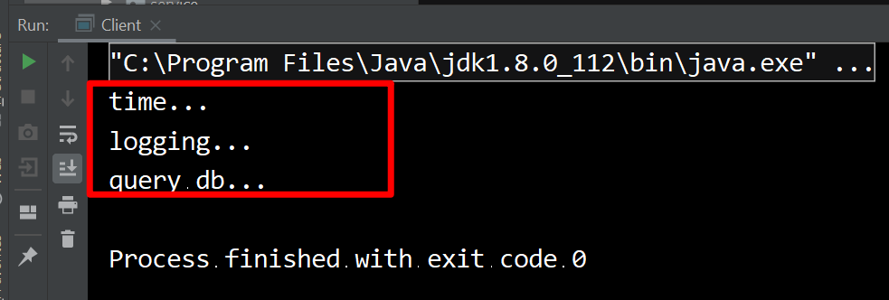
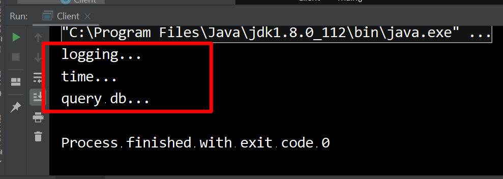

## Proxy 模式

### 什么是代理

比如说我们去买火车票，现在我们一般不会直接去火车站买票，而是通过12306app来购票，这里的app就相当于一个代理，能够帮助我们完成购票。

Java中如何实现代理？

### Java中实现代理的两种方法

#### 代理中的名词

- 目标对象
  - 被增强的对象


- 代理对象
  - 增强后的对象

#### 静态代理

- 继承

  - 代理对象继承目标对象，重写需要增强的方法

  - 缺点：会产生类爆炸

  - 例子：UserServiceImpl只有查询DB的功能，但是我想要在查询DB的时候记录log以及time。

    ```java
    public class UserServiceImpl implements UserService
    {

        @Override
        public void query()
        {
            System.out.println("query db...");
        }
    }
    ```

  解决：

  ​	创建两个类，LogServiceImpl和TimeServiceImpl分别记录log和time；

  ```java
  public class LogServiceImpl extends UserServiceImpl
  {

      @Override
      public void query()
      {
          System.out.println("logging...");
          System.out.println("query db...");
      }
  }
  ```

  ```java
  public class TimeServiceImpl extends LogServiceImpl
  {
      @Override
      public void query()
      {
          System.out.println("time...");
          System.out.println("logging...");
          System.out.println("query db...");
      }
  }
  ```

  main方法

  ```java
  public class Client
  {
      public static void main(String[] args)
      {
          UserService userService = new TimeServiceImpl();
          userService.query();
      }
  }
  ```

  结果：

  

  缺点：每添加一个功能都会新增加一个类文件，这样造成类爆炸。比如logging在前time在后，这个时候又会创建新的类LoggingTimeServiceImpl去继承TimeServiceImpl，最终用LoggingTimeServiceImpl，这样没改变一个需求就会多创建一个类，造成类爆炸。

- 聚合

  - 目标对象和代理对象实现同一接口，代理对象包含目标对象。

  - 缺点：也会产生类爆炸，只不过比继承产生的类要少点。

    ```java
    public class LogServiceImplementation implements UserService
    {
        private UserService userService;
        public LogServiceImplementation(UserService userService)
        {
            this.userService = userService;
        }

        @Override
        public void query()
        {
            System.out.println("logging...");
            userService.query();
        }
    }
    ```

    ```java
    public class Client
    {
        public static void main(String[] args)
        {
            UserService userService = new UserServiceImpl();
            UserService timeServiceImplementation = new TimeServiceImplementation(userService);
            UserService logServiceImplementation = new LogServiceImplementation(timeServiceImplementation);
            logServiceImplementation.query();
        }
    }
    ```

    

#### 动态代理

just some test...sdfdsafdsf