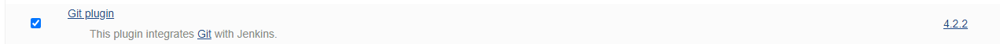

## Jenkins学习笔记

### 持续集成及Jenkins介绍

1.软件开发生命周期

- ​	需求分析->设计(架构图)->实现(编码)->测试(功能测试，代码测试，压力测试)->进化(改bug，总结)

2.软件开发瀑布模型

- 流程：用户需求->需求分析->详细设计->编码->测试->运维
- 优点：在各个时间节点，项目经理可以审查项目进度。
- 缺点：不适应需求经常变化的情况。

3.敏捷开发模型

- 核心：迭代开发和增量开发
  - 迭代开发：把一个大的任务划分成n多个小的任务，每一个小的任务都是一个完整的软件开发生命周期的过程。
  - 增量开发：每次迭代开发完成之后，我们都会实现部分新的功能，之后把新的功能发布到客户系统。
- 优点：相比于瀑布模型开发模式风险性更小，更加适用于需求多变的开发模式。

4.什么是持续集成(CI)？

- 开发人员每天频繁的将代码集成到主干。**目的是让产品快速的迭代，同时还能保证代码质量。**
- 能够更好的进行敏捷开发
- 流程：代码提交->测试(跑自动化测试脚本)->构建(代码合并到主干，可以交付)->部署(war/jar包)->回滚

5.持续集成组成要素

- 自动化构建过程：检出代码、编译构建、运行测试、结果记录、测试统计等等都是自动化的过程
- 代码仓库：Git/SVN
- 持续集成服务器：Jenkins


## Jenkins介绍

1. Jenkins安装和持续集成环境配置

   - 持续集成流程说明

     

- 代码提交->代码编译，测试，打包->war/jar分发到测试服务器或者生产服务器

- 服务器列表

  - 虚拟机OS: Centos7

  | 名称      | IP地址 | 安装的软件                                    |
  | ------- | ---- | :--------------------------------------- |
  | 代码托管服务器 |      | Github                                   |
  | 持续集成服务器 |      | Jenkins-2.190.3;JDK1.8;Maven3.6.2;Git;SonarQube |
  | 应用测试服务器 |      | JDK1.8;Tomcat8.5                         |


## Jenkins启动停止即修改默认端口

1.安装好Jenkins（**2.222.4**），在Jenkins安装目录修改jenkins.xml文件中的默认8080端口。改成8888.

2.启动Jenkins：进入Jenkins安装目录执行: java -jar jenkins.war --httpPort=8888

3.停止Jenkins服务：net stop jenkins


## Jenkins插件管理

Jenkins国外官方插件地址下载速度非常慢，所以可以修改为国内插件地址：

Jenkins->Manage Jenkins->Manage Plugins，点击Available

替换Jenkins官方镜像地址：

```
cd /c/Program Files (x86)/Jenkins/updates
sed -i 's/http:\/\/updates.jenkinsci.org\/download/https:\/\/mirrors.tuna.tsinghua.edu.cn\/jenkins/g' default.json && sed -i 's/http:\/\/www.google.com/https:\/\/www.baidu.com/g' default.json
```

最后，Manage Plugins点击Advanced，把Update Site改为国内插件下载地址

https://mirrors.tuna.tsinghua.edu.cn/jenkins/updates/update-center.json


## Jenkins用户权限管理

思路：创建角色，创建用户，给用户分配相应的角色，使得用户可以访问Jenkins及不同的Jenkins Job

1.安装Jenkins插件：Role-based Authorization Strategy

2.Manage Jenkins -> Configure Global Security(开启全局安全配置)


3.创建角色

Manage And Assign Roles -> Manage Roles

- Global roles: 最整个Jenkins软件有哪些访问权限
- Item roles：Jenkins下面创建的job的访问权限
- node roles: Jenkins 集群的结点的权限


## Jenkins凭证管理

凭证用来存储需要密文保护的数据库密码，Github密码信息，Docker私有仓库密码等，使得Jenkins可以同这些第三方应用进行交互。

### 安装Credentials Binding插件

要使用Jenkins凭证管理功能需要安装Credentials Binding插件


安裝好之后会在Jenkins左边部分多出一个凭证


凭证类型有5种


- Username with password：用户名和密码
- SSH Username with private key：使用SSH用户和密码
- Secret file：需要保密的文本文件，使用时Jenkins会将文件复制到一个临时目录中，再将文件路径设置到一个变量中，等构建结束之后，锁复制的Secret file就会被删除。
- Secret text：需要保存的一个加密文本串，如Github的api token
- Certificate：通过上传证书文件的方式

接下来通过使用Git工具到Github拉取项目源码为例，来演示Jenkins如果管理Github的凭证。

### 安装Git插件



### 用户密码类型

1.创建凭证

- Jenkins->凭证->系统->全局凭证->添加凭证

  


- 保存凭证

2.测试凭证是否可用

- 创建一个FreeStyle项目：新建Item->FreeStyle Project->确定

- 在"源码管理"中配置Github仓库地址

  

- 保存配置之后点击"Build Now"开始构建项目

  查看构建结果

  

- 查看Jenkins workspace目录发现已经从Github上把该Git项目成功拉取到本地Jenkins中。

  


### SSH 密钥类型

1.通过git bash 查看本地是否有公钥(id_rsa.pub)和私钥(id_rsa)


如果没有的话需要通过ssh-keygen -t rsa生成相应的公钥和私钥

2.本地的公钥需要上传到Github上去，Jenkins通过私钥对远端的公钥进行解密认证。

- 上传公钥到Github：登录到Github->点击头像->Settings->SSH and GPG Keys-> New SSH keys


- 在Jenkins中添加私钥

  


- 保存之后测试凭证是否可用

  创建一个新的FreeStyle项目->源码管理->Git->填写上Github上通过ssh方式获取的地址

  

- 保存之后查看构建结果

  

同样该Jenkins Job也会把Github上该项目拉取到本地


### Jenkins持续集成环境-Maven的配置

在Jenkins集成服务器上，我们需要安装Maven来编译和打包项目。

#### 全局工具配置关联JDK和Maven

Jenkins->Global Tool Configuration ->JDK ->Add JDK


Jenkins->Global Tool Configuration -> Maven -> Add Maven


#### 添加Jenkins全局变量

Manage Jenkins -> Configure System -> Global Properties, 添加三个全局变量

JAVA_HOME, MAVEN_HOME, PATH+EXTRA


#### 测试Maven是否配置成功

我们现在Github上创建一个项目叫做Maven_Test_Project,之后拉取到本地，修改目录结构使之成为Maven项目。

之后通过Jenkins Job里面的Maven配置项去编译构建该Maven工程，看能否成功打包

- 创建一个新的Jenkins Job，源码管理部分选择Git仓库地址以及其认证方式

  


- 在构建部分通过Shell脚本构建该Jenkins Job

  


- 点击Build Now,如果项目成功打成Jar包那么证明Maven环境配置成功。


### Jenkin持续集成-Apache Tomcat安装

1.去Apache 官网下载Zip Tomcat解压并安装（Windows环境）

2.配置环境变量


3.如果在windows环境，直接进入到bin目录下执行./startup.bat

4.查看tomcat是否正常启动：localhost:8080


5.修改tomcat默认8080端口：进入config目录，找到server.xml文件，把8080端口修改为8081.


6.配置tomcat用户角色权限

- 进入到config目录找到tomcat-user.xml文件


7.为了能使刚才配置的用户登录到tomcat，我们需要把tomcat目录下的webapps/manager/META-INF/context.xml内容修改为应许所有ip地址访问。


8.重启tomcat并用创建的用户访问测试


## Jenkins构建Maven项目

1.Jenkins项目构建类型

- 自由风格类型
- Maven项目
- **流水线项目**

每一种类型的构建都能够完成一样的构建过程和结果，只是在操作方式，灵活度等方面有区别。推荐使用pipeline方式，因为灵活度更高。


#### Jenkins项目构建-自由风格项目构建

下面演示一个自由风格项目来完成项目的集成过程

**拉取代码->编译->打包->部署**

**拉取代码**

- 创建项目

  


- 源码管理部分配置代码从里面进行拉取


- 编译打包


- 部署
  1. 把项目部署到远程的Tomcat里面，在这此之前呢我们需要安装Deploy to container插件，通过该插件实现把war包部署到Tomcat服务器。


2. 添加tomcat用户凭证

   

3.添加构建后的操作


点击"Build Now"开始构建

查看构建结果


部署成功之后访问项目：


### Jenkins项目构建-Maven风格构建

1.安装Maven Integration插件


2.创建Maven项目


3.配置项目

拉取代码和远程部署的过程和自由风格项目一样，只是"构建"部分不同


#### Jenkins项目构建类型-Pipeline流水线项目构建

1.Pipeline：一套运行在Jenkins上的工作流框架，将原来单个或者多个结点的任务连接起来，实现复杂的流程编排和可视化的工作。

2.如何创建Jenkins Pipeline？

- 它由Groovy脚本实现
- 支持两种语法，声明式和脚本式的语法
- 两种创建方法：可以直接在Web UI界面中输入脚本，也可以通过创建一个Jenkinsfile脚本文件放入项目源码库中。（推荐采用源码库进行控制）

3.安装Pipeline插件


4.创建声明式Pipeline


