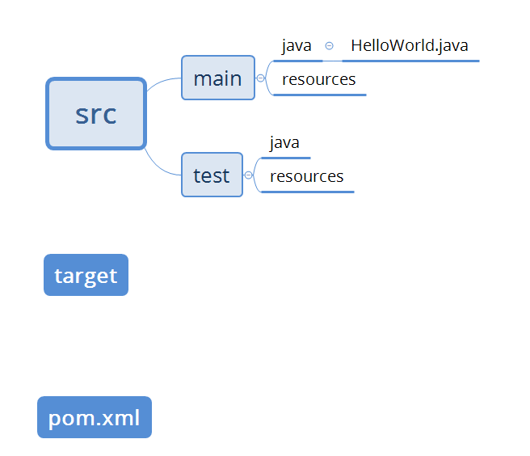

## Maven

1.什么是Maven

- 是一个跨平台的项目管理工具

2.Maven功能

- 项目构建、依赖管理、项目信息管理

3.什么是依赖

- SSH项目，手动拷贝jar包，拷贝的过程非常繁琐

4.Maven目录结构



5.Maven生命周期

- default lifecycle :是构建的核心，主要完成编译、测试、打包、部署等动作

  - ```
    <phases>
      <phase>validate</phase>
      <phase>initialize</phase>
      <phase>generate-sources</phase>
      <phase>process-sources</phase>
      <phase>generate-resources</phase>
      <phase>process-resources</phase>
      <phase>compile</phase>
      <phase>process-classes</phase>
      <phase>generate-test-sources</phase>
      <phase>process-test-sources</phase>
      <phase>generate-test-resources</phase>
      <phase>process-test-resources</phase>
      <phase>test-compile</phase>
      <phase>process-test-classes</phase>
      <phase>test</phase>
      <phase>prepare-package</phase>
      <phase>package</phase>
      <phase>pre-integration-test</phase>
      <phase>integration-test</phase>
      <phase>post-integration-test</phase>
      <phase>verify</phase>
      <phase>install</phase>
      <phase>deploy</phase>
    </phases>
    ```

- clean lifecycle ： 在项目构建之前做一些清理的工作

  - ```
    <phases>
      <phase>pre-clean</phase>
      <phase>clean</phase>
      <phase>post-clean</phase>
    </phases>
    <default-phases>
      <clean>
        org.apache.maven.plugins:maven-clean-plugin:2.5:clean
      </clean>
    </default-phases>
    ```

- site lifecycle：生成项目报告，站点信息

```
<phases>
  <phase>pre-site</phase>
  <phase>site</phase>
  <phase>post-site</phase>
  <phase>site-deploy</phase>
</phases>
<default-phases>
  <site>
    org.apache.maven.plugins:maven-site-plugin:3.3:site
  </site>
  <site-deploy>
    org.apache.maven.plugins:maven-site-plugin:3.3:deploy
  </site-deploy>
</default-phases>
```

6.Maven常用命令

- mvn compile 编译
- mvn clean 编译以后的代码清除了
- mvn test 测试
- mvn package 打包（只是把jar包下载到本地工程的target目录下）
- mvn install 打包并拷贝到本地仓库
- mvn deploy 部署

7.仓库

- 仓库：用来存储所有Maven构建的jar包

- 本地仓库：settings.xml ->localRepository所在位置

- 远端仓库：

  - 中央仓库：Maven默认的远程仓库
  - 私服：公司的局域网内的仓库
  - 镜像：用来替代中央仓库（国内的地址，访问比较快，比如阿里巴巴提供的）

  查找顺序：本地->私服->Maven中央仓库

8.坐标

- groupId: 定义当前项目隶属的实际项目
- artifactId:定义实际项目中一个模块
- version：项目的版本
- packaging:定义项目打包方式

9.依赖机制

- 传递性依赖：A依赖于B，B依赖于C，那么我们只需要把直接把A的依赖写上，Maven会隐式的把间接依赖的全部加上。


- 依赖关系树最短原则：A->B-C 1.0; A->C 2.0; 因为在构建A的时候，A-C2.0版本路径更短。
- 最先声明优先：A->B-C 1.0; A->D->C 2.0 使用最先声明的那个，dependency顺序。
- 依赖管理
  - 主要用于处理传递性依赖没有指定版本或者需要指定一个新的版本，那么我们可以通过<dependencyManagement>进行统一管理.
- 依赖范围: 表明了依赖起作用的阶段
  - compile
  - provided
  - runtime
    - test
  - system
  - import
- 排除依赖项：X依赖Y，Y依赖Z，可以在X项目中指定排除对Z的依赖。
- 可选依赖：X依赖Y，Y通过设置optional 依赖Z，那么X默认是不依赖Z（默认排除依赖Z）


10.插件

```
<plugins>
	<plugin>
		<groupId></groupId>
		<artifactId></artifactId>
		<version></version>
	<plugin>
</plugins>
```

11.继承与聚合

- 继承：有多个Maven项目，他们之间呢有许多重复的依赖或者其他配置，那么我们可以把相同的一些配置提取出来做成一个Parent project.其他的Maven project继承该Parent Project，通过Parent Project对相同的一些配置进行管理。

  ```
  <parent>
    <artifactId>my-app</artifactId>
    <groupId>com.sap.leo.test</groupId>
    <version>1.0-SNAPSHOT</version>
  </parent>
  <modelVersion>4.0.0</modelVersion>
  <artifactId>my-module</artifactId>
     
  ```

- 聚合：需要在parent module里面指定多个子模块。

  - 好处：**1）假设一个应用程序由多个模块构成，那么由于功能需求变更，我们需要修改所有的模块，因为我们需要把所有的模块构建一次。但是如果我们引用了聚合，把某些模块聚合起来，这样就可以减少构建次数，减少一些重复性的工作。2）功能清晰，每个子模块负责一个小的功能模块。**
  - 聚合模块没有src/main/java或者src/main/resources这些目录结构。

  ```
  <groupId>com.sap.leo.test</groupId>
  <artifactId>my-app</artifactId>
  <version>1.0-SNAPSHOT</version>
  <modules>
  	<module>my-module</module>
  </modules>
  <packaging>pom</packaging>
  ```

12.私服-Nexus

- ​

13.dependencyManagement

- **主要用来对项目版本号进行管理**。一般我们在父模块中通过依赖管理对子模块的依赖版本进行管理，这样当子模块的某个依赖版本需要修改的时候，我们只需要修改父模块中的版本，不需要修改众多子模块的版本。那如果我们需要使用子模块的中的版本，只需要在子模块中写上相应的版本号即可。
- dependencyManagement只是声明依赖，并不会引入。因此需要子版本显示的声明依赖项，如果子项目没有声明依赖项，是不会从父项目中继承过来的。