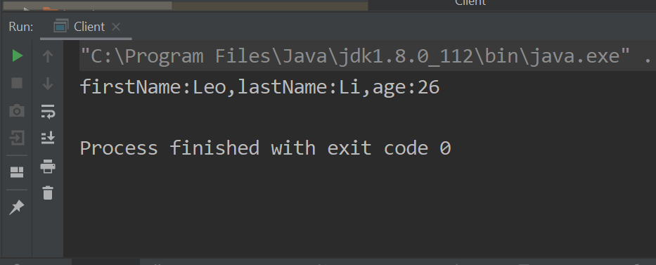

## Java自定义注解

### 介绍

Java注解是一种将元数据信息添加到我们源代码中的机制，JDK5版本之后引入了Java自定义注解。

我们可以在package、interface、class、method、field上使用自定义注解，但自定义注解并不会影响我们程序的执行。

### 创建自定义注解

接下来我会创建3个自定义注解，分别用在class、method、field级别上，并把一个对象序列化成String。

### Class 级别 Annotation Example

第一步我们需要使用**@Interface**来声明它是一个自定义注解

```java
public @interface JsonSerializable
{

}
```

接下来我们需要在自定义注解上指定scope和target

```java
@Retention(RetentionPolicy.RUNTIME) //表示该注解在RUNTIME生效
@Target(ElementType.TYPE)		   //表示该注解作用在Class上
public @interface JsonSerializable {
}
```

### Field 级别Annotation Example

```java
@Retention(RetentionPolicy.RUNTIME)
@Target(ElementType.FIELD)	//表示该注解作用在字段上
public @interface JsonElement
{
	public String key() default "";
}
```

该注解声明了参数是key，参数的默认值是""。

需要注意的是：自定义注解里面的方法不能有参数，不能抛出exception。并且方法的返回值只能是基本数据类型、Class类型、String、枚举类型、annotations或者数组，同时，默认值不能为null。

### Method 级别Annotation Example

在对象被序列化之前，我们想做一些初始化的工作，因此用到一个自定义注解来做初始化的工作。

```java
@Retention(RetentionPolicy.RUNTIME)
@Target(ElementType.METHOD)
public @interface Init
{
}
```

### 应用注解

场景：我们想序列化一个User对象，但在序列化之前，需要讲其firstName和lastName首字母大写。

```java
@JsonSerializable
public class User
{
	@JsonElement
	private String firstName;

	@JsonElement
	private String lastName;

	@JsonElement(key = "personAge")
	private String age;
  
  	@Init
	private void init()
	{
		this.firstName = this.firstName.substring(0, 1).toUpperCase()
			+ this.firstName.substring(1);
		this.lastName = this.lastName.substring(0, 1).toUpperCase()
			+ this.lastName.substring(1);
	}
  	//省略getter,setter方法
}
```

### 处理注解

我们利用Java反射机制来处理注解

首先我们得判断我们的对象是否为空，并且对象类型是否声明为@JsonSerializable注解类型。

```java
private void checkIfSerializable(Object object) throws Exception
{
  if(Objects.isNull(object))
  {
  	throw new Exception("Object is null.");
  }

  Class<?> clazz = object.getClass();
  if(!clazz.isAnnotationPresent(JsonSerializable.class))
  {
    throw new Exception("The class " + clazz.getName() + " "
    + "is not annotated with JsonSerialzable.");
  }
}
```

其次我们需要查找是否有方法被@Init注解标志，有的话，先调用该方法再序列化对象。

```java
private void initializeObject(Object object) throws InvocationTargetException, IllegalAccessException
	{
		Class<?> clazz = object.getClass();
		for(Method method : clazz.getDeclaredMethods())
		{
			if(method.isAnnotationPresent(Init.class))
			{
				method.setAccessible(true);;
				method.invoke(object);
			}
		}
	}
```

调用method.setAccessible(true)使得我们可以执行私有init方法。完成初始化之后，迭代对象的字段，取得被@JsonElement注解标志的字段名和其值，并把其key和value放入map中，最后从map中创建一个json string。

```
private String getJsonString(Object object) throws Exception
{
  Class<?> clazz = object.getClass();
  Map<String, String> map = new HashMap<String, String>();
  for(Field field: clazz.getDeclaredFields())
  {
    field.setAccessible(true);
    if(field.isAnnotationPresent(JsonElement.class))
    {
    	map.put(field.getName(), (String) field.get(object));
    }
  }

  String jsonString = map.entrySet().stream().map(entry->
    entry.getKey() + ":" + entry.getValue()
  ).collect(Collectors.joining(","));
  return jsonString;
}
```

最后创建一个类整合上面三个步骤

```
public class ObjectToJsonConverter
{
	public String convertToJson(Object object) throws Exception {
		try {
			checkIfSerializable(object);
			initializeObject(object);
			return getJsonString(object);
		} catch (Exception e) {
			throw new Exception(e.getMessage());
		}
	}
}
```

创建Client类去测试输出结果

```
public class Client
{
	public static void main(String[] args) throws Exception
	{
		User user = new User("leo","li","26");
		ObjectToJsonConverter objectToJsonConverter = new ObjectToJsonConverter();
		String jsonString = objectToJsonConverter.convertToJson(user);
		System.out.println(jsonString);
	}
}
```

结果：



### 结论

我们知道了如何来使用自定义注解，我们也知道了如何通过Java反射机制来处理自定义注解。