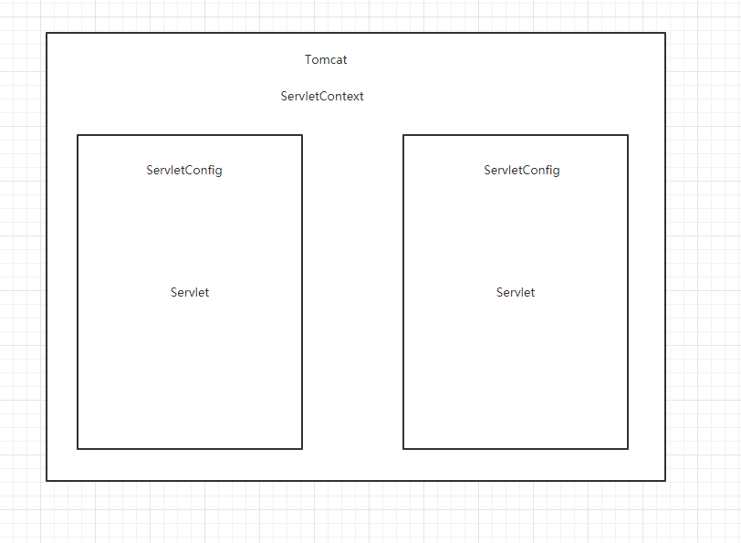
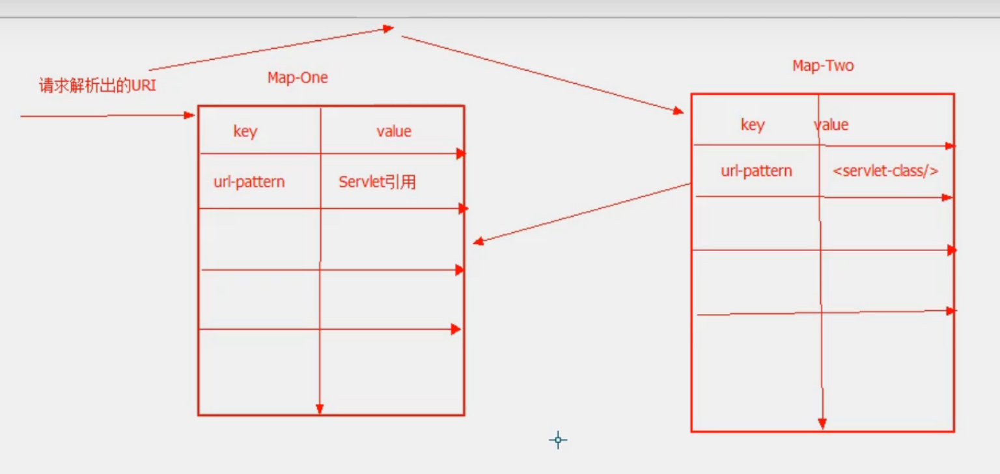
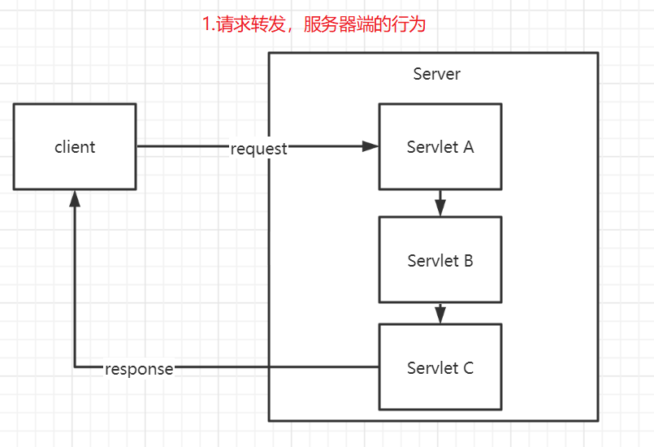
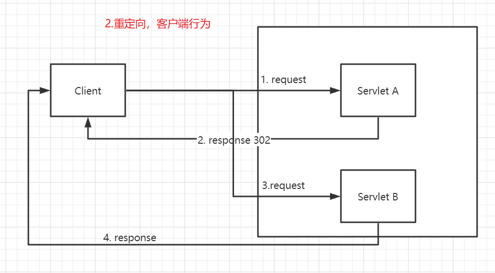
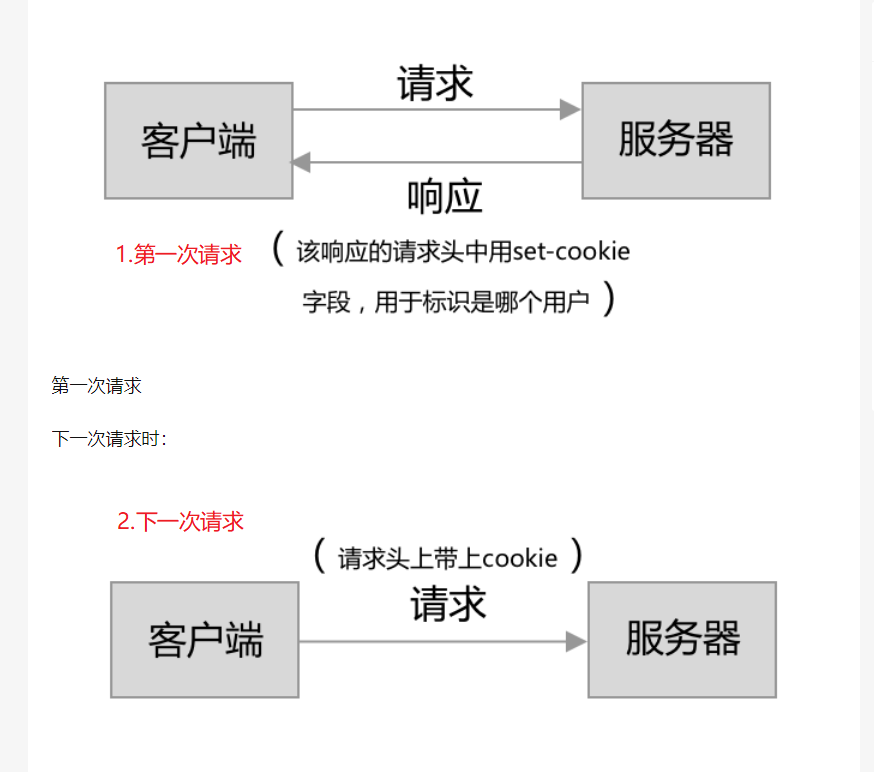
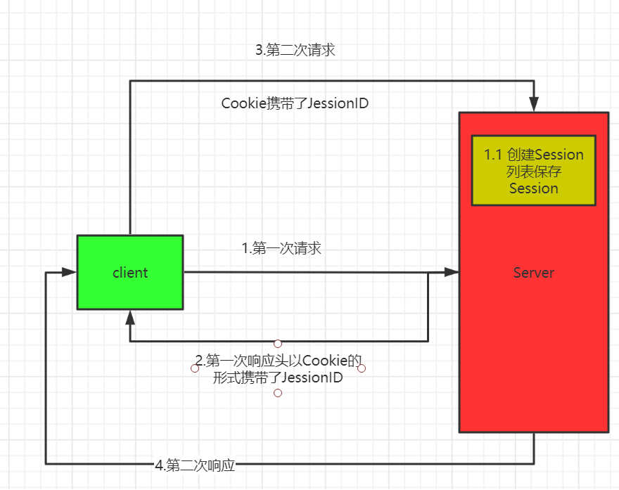
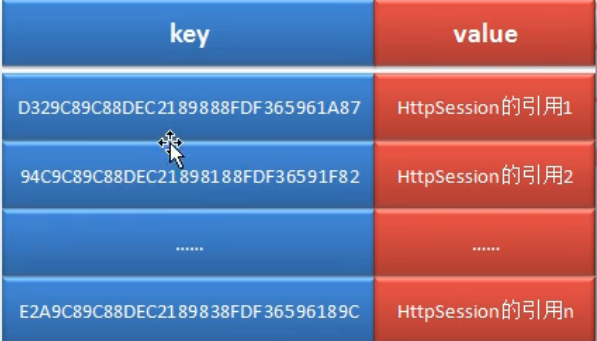

#  JavaEE基础

- [J2EE基础知识](#J2EE基础知识)
    - [Servlet相关知识](#Servlet相关知识)
    - [请求转发和重定向](#请求转发和重定向)
    - [Web容器两个Map](#Web容器两个Map)
    - [Cookie](#Cookie)
    - [Session](#Session)
    - [域属性空间对比](#域属性空间对比)
    - [MVC三层架构](#MVC三层架构)
    - [Filter](#Filter)

## J2EE基础知识

### Servlet相关知识

- 什么是Servlet

- Server Applet，是运行在服务器端的代码，程序

- Servlet作用

- 用来接收用户请求，并根据你的业务需求对请求进行相应处理，之后处理结果返回给用户。

- Servlet生命周期

    - 实例化：Web容器加载Servlet并实例化Servlet
    - 初始化：调用init方法对Servelt进行初始化，**只执行一次**
    - 服务：调用service方法，根据你的业务需求做相应处理
    - 销毁：当关闭Web容器时会调用destory来销毁Servelt，**只执行一次**，一般写关闭资源的连接。

- Servlet特征

    - 线程安全性问题：不是线程安全

    - Servlet是单例的

        ```xml
        <?xml version="1.0" encoding="UTF-8"?>
        <web-app xmlns="http://java.sun.com/xml/ns/javaee"
                   xmlns:xsi="http://www.w3.org/2001/XMLSchema-instance"
                   xsi:schemaLocation="http://java.sun.com/xml/ns/javaee
                http://java.sun.com/xml/ns/javaee/web-app_4_0.xsd"
                   version="4.0">
            <!-- 注册Servlet-->
            <servlet>
                <servlet-name>myServlet</servlet-name>
                <servlet-class>com.sap.SomeServlet</servlet-class>
                <!-- load-on-startup 指明哪一个Servlet优先被创建，值大于等于0，越小优先级越高-->
                <load-on-startup>0</load-on-startup> 
            </servlet>
            <servlet-mapping>
                <servlet-name>myServlet</servlet-name>
                <url-pattern>/myServlet</url-pattern>
            </servlet-mapping>
        </web-app>
        ```

        ```java
        package com.sap;
        
        import javax.servlet.*;
        
        public class SomeServlet implements Servlet
        {
        
            public SomeServlet()
            {
                System.out.println("constructor...");
            }
        
            @Override
            public void init(ServletConfig servletConfig) throws ServletException
            {
                System.out.println("init...");
            }
        
            @Override
            public ServletConfig getServletConfig()
            {
                return null;
            }
        
            @Override
            public void service(ServletRequest servletRequest, ServletResponse servletResponse) throws ServletException
            {
                System.out.println("service...");
            }
        
            @Override
            public String getServletInfo()
            {
                return null;
            }
        
            @Override
            public void destroy()
            {
                System.out.println("destroy...");
            }
        }
        ```

- ServletConfig

    - 就是Web.xml里面**所有Servlet的配置信息**

        ```xml
        <servlet>
            <servlet-name>myServlet</servlet-name>
            <servlet-class>com.sap.SomeServlet</servlet-class>
            <load-on-startup>0</load-on-startup>
            <init-param>
                <param-name>Company</param-name>
                <param-value>SAP</param-value>
            </init-param>
            <init-param>
                <param-name>Address</param-name>
                <param-value>Tian Fu 5th street</param-value>
            </init-param>
        </servlet>
        
        <servlet>
            <servlet-name>Servlet1</servlet-name>
            <servlet-class>com.sap.SomeServlet</servlet-class>
            <load-on-startup>1</load-on-startup>
            <init-param>
                <param-name>Company</param-name>
                <param-value>EMC</param-value>
            </init-param>
            <init-param>
                <param-name>Address</param-name>
                <param-value>Tian Fu 4th street</param-value>
            </init-param>
        </servlet>
        ```

        ```java
        @Override
        public void service(ServletRequest servletRequest, ServletResponse servletResponse) throws ServletException
        {
            System.out.println("service...");
            //每个请求来了，具体交给具体某个servlet进行处理，那么servletName就是当前的Servlet的name
            String servletName = servletConfig.getServletName(); 
            System.out.println("servletName" + servletName);
            //得到web.xml Servlet里面<init-param>的参数信息
            Enumeration<String> names =  servletConfig.getInitParameterNames();
            while(names.hasMoreElements())
            {
                String name = names.nextElement();
                String parameterValue = servletConfig.getInitParameter(name);
                System.out.println("parameterName:" + name);
                System.out.println("parameterValue:" + parameterValue);
            }
        ```

- ServletContext

    - 作用域：

        - 对每个Servlet都生效，一个Web应用对应一个ServeltContext

    - 应用场景

        - 网站的总访问量

            ```xml
            <context-param>
                <param-name>Country</param-name>
                <param-value>China</param-value>
            </context-param>
            ```

    - 

### Web容器两个Map

- Map One:：Web容器启动的时候会创建servlet实例，第一个Map存放的Key是url-pattern，Value是Servlet实例的引用。

- Map Two：Key是url-pattern（除去Ip地址和Port剩下的部分），Value是Servlet的全限定名

- 请求流程：**当用户发送一个请求来的时候，会在第一个Map中找是否有Servlet引用，如果存在直接调用service方法，如果不存在那么回去第二个Map中找，找到之后会创建Servlet实例，最后把创建好的Servlet实例引用添加到第一个Map中。**

    

### 请求转发和重定向

- 请求转发

    - 服务器内部跳转

    - request数据不会丢失，数据可以在多个页面共享

    - 地址不会变

    - 不可以跳转到其他Web应用

      ​    

- 重定向

    - 服务器外部跳转，客户端行为
    - request数据会丢失，数据不能在多个页面共享
    - 地址栏会发生改变
    - 可以跳转到其他Web应用
    - 可以防止表单的重复提交

- 应用场景

    - 提交表单的场景：重定向,由于重定向过后请求地址会发生改变，因此刷新页面并不会再次提交表单，从而避免了表单重复提交的问题。
    - 多个Web服务之间跳转：重定向
    - 单个Web服务内部跳转不涉及表单提交：转发

    

    ​	

    ```java
    @Override
    public void doGet(HttpServletRequest req, HttpServletResponse resp) throws ServletException, IOException
    {
        System.out.println("FirstServlet...");
        //转发，服务器端行为，页面地址不会变
        req.getRequestDispatcher("/secondServlet").forward(req, resp);
    }
    
    @Override
    public void doGet(HttpServletRequest req, HttpServletResponse resp) throws ServletException, IOException
    {
        //重定向，请求地址会发生改变
        resp.sendRedirect("/firstServlet");
    }
    ```

### Cookie

- Cookie

    - 什么是Cookie

        - 存放在浏览器客户端的一段文本信息

    - 作用

        - 我们知道Http是无状态的协议，每一次请求之间是没有关联的，但是我们希望第一次访问某个网站，输入用户名和密码进行登录，但是第二次及以后我们不想再输入用户名和密码，希望能否通过某种技术来记录我的登录信息，下次能够直接登录。那么Cookie就是实现这种功能的一种方式。

    - 机制

        

    - 如何设置Cookie

        - ```java
            Cookie cookie1 = new Cookie("Company", "SAP"); //创建Cookie，key-value形式
            cookie1.setMaxAge(60 * 60); //设置1个小时之后过期
            ```

    - 如何修改或删除Cookie呢

        - 修改的话，直接通过同名的Cookie进行覆盖即可。删除的话，只需要新建一个同名的Cookie，setMaxAge(0)

    - Cookie缺点

        - 存储量太小。因为不可能把所有的用户信息都存放在Cookie里面，这样网络传输的数据量太大，可能会造成网络超时。
        - 不安全。存储在客户端，Cookie信息可以被窃取。

### Session

- 什么是Session

    - 会话跟踪技术，浏览器端和服务器端进行的会话。

- Session作用

    - 存储会话信息供后续用户访问。

        ```java
        public class FirstServlet extends HttpServlet
        {
            @Override
            public void doGet(HttpServletRequest req, HttpServletResponse resp) throws ServletException, IOException
            {
                String userName = req.getParameter("userName");
                //没有Session就创建一个
                HttpSession session = req.getSession();
                session.setAttribute("userName" , userName);
                resp.getWriter().println("firstSevlet...");
            }
        
            @Override
            public void doPost(HttpServletRequest req, HttpServletResponse resp) throws ServletException, IOException {
        
            }
        }
        ```

        ```java
        public class SecondServlet extends HttpServlet
        {
            @Override
            public void doGet(HttpServletRequest req, HttpServletResponse resp) throws ServletException, IOException
            {
                HttpSession session = req.getSession();
                resp.getWriter().println("userName is " + session.getAttribute("userName"));;
            }
        
            @Override
            public void doPost(HttpServletRequest req, HttpServletResponse resp) throws ServletException, IOException {
        
            }
        }
        ```

- Session运行机制

    			

    

    

    

- 一个会话如何确保是同一个Session

    - 每次请求头里面包含了Cookie，Coolie里面有个JSessionID，通过该JSessionID能够获取到一个唯一的Session信息。

- Session应用场景

    - 购物车
    - 记录用户信息

- Cookie禁用过后能否使用Session进行会话跟踪

    - 可以，通过URL重写技术来实现。也就是在URL地址后面加上JSessionID，通过该JSessionID能够在服务器端获取到该Session的信息。

- **分布式Session同步**问题

    - 是什么问题
        - client -> nginx -> 不同的server，用户第一次访问服务器端，session存放在Server A。下一次访问的请求头Cookie中携带了JSessionID，由于负载均衡策略，该请求被发往Server B处理，这个时候，用户就获取不到Session信息，就没有达到Session共享的目的。
    - 怎么解决
        - Session复制。缺点：数据复制需要占用大量的网络带宽，存在延时；
        - Redis。Redis是基于内存的，读取速度块。缺点：系统复杂度增加，需要新写代码实现。

### 域属性空间对比

- ServletContext：全局性的，**整个应用范围，可以跨会话的**。
- HttpSession：会话范围，可以完成**跨请求共享数据**
- HttpServletRequest：请求范围的，在同一个请求里面，可以完成**跨Servlet**的数据可以共享。
- **使用原则**：在保证功能的情况下，优先使用范围小的。这样不仅可以节约内存空间，还可以保证数据的安全。

### MVC三层架构

- Model
    - Service：业务逻辑处理
    - Dto(Repository)：跟数据库打交道，CRUD
- View
    - 负责页面的展示
    - 发起Servlet请求
- Controller
    - 接收用户请求
    - 交给业务层处理

### Filter

- 是什么

    - 过滤器

- 作用

    - 用来拦截用户的请求，根据业务需求做相应的处理

- 应用场景

    - 统计网站访问次数
    - 解决全站字符乱码
    - 权限过滤

- 应用

    ```xml
    <filter>
        <filter-name>filter</filter-name>
        <filter-class>com.sap.servlet.MyFilter</filter-class>
    </filter>
    <filter-mapping>
        <filter-name>filter</filter-name>
        <url-pattern>/fitler</url-pattern>
    </filter-mapping>
    ```

    ```java
    import javax.servlet.*;
    import java.io.IOException;
    
    public class MyFilter implements Filter
    {
        @Override
        public void init(FilterConfig filterConfig) throws ServletException
        {
            System.out.println("MyFilter was created...");
        }
    
        @Override
        public void doFilter(ServletRequest servletRequest, ServletResponse servletResponse, FilterChain filterChain) throws IOException, ServletException
        {
            //处理字符乱码问题
            servletRequest.setCharacterEncoding("utf-8");
            servletResponse.setCharacterEncoding("utf-8");
            //必须得写上，这样请求才会能够继续往下执行
            filterChain.doFilter(servletRequest, servletResponse);
        }
    
        @Override
        public void destroy()
        {
    
        }
    }
    ```
