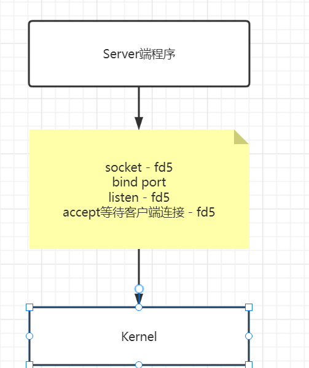
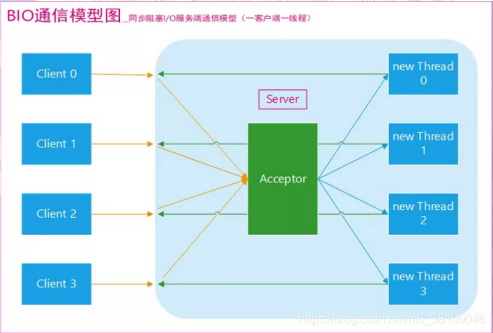

#  基础

- [JavaSE基础知识](#JavaSE基础知识)
    - [面向对象和面向过程](#面向对象和面向过程)
    -  [Java面向对象编程三大特性](#Java面向对象编程三大特性)
    - [重载和重写的区别](#重载和重写的区别)
    - [String为什么是不可变的](#String为什么是不可变的)
    - [StringBuffer和StringBuilder的区别是什么](#StringBuffer和StringBuilder的区别是什么)
    - [自动装箱与拆箱](#自动装箱与拆箱)
    - [接口和抽象类的区别](#接口和抽象类的区别)
    - [==和equals区别](#==和equals区别)
    - [hacode和equals](#hacode和equals)
    - [Object中常用方法](#Object中常用方法)
    - [什么是Java序列化，什么情况下需要序列化](#什么是Java序列化什么情况下需要序列化)
    - [Java泛型](#Java泛型)
    - [Java注解和反射](#Java注解和反射)
    - [Java枚举](#Java枚举)

## JavaSE基础知识

### 面向对象和面向过程

- 面向过程：侧重点在于过程。比如我们修一栋房子，需要先打地基，建立柱，一层一层网上修，之后再修门窗。
- 面向对象：侧重点在于对象。一栋房子由哪些要素或者对象构成，我们可以拆分为：外形长方体，门，窗户。这些对象通过特定的方法联系起来从而构建成房屋。
- 面向过程作用及优缺点：比如说我们的C语言，常用语底层开发，比如嵌入式单片机开发，语言性能比面向对象高。缺点不易维护。
- 面向对象作用及优缺点：比如说我们的Java语言，虽然它的性能比面向过程语言低，但是它容易维护，灵活性强。

### Java面向对象编程三大特性

- 封装：隐藏了对象的内部实现细节，如果要访问对象内部的数据，那么只需要通过对象提供给外部访问的接口即可。这样保证对象了内部数据的安全性。
- 继承：子类通过extends关键字继承父类，可以使用父类的某些功能。
    - 优点：减少冗余代码，代码更容易维护。
    - 特性
        - 子类拥有父类非private的属性和方法
        - 子类可以对父类进行扩展，也就是拥有自己的属性和方法
        - 子类可以根据自己的需求对父类的方法进行重写
- 多态：龙生九子，子子不同这就是多态的体现。Java中可以通过**继承和接口**来实现多态这种特性。
    - 父类引用指向子类对象

### 重载和重写的区别

- 重写：子类继承父类，那么可以对父类的非private方法进行重写，重写规则：方法名和方法的参数列表必须相同。
- 重载：在一个类里面，方法名相同，但是参数列表不同。
- 检验时机：重载是在编译期校验，而重写是在运行期间才校验。

### String为什么是不可变的

- String为什么是不可变的

    - Sting被final修饰，表明String不能被继承。

    - 而存放String具体内容的是存放在char数组，而该char数组又是被private和final修饰，final表明引用该char数组地址不可变，而private表明外部不能直接对该String的成员变量直接操作。

        ```java
        /** The value is used for character storage. */
        private final char value[];
        ```

- String不可变有什么好处，为什么要设计成不可变

    - 性能

        - 如果我们创建一个字符串，如果该字符串已经存在于常量池中（内容一致），则直接指向该内容，如果不存在则在字符串常量池中创建一个对象并建立相应的符号引用。如果它是可变的，那么字符串常量池存在的意义就荡然无存的了。

    - 安全性

        - 多线程环境下，操作同一字符串实例是线程安全的
        - 由于其不可变，因此适合做Map的Key

        ```java
        String s1 = new String("s1") ;
        String s1 = new String("s1") ;
        上面一共创建了几个对象？答案：答案:3个 ,编译期Constant Pool中创建1个,运行期heap中创建2个.（用new创建的每new一次就在堆上创建一个对象，用引号创建的如果在常量池中已有就直接指向，不用创建）
        String str1 = new String("abc");
        String str2 = "abc";
        答案：第一种是用new()来新建对象的，它会在存放于堆中。每调用一次就会创建一个新的对象。 运行时期创建 。第二种是先在栈中创建一个对String类的对象引用变量str2，然后通过符号引用去字符串常量池里找有没有”abc”,如果没有，则将”abc”存放进字符串常量池，并令str2指向”abc”，如果已经有”abc” 则直接令str2指向“abc”。“abc”存于常量池在 编译期间完成 。
        ```


### StringBuffer和StringBuilder的区别是什么

- StringBuffer

    - 线程安全性：StringBuffer的操作都是加了synchronized关键字，因此是线程安全的。
    - 性能：性能比StringBuilder低。

- StringBuilder

    - 线程安全性：不是线程安全的。
    - 性能：单线程环境下使用，效率比StringBuffer高。
    - 总括：他们都继承自AbstractStringBuilder，存储数据用的是父类的char数组，由于char[]没有加final关键字，因此这两种对象都是可变的。

### 自动装箱与拆箱

- 装箱：基本数据类型转成相应的抽象数据类型，比如int -> Integer。

- 拆箱：抽象数据类型装成相应的基本数据类型，比如Integer -> int。这个过程是自动的。
- 何时使用：
    - 赋值语句：Integer integer = 3;
    - 方法调用：方法参数需要一个抽象数据类型(Integer)，你传了一个基本数据类型，那么会触发自动装箱操作。

### 接口和抽象类的区别

- 规范：抽象类只能单继承，接口可以多个实现类；抽象类可以有抽象方法也可以有非抽象方法，而接口在JDK1.8以前只能有抽象方法
- 设计层面理解：抽象类是对类的抽象，一般是子类发现公共部分，把公共部分放到抽象类中，子类继承抽象类，减少冗余代码。而接口是对行为的抽象。

### ==和equals区别

- ==：如果基本数据类型比较，那么比较的是值，如果是抽象数据类型，那么比较的是内存地址。
- equals
    - 重写了equals方法：根据重写的规则去比较两个对象是否相同
    - 没有重写equals方法：比较两个对象的内存地址。

### hashcode和equals

- hashCode：返回一个int整数，用来确定对象在hash表中的索引位置。

- equals：用来比较两个对象的内存地址是否相同

- 为什么要有hashCode方法？

    - 以HashSet为例，HashSet如何做到去重的呢？首先会去判断添加元素hashCode值所在的位置是否已经有元素了，如果有，则再去再去比较两个对象的key是否equals，如果都相同则进行覆盖操作，没有则添加新的元素。这样做的好处在于减少了equals方法的比较次数，从而提交了程序的执行速度。

        ```java
        public V put(K key, V value) {
                return putVal(hash(key), key, value, false, true);
            }
        
        final V putVal(int hash, K key, V value, boolean onlyIfAbsent,
                       boolean evict) {
            Node<K,V>[] tab; Node<K,V> p; int n, i;
            if ((tab = table) == null || (n = tab.length) == 0)
                n = (tab = resize()).length;
            if ((p = tab[i = (n - 1) & hash]) == null)
                tab[i] = newNode(hash, key, value, null);
            else {
                Node<K,V> e; K k;
                if (p.hash == hash &&
                    ((k = p.key) == key || (key != null && key.equals(k))))
                    e = p;
                else if (p instanceof TreeNode)
                    e = ((TreeNode<K,V>)p).putTreeVal(this, tab, hash, key, value);
                else {
                    for (int binCount = 0; ; ++binCount) {
                        if ((e = p.next) == null) {
                            p.next = newNode(hash, key, value, null);
                            if (binCount >= TREEIFY_THRESHOLD - 1) // -1 for 1st
                                treeifyBin(tab, hash);
                            break;
                        }
                        if (e.hash == hash &&
                            ((k = e.key) == key || (key != null && key.equals(k))))
                            break;
                        p = e;
                    }
                }
                if (e != null) { // existing mapping for key
                    V oldValue = e.value;
                    if (!onlyIfAbsent || oldValue == null)
                        e.value = value;
                    afterNodeAccess(e);
                    return oldValue;
                }
            }
            ++modCount;
            if (++size > threshold)
                resize();
            afterNodeInsertion(evict);
            return null;
        }
        ```

- 重写equals方法为什么要重写hashCode方法？

    - 还是以HashSet为例，我们往HashSet里面添加两个Student对象，Student对象里面有age和name两个属性，我们重写其equals方法，认为只要两个对象的age和name相同，那么两个对象必定相同。但是我们没有重写其hashCode方法，那么会有什么问题呢？

    - 这个时候我们往HashSet里面添加两个new出来的相同的Student对象，这个时候由于我们没有重写hashCode方法，因此它会认为是两个不同的对象，因此HashSet里面最终会存放两份相同的对象，那么这种结果跟我们HashSet的设计违背。因此，我们重写equals方法一定得重写hashcode方法。

        ```java
        public class Student
        {
            private String name;
            private Long age;
        
            public String getName()
            {
                return name;
            }
        
            public void setName(String name)
            {
                this.name = name;
            }
        
            public Long getAge()
            {
                return age;
            }
        
            public void setAge(Long age)
            {
                this.age = age;
            }
        
            public Student(String name, Long age)
            {
                this.name = name;
                this.age = age;
            }
        
            public Student()
            {
        
            }
        
            @Override
            public String toString()
            {
                return "Student{" + "name='" + name + '\'' + ", age=" + age + '}';
            }
        
            @Override
            public boolean equals(Object o)
            {
                if (this == o)
                    return true;
                if (o == null || getClass() != o.getClass())
                    return false;
                Student student = (Student) o;
                return Objects.equals(name, student.name) && Objects.equals(age, student.age);
            }
        
            @Override
            public int hashCode()
            {
                return Objects.hash(name, age);
            }
        }
        
        public void printStudentCount()
        {
            Student student1 = new Student("Leo", 27L);
            Student student2 = new Student("Leo", 27L);
            Set<Student> set = new HashSet<>();
            set.add(student1);
            set.add(student2);
            System.out.println(set.size());
        }
        ```

- hashCode与equals相关的规定

    - 重写equals方法一定得重写hashCode方法
    - 两个相同的对象他们的hashCode值一定相同
    - hashCode相同的两个对象，他们不一定equals

### Object中常用方法

- wait & notify & notifyAll
    - wait：当前线程处于等待状态并且释放掉该对象的锁。直到其他线程调用了该对象的notify方法或者notifyAll方法去唤醒之前的线程。
    - notify：唤醒在该对象等待的任意一个线程。
    - 作用：wait & notify & notifyAll用于线程通信，需要在同步代码块中使用。
- hashCode & equals

### 什么是Java序列化，什么情况下需要序列化

- 什么是Java序列化，反序列化

    - 序列化：Java里面的对象转换成字节流
    - 反序列化：字节流转成成Java对象

- 作用

    - 通过序列化可以把对象持久化到磁盘，以后需要再次用到该对象可以直接从磁盘里面读取出来即可，避免对象因为程序运行完而消息掉。

- 如何实现Java序列化

    - Java对象实现Serializable接口，Serializalbe接口内部没有任何方法，它只是一个标志，表明实现了该接口的对象可以被序列化和反序列化。

        ```java
        //序列化
        Person person = new Person("Leo", 27, "A", "B", "C","D");
        ObjectOutputStream objectOutputStream = new ObjectOutputStream(new FileOutputStream(new File("C:\\Users\\i337040\\Desktop\\Person.txt")));
        objectOutputStream.writeObject(person);
        objectOutputStream.close();;
        
        //反序列化
        ObjectInputStream objectInputStream = new ObjectInputStream(new FileInputStream(new File("C:\\Users\\i337040\\Desktop\\Person.txt")));
        Object object = objectInputStream.readObject();
        System.out.println(object);
        objectInputStream.close();
        ```

- serialVersionUID作用

    - 是序列化前后的唯一标志，序列化和反序列化的serialVersionUID不一致，那么反序列化会失败。
    - 如果没有写，那么编译器会自动地给它加一个
        - **我们写代码的时候应该自动的给它加上**

- 两种情况字段不能被序列化

    - static修饰的字段
    - transient修饰的字段
        - 比如密码字段是敏感字段，我们想该字段在序列化进行加密。

- 自定义序列化策略

    - readObject()
    - writeObject()

- 注意事项

    - 父类实现了序列化，**子类自动就实现了序列化，不需要显示指明。**

    - 父类实现了序列化，但是子类不想被序列化，如何实现？

        - 子类中自定义writeObject()和readObject()

            ```java
            class MySubClass extends Father 
            {
                private void writeObject(java.io.ObjectOutputStream out) throws IOException {
                throw new NotSerializableException(“Can not serialize this class”);
                }
                private void readObject(java.io.ObjectInputStream in) throws IOException, ClassNotFoundException {
                    throw new NotSerializableException(“Can not serialize this class”);
                }
                private void readObjectNoData() throws ObjectStreamException; {
                    throw new NotSerializableException(“Can not serialize this class”);
                }
            }
            ```

            


### Java泛型

- 作用（JDK1.5引入的）：
    - 限定数据类型
    - 会把运行时异常提前在编译期间出现

- 格式：
    - ArrayList<String> arrayList = new ArrayList<String>(); 
    - ArrayList<String> arrayList = new ArrayList();//右边可以不用写引用数据类型，但是左边需要写上，右边可以不用写，JDK1.7会通过泛型推断出来你右边的数据类型。
    - ArrayList arrayList = new ArrayList<String>(); //左边不写，右边写等于没加。

- 使用：

    - 泛型类

        ```java
        public class GenericTest<T> //T是形参
        {
            T t;
        
            public T getT()
            {
                return t;
            }
        
            public void setT(T t)
            {
                this.t = t;
            }
        }
        ```

    - 泛型接口

        ```java
        package com.basic;
        
        public interface GenericInterfaceTest<T, E>
        {
            //T t ; 接口里面的属性都是常量，不能用泛型定义属性；属性前面会默认加上public static final
            //方法前面会默认加上abstract 
            void method(T t);
            void method2(E e);
        }
        ```

    - 泛型方法

        ```java
        public class GenericMethodTest
        {
            public <T, E> void test(T t, E e) //泛型加载方法返回值前面
            {
                System.out.println(t);
                System.out.println(e);
            }
        
            public static void main(String[] args)
            {
                GenericMethodTest genericMethodTest = new GenericMethodTest();
                genericMethodTest.test(1, "123");
            }
        }
        ```

- 泛型通配符

    - ?：任意数据类型，如果没有指定具体的数据类型，那么就是Object类型。**用在方法形参上**。

        ```java
        public void test(List<?> list)
        {
            list.forEach( data -> System.out.println(data));
        }
        ```

    - ? extends E：向下限定，天花板是E

    - ? super E：向上限定，地板是E

        ```java
        public class ChildTest extends AbstractTest
        {
        
        }
        
        public static void main(String[] args)
        {
            ArrayList<AbstractTest> arrayList1 = new ArrayList<>();
            ArrayList<ChildTest> arrayList2 = new ArrayList<>();
            ArrayList<Object> arrayList3 = new ArrayList<>();
        
            GenericTest genericTest = new GenericTest();
            genericTest.test1(arrayList1);
            genericTest.test1(arrayList2);
        
            genericTest.test2(arrayList1);
            genericTest.test2(arrayList3);
        
        }
        
        public void test1(List<? extends AbstractTest> list) //谁继承了AbstractTest
        {
            list.forEach( data -> System.out.println(data));
        }
        
        public void test2(List<? super AbstractTest> list) //谁是AbstractTest的父类
        {
            list.forEach( data -> System.out.println(data));
        }
        ```

- ?,T,E,K,V代表什么含义
    - ？表示不确定的 java 类型
    - T (type) 表示具体的一个java类型
    - K V (key value) 分别代表java键值中的Key Value
    - E (element) 代表Element

- 类型擦除
  
    - 编译期间通过泛型对数据类型校验，但是为了兼容老的Java版本，泛型会在运行时期间类型被擦除。

### Java注解和反射

- Java内置4大元注解
    - @Target：适用范围
    - @Retention：：注解生命周期
    - @Document：表明该注解是否包含在javadoc里面
    - @Inherited：子类可以继承父类的该注解

- [自定义注解](./Custom_Annotation.md)

    - @Interface

        ```java
        //作用在类，方法，字段上
        @Target(value = { ElementType.TYPE, ElementType.METHOD, ElementType.FIELD}) 
        //运行时起作用，当然在源码，和生成的字节码文件(.class文件)里面也会生成该注解
        @Retention( value = RetentionPolicy.RUNTIME)
        @interface AnnotationTest
        {
        
        }
        ```

- 反射

    - 什么是反射
    
        - 在运行时阶段，对于任意一个类/对象，我都能够获取到该类/对象的属性和方法。这种动态的获取类信息的方式称为反射。
    
- 获取Class对象的三种方式
  
        - Class.forName("类的全路径名")：讲字节码文件加载进内存，返回class对象。
            - **多用于配置文件**
        - 类的class属性(类名.class)：通过类名的属性class获取
            - 多用于**参数传递**
        - 对象.geClass()：getClass()方法在Object类中定义。
            - 多用于**获取字节码** 的方式
        - 结论
        - 同一个字节码文件(*.class)在一次程序运行过程中，只会被加载一次。不论通过哪一种方式获取Class对象，都是同一个。
    
- Class对象功能
  
    - 获取成员变量
    
        - getFields：获取public的成员变量
    
        - getField(String name)
    
        - getDeclaredMethods()：获取所有的成员变量
    
        - ]getDeclaredField(String name)
    
            ```java
            public static void main(String[] args) throws Exception
            {
                Person person = new Person("Leo", 27, "a", "b", "c", "d");
                Class clz3 = person.getClass();
            
                Field[]  fields = clz3.getFields();
                //获取public的成员变量
                for (Field field : fields)
                {
                    System.out.println(field);
                }
                System.out.println("*************************");
                Field field = clz3.getField("a");
                System.out.println(field);
                System.out.println("*************************");
                //获取类的所有成员变量
                Field[] fields1 = clz3.getDeclaredFields();
                for (Field field1 : fields1)
                {
                    System.out.println(field1);
                }
                System.out.println("*************************");
                Field field2 = clz3.getDeclaredField("name");
                System.out.println(field2);
                System.out.println("*************************");
                //得到field之后，获取它的值或者设置它的值
                //由于name字段是private修饰，访问该字段需要设置访问标志位true
                field2.setAccessible(true);
                System.out.println(field2.get(person));
                field2.set(person, "Maggie");
                System.out.println(field2.get(person));
            
            }
            ```
            ```
            
            ```
    
    - 获取构造方法
    
        - getConstructors()
    
        - getConstructor(Class<?>... parameterTypes)
    
        - getDeclaredConstructors()
    
        - getDeclaredConstructor(Class<?>... parameterTypes)
    
            ```java
            public static void main(String[] args) throws Exception
            {
                Class clz3 = Person.class;
                Constructor<Person> constructor = clz3.getConstructor(String.class, int.class, String.class, String.class, String.class, String.class);
                Person person1 = constructor.newInstance("Maggie", 25, "A","B","C","D");
                System.out.println(person1);
            }
            ```
            ```
            
            ```
    
    - 获取成员方法
    
        - getMethods()
    
        - getMethod(String name, Class<?>... parameterTypes)
    
        - getDeclaredMethod(String name, Class<?>... parameterTypes)
    
        - getDeclaredMethods()
    
            ```java
            public static void main(String[] args) throws Exception
            {
                Class clz3 = Person.class;
                Method[]  methods = clz3.getDeclaredMethods();
                for (Method method : methods)
                {
                    method.setAccessible(true);
                    System.out.println(method);
                    if(method.getName().contains("test"))
                    {
                        //创建类的实例对象
                        Object object = clz3.newInstance(); 
                        //调用对象的方法
                        method.invoke(object, "BBB");
                    }
                }
            }
            ```
    
    - 获取类名
    
        - getName()
    
    - 应用
    
        - [自定义注解](./Custom_Annotation.md)
        - JDBC：通过反射来加载驱动
        
    - 反射优缺点
    
        - 优点
            - 提高程序的灵活性
        - 缺点
            - 破坏了程序的封装性：通过反射可以直接获取到对象的私有字段，可能会出现安全性相关问题。
            - 性能低：因为反射涉及到动态加载的类型，因此JIT不能做优化。

### Java枚举

- **枚举(Java5引入)**允许继承类吗？
    - 不允许
- 枚举允许实现接口吗？
    - 可以实现多个接口跟类一样
- 枚举可以用等号比较吗？
    - 可以
- 可以继承枚举吗？
    - 不可以
- 枚举可以实现单例模式吗？
    - 可以
- 当使用compareTo()比较枚举时，比较的是什么？
    - 比较的是Enum类ordinal的值
- 当使用equals()比较枚举的时候，比较的是什么
    - 两个对象的内存地址

```java
package com.basic;

public enum EnumTest implements InterfaceTest
{
    APPLE(1)
        {
            @Override
            public void test1()
            {

            }

        };

    private int code;

    EnumTest(int code)
    {
        this.code = code;
    }

    public int getCode()
    {
        return code;
    }

    @Override
    public void test()
    {

    }

    abstract void test1();
}
```

- 源代码经过编译之后生成.class文件，.class文件之后再通过jad工具进行反编译，我们可以查看其反编译的代码

    ```java
    // Decompiled by Jad v1.5.8g. Copyright 2001 Pavel Kouznetsov.
    // Jad home page: http://www.kpdus.com/jad.html
    // Decompiler options: packimports(3) 
    // Source File Name:   EnumTest.java
    
    package com.basic;
    
    
    // Referenced classes of package com.basic:
    //            InterfaceTest
    
    public abstract class EnumTest extends Enum //反编译过后，看到它继承了Enum
        implements InterfaceTest
    {
    
        public static EnumTest[] values()
        {
            return (EnumTest[])$VALUES.clone();
        }
    
        public static EnumTest valueOf(String name)
        {
            return (EnumTest)Enum.valueOf(com/basic/EnumTest, name);
        }
    
        private EnumTest(String s, int i, int code)
        {
            super(s, i);
            this.code = code;
        }
    
        public int getCode()
        {
            return code;
        }
    
        public void test()
        {
        }
    
        abstract void test1();
    
        EnumTest(String x0, int x1, int x2, _cls1 x3)
        {
            this(x0, x1, x2);
        }
    
        public static final EnumTest APPLE;
        private int code;
        private static final EnumTest $VALUES[];
    
        static 
        {
            APPLE = new  Object("APPLE", 0, 1)     /* anonymous class not found */
        class _anm1 {}
    
    ;
            $VALUES = (new EnumTest[] {
                APPLE
            });
        }
    }
    
    ```

### BIO,NIO,AIO的理解

#### Java中的IO原理

- Java中的IO实际上是调用**操作系统内核中read & write发起的系统调用**来实现的。

#### BIO

​	

​	

- 阻塞IO，server端accept，read,write会阻塞。客户端和server连接好之后，server端创建一个新的线程来专门处理客户端的数据传输，这样server端可以和其他客户端进行连接。
- 缺点：高并发的情况下，没来一个客户端和server连接都需要创建一个新的线程，那么资源消耗特别大！
- 场景：排队吃饭，一直等，不做其他事情。

#### NIO

- 同步非阻塞IO，线程可以做其他事情，不用一直等到数据来。