[TOC]

## ThreadLocal

### 有什么作用

1. 提供线程的局部变量，即线程的本地副本，不同线程之间变量互不干扰。

### 基本用法

| 方法声明                     | 描述              |
| ------------------------ | --------------- |
| ThreadLocal              | 创建ThreadLocal对象 |
| public void set(T value) | 设置当前线程绑定的局部变量   |
| public T get()           | 获取当前线程绑定的局部变量   |
| public void remove()     | 移除当前线程绑定的局部变量   |

### 使用案例

```java
package com.sap.csc.ems.settings.leo.test;

public class ThreadLocalTest
{
    ThreadLocal<String> threadLocal = new ThreadLocal<>();
    private final static int THREAD_NUMBER = 10;

    public String getContent()
    {
        return threadLocal.get();
    }

    public void setContent(String content)
    {
        threadLocal.set(content);
    }

    public static void main(String[] args)
    {
        ThreadLocalTest threadLocalTest = new ThreadLocalTest();
        for(int i=0; i< THREAD_NUMBER; i++)
        {
            Thread thread = new Thread(new Runnable()
            {
                @Override
                public void run()
                {
                    threadLocalTest.setContent(Thread.currentThread().getName());
                    System.out.print("thread-" + Thread.currentThread().getName() + "\t");
                    System.out.println(threadLocalTest.getContent());
                }
            }, i+"");

            thread.start();
        }


    }
}

```

输出结果

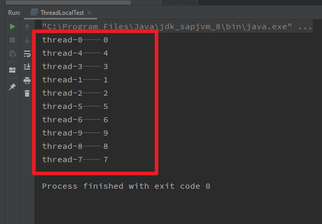

#### ThreadLocal 和synchronized区别

|      | synchronized                             | ThreadLocal                              |
| ---- | ---------------------------------------- | ---------------------------------------- |
| 原理   | 以“时间换空间”的方式来控制多线程资源同步访问。<br>只有一份变量，不同线程同步访问资源。 | 以“空间换时间”的方式，为每个线程都提供一份变量的副本，多线程之间变量或不干扰。 |
| 侧重点  | 多线程资源同步访问                                | 多线程之间数据相互隔离                              |

### 应用场景

1. 传递数据：确保每个线程里面的数据能够在任何地方进行获取，避免了传参带来的代码耦合问题。
2. 线程隔离：线程之间数据相互隔离但却有并发性，避免了同步带来的性能损耗。

### 内部分析

JDK1.8及其以后的ThreadLocal设计


```java
ThreadLocalMap getMap(Thread t) {
    return t.threadLocals;
}
```

1. **ThreadLocal set值的时候里面实际上用的是ThreadLocalMap进行存储的，ThreadLocalMap的key是当前的ThreadLocal，value就是线程变量的副本。而ThreadLocalMap又是用Entry[]来存储数据的。**
2. **怎么做到线程副本隔离的**？
   1. 每个Thread里面都有独自的ThreadLocal.ThreaLocalMap threadLocals，每当ThreadLocal设置值的时候，当前线程的threadLocals的内容就是ThreadLocalMap(当前ThreadLocal，value)。
   2. 你取值的时候，会从当前线程的threadLocals里面获取，通过传入的ThreadLocal即可取到线程的副本值，即实现了线程副本数据隔离。

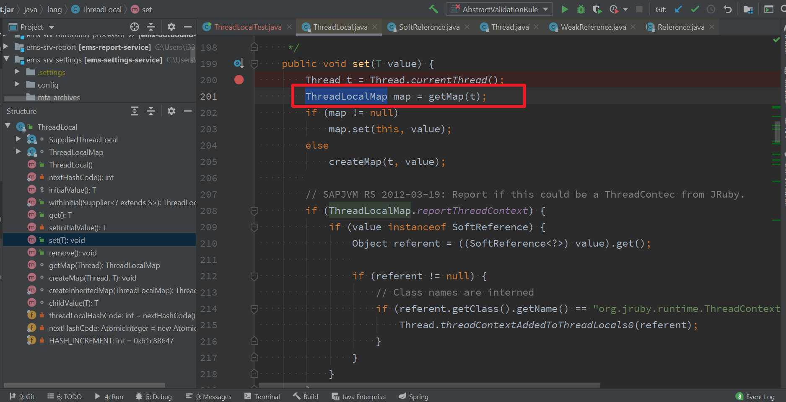

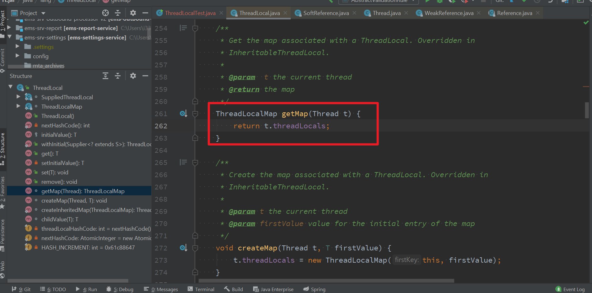

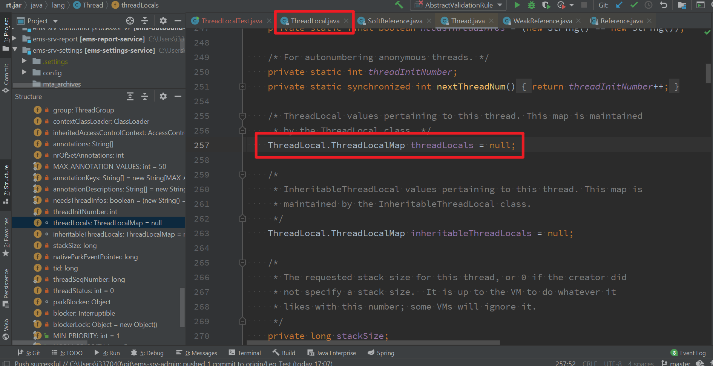

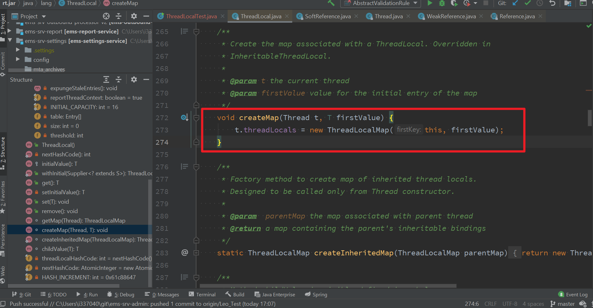

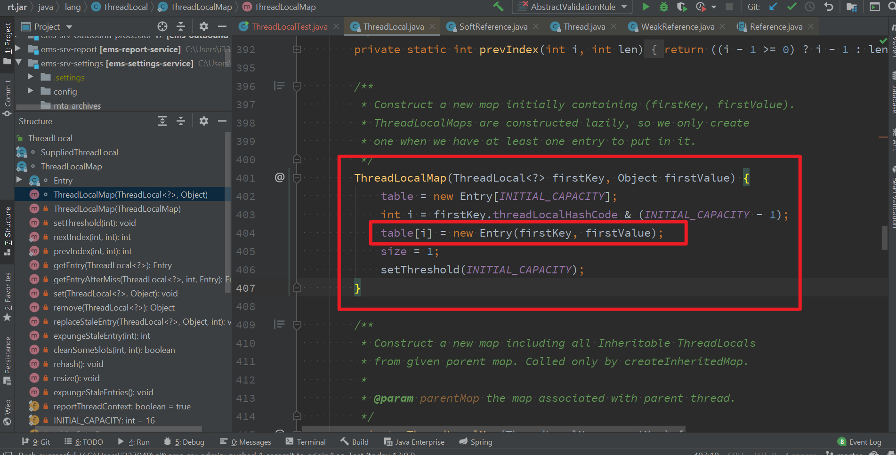

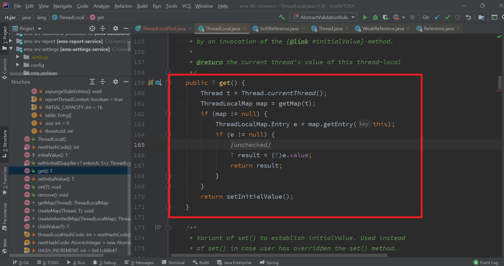

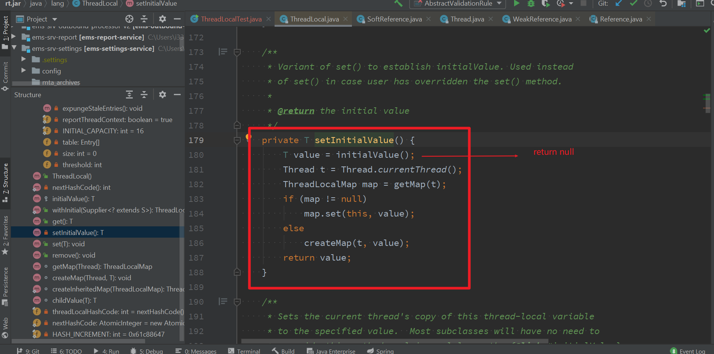

### ThreadLocalMap 基本结构

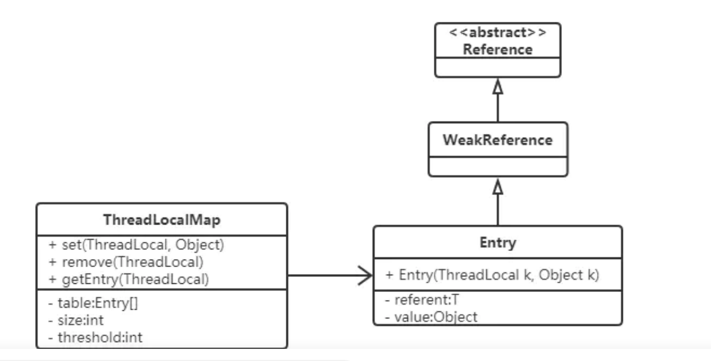

```java
static class Entry extends WeakReference<ThreadLocal<?>> {
    /** The value associated with this ThreadLocal. */
    Object value;

    Entry(ThreadLocal<?> k, Object v) {
        super(k);
        value = v;
    }
}
```

### 强引用弱引用和内存泄漏

#### 内存泄漏相关概念

1. 内存泄漏：动态分配的堆内存由于某些原因导致我们的程序没法释放，造成程序运行速度减慢甚至崩溃。内存泄漏的堆积会导致内存溢出。
2. 内存溢出：已经没有足够的内存提供给申请者使用。

#### 强引用和弱引用

1. 强引用：就是普通对象的引用。如果当前对象还存在强引用（对象还活着），那么垃圾回收器不会回收该对象。
2. 弱引用：垃圾回收器一旦发现具有弱引用的对象，那么一定会回收该对象。

### 什么原因导致ThreadLocal存在内存泄漏的问题

1. 是Entry的key是弱引用导致的吗？

   - 假如说存放数据的Entry的key是强引用，还会出现内存泄漏吗？

     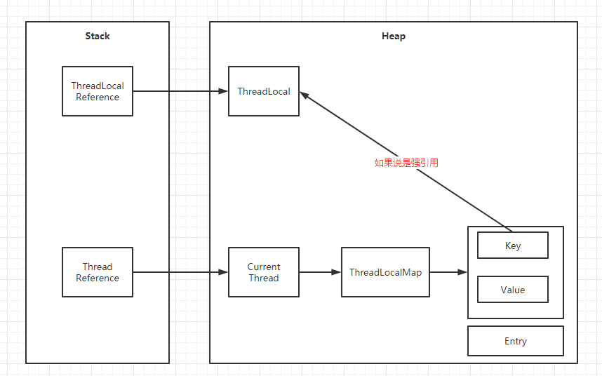

     - 解释：还是会。因为当前ThreadLocal使用完，它的引用就会被销毁，但是呢，由于当前线程还在执行，当前线程里面存放了ThreadLocalMap(ThreadLocal threadLocal, Object value);也就是说当前线程没有被销毁，那么就一直存在一个强引用指向堆内存上的ThreadLocal对象。因此呢，ThreadLocal对象不会被销毁，存在内存泄漏的风险。

     


   - 那么Entry的Key是弱引用类型，那么还存在内存泄漏风险吗？

     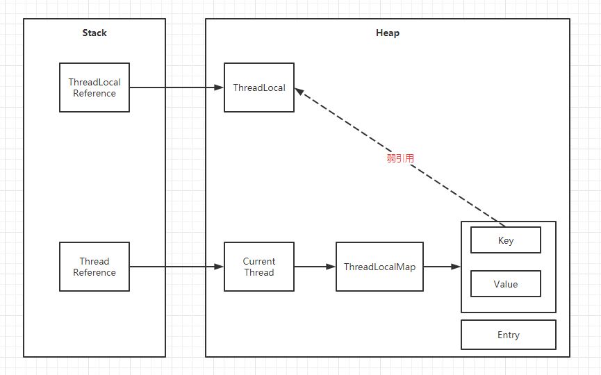

     - 解释：还是会。当前ThreadLocal使用完之后，引用被回收，同时由于Entry的Key是弱引用类型，因此在垃圾回收阶段，会把堆内存中的ThreadLocal对象回收掉,，所以Entry中的Key就变成null。但是，**只要当前线程没有被销毁，那么就存在一个强引用链**，当前线程引用到ThreadLocalMap ->Entry -> Value. 由于，Entry中的Key是null，但是Value又有值，但是该Entry永远都不会被访问到。因此还是会存在内存泄漏，因此需要手动调用ThreadLocal.remove()，删掉强引用。

### 内存泄漏的真正原因

1. ThreadLocal使用完之后，没有调用其remove方法手动删除Entry
2. 当前线程的生命周期和ThreadLocal的生命周期不一致
   - **解决：手动调用ThreadLocal的remove方法，手动删除Entry。**

#### 为什么要使用弱引用

1. 弱引用比强引用多一层保障，ThreadLocalMap的set/getEntry方法中，会把Key为null的Entry的Value也设置成null。这样弱引用的ThreadLocal被回收，对应的Value会在下一次ThreadLocalMap调用set/get/remove方法时会被置空，从而避免了内存泄漏。


### Hash冲突的解决

1. 我们往ThreadLocalMap里面插入元素时候，可能发生哈希冲突(图中i的位置有值，key不为null).那么会采用线性探测法来解决冲突，比如计算出i的位置是15，Entry的size是16，那么回往Entry数组位置0的地方插入，如果发现0位置还是有元素，那么会往位置1的地方插入，如果1位置没有元素，那么直接插入进去。

   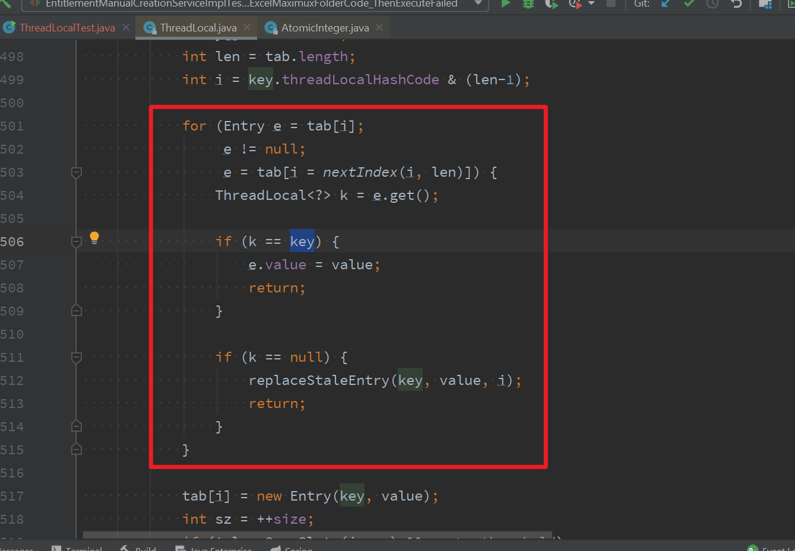

   2. 显然ThreadLocalMap采用线性探测的方式解决Hash冲突的**效率很低**，如果有大量不同的ThreadLocal对象放入map中时发送冲突，或者发生二次冲突，则效率很低。

      **所以这里引出的良好建议是：每个线程只存一个变量，这样的话所有的线程存放到map中的Key都是相同的ThreadLocal，如果一个线程要保存多个变量，就需要创建多个ThreadLocal，多个ThreadLocal放入Map中时会极大的增加Hash冲突的可能。**

      ```java
      public class Test
      {
          static ThreadLocal threadLocal1 = new ThreadLocal();
          static ThreadLocal threadLocal2 = new ThreadLocal();
          static ThreadLocal threadLocal3 = new ThreadLocal();
          //不建议这样做，因此发生冲突的概率比较高
      }
      ```

      
