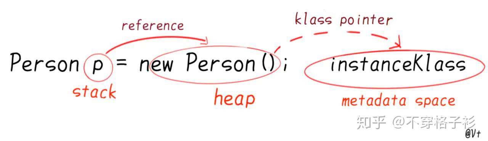
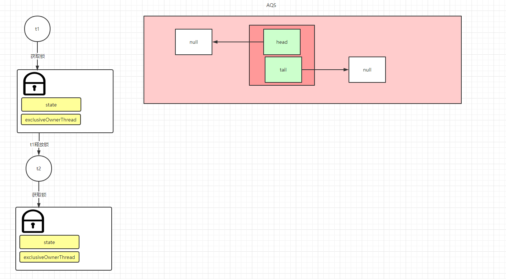
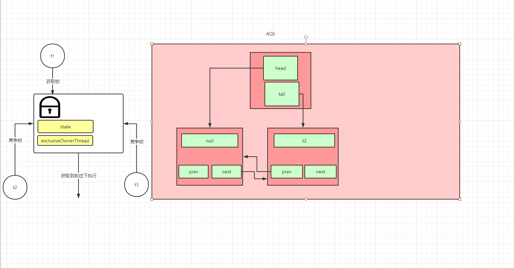
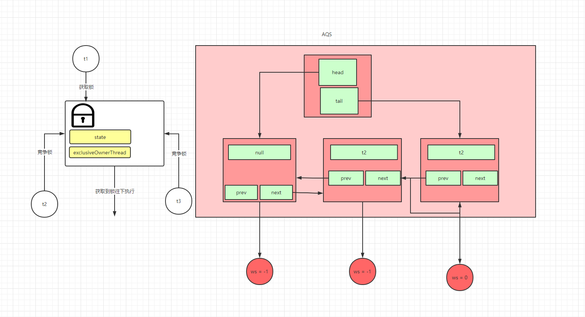

###	并发编程

- [进程与线程](#进程与线程)
- [并发与并行](#并发与并行)
- [线程状态](#线程状态)
- [wait/sleep区别](#wait/sleep区别)
- [生产者消费者模型，防止虚拟唤醒](#生产者消费者模型防止虚拟唤醒)
- [CopyOnWriteArrayList](#CopyOnWriteArrayList)
- [CopyOnWriteArraySet](#CopyOnWriteArraySet)
- [ConcurrentHashMap](#ConcurrentHashMap)
- [Callable](#Callable)
- [Synchronized与Lock](#Synchronized与Lock)
- [手写一把锁](#手写一把锁)
- [ReentrantLock](#ReentrantLock)
- [AQS](#AQS)
- [CountDownLatch发令枪](#CountDownLatch发令枪)
- [CyclicBarrier循环栅栏](#CyclicBarrier循环栅栏)
- [Semaphore](#Semaphore)
- [读写锁](#读写锁)
- [阻塞队列](#阻塞队列)
- [线程池](#线程池)
- [函数式接口](#函数式接口)
- [ForkJoin框架](#ForkJoin框架)

### 进程与线程

- 进程
    - **资源分配**的最小单位

- 线程
    - **CPU调度**的最小单位

- 总括：比如我们打开一个qq.exe,这里qq就是一个进程。而qq里面发送语音或者消息，这个时候就是通过该进程里面开启的线程来实现的。一个进程里面有一个或者多个线程。


- Java默认两个线程：主线程和GC线程。


- Java可以开启线程吗
    - 不可以，它是调用C++来开启线程的。

        ```java
        public synchronized void start() {
                /**
                 * This method is not invoked for the main method thread or "system"
                 * group threads created/set up by the VM. Any new functionality added
                 * to this method in the future may have to also be added to the VM.
                 *
                 * A zero status value corresponds to state "NEW".
                 */
                if (threadStatus != 0)
                    throw new IllegalThreadStateException();
        
                /* Notify the group that this thread is about to be started
                 * so that it can be added to the group's list of threads
                 * and the group's unstarted count can be decremented. */
                group.add(this);
        
                boolean started = false;
                try {
                    start0();
                    started = true;
                } finally {
                    try {
                        if (!started) {
                            group.threadStartFailed(this);
                        }
                    } catch (Throwable ignore) {
                        /* do nothing. If start0 threw a Throwable then
                          it will be passed up the call stack */
                    }
                }
            }
        	
            private native void start0();
        ```

        

### 并发和并行

- 并发：多线程操作同一资源。

- 并行：多核CPU，多线程同时执行。

- 并发编程本质：充分利用CPU的资源。

    ```java
    public class Test
    {
        public static void main(String[] args)
        {
            //CPU 密集型； IO密集型
            System.out.println(Runtime.getRuntime().availableProcessors());
        }
    }
    ```


### 线程状态

```java
public enum State {
       
       //新生，线程还没有启动
        NEW,

        //运行
        RUNNABLE,

        //阻塞，等待锁
        BLOCKED,

        //等待，死死的等，等待其他线程调用notify,notifyAll把它唤醒
        WAITING,

		//超市等待，时间过了就不等了
        TIMED_WAITING,

		//终止
        TERMINATED;
    }
```

### wait/sleep区别

- 来自不同的类
    - wait()：来自Object
    - sleep：来自Thread

- 锁的释放
    - wait()：释放当前持有的锁
    - sleep()：不释放锁
- 使用范围：
    - wait()：需要在同步代码块中使用
    - sleep()：在代码中任何地方使用
- wait与notify和notifyAll搭配使用
    - notify()：在队列中唤醒任意一个在此对象监视器上等待线程
    - notifyAll()：唤醒所有在此对象监视器上等待的线程。

### Synchronized与Lock

#### Synchronized

- **对象监视器锁。**多线程环境下控制资源同步访问，同步代码块是一个原子操作，**依赖于底层操作系统Mutex Lock实现。**
- **对象内存结构/内存布局**
    - 对象头：**64位操作系统占用16字节**
        - mark word: 包括锁的状态信息，对象的hash码，对象分代年龄。占用8字节。
        - klass word：指向实例对象的元数据信息的指针。开启指针压缩占用4字节，没开启占用8字节
            - 
        
    - 对象实际数据：成员数据

    - 对其填充：实例对象创建的时候会占用固定大小的空间，如果说对象的实际数据没有占满该空间，那么把剩余的空的位置自动填满。

        ```
        com.example.springbootredis.com.leo.SynchronizeTest object internals:
         OFFSET  SIZE   TYPE DESCRIPTION                               VALUE
              0     4        (object header)                           0d 00 00 00 (00001101 00000000 00000000 00000000) (13)
              4     4        (object header)                           00 00 00 00 (00000000 00000000 00000000 00000000) (0)
              8     4        (object header)                           b2 c5 06 f8 (10110010 11000101 00000110 11111000) (-133773902)
             12     4        (loss due to the next object alignment)
        Instance size: 16 bytes
        ```

        

        ```c++
        //  32 bits:
        //  --------
        //             hash:25 ------------>| age:4    biased_lock:1 lock:2 (normal object)
        //             JavaThread*:23 epoch:2 age:4    biased_lock:1 lock:2 (biased object)
        //
        //  64 bits:
        //  --------
        //  unused:25 hash:31 -->| unused_gap:1   age:4    biased_lock:1 lock:2 (normal object)
        //  JavaThread*:54 epoch:2 unused_gap:1   age:4    biased_lock:1 lock:2 (biased object)
        ```

    - 指针压缩：

        - 64位JVM消耗的内存会比32位的要多大约1.5倍，这是因为对象指针在64位JVM下有更宽的寻址。对于那些将要从32位平台移植到64位的应用来说，平白无辜多了1/2的内存占用，这是开发者不愿意看到的。
        - 作用：**节约内存占用**

- 版本：
    - JDK1.6及其以前：synchronized是一把重量级锁，某个线程获取到锁之后，其他线程就处于阻塞状态，直到当前线程释放掉锁以后，处于阻塞队列中的线程会去竞争这把锁。竞争到锁的线程会发生线程切换，这个时候会调用操作系统函数使得**操作系统由用户态转成核心态**，这个操作是十分耗时的，因此JDK1.6以前synchronized效率是比较低下的。
        - 为什么操作系统的用户态和内核态转换是非常耗时的或者耗费资源的？
            - 硬件
            - 
    - JDK1.6以后：对synchronized进行了优化，引入了偏向锁，轻量级锁，自旋锁等等。
        - 偏向锁：没有多线程竞争情况下，会把整个同步代码块给消除掉。它偏向于第一次获取到锁的那个线程，在接下来的执行过程中，该线程获取到锁的概率更大。那么如果偏向锁获取失败，那么会膨胀为轻量级锁。
        - 轻量级锁：轻量级锁采用CAS加锁，相比与重量级锁直接使用操作系统的互斥量所产生的性能开销更小。如果多线程环境下锁资源竞争激烈，如果轻量级锁加锁失败之后，轻量级锁会膨胀为重量级锁。
        - 自旋锁：在轻量级锁加锁失败之后，它会尝试空转，也就是什么都不做，等其他线程释放锁。因为线程获取到锁之后执行的时间很快，远低于线程阻塞到执行这两种线程状态的切换时间。还是获取不到锁的话，那么就会膨胀为重量级锁。
        - 锁消除：编译器在编译Java代码的时候，会检测共享资源是否存在竞争锁的情况，如果没有，那么会消除相应的锁。
    
- 作用域
    - 静态方法：也就是给当前类加锁，多线程环境竞争资源的情况下，进入同步代码块之前需要获得类对象的锁。
    - 非静态方法：给当前实例对象加锁，多线程环境竞争资源的情况下，进入同步代码块之前需要获得实例对象的锁。
    
- 如何确定锁定对象是谁，即锁的对象是谁？
    - 如果显示指定了锁的对象：synchronized(this), synchronized(变量名)那么就表明你加锁的对象是括号里面的对象。
    - 如果是隐式的：比如说修饰非静态方法或者静态方法
        - 非静态方法：锁的是实例对象。
        - 静态方法：那么你锁的对象是类对象。
    
- 字节码层面理解synchronized
  
    - synchronized的实现是使用**monitorenter和monitorexit**来实现的，monitorenter表明同步代码块开始的位置，monitorexit表明同步代码块结束的位置.当锁的计算器为0的时候表明可以获取锁，获取到锁之后那么锁的计数器会+1，由于synchronized是可重入锁，因此可以它可以获取到同一对象的多把锁，每获取到一次锁，那么锁的计数器就+1,最后它会调用monitorexit去释放锁，没释放一次锁，锁的计数器就-1. 当锁的计数器为0的时候表明锁已经全部释放完。
    
- 延伸

    - 锁的状态

        - 无锁，偏向锁，轻量级锁，重量级索，GC标记

    - 实例对象怎么存储在内存中的？

        - **对象存放在堆，对象的元数据存放在元空间(方法区)，对象的引用存放在栈**

    - 元数据

        - meta data。对数据的特征，内容等方面进行说明的数据。(data about data.)

    - 为什么不直接上重量级锁

        - 重量级锁会涉及到线程上下文切换，使得操作系统用户态和内核态转换，非常消耗系统资源。

        - 为什么线程上下文切换就会消耗很大系统资源？

            - **直接消耗**：指的是CPU寄存器需要保存和加载, 系统调度器的代码需要执行, TLB实例需要重新加载, CPU 的pipeline需要刷掉；
    
            - **间接消耗**：指的是多核的cache之间得共享数据, 间接消耗对于程序的影响要看线程工作区操作数据的大小；
    
                

#### Lock

- 位置：它是在JUC包下的一个接口。常见的实现类有Reentrantlock，ReentrantReadWriteLock.WriteLock, ReentrantReadWriteLock.ReadLock

- 比如说它的实现类ReentrantLock

    - 构造函数通过传入的true或者false可以构造公平锁还是非公平锁。

    - synchronized不可以中断，而ReentrantLock可以被中断。

    - ReentranLock也可以实现可选择性通知


### 生产者消费者模型，防止虚拟唤醒

场景：有一个生产者一个消费者，一个盘子，盘子上只能够放一个苹果。如果说盘子上没有苹果，那么生产者会在盘子上放苹果，如果有苹果，生产者就不放，让消费者去消费苹果，请用代码实现。

- 首先这涉及到线程通信的问题

```java
package com.example.springbootredis.com.leo;

/**
 * ProjectName:${project_name}
 * FileName:${file_name}
 * Description:${todo}
 * Copyright:Copyright(c)2017
 * Company:SAP
 *
 * @authorSAP
 * @date${date}${time}
 * @see
 * @since
 */
public class ProducerConsumerTest
{
    public static void main(String[] args)
    {
        Plate plate = new Plate();
        new Thread(() -> { for (int i = 0; i < 20; i++) plate.increment(); }, "A").start(); 
        new Thread(() -> { for (int i = 0; i < 20; i++) plate.decrement(); }, "B").start();
    }
}

class Plate
{
    //盘子上的苹果，假定开始盘子上没有苹果
    private int apple = 0;

    public synchronized void increment()
    {
        //有东西那么就叫其他人取，取完之后再放
        if (apple != 0)
        {
            try
            {
                this.wait();
            }
            catch (InterruptedException exception)
            {
                exception.printStackTrace();
            }
        }
        apple++;
        System.out.println(Thread.currentThread().getName() + "=>" + apple);
        this.notify();
    }

    public synchronized void decrement()
    {
        if (apple == 0)
        {
            try
            {
                this.wait();
            }
            catch (InterruptedException exception)
            {
                exception.printStackTrace();
            }
        }
        apple--;
        System.out.println(Thread.currentThread().getName() + "=>" + apple);
        this.notify();
    }
}

```

结果：

```上
B=>0
A=>1
B=>0
A=>1
B=>0
A=>1
B=>0
A=>1
B=>0
A=>1
B=>0
A=>1
B=>0
A=>1
B=>0
A=>1
B=>0
A=>1
B=>0
A=>1
B=>0
A=>1
B=>0
A=>1
B=>0
A=>1
B=>0
A=>1
B=>0
A=>1
B=>0
A=>1
B=>0
A=>1
B=>0
A=>1
B=>0
A=>1
B=>0
A=>1

Process finished with exit code 0

```

- 但这样有一个问题，也就是当生产者和消费者增多的时候，会出现消费或者生产紊乱的情况，也就是**线程假唤醒。虚假唤醒发生的原因在于CPU是基于时间片进行轮准调度执行的，因此不能值判断一次，需要加上while循环。**

复现：

```java
 public static void main(String[] args)
 {
     Plate plate = new Plate();
     new Thread(() -> { for (int i = 0; i < 50; i++) plate.increment(); }, "A").start();
     new Thread(() -> { for (int i = 0; i < 50; i++) plate.decrement(); }, "B").start();
     new Thread(() -> { for (int i = 0; i < 50; i++) plate.increment(); }, "C").start();
     new Thread(() -> { for (int i = 0; i < 50; i++) plate.decrement(); }, "D").start();
 }
```

结果：


问题原因：if判断肯定有问题，我们应该用while，需要注意的是生产者生产的数量一定要和消费者消费的数量一致，不然会出现死锁。也就是说会有线程等待消费或者等待生产。

- 通过使用Lock来实现生产者和消费者模型，并且期望实现某个生产者生产了苹果让特定的消费者进行消费。


```java
package com.example.springbootredis.com.leo;

import java.util.concurrent.locks.Condition;
import java.util.concurrent.locks.Lock;
import java.util.concurrent.locks.ReentrantLock;

public class LockConditionalTest
{
    public static void main(String[] args)
    {
        PlateDumplate plateDumplate = new PlateDumplate();
        new Thread(() -> { for (int i = 0; i < 10; i++) plateDumplate.increment(); }, "A").start();
        new Thread(() -> { for (int i = 0; i < 10; i++) plateDumplate.increment(); }, "B").start();
        new Thread(() -> { for (int i = 0; i < 10; i++) plateDumplate.decrement(); }, "C").start();
        new Thread(() -> { for (int i = 0; i < 10; i++) plateDumplate.decrement(); }, "D").start();
    }
}

class PlateDumplate
{
    private Lock lock = new ReentrantLock(true);
    Condition condition = lock.newCondition();
    //盘子上的苹果
    private int apple = 0;

    public void increment()
    {
        try
        {
            lock.lock();
            //有东西那么就叫其他人取，取完之后再放
            while (apple != 0)
            {
                try
                {
                    condition.await();
                }
                catch (InterruptedException exception)
                {
                    exception.printStackTrace();
                }
            }
            apple++;
            System.out.println(Thread.currentThread().getName() + "=>" + apple);
            condition.signalAll();
        }
        finally
        {
            lock.unlock();
        }
    }

    public  void decrement()
    {
        try
        {
            lock.lock();
            while (apple == 0)
            {
                try
                {
                    condition.await();;
                }
                catch (InterruptedException exception)
                {
                    exception.printStackTrace();
                }
            }
            apple--;
            System.out.println(Thread.currentThread().getName() + "=>" + apple);
            condition.signalAll();
        }
        finally
        {
            lock.unlock();
        }
    }
}

```

- Condition实现精准唤醒
    - 我们想实现线程A -> B->C->D->A 的调用顺序

    ```java
    package com.example.springbootredis.com.leo;
    
    import java.util.concurrent.locks.Condition;
    import java.util.concurrent.locks.Lock;
    import java.util.concurrent.locks.ReentrantLock;
    
    public class ReentrantLockConditionTest
    {
        public static void main(String[] args)
        {
            Data data = new Data();
            new Thread(()-> { for(int i=0;i<10;i++) data.printA();},"A").start();
            new Thread(()-> { for(int i=0;i<10;i++) data.printB();},"B").start();
            new Thread(()-> { for(int i=0;i<10;i++) data.printC();},"C").start();
            new Thread(()-> { for(int i=0;i<10;i++) data.printD();},"D").start();
        }
    }
    class Data
    {
        private int number = 1; // default is A
        private Lock lock = new ReentrantLock();
        private Condition condition1 = lock.newCondition();
        private Condition condition2 = lock.newCondition();
        private Condition condition3 = lock.newCondition();
        private Condition condition4 = lock.newCondition();
    
        public void printA()
        {
            try
            {
                lock.lock();
                while(number != 1)
                {
                    //A should wait
                    condition1.await();
                }
                number = 2;
                condition2.signal();
                System.out.println(Thread.currentThread().getName());
            }
            catch (InterruptedException exception)
            {
                exception.printStackTrace();
            }
            finally
            {
                lock.unlock();
            }
        }
    
        public void printB()
        {
            try
            {
                lock.lock();
                while(number != 2)
                {
                    //A should wait
                    condition2.await();
                }
                number = 3;
                condition3.signal();
                System.out.println(Thread.currentThread().getName());
            }
            catch (InterruptedException exception)
            {
                exception.printStackTrace();
            }
            finally
            {
                lock.unlock();
            }
        }
    
        public void printC()
        {
            try
            {
                lock.lock();
                while(number != 3)
                {
                    //A should wait
                    condition3.await();
                }
                number = 4;
                condition4.signal();
                System.out.println(Thread.currentThread().getName());
            }
            catch (InterruptedException exception)
            {
                exception.printStackTrace();
            }
            finally
            {
                lock.unlock();
            }
        }
    
        public void printD()
        {
            try
            {
                lock.lock();
                while(number != 4)
                {
                    //A should wait
                    condition4.await();
                }
                number = 1;
                condition1.signal();
                System.out.println(Thread.currentThread().getName());
            }
            catch (InterruptedException exception)
            {
                exception.printStackTrace();
            }
            finally
            {
                lock.unlock();
            }
        }
    }
    
    ```

    ```
    //输出结果
    A
    B
    C
    D
    A
    B
    C
    D
    A
    B
    C
    D
    .
    .
    .
    ```

### CopyOnWriteArrayList

多线程环境下，使用ArrayList不是线程安全的，能否使用**线程安全的list**？

- Vector容器：但是锁定粒度太大，添加、删除、获取元素的操作都加了synchronized关键字，因此性能不好。

    ```java
     	public synchronized void addElement(E obj) {
            modCount++;
            ensureCapacityHelper(elementCount + 1);
            elementData[elementCount++] = obj;
        }
        
        public synchronized boolean removeElement(Object obj) {
            modCount++;
            int i = indexOf(obj);
            if (i >= 0) {
                removeElementAt(i);
                return true;
            }
            return false;
        }
    	public synchronized E get(int index) {
            if (index >= elementCount)
                throw new ArrayIndexOutOfBoundsException(index);
    
            return elementData(index);
        }
    ```

    

- Collections.synchronizedList(List<T> list)：**方法内部加了synchronized关键字**

    ```java
    		public void add(int index, E element) {
                synchronized (mutex) {list.add(index, element);}
            }
            public E remove(int index) {
                synchronized (mutex) {return list.remove(index);}
            }
    ```

- CopyOnWriteArrayList：

    ```java
    public boolean add(E e) {
            final ReentrantLock lock = this.lock;
            lock.lock();
            try {
                Object[] elements = getArray();
                int len = elements.length;
                Object[] newElements = Arrays.copyOf(elements, len + 1);
                newElements[len] = e;
                setArray(newElements);
                return true;
            } finally {
                lock.unlock();
            }
        }
    
    public E get(int index) {
            return this.get(this.getArray(), index);
        }
    private E get(Object[] a, int index) {
            return a[index];
        }
    ```

    - 在添加元素时候采用COW设计思想，添加元素的线程会先复制一份array数组中的数据，之后对副本进行操作。操作完之后再把副本的数据赋值给array数组。
    - **读不加锁**
    - 缺点：
        - 内存占用；会创建副本数组
        - 不适合写多读少的场景
        - 不能保证数据实时一致性：只能保证数据最终一致性。

- 为什么CopyOnWriteArrayList比Vector性能好？

    - CopyOnWriteArrayList支持并发读，读操作没有加锁。而Vector所有操作都加了锁。

- 为什么需要一个副本数组？

    - 因为这保证在get的时候每次都能够获取到数据，如果在增删过程中直接修改原来数组的值，高并发场景下可能会出现ConcurrentModificationException，读取不到数据。

### CopyOnWriteArraySet

1.线程安全的Set实现类

2.**底层实质上就是调用的CopyOnWriteArrayList**

```java
/**
     * Creates an empty set.
     */
    public CopyOnWriteArraySet() {
        al = new CopyOnWriteArrayList<E>();
    }
```

### ConcurrentHashMap

- JDK版本

    - JDK1.7

        - 线程安全
            - 是
        - 底层数据结构：Segment数组+HashEntry
        - 高并发如何保证：分段锁的设计思想。插入元素的过程中，会通过其key定位到某个Segment，也就是只会锁在当前Segment，其他线程插入数据到其他的Segment，插入操作并不会被阻塞。从而提高了并发访问的效率。

        

        ```java
        public V put(K key, V value) {
            	//采用分段锁来控制并发
                Segment<K,V> s;
                if (value == null)
                    throw new NullPointerException();
                int hash = hash(key);
                int j = (hash >>> segmentShift) & segmentMask;
                if ((s = (Segment<K,V>)UNSAFE.getObject          // nonvolatile; recheck
                     (segments, (j << SSHIFT) + SBASE)) == null) //  in ensureSegment
                    s = ensureSegment(j);
                return s.put(key, hash, value, false);
            }
            
            final V put(K key, int hash, V value, boolean onlyIfAbsent) {
                    HashEntry<K,V> node = tryLock() ? null :
                        scanAndLockForPut(key, hash, value);
                    V oldValue;
                    try {
                        HashEntry<K,V>[] tab = table;
                        int index = (tab.length - 1) & hash;
                        HashEntry<K,V> first = entryAt(tab, index);
                        for (HashEntry<K,V> e = first;;) {
                            if (e != null) {
                                K k;
                                if ((k = e.key) == key ||
                                    (e.hash == hash && key.equals(k))) {
                                    oldValue = e.value;
                                    if (!onlyIfAbsent) {
                                        e.value = value;
                                        ++modCount;
                                    }
                                    break;
                                }
                                e = e.next;
                            }
                            else {
                                if (node != null)
                                    node.setNext(first);
                                else
                                    node = new HashEntry<K,V>(hash, key, value, first);
                                int c = count + 1;
                                if (c > threshold && tab.length < MAXIMUM_CAPACITY)
                                    rehash(node);
                                else
                                    setEntryAt(tab, index, node);
                                ++modCount;
                                count = c;
                                oldValue = null;
                                break;
                            }
                        }
                    } finally {
                        unlock();
                    }
                    return oldValue;
                }
        
        public V get(Object key) {
                Segment<K,V> s; // manually integrate access methods to reduce overhead
                HashEntry<K,V>[] tab;
                int h = hash(key);
                long u = (((h >>> segmentShift) & segmentMask) << SSHIFT) + SBASE;
                if ((s = (Segment<K,V>)UNSAFE.getObjectVolatile(segments, u)) != null &&
                    (tab = s.table) != null) {
                    for (HashEntry<K,V> e = (HashEntry<K,V>) UNSAFE.getObjectVolatile
                             (tab, ((long)(((tab.length - 1) & h)) << TSHIFT) + TBASE);
                         e != null; e = e.next) {
                        K k;
                        if ((k = e.key) == key || (e.hash == h && key.equals(k)))
                            return e.value;
                    }
                }
                return null;
            }
        ```

        - 并发度：默认是16

        - put操作流程：

            - 尝试获取锁，如果没有获取到锁那么就自旋获取锁，如果说达到指定次数之后（多核处理器是自旋64次，如果单核的话就自旋1次），还没有获取到锁当前线程就会阻塞。获取到锁就会执行插入元素操作。

        - get操作：

            - 通过key定位到具体的Segment，再通过一次hash就可以地位到具体元素。**get操作效率很高，因为它不需要加锁**

    - JDK1.8

        - 摒弃了分段锁的设计思想，采用了CAS和Synchronized来控制并发。

        - 底层数据结构：数组+链表+红黑树

        - **为什么要摒弃分段锁**

            - 分段会内存不连续，内存碎片化，浪费了内存空间
            - 锁粒度更小，**JDK1.7要锁住某个Segment，而JDK1.8只需要锁住单个结点，提高了并发访问效率。**

        - **为什么用Synchronized而不采用JDK1.7里面的ReentrantLock**

            - ​	JDK1.6以后对Synchronized进行了优化，引入了偏向锁，轻量级锁，自旋锁，锁粗化，锁消除等等优化技术对JVM锁进行了优化，大大提高了Synchronized锁的效率。

                ```java
                final V putVal(K key, V value, boolean onlyIfAbsent) {
                    if (key != null && value != null) {
                        int hash = spread(key.hashCode());
                        int binCount = 0;
                        ConcurrentHashMap.Node[] tab = this.table;
                
                        while(true) {
                            int n;
                            while(tab == null || (n = tab.length) == 0) {
                                tab = this.initTable();
                            }
                
                            ConcurrentHashMap.Node f;
                            int i;
                            if ((f = tabAt(tab, i = n - 1 & hash)) == null) {
                                if (casTabAt(tab, i, (ConcurrentHashMap.Node)null, new ConcurrentHashMap.Node(hash, key, value, (ConcurrentHashMap.Node)null))) {
                                    break;
                                }
                            } else {
                                int fh;
                                if ((fh = f.hash) == -1) {
                                    tab = this.helpTransfer(tab, f);
                                } else {
                                    V oldVal = null;
                                    synchronized(f) {
                                        if (tabAt(tab, i) == f) {
                                            if (fh < 0) {
                                                if (f instanceof ConcurrentHashMap.TreeBin) {
                                                    binCount = 2;
                                                    ConcurrentHashMap.TreeNode p;
                                                    if ((p = ((ConcurrentHashMap.TreeBin)f).putTreeVal(hash, key, value)) != null) {
                                                        oldVal = p.val;
                                                        if (!onlyIfAbsent) {
                                                            p.val = value;
                                                        }
                                                    }
                                                }
                                            } else {
                                                label103: {
                                                    binCount = 1;
                
                                                    ConcurrentHashMap.Node e;
                                                    Object ek;
                                                    for(e = f; e.hash != hash || (ek = e.key) != key && (ek == null || !key.equals(ek)); ++binCount) {
                                                        ConcurrentHashMap.Node<K, V> pred = e;
                                                        if ((e = e.next) == null) {
                                                            pred.next = new ConcurrentHashMap.Node(hash, key, value, (ConcurrentHashMap.Node)null);
                                                            break label103;
                                                        }
                                                    }
                
                                                    oldVal = e.val;
                                                    if (!onlyIfAbsent) {
                                                        e.val = value;
                                                    }
                                                }
                                            }
                                        }
                                    }
                
                                    if (binCount != 0) {
                                        if (binCount >= 8) {
                                            this.treeifyBin(tab, i);
                                        }
                
                                        if (oldVal != null) {
                                            return oldVal;
                                        }
                                        break;
                                    }
                                }
                            }
                        }
                
                        this.addCount(1L, binCount);
                        return null;
                    } else {
                        throw new NullPointerException();
                    }
                }
                ```

### Callable

- 创建多线程4种方式
    - 继承Thread
    - 实现Runnable接口
    - 实现Callable接口
    - 线程池

- Runnable和Callable接口区别
    - Runnable接口没有返回值，如果说你的任务需要返回值那么使用Runnable。	
    - Runnable接口不会抛出异常

- Runnable和Callable之间可以互相转换
    - 通过引入FutureTask实现二者的转换

    ```java
    package com.juc;
    
    import java.util.concurrent.Callable;
    import java.util.concurrent.ExecutionException;
    import java.util.concurrent.FutureTask;
    
    public class CallableTest  implements Callable<String>
    {
        public static void main(String[] args) throws ExecutionException, InterruptedException
        {
            CallableTest callableTest = new CallableTest();
            FutureTask futureTask = new FutureTask(callableTest);
            new Thread(futureTask,"AAA").start();;
            System.out.println(futureTask.get());;
        }
    
        @Override
        public String call() throws Exception
        {
            return "call";
        }
    }
    
    ```

- FutureTask
    - 实现了RunnableFuture，同时RunnableFuture继承了Runnable和Future接口，因此它可以作为Runnable被线程执行，也可以作为Future得到Callable的返回值。

    ```java
    public class FutureTask<V> implements RunnableFuture<V> 
    
    public interface RunnableFuture<V> extends Runnable, Future<V> {
        /**
         * Sets this Future to the result of its computation
         * unless it has been cancelled.
         */
        void run();
    }
    ```

    - **可以判断任务是否执行完成，或者是否已经取消，并且可以取消任务的执行。**

    ```java
        public boolean isCancelled() {
                return state >= CANCELLED;
            }
    
        public boolean isDone() {
            return state != NEW;
        }
     	public boolean cancel(boolean mayInterruptIfRunning) {
            if (!(state == NEW &&
                  UNSAFE.compareAndSwapInt(this, stateOffset, NEW,
                      mayInterruptIfRunning ? INTERRUPTING : CANCELLED)))
                return false;
            try {    // in case call to interrupt throws exception
                if (mayInterruptIfRunning) {
                    try {
                        Thread t = runner;
                        if (t != null)
                            t.interrupt();
                    } finally { // final state
                        UNSAFE.putOrderedInt(this, stateOffset, INTERRUPTED);
                    }
                }
            } finally {
                finishCompletion();
            }
            return true;
        }
        
        /**
         * @throws CancellationException {@inheritDoc}
         */
        public V get() throws InterruptedException, ExecutionException {
            int s = state;
            if (s <= COMPLETING)
                s = awaitDone(false, 0L);
            return report(s);
        }
    ```

    - get()：获取任务的执行结果，获取到结果之前，一直阻塞。


### 手写一把锁

```java
volatile int status = 0;	//是否有线程获取到锁，0表示没有
Queue parkQueue;			//队列，用来存放阻塞的线程
	
//加锁流程
public void lock()
{
    //CAS(0,1); 比较当前status值是否为0，如果是的话返回true，否则返回false
	while(!CAS(0,1))	
	{
		park();	//当前线程阻塞
	}
	
	logic(); //处理业务逻辑
	
	unlock();
}
 
public void unlock()
{
	status = status -1 ;
	Thread t = parkQueue.header();	//得到队列头部线程
	unpark(t);	//唤醒t线程
}
 
public void park()
{
	Thread t = Thread.currentThread();
	parkQueue.add(t);	//当前线程加入阻塞队列
	releaseCpu();	//释放CPU资源
}
 
public boolean  CAS(int oldVlaue, int newValue)
{
	//CAS操作，修改status的值成功返回true，否则返回false
}
 
```

### ReentrantLock

- 可重入锁，始于JDK1.5，基于Java API层面实现。**线程交替执行，没有竞争执行的情况，其实和队列无关，从JDK级别解决的同步问题。**

- 实现可选择性通知，唤醒指定线程，让线程有序执行

- **可中断锁**

    - 通过设置超时时间或者调用lockInterruptibly

        ```java
        
        
        Thread t1 = new Thread(()->{
            try
            {
                //reentrantLock.tryLock(long timeout, TimeUnit unit); 设置超时中断时间
                reentrantLock.lockInterruptibly();
            }
            catch (InterruptedException exception)
            {
                exception.printStackTrace();
            }
            finally
            {
                reentrantLock.unlock();
            }
        }, "t1");
        t1.start();
        t1.interrupt(); //手动打断等待的线程
        ```

- 锁的对象是线程

- 加锁过程：就是让lock方法正常返回

    - 公平锁

        - 尝试获取锁的线程会查看AQS里面是否有线程排队，有点话，那么就排队。没有的话，就尝试CAS加锁。
            - 优点：队列里面的线程不会饿死
            - 缺点：唤醒队列里面的线程开销较大，吞吐量较低

    - 非公平锁

        - 尝试获取锁的线程不需要查看AQS队列是否有排队的线程，直接通过CAS尝试加锁。
            - 优点：吞吐量大，性能好。
            - 缺点：可能队列里面的线程会饿死。

    - 交替执行

        - 没有用到AQS队列同步器，只是使用cas对AQS里面state进行了修改

        

    - 竞争执行

        - **队列的队头元素的线程一定是null**
            - 为什么队头元素是null,为何要虚拟出来一个null结点？
                - AQS设计的思想是，队头元素永远是持有锁的线程，

        - t1获取到锁并没有释放，t2，t3竞争获取锁

            

            

            - **公平锁加锁过程**

                ```java
                final void lock() {
                    this.acquire(1);
                }
                public final void acquire(int arg) {
                        if (!this.tryAcquire(arg) && this.acquireQueued(this.addWaiter(AbstractQueuedSynchronizer.Node.EXCLUSIVE), arg)) {
                            selfInterrupt();
                        }
                
                    }
                
                //尝试加锁，看能否获取到锁
                protected final boolean tryAcquire(int acquires) {
                            Thread current = Thread.currentThread();
                			//查看锁的状态，如果不是0，说明被其他线程持有
                    		int c = this.getState();
                            if (c == 0) {
                                if (!this.hasQueuedPredecessors() && this.compareAndSetState(0, acquires)) {
                                    //设置持有锁的线程为当前线程
                                    this.setExclusiveOwnerThread(current);
                                    return true;
                                }
                            } else if (current == this.getExclusiveOwnerThread()) { //如果持有锁的线程是当前线程，那么可以再次获取到锁，锁的计数器加1。**这就是重入锁的体现**
                                int nextc = c + acquires;
                                if (nextc < 0) {
                                    throw new Error("Maximum lock count exceeded");
                                }
                				//设置锁的状态
                                this.setState(nextc);
                                return true;
                            }
                
                            return false;
                        }
                //查看队列里面是否有其他线程在排队
                public final boolean hasQueuedPredecessors() {
                        AbstractQueuedSynchronizer.Node t = this.tail;
                        AbstractQueuedSynchronizer.Node h = this.head;
                        AbstractQueuedSynchronizer.Node s;
                        return h != t && ((s = h.next) == null || s.thread != Thread.currentThread());
                    }
                
                private AbstractQueuedSynchronizer.Node addWaiter(AbstractQueuedSynchronizer.Node mode) {
                    	//创建一个新的Node结点，该Node结点的线程是当前线程
                        AbstractQueuedSynchronizer.Node node = new AbstractQueuedSynchronizer.Node(Thread.currentThread(), mode);
                        AbstractQueuedSynchronizer.Node pred = this.tail;
                        if (pred != null) {
                            node.prev = pred;
                            if (this.compareAndSetTail(pred, node)) {
                                pred.next = node;
                                return node;
                            }
                        }
                        this.enq(node);
                        return node;
                    }
                //采用CAS和自旋把当前Node结点入队，入队就是维护好链表关系
                private AbstractQueuedSynchronizer.Node enq(AbstractQueuedSynchronizer.Node node) {
                        while(true) {
                            AbstractQueuedSynchronizer.Node t = this.tail;
                            if (t == null) {
                                if (this.compareAndSetHead(new AbstractQueuedSynchronizer.Node())) {
                                    this.tail = this.head;
                                }
                            } else {
                                node.prev = t;
                                if (this.compareAndSetTail(t, node)) {
                                    t.next = node;
                                    return t;
                                }
                            }
                        }
                    }
                //把Node结点的线程阻塞
                final boolean acquireQueued(AbstractQueuedSynchronizer.Node node, int arg) {
                        boolean failed = true;
                
                        try {
                            boolean interrupted = false;
                
                            while(true) {
                                AbstractQueuedSynchronizer.Node p = node.predecessor();
                                if (p == this.head && this.tryAcquire(arg)) {
                                    this.setHead(node);
                                    p.next = null;
                                    failed = false;
                                    boolean var6 = interrupted;
                                    return var6;
                                }
                
                                if (shouldParkAfterFailedAcquire(p, node) && this.parkAndCheckInterrupt()) {
                                    interrupted = true;
                                }
                            }
                        } finally {
                            if (failed) {
                                this.cancelAcquire(node);
                            }
                
                        }
                    }
                
                //把上一个Node结点的waitStatus设置成-1，表示上一个Node结点的线程睡眠。
                private static boolean shouldParkAfterFailedAcquire(AbstractQueuedSynchronizer.Node pred, AbstractQueuedSynchronizer.Node node) {
                        int ws = pred.waitStatus;
                        if (ws == -1) {
                            return true;
                        } else {
                            if (ws > 0) {
                                do {
                                    node.prev = pred = pred.prev;
                                } while(pred.waitStatus > 0);
                
                                pred.next = node;
                            } else {
                                compareAndSetWaitStatus(pred, ws, -1);
                            }
                
                            return false;
                        }
                    }
                //当前线程阻塞
                private final boolean parkAndCheckInterrupt() {
                        LockSupport.park(this);
                        return Thread.interrupted();
                    }
                ```

                

### AQS队列同步器

- 抽象类

    ```java
    public abstract class AbstractQueuedSynchronizer {
        ...
        private transient volatile AbstractQueuedSynchronizer.Node head; //队列头指针
        private transient volatile AbstractQueuedSynchronizer.Node tail; //队列尾指针
        private volatile int state; //锁的状态
        private transient Thread exclusiveOwnerThread;//当前持有锁的线程
    }
    
    //双向链表结构
    static final class Node {
        ...    
        volatile AbstractQueuedSynchronizer.Node prev; //前驱
        volatile AbstractQueuedSynchronizer.Node next; //后继
        volatile Thread thread; //线程
    }
    ```

- 技术

    - cas
    - park/unpark
    - 自旋

### CountDownLatch发令枪

- 发令枪
    - 作用：并发场景下，让一个线程或者多个线程等待，直到这些线程完成各自的操作以后才继续往下执行。
    - 常用方法:
        - countDown：在初始化CountDownLatch的时候需要给定一个计数器，每调用一次countDown计数器就会减一。
        - await()：调用了await，线程会等待，直到计数器为0，才会继续往下执行。
        - await(long timeout, TimeUnit unit)：超时等待。

- 调用countDown会等待吗
  
    - 不会，调用await才会等待
- 底层是基于AQS来实现的

- 举例
    - 10个运动员比赛，只有当它们都到场了以后才开始比赛

        ```java
        package com.juc;
        
        import java.util.concurrent.CountDownLatch;
        import java.util.concurrent.TimeUnit;
        
        public class CountDownLatchTest
        {
            public static void main(String[] args) throws InterruptedException
            {
                CountDownLatch countDownLatch = new CountDownLatch(10);
                for (int i = 0; i < 10; i++)
                {
                    final int temp = i;
                    new Thread(()->{
                        System.out.println(temp+" is ready");
                        countDownLatch.countDown();
                    },String.valueOf(i)).start();
                }
                countDownLatch.await();
                System.out.println("Run!!!");
            }
        }
        ```

### CyclicBarrier循环栅栏

- 循环栅栏：一组线程在达到屏蔽点之前都得等待，如果说达到了屏蔽点，那么所以线程才会继续往下执行。
    - await()

- 为什么叫循环：因为线程执行完之后，CyclicBarrier可以被重用。


- 怎么重用？可以举个例子吗
    - 3个人一起去吃饭，当三个人都到达了餐厅才可以吃饭，等大家都吃饭之后再一起离开

    ```java
    package com.juc;
    
    import org.apache.tomcat.websocket.server.WsHttpUpgradeHandler;
    
    import java.util.ArrayList;
    import java.util.List;
    import java.util.concurrent.BrokenBarrierException;
    import java.util.concurrent.CyclicBarrier;
    import java.util.concurrent.TimeUnit;
    
    public class CyclicBarrierTest
    {
        public static void main(String[] args) throws BrokenBarrierException, InterruptedException
        {
            CyclicBarrier cyclicBarrier = new CyclicBarrier(3);
    
            List<Thread> threads = new ArrayList<>();
            People p1 = new People(cyclicBarrier,"leo");
            p1.start();
            People p2 = new People(cyclicBarrier,"maggie");
            p2.start();
            People p3 = new People(cyclicBarrier,"wade");
            p3.start();
            threads.add(p1);
            threads.add(p2);
            threads.add(p3);
    
            for(Thread thread:threads)
            {
                //等待所有线程跑完主线程才执行结束
                //join:让当前线程执完
                thread.join();
            }
        }
    }
    
    class People extends Thread
    {
        CyclicBarrier cyclicBarrier;
        public People(CyclicBarrier cyclicBarrier, String name)
        {
            super(name);
            this.cyclicBarrier = cyclicBarrier;
        }
    
        @Override
        public void run()
        {
            System.out.println(Thread.currentThread().getName()+ " comes to hall.");
            try
            {
                //三个人同时到达之后才能开始游戏
                cyclicBarrier.await();
            }
            catch (InterruptedException exception)
            {
                exception.printStackTrace();
            }
            catch (BrokenBarrierException e)
            {
                e.printStackTrace();
            }
            System.out.println("start to play.");
    
            try
            {
                TimeUnit.SECONDS.sleep(3);
            }
            catch (InterruptedException exception)
            {
                exception.printStackTrace();
            }
            
            System.out.println("Ready to go.");
            try
            {
                //玩完之后准备离开，但是得三个同时走到这里
                cyclicBarrier.await();
            }
            catch (InterruptedException exception)
            {
                exception.printStackTrace();
            }
            catch (BrokenBarrierException e)
            {
                e.printStackTrace();
            }
            System.out.println(Thread.currentThread().getName()+" left the hall.");
        }
    }
    
    ```

- CyclicBarrier 与 CountDownLatch 区别
    - CountDownLatch 是一次性的，CyclicBarrier 是可循环使用的。一个是比赛，一个是训练。
    - **CountDownLatch执行完await方法之后，所有线程会结束**。而CyclicBarrier由于前面线程阻塞了，因此它会继续往下执行。
    - **CountDownLatch 基于AQS，而CyclicBarrier 基于ReentrantLock**

- CyclicBarrier屏障原理
    - 在CyclicBarrier的内部定义了一个ReentrantLock的对象，然后再利用这个ReentrantLock对象生成一个Condition的对象。每当一个线程调用CyclicBarrier的await方法时，首先把剩余屏障的线程数减1，然后判断剩余屏障数是否为0：如果不是，利用Condition的await方法阻塞当前线程；如果是，首先利用Condition的signalAll方法唤醒所有线程，最后重新生成Generation对象以实现屏障的循环使用。

    ```Java
    public CyclicBarrier(int parties) {
            this(parties, null);
    }
    
    public CyclicBarrier(int parties, Runnable barrierAction) {
            if (parties <= 0) throw new IllegalArgumentException();
            this.parties = parties; //屏障数
            this.count = parties;	//屏障数
            this.barrierCommand = barrierAction;
    }
    
    public int await() throws InterruptedException, BrokenBarrierException {
            try {
                return dowait(false, 0L);
            } catch (TimeoutException toe) {
                throw new Error(toe); // cannot happen
            }
        }
    
    
    private int dowait(boolean timed, long nanos)
            throws InterruptedException, BrokenBarrierException,
                   TimeoutException {
            final ReentrantLock lock = this.lock;
            lock.lock();
            try {
                final Generation g = generation;
    
                if (g.broken)
                    throw new BrokenBarrierException();
    
                if (Thread.interrupted()) {
                    breakBarrier();
                    throw new InterruptedException();
                }
    
                int index = --count;
                //计算屏障数是否为0
                if (index == 0) {  // tripped
                    boolean ranAction = false;
                    try {
                        final Runnable command = barrierCommand;
                        if (command != null)
                            command.run();
                        ranAction = true;
                        nextGeneration();
                        return 0;
                    } finally {
                        if (!ranAction)
                            breakBarrier();
                    }
                }
    
                // loop until tripped, broken, interrupted, or timed out
                for (;;) {
                    try {
                        if (!timed)
                            trip.await();
                        else if (nanos > 0L)
                            nanos = trip.awaitNanos(nanos);
                    } catch (InterruptedException ie) {
                        if (g == generation && ! g.broken) {
                            breakBarrier();
                            throw ie;
                        } else {
                            // We're about to finish waiting even if we had not
                            // been interrupted, so this interrupt is deemed to
                            // "belong" to subsequent execution.
                            Thread.currentThread().interrupt();
                        }
                    }
    
                    if (g.broken)
                        throw new BrokenBarrierException();
    
                    if (g != generation)
                        return index;
    
                    if (timed && nanos <= 0L) {
                        breakBarrier();
                        throw new TimeoutException();
                    }
                }
            } finally {
                lock.unlock();
            }
        }
    
    /**
         * Updates state on barrier trip and wakes up everyone.
         * Called only while holding lock.
         */
        private void nextGeneration() {
            // signal completion of last generation
            trip.signalAll(); //唤醒所有阻塞的线程继续执行
            // set up next generation
            count = parties; //内存屏蔽书重新赋值
            generation = new Generation();
        }
    ```

### Semaphore

- 信号量（令牌）
    - 调用acquire来获取令牌，如果获取到，则继续运行，运行完成之后，调用release方法释放令牌供后面的线程使用。

    - 如果获取不到，则等待，直到有令牌空闲出来，其才会被唤醒然后获取令牌之后继续运行。

- 每调用一次release方法，就会唤醒一个线程继续执行，如果没有阻塞的线程就不管。

    ```java
    package com.juc;
    
    import java.util.concurrent.*;
    
    public class SemaphoreTest
    {
        public static void main(String[] args)
        {
            Semaphore semaphore = new Semaphore(2);
            for (int i = 0; i < 10; i++)
            {
                new Thread(() ->
                {
                    try
                    {
                        semaphore.acquire();
                        task();
                    }
                    catch (InterruptedException exception)
                    {
                        exception.printStackTrace();
                    }
                    finally
                    {
                        semaphore.release();
                    }
                }, String.valueOf(i)).start();
            }
    
        }
    
        private static void task()
        {
            System.out.println(Thread.currentThread().getName() + " start to run task...");
            System.out.println(Thread.currentThread().getName() + " is running...");
            try
            {
                TimeUnit.SECONDS.sleep(1);
            }
            catch (InterruptedException exception)
            {
                exception.printStackTrace();
            }
        }
    }
    ```

    

### 读写锁

- 锁分类
    - 读锁
        - 其他线程已经获取写锁，获得读锁的线程会等待
        - 其他线程获取读锁，当前获得读锁的线程会并发执行
    - 写锁
        - 其他线程已经获得了读锁或者写锁，当前获得写锁的线程会等待
- 作用
    - 提高了并发读的效率
- 使用场景
    - 读多写少

### 阻塞队列

- 什么时候使用阻塞队列？
    - 线程池

- 7大阻塞队列
    - ArrayBlockingQueue：底层采用数组存储
    - LinkedBlockingQueue：底层采用链表存储
    - SynchronousQueue：同步队列，不存放元素
    - PriorityBlockingQueue
    - DelayQueue
    - LinkedTransferQueue
    - LinkedBlockingQueue

- 4组API

| 方式           | 抛出异常 | 有返回值，不抛出异常 | 阻塞等待 | 超时等待                                   |
| -------------- | -------- | -------------------- | -------- | ------------------------------------------ |
| 添加           | add      | offer                | put      | offer(E element, long time, TImeUnit unit) |
| 移除           | remove   | poll                 | take     | poll(long time, TimeUnit unit)             |
| 获取队列首元素 | element  | peek                 |          |                                            |

```java
package com.juc;

import java.util.concurrent.ArrayBlockingQueue;
import java.util.concurrent.LinkedBlockingQueue;

public class BlockingQueue
{
    public static void main(String[] args) throws InterruptedException
    {
        ArrayBlockingQueue<Integer> arrayBlockingQueue = new ArrayBlockingQueue(3); //指定队列大小
        arrayBlockingQueue.add(1);
        arrayBlockingQueue.add(2);
        arrayBlockingQueue.add(3);
        //java.lang.IllegalStateException: Queue full
        //arrayBlockingQueue.add(4);

        System.out.println(arrayBlockingQueue.remove());
        System.out.println(arrayBlockingQueue.remove());
        System.out.println(arrayBlockingQueue.remove());
        //java.util.NoSuchElementException
        System.out.println(arrayBlockingQueue.remove());

    }
}

```

```java
package com.juc;

import java.util.concurrent.ArrayBlockingQueue;
public class BlockingQueue
{
    public static void main(String[] args) throws InterruptedException
    {
        ArrayBlockingQueue<Integer> arrayBlockingQueue = new ArrayBlockingQueue(3);
        System.out.println(arrayBlockingQueue.offer(1));
        System.out.println(arrayBlockingQueue.offer(2));
        System.out.println(arrayBlockingQueue.offer(3));
        System.out.println(arrayBlockingQueue.offer(4));

        System.out.println(arrayBlockingQueue.poll());
        System.out.println(arrayBlockingQueue.poll());
        System.out.println(arrayBlockingQueue.poll());
        System.out.println(arrayBlockingQueue.poll());
    }
}
```

```java
package com.juc;

import java.util.concurrent.ArrayBlockingQueue;
public class BlockingQueue
{
    public static void main(String[] args) throws InterruptedException
    {
        ArrayBlockingQueue<Integer> arrayBlockingQueue = new ArrayBlockingQueue(3);
        arrayBlockingQueue.put(1);
        arrayBlockingQueue.put(2);
        arrayBlockingQueue.put(3);

        System.out.println(arrayBlockingQueue.take());
        System.out.println(arrayBlockingQueue.take());
        System.out.println(arrayBlockingQueue.take());
    }
}
```

```java
package com.juc;

import java.util.concurrent.ArrayBlockingQueue;
import java.util.concurrent.TimeUnit;

public class BlockingQueue
{
    public static void main(String[] args) throws InterruptedException
    {
        ArrayBlockingQueue<Integer> arrayBlockingQueue = new ArrayBlockingQueue(3);
        System.out.println(arrayBlockingQueue.offer(1));
        System.out.println(arrayBlockingQueue.offer(2));
        System.out.println(arrayBlockingQueue.offer(3));
        System.out.println(arrayBlockingQueue.offer(4, 2, TimeUnit.SECONDS));

        System.out.println(arrayBlockingQueue.poll());
        System.out.println(arrayBlockingQueue.poll());
        System.out.println(arrayBlockingQueue.poll());
        System.out.println(arrayBlockingQueue.poll(2, TimeUnit.SECONDS));

    }
}
```

- SynchronousQueue
    - 一个不存储元素的阻塞队列，每当插入元素的时候，必须要有一个移除元素的操作，不然插入操作会一直阻塞。
    - 用处：创建**可缓存线程池里面用到的阻塞队列就是SynchronousQueue**

```java
public static ExecutorService newCachedThreadPool() {
    return new ThreadPoolExecutor(0, Integer.MAX_VALUE,
                                  60L, TimeUnit.SECONDS,
                                  new SynchronousQueue<Runnable>());
}
```

```JAVA
package com.juc;

import java.util.concurrent.BlockingQueue;
import java.util.concurrent.SynchronousQueue;
import java.util.concurrent.TimeUnit;

public class BlockingQueueTest
{
    public static void main(String[] args) throws InterruptedException
    {
        BlockingQueue<Integer> blockingQueue = new SynchronousQueue<>();
        new Thread(()->{
            try
            {
                blockingQueue.put(1);
                blockingQueue.put(2);
                blockingQueue.put(3);
            }
            catch (InterruptedException exception)
            {
                exception.printStackTrace();
            }
        },"t1").start();

        new Thread(()->{
            try
            {
                TimeUnit.SECONDS.sleep(2);
                System.out.println(Thread.currentThread().getName()+ " " + blockingQueue.take());
                TimeUnit.SECONDS.sleep(2);
                System.out.println(Thread.currentThread().getName()+ " " + blockingQueue.take());
                TimeUnit.SECONDS.sleep(2);
                System.out.println(Thread.currentThread().getName()+ " " + blockingQueue.take());
            }
            catch (InterruptedException exception)
            {
                exception.printStackTrace();
            }
        },"t2").start();
    }
}
```

### 线程池

- 什么是线程池
    - 它是一种池化技术，我们可以先创建一部分线程放在池中，当有任务来的时候，直接通过池中的线程进行处理。

- 作用：
    - 避免频繁的创建和销毁线程所带来的开销，节约系统资源
    - 提高程序响应速度
    - 方便对线程的管理

- 什么时候使用线程池
    - 任务量多，但是单个任务处理时间短

- 场景线程池分类
    - newCachedThreadPool
    - newFixedThreadPool
    - newSIngleThreadPool
    - newScheduledThreadPool

- 场景线程池的方式
    - Executors：不推荐
    - new ThreadPoolExecutor()：推荐，我们可以指定核心线程数和线程池中最大线程数，超时等待时间，采用哪种阻塞队列来存储任务，以及采用何种拒绝策略拒绝任务。

```java
public ThreadPoolExecutor(int corePoolSize,
                          int maximumPoolSize,
                          long keepAliveTime,
                          TimeUnit unit,
                          BlockingQueue<Runnable> workQueue,
                          ThreadFactory threadFactory,
                          RejectedExecutionHandler handler) 
```

- 4种拒绝策略
    - AbortPolicy  :直接抛出异常     
    - CallerRunsPolicy：哪里来的回哪里去。main线程处理任务
    - DiscardOldestPolicy：丢弃掉阻塞队列中等待最久的一个任务，之后把当前任务重新加入到阻塞队列中
    - DiscardPolicy：直接丢弃当前任务

- 任务处理流程
  
- 任务来了，交给核心线程处理，如果核心线程处理不过来，就把任务放入阻塞队列。如果某一时刻阻塞队列也满了，还有任务过来，那么就创建非核心线程处理任务，知道线程池中线程数达到最大线程数的限制。如果说还有任务来，那么就采用拒绝策略来处理当前任务。
  
- 任务提交的方法
    - execute：没有返回值，不知道任务是否执行完。
    - submit：有返回值，返回的是Future类型的对象，可以通过该对象得知任务是或处理完。

- 线程池的状态
    - RUNNING

    - SHUTDOWN

    - STOP

    - TIDYING

    - TERMINATED

    

- shutdown() VS shutdownNow()
    - shutdown()：	关闭线程池。不接收新的任务，但是会继续处理完阻塞队列里面的任务。线程池的状态变为SHUTDOWN。
    - shutdownNow()：关闭线程池。立即停止处理当前任务和阻塞队列中的任务，它有返回值，返回的是阻塞队列中的任务。线程池中国的状态变为STOP。

- 如何确定线程池中最大线程数？
    - 需要看我们的任务是CPU密集型还是IO密集型，CPU密集型也就是计算为主，IO密集型是IO为主的任务。
    - CPU密集型：线程池中最大线程数为CPU核心数+1（N+1）。+1的目的是为了充分利用CPU的空闲时间。
    - IO密集型：2N +1（N是CPU的核心数）

- 线程池里面的线程是如何实现复用的？
  
    - ThreadPoolExecutor里面的runWorker方法，由于使用到是while循环，只要当阻塞队列里面的任务不为空，那么当前线程会一直去阻塞队列里面获取任务进行处理，这样就实现了线程的复用。

```JAVA
final void runWorker(Worker w) {
    Thread wt = Thread.currentThread();
    Runnable task = w.firstTask;
    w.firstTask = null;
    w.unlock(); // allow interrupts
    boolean completedAbruptly = true;
    try {
        while (task != null || (task = getTask()) != null) {
            w.lock();
            // If pool is stopping, ensure thread is interrupted;
            // if not, ensure thread is not interrupted.  This
            // requires a recheck in second case to deal with
            // shutdownNow race while clearing interrupt
            if ((runStateAtLeast(ctl.get(), STOP) ||
                 (Thread.interrupted() &&
                  runStateAtLeast(ctl.get(), STOP))) &&
                !wt.isInterrupted())
                wt.interrupt();
            try {
                beforeExecute(wt, task);
                Throwable thrown = null;
                try {
                    task.run();
                } catch (RuntimeException x) {
                    thrown = x; throw x;
                } catch (Error x) {
                    thrown = x; throw x;
                } catch (Throwable x) {
                    thrown = x; throw new Error(x);
                } finally {
                    afterExecute(task, thrown);
                }
            } finally {
                task = null;
                w.completedTasks++;
                w.unlock();
            }
        }
        completedAbruptly = false;
    } finally {
        processWorkerExit(w, completedAbruptly);
    }
}
```

### 函数式接口

- 定义：通过@FunctionalInterface注解，并且接口里面有且仅有一个抽象方法


- 使用：作为方法的参数或者返回值
    - 使用函数式接口作为方法的参数

```java
package com.juc;

@FunctionalInterface
public interface FunctionInterfaceTest
{
    void test(String arg1, String arg2);
}
```

```java
package com.juc;

public class FunctionalInterfaceTestImpl implements FunctionInterfaceTest
{
    public static void main(String[] args)
    {
        FunctionalInterfaceTestImpl functionalInterfaceTest = new FunctionalInterfaceTestImpl();
        //1. input its implementation
        functionalInterfaceTest.show(functionalInterfaceTest);

        //2. input no name inner class
        functionalInterfaceTest.show(new FunctionInterfaceTest(){
            @Override
            public void test(String arg1, String arg2)
            {
                System.out.println("FunctionInterfaceTest");
            }
        });
        //3. lambda
        functionalInterfaceTest.show((arg1, arg2)->{
            System.out.println("lambda");
        });
    }

    public void show(FunctionInterfaceTest functionInterfaceTest)
    {
        String arg1 = "arg1";
        String arg2 = "arg2";
        functionInterfaceTest.test(arg1, arg2);
    }

    @Override
    public void test(String arg1, String arg2)
    {
        System.out.println(arg1 + arg2);
    }
}

```

- 使用函数式接口作为方法的返回值类型

    - 根据字符串进行升序排序

        ```java
        package com.featrue;
        
        import java.util.Arrays;
        import java.util.Comparator;
        import java.util.List;
        
        public class ComparatorTest
        {
            public static void main(String[] args)
            {
                String[] list = {"abc","cba","aab","1","3","2"};
                System.out.println("Before sorting:" + Arrays.toString(list));
                ComparatorTest comparatorTest = new ComparatorTest();
                Arrays.sort(list, comparatorTest.getComparator());
                System.out.println("After sorting:" + Arrays.toString(list));
        
            }
        
            public Comparator<String> getComparator()
            {
                //方式1：通过匿名内部类实现
                /*return new Comparator<String>()
                {
                    @Override
                    public int compare(String o1, String o2)
                    {
                        return o1.compareTo(o2);
                    }
                };*/
                //方式2：通过lambda来实现
                return (o1, o2) -> {return o1.compareTo(o2);} ;
                //优化lambda
             	///return (o1, o2) -> o1.compareTo(o2) ;
            }
        }
        ```

- Supplier 接口
  
    - 生产型接口，通过get方法来生产数据的。

```java
package com.featrue;

import java.util.function.Supplier;

public class SupplierTest
{
    public static void main(String[] args)
    {
        SupplierTest supplierTest = new SupplierTest();
        // way 1:
        System.out.println(supplierTest.getString(new Supplier<String>()
        {
            @Override
            public String get()
            {
                return "leo";
            }
        }));

        //way 2:
        System.out.println(supplierTest.getString(() ->
        {
            return "LEO";
        }));
    }

    public String getString(Supplier<String> supplier)
    {
        return supplier.get();
    }
}
```

- Consumer接口
    - 它是一个消费型接口，你给他什么样的数据，它就调用accept方法进行消费。

        ```java
        package com.featrue;
        
        import java.util.function.Consumer;
        
        public class ConsumerTest
        {
            public static void main(String[] args)
            {
                ConsumerTest consumerTest = new ConsumerTest();
                consumerTest.consume("leo", (name)->{
                    System.out.println(name);
                });
            }
        
            public void consume(String name, Consumer<String> consumer)
            {
                consumer.accept(name);
            }
        }
        ```

    - addThen方法：连接多个Consumer接口并依次进行消费数据

    ```java
    package com.featrue;
    
    import java.util.function.Consumer;
    
    public class ConsumerTest
    {
        public static void main(String[] args)
        {
            ConsumerTest consumerTest = new ConsumerTest();
            /*consumerTest.consume("leo", (name)->{
                System.out.println(name);
            });*/
    
            consumerTest.consume("Leo", (name)->{
                System.out.println(name.toUpperCase());
            }, (name)->{
                System.out.println(name.toLowerCase());
            });
        }
    
        /*public void consume(String name, Consumer<String> consumer)
        {
            consumer.accept(name);
        }*/
    
        public void consume(String name, Consumer<String> consumer1, Consumer<String> consumer2)
        {
            consumer1.andThen(consumer2).accept(name);
        }
    }
    ```

- Predicate接口
    - java.util.function.Predicate<T>，作用：对某种数据类型的数据进行判断并返回boolean值。
    - 里面包含一个test方法对数据进行判断。

```java
package com.featrue;

import java.util.function.Predicate;

public class PredicateTest
{
    public static void main(String[] args)
    {
        PredicateTest predicateTest = new PredicateTest();
        boolean result = predicateTest.test("Leo", (str)->{
            if(str.length() > 5)
            {
                return true;
            }
            else
            {
                return false;
            }
        });
        System.out.println(result);
    }

    public boolean test(String str, Predicate<String> predicate)
    {
        return predicate.test(str);
    }
}
```

- Predicate接口里面and方法：表示多个Predicate且的关系

    ```java
    package com.featrue;
    
    import java.util.function.Predicate;
    
    public class PredicateTest
    {
        public static void main(String[] args)
        {
            PredicateTest predicateTest = new PredicateTest();
            boolean result = predicateTest.testAnd("12345",(str1)->{
                return str1.length()>3;
            }, (str2)->{
                return str2.contains("1");
            });
            System.out.println(result);
        }
    
        public boolean testAnd(String str, Predicate<String> predicate1, Predicate<String> predicate2)
        {
            return predicate1.and(predicate2).test(str);
        }
    }
    ```

    - or以及negate

- Function接口：用来转换值的类型的
    - R apply(T t)：通过传入参数t，返回值R
    - Function andThen(Function function)：上一个Function的结果作为输入，再次进行转换。
    - Function compose(Function function)：后面的Function先执行
    - static Function identity()：静态方法，输入什么就输出什么

```java
package com.featrue;

import java.util.function.Function;

public class FunctionTest
{
    public static void main(String[] args)
    {
        String data = "123";
        FunctionTest functionTest = new FunctionTest();
        System.out.println(functionTest.convert(data, (str) ->
        {
            return Integer.parseInt(str) + 10; 
        }));
    }

    public Integer convert(String data, Function<String, Integer> function) //把String转为Integer
    {
        return function.apply(data);
    }
}
```

```java
package com.featrue;

import java.util.function.Function;

public class FunctionTest
{
    public static void main(String[] args)
    {
        String data = "123";
        FunctionTest functionTest = new FunctionTest();
        String finalResult = functionTest.convert(data,
            (String str1)->{
                return Integer.parseInt(str1) +10;
            },
            (Integer integer1)->{
                return String.valueOf(integer1)+" haha";
            });
        System.out.println(finalResult);
    }

    public String convert(String data, Function<String, Integer> function1,Function<Integer, String> function2)
    {
        return function1.andThen(function2).apply(data);
    }
}
```

```java
package com.featrue;

import java.util.function.Function;

public class FunctionTest
{
    public static void main(String[] args)
    {
        Integer data = 123;
        FunctionTest functionTest = new FunctionTest();
        Integer finalResult = functionTest.convert(data,
            (String str1)->{
                System.out.println("part1 is executing...");
                str1 = str1.substring(0, 2);
                return Integer.parseInt(str1) +10;
            },
            (Integer integer1)->{
                System.out.println("part2 is executing...");
                return String.valueOf(integer1)+" haha";
            });
        System.out.println(finalResult);
    }

    public Integer convert(Integer data, Function<String, Integer> function1,Function<Integer, String> function2)
    {
        return function1.compose(function2).apply(data); //function2先执行
    }

}                                                           
```

### ForkJoin框架


1.如何充分利用多核CPU，计算很大List中所有整数的和？

- 利用Fork/Join框架来做

2.什么是Fork/Join框架

- 采用map/reduce **分治的设计思想**，即将一个大任务拆分成多个小任务处理，最终将小任务的结果进行汇总，从而提高运算效率。

3.ForkJoinPool

- **类似于线程池，只不过线程池里面只有一个阻塞队列存放任务处理，而ForkJoinPool里面可以存放多个双端队列，双端队列中存放任务进行处理。**
- 为什么采用双端队列
    - 被窃取的线程从队列头部处理任务，而别窃取的任务是从尾部被处理，这样可以避免多线程竞争任务的情况。
- 采用工作窃取模式处理任务，每一个线程对应一个双端队列，当某个线程里的队列任务完之后，它会去其他线程的队列尾部去窃取任务处理。这样提高了程序的执行效率。

