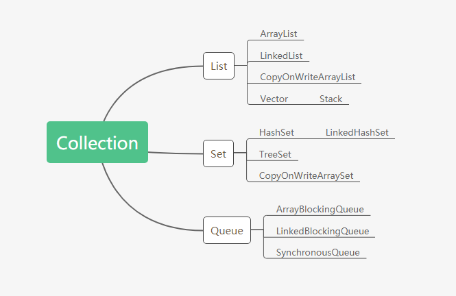

[容器层级图](#容器层级图)

[Collection](#Collection)

- [List](#List)
    - [ArrayList](#ArrayList)
    - [LinkedList](#LinkedList)
    - [CopyOnWriteArrayList](#CopyOnWriteArrayList)
    - [Vector](#Vector)
    - [Stack](#Stack)
- [Set](#Set)
    - [HashSet](#HashSet)
    - [LinkedHashSet](#LinkedHashSet)
    - [TreeSet](#TreeSet)
    - [CopyOnWriteArraySet](#CopyOnWriteArraySet)
    
- [Queue](#Queue)
    - [ArrayBlockingQueue](#ArrayBlockingQueue)
    - [LinkedBlockingQueue](#LinkedBlockingQueue)
    - [SynchronousQueue](#SynchronousQueue)

[Map](#Map)

- [红黑树](#红黑树)

- [HashMap](#HashMap)
- [LinkedHashMap](#LinkedHashMap)
- [ConcurrentHashMap](#ConcurrentHashMap)
- [TreeMap](#TreeMap)
- [Hashtable](#Hashtable)

### 容器层级图



### Collection

#### List

- ##### ArrayList

    - 线程安全

        - 不是线程安全的

    - 底层数据结构

        - 采用Object数组存储数据

            ```java
            transient Object[] elementData;
            
            //添加元素
            public boolean add(E e) {
                    ensureCapacityInternal(size + 1);  // Increments modCount!!
                    elementData[size++] = e;
                    return true;
                }
            ```

    - 元素是否有序

        - 有序

    - 是否支持快速随机访问

        - 是。它实现了RandomAccess接口，具备快速随机访问的能力。**遍历采用for循环效率更高**

            ```java
            public class ArrayList<E> extends AbstractList<E>
                    implements List<E>, RandomAccess, Cloneable, java.io.Serializable
            ```

    - 扩容机制

        - 我们在初始化ArrayList的时候，如果不指定容量大小，那么默认是10。我们不停的往ArrayList里面添加元素，**当元素的个数大于ArrayList容量，那么ArrayList会进行扩容,新的容量是原来的1.5倍.**

            ```java
            //扩容代码
            private void grow(int minCapacity) {
                    // overflow-conscious code
                    int oldCapacity = elementData.length;
                    int newCapacity = oldCapacity + (oldCapacity >> 1);
                    if (newCapacity - minCapacity < 0)
                        newCapacity = minCapacity;
                    if (newCapacity - MAX_ARRAY_SIZE > 0)
                        newCapacity = hugeCapacity(minCapacity);
                    // minCapacity is usually close to size, so this is a win:
                    elementData = Arrays.copyOf(elementData, newCapacity);
                }
            ```

    - 适用场景

        - 不适合：对于越靠近前面元素添加或者删除操作,ArrayList效率较低,不适合，因为要挪动大量元素，效率降低。

        - 适合：通过下标获取元素

            ```java
            public E get(int index) {
                rangeCheck(index);
            
                return elementData(index);
            }
            E elementData(int index) {
                    return (E) elementData[index];
                }
            ```

    

- ##### LinkedList

    - 线程安全

        - 不是

    - 底层数据结构

        - 双向链表

            ```java
            public class LinkedList<E>
                extends AbstractSequentialList<E>
                implements List<E>, Deque<E>, Cloneable, java.io.Serializable
            {
                transient int size = 0;
            
                /**
                 * Pointer to first node.
                 * Invariant: (first == null && last == null) ||
                 *            (first.prev == null && first.item != null)
                 */
            	//指向头部
                transient Node<E> first;
            
                /**
                 * Pointer to last node.
                 * Invariant: (first == null && last == null) ||
                 *            (last.next == null && last.item != null)
                 */
                //指向尾部
                transient Node<E> last;
            }
            ```

    - 元素是否有序

        - 是

    - 使用场景

        - 适合：频繁增删的场景

        - 不适合：不适合遍历的场景，**遍历的时候先根据下标值判断数据在左边还是右边，再决定从头还是尾部进行遍历。 **

            ```java
            //遍历元素
            public E get(int index) {
                checkElementIndex(index);
                return node(index).item;
            }
            
            Node<E> node(int index) {
                    // assert isElementIndex(index);
            
                    if (index < (size >> 1)) {
                        Node<E> x = first;
                        for (int i = 0; i < index; i++)
                            x = x.next; //从头遍历
                        return x;
                    } else {
                        Node<E> x = last;
                        for (int i = size - 1; i > index; i--)
                            x = x.prev; //从尾部遍历
                        return x;
                    }
                }
            ```

    - 遍历：由于没有实现RandomAccess接口，因此采用迭代器iterator循环效率更高。

- ##### CopyOnWriteArrayList

    - 线程安全

        - 是，写的时候加锁，读不加锁。

            ```java
            //添加元素
            public boolean add(E e) {
                final ReentrantLock lock = this.lock;
                lock.lock();
                try {
                    Object[] elements = getArray();
                    int len = elements.length;
                    Object[] newElements = Arrays.copyOf(elements, len + 1);
                    newElements[len] = e;
                    setArray(newElements);
                    return true;
                } finally {
                    lock.unlock();
                }
            }
            
            /**
                 * {@inheritDoc}
                 *
                 * @throws IndexOutOfBoundsException {@inheritDoc}
                 */
            	//通过index读取数据
                public E get(int index) {
                    return get(getArray(), index);
                }
            /**
                 * Gets the array.  Non-private so as to also be accessible
                 * from CopyOnWriteArraySet class.
                 */
                final Object[] getArray() {
                    return array;
                }
            
             	private E get(Object[] a, int index) {
                    return (E) a[index];
                }
            ```

            

    - 底层数据结构

        - 采用volatile Object数组存储数据

            ```java
            /** The array, accessed only via getArray/setArray. */
            private transient volatile Object[] array;
            ```

    - 引入原因

        - ArrayList不是线程安全的，但是使用Vector锁的粒度太大，同样使用Collections.synchronizedList方法，锁定粒度也太大了。因此引入了CopyOnWriteArrayList。

    - 工作原理

        - 添加元素：通过ReentrantLock加锁，采用COW设计理念，创建一个副本出来，新添加的元素先设置到副本里面，当添加完之后再把原来的引用指向副本。这样就实现了元素的添加。
            - 优点：在并发情况下，**由于读操作没有加锁，那么其他线程可以读取原来数组里面的内容。不会出现并发修改异常**。
            - 缺点：它能够保持数据最终一致性，**但是不能够保证数据的实时性一致性**。由于采用了COW设计思想，会开辟新的内存区域来存放副本内容，增加了**内存开销**。

- ##### Vector

    - 线程安全

        - 是的，所有的方法都加了synchronized关键字，锁的粒度太大。

    - 底层数据结构

        - Object[]

            ```java
            protected Object[] elementData;
            ```

    - 扩容

        - 如果不指定容量大小，默认是10。当往Vector里面添加元素超过了其容量，那么会进行扩容，如果没有指定它的一个增量，那么默认是新的容量是原来的两倍。如果指定了增量，那么新的容量= oldCapacity + capacityIncrement.

            ```java
            //在初始化Vector的时候，看你是否指定了其增量capacityIncrement
            public Vector(int initialCapacity, int capacityIncrement) {
                super();
                if (initialCapacity < 0)
                    throw new IllegalArgumentException("Illegal Capacity: "+
                                                       initialCapacity);
                this.elementData = new Object[initialCapacity];
                this.capacityIncrement = capacityIncrement;
            }
            
            //扩容
            private void grow(int minCapacity) {
                    // overflow-conscious code
                    int oldCapacity = elementData.length;
                    int newCapacity = oldCapacity + ((capacityIncrement > 0) ?
                                                     capacityIncrement : oldCapacity);
                    if (newCapacity - minCapacity < 0)
                        newCapacity = minCapacity;
                    if (newCapacity - MAX_ARRAY_SIZE > 0)
                        newCapacity = hugeCapacity(minCapacity);
                    elementData = Arrays.copyOf(elementData, newCapacity);
                }
            ```

    - 弃用原因

        - Vector JDK1.0就引入了，老容器了。由于**所有方法都需要加锁，性能太低**。
        - 相比于ArrayList，扩容的时候，如果没有为Vector指定增量，那么新的容量会是原来的2倍，而ArrayList是原来的1.5倍。也就是占用**内存空间会比ArrayList大**。

##### Stack

- 线程安全

    - 是的，添加/删除/获取元素操作全都加了Synchronized关键字，因此是线程的的

- 底层数据结构

    - Object[]数组

        ```JAVA
        //用的Vector的数组存储数据
        protected Object[] elementData;
        ```

- 常用方法

    - push(E item)：添加元素，用的父类的添加元素方法

    - pop()：弹出并移除栈顶元素。

        ```java
        public synchronized E pop() {
            E       obj;
            int     len = size();
        
            obj = peek();
            removeElementAt(len - 1);
        
            return obj;
        }
        
        public synchronized void removeElementAt(int index) {
                modCount++;
                if (index >= elementCount) {
                    throw new ArrayIndexOutOfBoundsException(index + " >= " +
                                                             elementCount);
                }
                else if (index < 0) {
                    throw new ArrayIndexOutOfBoundsException(index);
                }
                int j = elementCount - index - 1;
                if (j > 0) {
                    System.arraycopy(elementData, index + 1, elementData, index, j);
                }
                elementCount--;
                elementData[elementCount] = null; /* to let gc do its work */
            }
        ```

    - peek()：获取栈顶元素

    - empty()：判断栈是否为空

- 扩容

    - 当元素个数超过其容量，那么新容量会是原来的两倍。


#### Set

- ##### HashSet

    - 线程安全

        - 不是线程安全的

    - 底层数据结构

        - 其实就是调用的HashMap进行操作

    - 是否有序

        - 否，底层采用的是hash散列表存储数据，因此数据不是有序的。

    - **对象如何去重的**

        - 两个相同的对象必定hashCode相同。在往HashSet里面添加元素的时候，首先会去判断该元素的hashCode值是否和已有元素的hashCode值相同，**如果相同，再比较key是否一样，如果key也一样，那么会用旧的引用覆盖新的引用，从而达到了去重的效果。**

        ```java
        static class Node<K,V> implements Map.Entry<K,V> {
                final int hash;
                final K key;
                V value;
                Node<K,V> next;
        
                Node(int hash, K key, V value, Node<K,V> next) {
                    this.hash = hash;
                    this.key = key;
                    this.value = value;
                    this.next = next;
                }
        
                public final K getKey()        { return key; }
                public final V getValue()      { return value; }
                public final String toString() { return key + "=" + value; }
        
                public final int hashCode() {
                    return Objects.hashCode(key) ^ Objects.hashCode(value);
                }
        
                public final V setValue(V newValue) {
                    V oldValue = value;
                    value = newValue;
                    return oldValue;
                }
        
                public final boolean equals(Object o) {
                    if (o == this)
                        return true;
                    if (o instanceof Map.Entry) {
                        Map.Entry<?,?> e = (Map.Entry<?,?>)o;
                        if (Objects.equals(key, e.getKey()) &&
                            Objects.equals(value, e.getValue()))
                            return true;
                    }
                    return false;
                }
            }
        
        transient Node<K,V>[] table;
        
        public boolean add(E e) {
            return map.put(e, PRESENT)==null;
        }
        
        public V put(K key, V value) {
                return putVal(hash(key), key, value, false, true);
        }
        
        final V putVal(int hash, K key, V value, boolean onlyIfAbsent,
                           boolean evict) {
                Node<K,V>[] tab; Node<K,V> p; int n, i;
                if ((tab = table) == null || (n = tab.length) == 0)
                    n = (tab = resize()).length;
            	//从数组里面拿出一个结点，看该结点是否为空，如果为空，那么就新创建一个结点
                if ((p = tab[i = (n - 1) & hash]) == null)
                    tab[i] = newNode(hash, key, value, null);
                else {
                    Node<K,V> e; K k;
                    //判断结点的hashCode值和新添加的hashCode值是否相同
                    //hashCode值如果相同，在判断key是否相同；key也相同那么就旧值覆盖新值
                    if (p.hash == hash &&
                        ((k = p.key) == key || (key != null && key.equals(k))))
                        e = p;
                    else if (p instanceof TreeNode)
                        e = ((TreeNode<K,V>)p).putTreeVal(this, tab, hash, key, value);
                    else {
                        for (int binCount = 0; ; ++binCount) {
                            if ((e = p.next) == null) {
                                p.next = newNode(hash, key, value, null);
                                if (binCount >= TREEIFY_THRESHOLD - 1) // -1 for 1st
                                    treeifyBin(tab, hash);
                                break;
                            }
                            if (e.hash == hash &&
                                ((k = e.key) == key || (key != null && key.equals(k))))
                                break;
                            p = e;
                        }
                    }
                    if (e != null) { // existing mapping for key
                        V oldValue = e.value;
                        if (!onlyIfAbsent || oldValue == null)
                            e.value = value;
                        afterNodeAccess(e);
                        return oldValue;
                    }
                }
                ++modCount;
                if (++size > threshold)
                    resize();
                afterNodeInsertion(evict);
                return null;
            }
        ```

        

    - HashSet与HashMap的区别

        - HashMap存储键值对，而HashSet存放的是对象

- ##### LinkedHashSet

    - 线程安全

        - 否

    - 底层数据结构

        - 它集成自HashSet，使用LinkedHashMap来实现的，当然LinkedHashMap又继承自HashMap。

            ```java
            //默认初始化容量是16，加载因子是0.75
            public LinkedHashSet() {
                super(16, .75f, true);
            }
            
            HashSet(int initialCapacity, float loadFactor, boolean dummy) {
                    map = new LinkedHashMap<>(initialCapacity, loadFactor);
                }
            ```

    - 如何做到元素有序
      
        - 具体的参考LinkedHashMap如何实现元素有序的

- ##### TreeSet

    - 线程安全
        - 否
    - 底层数据结构
        - [TreeMap](#TreeMap)

- ##### CopyOnWriteArraySet

    - 底层结构：**底层调用CopyonWriteArrayList来实现的**

    - 如何去重

        - 会把当前值或者对象在数组里面查找，看是否有相同的元素，是否equals，如果equals那么添加失败。

            ```java
            public boolean add(E e) {
                return this.al.addIfAbsent(e);
            }
            
            public boolean addIfAbsent(E e) {
                    Object[] snapshot = this.getArray();
                    return indexOf(e, snapshot, 0, snapshot.length) >= 0 ? false : this.addIfAbsent(e, snapshot);
                }
                
                 private static int indexOf(Object o, Object[] elements, int index, int fence) {
                    int i;
                    if (o == null) {
                    	//遍历数组
                        for(i = index; i < fence; ++i) {
                            if (elements[i] == null) {
                                return i;
                            }
                        }
                    } else {
                    	//遍历数组
                        for(i = index; i < fence; ++i) {
                            if (o.equals(elements[i])) {
                                return i;
                            }
                        }
                    }
            
                    return -1;
                }
            ```

#### Queue

- ##### ArrayBlockingQueue

    - 线程安全

        - 是，采用ReetrantLock保证并发安全

    - 底层数据结构

        - 有界阻塞队列，数组存储元素

    - 公平访问队列

        - 构造器传入队列容量和true，那么可以构造出ReentrantLock是公平锁。先阻塞的生产者或者消费者可以先处理任务。

            ```java
            public ArrayBlockingQueue(int capacity, boolean fair) {
                this.itrs = null;
                if (capacity <= 0) {
                    throw new IllegalArgumentException();
                } else {
                    this.items = new Object[capacity];
                    this.lock = new ReentrantLock(fair);
                    this.notEmpty = this.lock.newCondition();
                    this.notFull = this.lock.newCondition();
                }
            }
            ```

    - 4组API

        | 方式           | 抛出异常 | 有返回值，不抛出异常 | 阻塞等待 | 超时等待                                   |
        | -------------- | -------- | -------------------- | -------- | ------------------------------------------ |
        | 添加           | add      | offer                | put      | offer(E element, long time, TImeUnit unit) |
        | 移除           | remove   | poll                 | take     | poll(long time, TimeUnit unit)             |
        | 获取队列首元素 | element  | peek                 |          |                                            |
        
        - **线程是否等待**意思是获取到锁，容量满了会或者没有数据消费了，需要等待其他线程消费数据或者放入数据，再进行相应的操作。

    - ArrayBlockingQueue缺点
        - 初始化时，容量指定，接下来不可再调整容量大小。
        - 生产者如果生产速度大于消费者消费速度，那么会有大量的生产者线程阻塞。

- ##### LinkedBlockingQueue

    - 线程安全

        - 是

    - 底层数据结构

        - 单链表

            ```java
            //存储结构
            static class Node<E> {
                E item;
                LinkedBlockingQueue.Node<E> next;
            
                Node(E x) {
                    this.item = x;
                }
            }
            ```

    | 方式           | 抛出异常 | 有返回值，不抛出异常 | 阻塞等待 | 超时等待                                   |
    | -------------- | -------- | -------------------- | -------- | ------------------------------------------ |
    | 添加           | add      | offer                | put      | offer(E element, long time, TImeUnit unit) |
    | 移除           | remove   | poll                 | take     | poll(long time, TimeUnit unit)             |
    | 获取队列首元素 | element  | peek                 |          |                                            |

- ##### SynchronousQueue

    - 作用

        - 不存储元素的阻塞队列，每当往同步队列里面放置元素，必须得有一个消费者去消费数据，不然会一直阻塞。

    - 实现策略

        - 公平模式

            - TransferQueue来实现，队尾添加阻塞的线程，队头出队，先进先出，体现公平原则。

                ```java
                static final class TransferQueue<E> extends SynchronousQueue.Transferer<E> {
                    //链表，有头指针和尾指针，新线程添加在尾部
                    transient volatile SynchronousQueue.TransferQueue.QNode head;
                    transient volatile SynchronousQueue.TransferQueue.QNode tail;
                    transient volatile SynchronousQueue.TransferQueue.QNode cleanMe;
                    private static final Unsafe UNSAFE;
                    private static final long headOffset;
                    private static final long tailOffset;
                    private static final long cleanMeOffset;
                }
                
                static final class QNode {
                    		
                            volatile SynchronousQueue.TransferQueue.QNode next;
                			//线程携带的数据
                    		volatile Object item;
                			//线程
                            volatile Thread waiter;
                            final boolean isData;
                            private static final Unsafe UNSAFE;
                            private static final long itemOffset;
                            private static final long nextOffset;
                }
                ```

        - 非公平模式

            - TransferStack实现，栈的结构，先进后出。体现不公平策略。

                ```java
                static final class TransferStack<E> extends SynchronousQueue.Transferer<E> {
                    static final int REQUEST = 0;
                    static final int DATA = 1;
                    static final int FULFILLING = 2;
                    //只有一个头指针
                    volatile SynchronousQueue.TransferStack.SNode head;
                    private static final Unsafe UNSAFE;
                    private static final long headOffset;
                }
                ```

    - 应用场景

        - 线程池中newCachedThreadPool用到。

            ```java
            public static ExecutorService newCachedThreadPool() {
                return new ThreadPoolExecutor(0, Integer.MAX_VALUE,
                                              60L, TimeUnit.SECONDS,
                                              new SynchronousQueue<Runnable>());
            }
            ```

            

### Map

##### 红黑树

- 特点

    - 结点非黑即红

    - 根结点是黑色

    - 如果结点是红色的并且该红色结点下面有孩子，那么其子结点一定是黑色

    - 根结点到叶节点的每条路径，其黑色结点数量一定相同。

        

- 插入元素源码解析

    ```java
    public V put(K key, V value) {
        Entry<K,V> t = root;
        //如果根结点为空，那么直接插入元素
        if (t == null) {
            compare(key, key); // type (and possibly null) check
    
            root = new Entry<>(key, value, null);
            size = 1;
            modCount++;
            return null;
        }
        int cmp;
        Entry<K,V> parent;
        // split comparator and comparable paths
        Comparator<? super K> cpr = comparator;
        if (cpr != null) {
            do {
                parent = t;
                //传入的key和二叉树里面key比较
                cmp = cpr.compare(key, t.key);
                //key小于t.key 则往左遍历，直到没有左孩子结点
                if (cmp < 0)
                    t = t.left;
                //key大于t.key 则往右遍历，直到没有右孩子结点
                else if (cmp > 0)
                    t = t.right;
                else
                    //key相同，则更新value值
                    return t.setValue(value);
            } while (t != null);
        }
        else {
            if (key == null)
                throw new NullPointerException();
            @SuppressWarnings("unchecked")
                Comparable<? super K> k = (Comparable<? super K>) key;
            do {
                parent = t;
                cmp = k.compareTo(t.key);
                if (cmp < 0)
                    t = t.left;
                else if (cmp > 0)
                    t = t.right;
                else
                    return t.setValue(value);
            } while (t != null);
        }
        //插入新结点，看是放在左边还是右边
        Entry<K,V> e = new Entry<>(key, value, parent);
        if (cmp < 0)
            parent.left = e;
        else
            parent.right = e;
        fixAfterInsertion(e);
        size++;
        modCount++;
        return null;
    }
    ```

- 有了二叉查找树，平衡二叉树(AVL)为啥还需要红黑树
    - 因为二叉查找树在极端情况下肯能会构造成链表的结构，查询的时间复杂度为O(n)
    - 平衡二叉树是为了解决二叉查找树退化成链表的情况
    - **有了平衡二叉树为啥还需要红黑树：平衡二叉树由于需要保证所有结点的平衡性，那么在插入结点的时候如果平衡性被打破，那么需要调整的结点比红黑树更多，效率降低了。因此引入了红黑树。**
- 红黑树应用
    - [HashMap](#HashMap)
    - [TreeMap](#TreeMap)
- 遍历的时间复杂度
  
    - O(logN)

##### HashMap

- 线程安全

    - 否

- 版本差别

    - JDK1.7及以前

        - 数据结构：数组+链表

        - 插入方式：头插法

        - 存在问题：并发情况下可能链表成环

        - 时间复杂度：O(n)

            ```java
            public V put(K key, V value) {
                if (table == EMPTY_TABLE) {
                    inflateTable(threshold);
                }
                if (key == null)
                    return putForNullKey(value);
                int hash = hash(key);
                int i = indexFor(hash, table.length);
                //得到table数组所在i位置的元素，遍历i元素所在链表所有元素
                //查看传入的key是否已经存在于链表中，如果存在，则替换key所对应的value值，不做插入操作
                for (Entry<K,V> e = table[i]; e != null; e = e.next) {
                    Object k;
                    if (e.hash == hash && ((k = e.key) == key || key.equals(k))) {
                        V oldValue = e.value;
                        e.value = value;
                        e.recordAccess(this);
                        return oldValue;
                    }
                }
            
                modCount++;
                addEntry(hash, key, value, i);
                return null;
            }
            
            void addEntry(int hash, K key, V value, int bucketIndex) {
                    if ((size >= threshold) && (null != table[bucketIndex])) {
                        resize(2 * table.length);
                        hash = (null != key) ? hash(key) : 0;
                        bucketIndex = indexFor(hash, table.length);
                    }
            
                    createEntry(hash, key, value, bucketIndex);
                }
            
            //第bucketIndex元素和新创建的元素调换一下位置，也就是头插法插入元素
            void createEntry(int hash, K key, V value, int bucketIndex) {
                    Entry<K,V> e = table[bucketIndex];
                	//头插法插入元素
                    table[bucketIndex] = new Entry<>(hash, key, value, e);
                    size++;
                }
            
            void resize(int newCapacity) {
                    Entry[] oldTable = table;
                    int oldCapacity = oldTable.length;
                    if (oldCapacity == MAXIMUM_CAPACITY) {
                        threshold = Integer.MAX_VALUE;
                        return;
                    }
            
                    Entry[] newTable = new Entry[newCapacity];
                    transfer(newTable, initHashSeedAsNeeded(newCapacity));
                    table = newTable;
                    threshold = (int)Math.min(newCapacity * loadFactor, MAXIMUM_CAPACITY + 1);
                }
            
            /**
                 * Transfers all entries from current table to newTable.
                 */
                void transfer(Entry[] newTable, boolean rehash) {
                    int newCapacity = newTable.length;
                    for (Entry<K,V> e : table) {
                        while(null != e) {
                            //多线程竞争插入元素的情况下，可能会造成链表成环
                            Entry<K,V> next = e.next;
                            if (rehash) {
                                e.hash = null == e.key ? 0 : hash(e.key);
                            }
                            int i = indexFor(e.hash, newCapacity);
                            e.next = newTable[i];
                            newTable[i] = e;
                            e = next;
                        }
                    }
                
            ```

    - JDK1.8及以后

        - 数据结构：数组+链表+红黑树

        - 时间复杂度：O(logN)

            ```java
            public V put(K key, V value) {
                return this.putVal(hash(key), key, value, false, true);
            }
            
            final V putVal(int hash, K key, V value, boolean onlyIfAbsent, boolean evict) {
                HashMap.Node[] tab;
                int n;
                if ((tab = this.table) == null || (n = tab.length) == 0) {
                    n = (tab = this.resize()).length;
                }
            
                Object p;
                int i;
                if ((p = tab[i = n - 1 & hash]) == null) {
                    tab[i] = this.newNode(hash, key, value, (HashMap.Node)null);
                } else {
                    Object e;
                    Object k;
                    if (((HashMap.Node)p).hash == hash && ((k = ((HashMap.Node)p).key) == key || key != null && key.equals(k))) {
                        //e指向旧结点
                        e = p;
                    } else if (p instanceof HashMap.TreeNode) {
                        e = ((HashMap.TreeNode)p).putTreeVal(this, tab, hash, key, value);
                    } else {
                        int binCount = 0;
            
                        while(true) {
                            if ((e = ((HashMap.Node)p).next) == null) {
                                ((HashMap.Node)p).next = this.newNode(hash, key, value, (HashMap.Node)null);
                                if (binCount >= 7) {
                                    this.treeifyBin(tab, hash);
                                }
                                break;
                            }
            
                            if (((HashMap.Node)e).hash == hash && ((k = ((HashMap.Node)e).key) == key || key != null && key.equals(k))) {
                                break;
                            }
            
                            p = e;
                            ++binCount;
                        }
                    }
            		//e存在
                    if (e != null) {
                        V oldValue = ((HashMap.Node)e).value;
                        if (!onlyIfAbsent || oldValue == null) {
                            //用传入的新value替换掉旧结点的值
                            ((HashMap.Node)e).value = value;
                        }
            
                        this.afterNodeAccess((HashMap.Node)e);
                        return oldValue;
                    }
                }
            
                ++this.modCount;
                if (++this.size > this.threshold) {
                    this.resize();
                }
            
                this.afterNodeInsertion(evict);
                return null;
            }
            ```

- 如何去重

    - 往HashMap中添加键值对，通过key计算出hashCode，通过hashCode定位到元素所在hash表中的具体位置，如果该位置已经有元素存在，那么再去判断key值是否equals，如果key也相同，那么用新的元素的value替换掉原来的元素。

- 扩容：

    - 在初始化HashMap的时候，如果没有指定其容量大小，那么默认是**16**。如果添加元素的个数超过其**阈值(默认是3/4)**，那么会进行扩容，**新的容量是原来容量的2倍**。因此，如果需要大量添加数据，我们最好指定其容量大小，这样的话可以避免频繁扩容所带来的频繁开销。

- JDK1.7存在的问题怎么解决的

    - **在扩容的过程中，并且是在多线程并发插入数据的情况下，可能出现链表成环的情况，因此下一次get数据的时候会发生死循环的情况。**
    - 如何解决：**JDK1.8采用尾插法解决链表成环的问题，但是由于插入操作并不具备原子性，因此存在数据丢失的风险。**

##### LinkedHashMap

- 是否安全

    - 否

- 底层数据结构

    - **继承自HashMap，底层逻辑通过HashMap来实现的。**

- 元素是否有序

    - 是

- 如何保证元素有序

    - 添加元素的时候，底层调用的是HashMap的put方法，当添加的元素不在HashMap里面的时候，会创建一个新的结点，newNode方法。该方法被LinkedHashMap重写了，新结点会加入到双向链表的尾部，从而保证了链表数据的有序性。

        ```java
        Node<K,V> newNode(int hash, K key, V value, Node<K,V> e) {
            LinkedHashMap.Entry<K,V> p =
                new LinkedHashMap.Entry<K,V>(hash, key, value, e);
            linkNodeLast(p);
            return p;
        }
        
        // link at the end of list
            private void linkNodeLast(LinkedHashMap.Entry<K,V> p) {
                LinkedHashMap.Entry<K,V> last = tail;
                tail = p;
                if (last == null)
                    head = p;
                else {
                    p.before = last;
                    last.after = p;
                }
            }
        ```

##### ConcurrentHashMap

- JDK版本

    - JDK1.7

        - 线程安全
            - 是
        - 底层数据结构：Segment数组+HashEntry
        - 高并发如何保证：分段锁的设计思想。插入元素的过程中，会通过其key定位到某个Segment，也就是只会锁在当前Segment，其他线程插入数据到其他的Segment，插入操作并不会被阻塞。从而提高了并发访问的效率。

        

        ```java
        public V put(K key, V value) {
            	//采用分段锁来控制并发
                Segment<K,V> s;
                if (value == null)
                    throw new NullPointerException();
                int hash = hash(key);
                int j = (hash >>> segmentShift) & segmentMask;
                if ((s = (Segment<K,V>)UNSAFE.getObject          // nonvolatile; recheck
                     (segments, (j << SSHIFT) + SBASE)) == null) //  in ensureSegment
                    s = ensureSegment(j);
                return s.put(key, hash, value, false);
            }
            
            final V put(K key, int hash, V value, boolean onlyIfAbsent) {
                    HashEntry<K,V> node = tryLock() ? null :
                        scanAndLockForPut(key, hash, value);
                    V oldValue;
                    try {
                        HashEntry<K,V>[] tab = table;
                        int index = (tab.length - 1) & hash;
                        HashEntry<K,V> first = entryAt(tab, index);
                        for (HashEntry<K,V> e = first;;) {
                            if (e != null) {
                                K k;
                                if ((k = e.key) == key ||
                                    (e.hash == hash && key.equals(k))) {
                                    oldValue = e.value;
                                    if (!onlyIfAbsent) {
                                        e.value = value;
                                        ++modCount;
                                    }
                                    break;
                                }
                                e = e.next;
                            }
                            else {
                                if (node != null)
                                    node.setNext(first);
                                else
                                    node = new HashEntry<K,V>(hash, key, value, first);
                                int c = count + 1;
                                if (c > threshold && tab.length < MAXIMUM_CAPACITY)
                                    rehash(node);
                                else
                                    setEntryAt(tab, index, node);
                                ++modCount;
                                count = c;
                                oldValue = null;
                                break;
                            }
                        }
                    } finally {
                        unlock();
                    }
                    return oldValue;
                }
        
        public V get(Object key) {
                Segment<K,V> s; // manually integrate access methods to reduce overhead
                HashEntry<K,V>[] tab;
                int h = hash(key);
                long u = (((h >>> segmentShift) & segmentMask) << SSHIFT) + SBASE;
                if ((s = (Segment<K,V>)UNSAFE.getObjectVolatile(segments, u)) != null &&
                    (tab = s.table) != null) {
                    for (HashEntry<K,V> e = (HashEntry<K,V>) UNSAFE.getObjectVolatile
                             (tab, ((long)(((tab.length - 1) & h)) << TSHIFT) + TBASE);
                         e != null; e = e.next) {
                        K k;
                        if ((k = e.key) == key || (e.hash == h && key.equals(k)))
                            return e.value;
                    }
                }
                return null;
            }
        ```

        - 并发度：默认是16

        - put操作流程：

            - 尝试获取锁，如果没有获取到锁那么就自旋获取锁，如果说达到指定次数之后（多核处理器是自旋64次，如果单核的话就自旋1次），还没有获取到锁当前线程就会阻塞。获取到锁就会执行插入元素操作。

        - get操作：

            - 通过key定位到具体的Segment，再通过一次hash就可以地位到具体元素。**get操作效率很高，因为它不需要加锁**

    - JDK1.8

        - 摒弃了分段锁的设计思想，采用了CAS和Synchronized来控制并发。

        - 底层数据结构：数组+链表+红黑树

        - **为什么要摒弃分段锁**

            - 分段会内存不连续，内存碎片化，浪费了内存空间
            - 锁粒度更小，**JDK1.7要锁住某个Segment，而JDK1.8只需要锁住单个结点，提高了并发访问效率。**

        - **为什么用Synchronized而不采用JDK1.7里面的ReentrantLock**

            - ​	JDK1.6以后对Synchronized进行了优化，引入了偏向锁，轻量级锁，自旋锁，锁粗化，锁消除等等优化技术对JVM锁进行了优化，大大提高了Synchronized锁的效率。

                ```java
                final V putVal(K key, V value, boolean onlyIfAbsent) {
                    if (key != null && value != null) {
                        int hash = spread(key.hashCode());
                        int binCount = 0;
                        ConcurrentHashMap.Node[] tab = this.table;
                
                        while(true) {
                            int n;
                            while(tab == null || (n = tab.length) == 0) {
                                tab = this.initTable();
                            }
                
                            ConcurrentHashMap.Node f;
                            int i;
                            if ((f = tabAt(tab, i = n - 1 & hash)) == null) {
                                if (casTabAt(tab, i, (ConcurrentHashMap.Node)null, new ConcurrentHashMap.Node(hash, key, value, (ConcurrentHashMap.Node)null))) {
                                    break;
                                }
                            } else {
                                int fh;
                                if ((fh = f.hash) == -1) {
                                    tab = this.helpTransfer(tab, f);
                                } else {
                                    V oldVal = null;
                                    synchronized(f) {
                                        if (tabAt(tab, i) == f) {
                                            if (fh < 0) {
                                                if (f instanceof ConcurrentHashMap.TreeBin) {
                                                    binCount = 2;
                                                    ConcurrentHashMap.TreeNode p;
                                                    if ((p = ((ConcurrentHashMap.TreeBin)f).putTreeVal(hash, key, value)) != null) {
                                                        oldVal = p.val;
                                                        if (!onlyIfAbsent) {
                                                            p.val = value;
                                                        }
                                                    }
                                                }
                                            } else {
                                                label103: {
                                                    binCount = 1;
                
                                                    ConcurrentHashMap.Node e;
                                                    Object ek;
                                                    for(e = f; e.hash != hash || (ek = e.key) != key && (ek == null || !key.equals(ek)); ++binCount) {
                                                        ConcurrentHashMap.Node<K, V> pred = e;
                                                        if ((e = e.next) == null) {
                                                            pred.next = new ConcurrentHashMap.Node(hash, key, value, (ConcurrentHashMap.Node)null);
                                                            break label103;
                                                        }
                                                    }
                
                                                    oldVal = e.val;
                                                    if (!onlyIfAbsent) {
                                                        e.val = value;
                                                    }
                                                }
                                            }
                                        }
                                    }
                
                                    if (binCount != 0) {
                                        if (binCount >= 8) {
                                            this.treeifyBin(tab, i);
                                        }
                
                                        if (oldVal != null) {
                                            return oldVal;
                                        }
                                        break;
                                    }
                                }
                            }
                        }
                
                        this.addCount(1L, binCount);
                        return null;
                    } else {
                        throw new NullPointerException();
                    }
                }
                ```

##### TreeMap

- 线程安全

    - 否

- 底层数据结构

    - [红黑树](#红黑树)

        ```java
        public V put(K key, V value) {
            TreeMap.Entry<K, V> t = this.root;
            if (t == null) {
                this.compare(key, key);
                this.root = new TreeMap.Entry(key, value, (TreeMap.Entry)null);
                this.size = 1;
                ++this.modCount;
                return null;
            } else {
                Comparator<? super K> cpr = this.comparator;
                int cmp;
                TreeMap.Entry parent;
                if (cpr != null) {
                    do {
                        parent = t;
                        cmp = cpr.compare(key, t.key);
                        if (cmp < 0) {
                            t = t.left;
                        } else {
                            if (cmp <= 0) {
                                return t.setValue(value);
                            }
        
                            t = t.right;
                        }
                    } while(t != null);
                } else {
                    if (key == null) {
                        throw new NullPointerException();
                    }
        
                    Comparable k = (Comparable)key;
        
                    do {
                        parent = t;
                        cmp = k.compareTo(t.key);
                        if (cmp < 0) {
                            t = t.left;
                        } else {
                            if (cmp <= 0) {
                                return t.setValue(value);
                            }
        
                            t = t.right;
                        }
                    } while(t != null);
                }
        
                TreeMap.Entry<K, V> e = new TreeMap.Entry(key, value, parent);
                if (cmp < 0) {
                    parent.left = e;
                } else {
                    parent.right = e;
                }
        
                this.fixAfterInsertion(e);
                ++this.size;
                ++this.modCount;
                return null;
            }
        ```

##### Hashtable

- 线程安全

    - 是

- 底层数据结构

    - 数组+链表

        ```java
        public synchronized V put(K key, V value) {
            if (value == null) {
                throw new NullPointerException();
            } else {
                Hashtable.Entry<?, ?>[] tab = this.table;
                int hash = key.hashCode();
                int index = (hash & 2147483647) % tab.length;
        		//通过索引找到entry,再查看entry是否构建成了链表
                for(Hashtable.Entry entry = tab[index]; entry != null; entry = entry.next) {
                	//如果是的话，那么遍历链表元素,用新值替换旧值
                    if (entry.hash == hash && entry.key.equals(key)) {
                        V old = entry.value;
                        entry.value = value;
                        return old;
                    }
                }
        
                this.addEntry(hash, key, value, index);
                return null;
            }
        }
        
        //添加结点
        private void addEntry(int hash, K key, V value, int index) {
                ++this.modCount;
                Hashtable.Entry<?, ?>[] tab = this.table;
                if (this.count >= this.threshold) {
                    this.rehash();
                    tab = this.table;
                    hash = key.hashCode();
                    index = (hash & 2147483647) % tab.length;
                }
        
                Hashtable.Entry<K, V> e = tab[index];
                tab[index] = new Hashtable.Entry(hash, key, value, e);
                ++this.count;
            }
        ```

- 对null支持
    
- key/value都不支持，会报空指针异常
    
- 扩容
    
    - **默认容量是11，加载因子是3/4,当插入数据达到其阈值，会进行扩容，新容量是原来的2n+1.**
- 为啥摒弃了Hashtable
    
    - 由于它的CRUD操作都是同步的，效率低下，如果要同步添加元素可以使用ConcurrentHashMap，如果不需要同步，那么使用HashMap