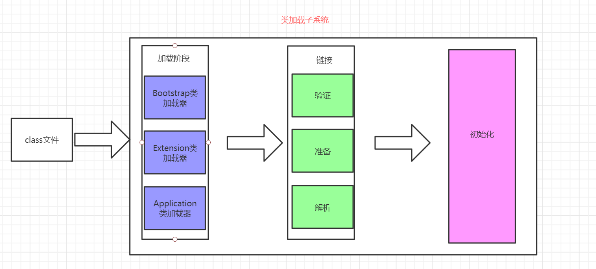
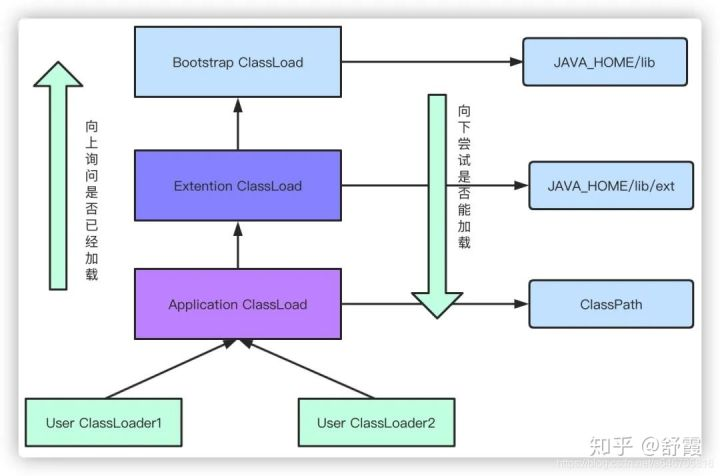
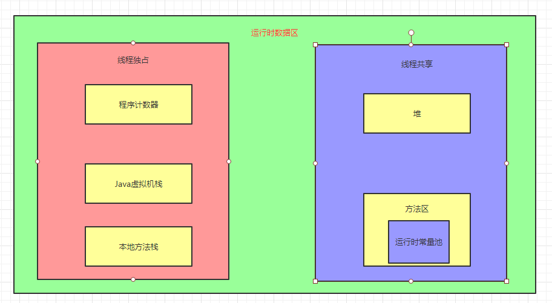

### JVM

- [JVM内存模型](#JVM内存模型)
    - 堆
    - 方法区
    - 栈
    - 程序计数器
- [JVM类加载机制](#JVM类加载机制)
    - [类加载过程](#类加载过程)
    - [类加载器](#类加载器)
    - [双亲委派模型](#双亲委派模型)
    - [JVM中表示两个class对象是否为同一类的两个必要条件](#JVM中表示两个class对象是否为同一类的两个必要条件)
    - [如何打破双亲委派模型](#如何打破双亲委派模型)
        - [什么情况下我们需要打破双亲委派模型](#什么情况下我们需要打破双亲委派模型)
- [类字节码文件剖析](#类字节码文件剖析)
- [垃圾收集机制](#垃圾收集机制)
- [垃圾收集器](#垃圾收集器)
- [JVM调优工具](#JVM调优工具)
- [JVM调优实战](#JVM调优实战)

#### JVM类加载机制

##### 类加载过程

- 加载
    - 通过类的全限定名来获取该类的二进制字节流，通过类加载器加载进内存。
- 链接
    - 验证：验证字节码文件是否合法。比如是否是CAFEBABE打头
    - 准备：为类变量分配初始值，比如int 类型为0，引用类型为null
    - 解析：将常量池的符号引用转换成直接引用。
        - 符号引用：通过一组符号来描述引用的目标
        - 直接引用：直接指向目标的指针
- 初始化
    - 执行类构造器的<clinit>方法的过程
    - clinit方法内容由类变量赋值语句以及静态代码块构成
    - **clinit方法执行指令顺序按照源文件顺序而来**
    - 如果该类有父类，那么先调用父类的<clinit>方法再执行子类的<clinit>方法
    - 虚拟机必须保证一个类的<clinit>方法在多线程下被同步加锁

#### 类加载器

- 类加载器
    - 启动类加载器(Bootstrap ClassLoader)
        - 加载Java的核心类库。
    - 扩展类加载器(Extension ClassLoader)
        - 加载Java的扩展类库。
    - 应用程序类加载器(Application ClassLoader)
        - 加载ClassPath下的类。
    - 自定义类加载器
        - 自定义类加载逻辑

#### 双亲委派模型

​	

- **作用：**
    - **避免类的重复加载**
    - **保护Java核心类库（沙箱安全机制），防止恶意攻击代码**
- 如果一个类加载器收到类加载请求，首先会委托给父类的加载器去加载。如果父类还存在父类加载器，那么由交给其父类加载器加载。如果父类加载器不能加载，那么会尝试交给子类加载器加载。

#### JVM中表示两个class对象是否为同一类的两个必要条件

- 类的全限定名一样
- 加载这个类的类加载器一样

#### 如何打破双亲委派模型

- 自定义类加载器并重写loadClass方法

##### 什么情况下我们需要打破双亲委派模型

- OSGI模块化热部署
- Tomcat部署多个应用

#### JVM内存模型

