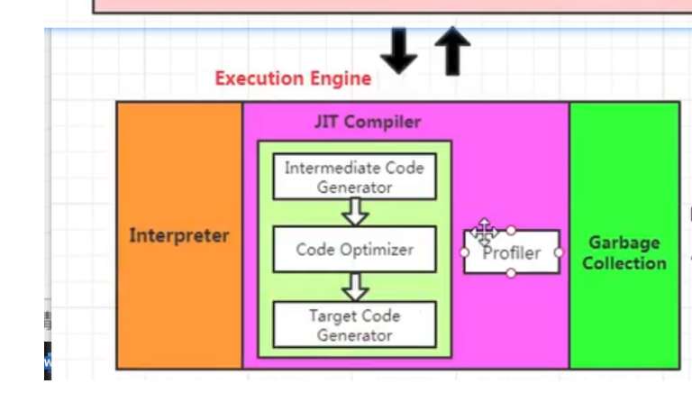

### **JVM**

- [架构](#架构)
- [JVM类加载机制](#JVM类加载机制)
    - [类加载过程](#类加载过程)
    - [类加载器](#类加载器)
    - [双亲委派模型](#双亲委派模型)
    - [JVM中表示两个class对象是否为同一类的两个必要条件](#JVM中表示两个class对象是否为同一类的两个必要条件)
    - [如何打破双亲委派模型](#如何打破双亲委派模型)
        - [什么情况下我们需要打破双亲委派模型](#什么情况下我们需要打破双亲委派模型)
- [JVM内存模型](#JVM内存模型)
    - [堆](#堆)
        - [对象分配过程](#对象分配过程)
        - [Minor GC,Major GC,Full GC](#MinorGC,MajorGC,FullGC)
        - [Java堆为什么要分代](#Java堆为什么要分代)
        - [内存分配策略](#内存分配策略)
        - [TLAB](#TLAB(本地线程分配缓存))
        - [堆空间参数设置](#堆空间参数设置)
        - [堆是分配对象的唯一选择吗](#堆是分配对象的唯一选择吗)
        - [代码优化](#代码优化)
    - [方法区](#方法区)
        - [运行时常量池](#运行时常量池)
        - [永久代为什么被元空间替换](#永久代为什么被元空间替换)
        - [StringTable为什么要调整](#StringTable为什么要调整)
        - [方法区垃圾回收](#方法区垃圾回收)
    - [栈](#栈)
        - [栈帧](#栈帧)
        - [栈相关的面试题](#栈相关的面试题)
    - [程序计数器](#程序计数器)
- [对象的实例化](#对象的实例化)
    - [对象的内存布局](#对象的内存布局)
    - [对象访问定位](#对象访问定位)
- [执行引擎](#执行引擎)
- [StringTable](#StringTable)
    - [位置调整](#位置调整)
    - [字符串拼接](#字符串拼接)
    - [inter()相关的面试题](#inter()相关的面试题)
- [垃圾收集概述](#垃圾收集概述)
- [垃圾收集算法](#垃圾收集算法)
    - [垃圾标记阶段算法](#垃圾标记阶段算法)
        - [引用计数法](#引用计数法)
        - [可达性分析法](#可达性分析法)
    - [垃圾清除阶段算法](#垃圾清除阶段算法)
        - [标记清除算法](#标记清除算法)
        - [复制算法](#复制算法)
        - [标记压缩算法](#标记压缩算法)
    - [内存溢出和内存泄漏](#内存溢出和内存泄漏)
    - [STW](#STW)
    - [安全点](#安全点)
    - [安全区域](#安全区域)
    - [强引用](#强引用)
    - [软引用](#软引用)
    - [弱引用](#弱引用)
    - [虚引用](#虚引用)
- [垃圾收集器](#垃圾收集器)
    - [GC性能指标](#GC性能指标)
    - [7种垃圾收集器与垃圾分代的关系](#7种垃圾收集器与垃圾分代的关系)
    - [Serial回收器](#Serial回收器)
    - [Parallel回收器](#Parallel回收器)
    - [ParNew回收器](#ParNew回收器)
    - [G1回收器](#G1回收器)
- [JVM调优工具](#JVM调优工具)
- [JVM调优实战](#JVM调优实战)

### 架构


#### JVM类加载机制

##### 类加载过程


- 加载
    - 通过类的全限定名来获取该类的二进制字节流，通过类加载器加载进内存。
- 链接
    - 验证：验证字节码文件是否合法。比如是否是CAFEBABE打头
    - 准备：为类变量分配初始值，比如int 类型为0，引用类型为null
    - 解析：将常量池的符号引用转换成直接引用。
        - 符号引用：通过一组符号来描述引用的目标
        - 直接引用：直接指向目标的指针
- 初始化
    - 执行类构造器的<clinit>方法的过程
    - clinit方法内容由类变量赋值语句以及静态代码块构成
    - **clinit方法执行指令顺序按照源文件顺序而来**
    - 如果该类有父类，那么先调用父类的<clinit>方法再执行子类的<clinit>方法
    - 虚拟机必须保证一个类的<clinit>方法在多线程下被同步加锁

##### 类加载器

- 类加载器
    - 启动类加载器(Bootstrap ClassLoader)
        - 加载Java的核心类库。
    - 扩展类加载器(Extension ClassLoader)
        - 加载Java的扩展类库。
    - 应用程序类加载器(Application ClassLoader)
        - 加载ClassPath下的类。
    - 自定义类加载器
        - 自定义类加载逻辑

##### 双亲委派模型

​	

- **作用：**
    - **避免类的重复加载**
    - **保护Java核心类库（沙箱安全机制），防止恶意攻击代码**
- 如果一个类加载器收到类加载请求，首先会委托给父类的加载器去加载。如果父类还存在父类加载器，那么由交给其父类加载器加载。如果父类加载器不能加载，那么会尝试交给子类加载器加载。

##### JVM中表示两个class对象是否为同一类的两个必要条件

- 类的全限定名一样
- 加载这个类的类加载器一样

##### 如何打破双亲委派模型

- 自定义类加载器并重写loadClass方法

##### 什么情况下我们需要打破双亲委派模型

- OSGI模块化热部署
- Tomcat部署多个应用

#### JVM内存模型


##### 程序计数器

- 作用：记录执行下一条指令的地址，程序控制流指示器。
- 生命周期：跟线程一样
- 任何时间一个线程都只有一个方法在执行，也就是**当前方法**,程序计数器会记录当前线程正在执行Java方法的JVM指令地址。如果该方法时native方法，那么指令地址为undefined。（因为native方法是由C/C++来实现的，而该程序计数器是Java层面的）
- **唯一一个没有OOM的区域，也没有GC**

- PC寄存器为什么要每个线程独占？
    - PC寄存器是记录的当前线程执行的下一条指令的地址，线程获得CPU就立即执行，但是CPU是基于时间片轮转调度的，因此如果是线程共享的话，那么下一条执行地址会被其他线程覆盖。

##### 堆

- 堆在JVM启动的时候就被创建，其空间大小也就确定了
- 设置堆空间大小
    - -**Xms10m（启始堆空间，新生代和老年代大小）**
        - -X: JVM 参数
        - ms: memory size
    - **-Xmx10m（最大堆空间）**
    - 默认堆空间大小
        -  初始内存大小：电脑物理内存/64
        - 最大内存大小：物理电脑内存/4
- 特点
    - 线程共享
    - **TLAB是线程私有（线程本地分配缓存）**
- 堆逻辑组成部分
    - JDK1.7及其以前
        - 新生代
            - Eden
            - S0
            - S1
        - 老年代
        - 永久代
    - JDK1.8
        - 新生代
        - 老年代
        - 元空间
    - 新生代老年代堆配置占比：-XX:NewRatio=2（默认值）;表示新生代占1，老年代占2。
    - 新生代Eden区和s0,s1默认比例：8:1:1；通过-XX:NewSurvivorRatio=8;

###### 对象分配过程

- 对象创建首先会分配到Eden区，**当Eden区满的时候，触发youngGC**，Eden区的垃圾会被回收。存活的对象放入s0, Eden区被清空。

- 接下来我们再往Eden区存放对象，Eden区满了，触发youngGC的时候，**Eden区存活的对象和s0的存活的对象会被copy到s1**，Eden区和s0被清空。

- 每次这样操作，会使得对象的age加1.直到**对象的age到了15（默认是15，-XX:MaxTenuringThreashold=???;可以通过设置可以指定age阈值）**，**那么下一次触发youngGC的时候，该对象会直接存放到老年代。**

- 只要触发了youngGC，s0或者s1一定有一个是空（**谁空谁是to**），没有存放任何对象。

- **大对象直接存放到老年代**

- **老年代放不下，会触发FullGC，FullGC之后，老年代还是放不下，直接报OOM。**

- 垃圾回收：频繁回收新生代，很少收集养老代，几乎不收集永久代、元空间。

    

###### MinorGC,MajorGC,FullGC

- Minor GC/Young GC
    - 新生代的垃圾收集，Eden,s0,s1
    - 触发条件
        - Eden区满了触发Minor GC，**Survivor区满了并不会触发Minor GC，会把对象放入老年代**
    - 触发比较频繁
    - **造成STW**，会暂停用户线程，等垃圾回收结束之后，用户线程才会恢复。
- Major GC/Old GC
    - 目前**只有CMS GC才单独收集老年代**
    - 老年代的收集
    - 触发条件
        - 对象从老年代消失会触发
    - 执行速度
        - 比Minor GC慢10以上，STW时间更长
    - 如果Major GC之后，内存还不足会出现OOM
- Mixed GC
    - 对整个新生代和部分老年代的垃圾收集，目前之后G1 GC才有这种行为
- Full GC
    - **堆和方法区的收集**
    - 触发条件
        - System.gc()
        - **老年代空间不足**
        - 方法区空间不足
        - **通过Minor GC进入老年代的对象大于老年代可用内存**

###### Java堆为什么要分代

- 是否必须分代？
    - 不是，**分代是为了优化GC性能。** 如果说不分代的话，就会对整个堆空间进行扫描，效率低下。比如我们的Minor GC就只会对我们新生代进行扫描。

###### 内存分配策略

- 对象优先分配到Eden区
- 大对象直接分配到老年代
    - 程序中应该尽量避免出现过多的大对象
- 长期存活的对象分配到老年代
- 对象的年龄达到15，下一次直接进入老年代

###### TLAB(本地线程分配缓存)

- 概念：存在于Eden区(仅仅占用Eden区的1%)，为每个线程分配了一个私有缓存区域。

- 作用：避免一系列线程安全性问题，提升**内存分配吞吐量及快速分配策略**

- 说明：由于占用Eden区的1%，因此**不是所有对象实例都能够在TLAB中成功分配**，但是它是**首选**。一旦**TLAB空间分配失败**，JVM会尝试通过加锁来确保操作数据的原子性，进而**在Eden空间中直接分配内存**。

- 如何开启：**-XX:UseTLAB**

    

###### 堆空间参数设置

- 堆空间常用的jvm参数
    - -XX:+PrintFlagsInitial:查看所有参数的默认初始值
    - -XX:+PrintFlagsFinal:查看所有参数最终值（可能存在修改，不再是初始值）
    - -Xms:初始堆空间内存
    - -Xmx:最大堆空间内存
    - -Xmn:**设置新生代大小**
    - -XX:NewRatio:新生代和老年代比例
    - -XX:SurvivorRatio:Eden区和s0,s1的比例，如果说Eden区比较大，s0,s1特别小，那么MinorGC没意义，垃圾分代没意义。因为对象会不断地往老年代放。
    - -XX:MaxTenuringThreshold:新生代垃圾的最大年龄：默认值是15
    - -XX:+PrintGCDetails:输出详细的GC处理日志
    - -XX:HandlePromotionFailure:是否设置空间分配担保

###### 堆是分配对象的唯一选择吗

- 如果一个对象经过逃逸分析之后发现它并**没有逃逸出方法**，那么就可能**优化成栈上分配**。
    - 逃逸分析
        - 对象只在方法内部使用，则没有发生逃逸，**没有发生逃逸的对象（new出来的对象）分配到栈上。**栈上的对象不需要垃圾回收。
        - 如果对象被外部方法使用，则认为发生了逃逸
    - 结论：**开发中能够使用局部变量的，就不要方法外部定义**

###### 代码优化

- **栈上分配**

- **同步省略**(锁消除)

- **标量替换**(分离对象):JIT阶段，通过逃逸分析得知某个对象不会被外界访问，通过JIT优化，就会把该**对象拆解成若干个局部变量（由对象的属性构成）**

    - 标量：无法分解成更小数据的数据。比如：Java中基本数据类型的数据

    - 聚合量：可以被分解的数据。比如Java中的对象(User,Person)

    - 作用：大大减少堆内存占用，减少GC。

    - 参数:-XX:EliminateAllocations  默认是打开的

    - 

        ​		

##### 方法区

- 堆、栈、方法区三者的关系

    

- 概念
    - 线程共享
    - JVM启动时候创建，实际物理内存空间和Java堆区一样，都可以不连续
    - 可以选择固定大小，也可以扩展
    - 会报OOM
    - 关闭JVM就释放了这个区域的内存
    
- 方法区的实现
    - JDK1.7及以前：永久代
        - 设置大小
            - -XX:PermSize=100m
            - -XX:MaxPermSize=100m
    - JDK1.8及以后：元空间
        - 设置大小
            - -XX:MetaspaceSize=100m
            - -XX:MaxMetaspaceSize=100m
    
- 存放的内容
  
    - **类信息、运行时常量池字符串常量、静态变量、JIT编译后的代码缓存**
    
- final修饰的属性，在编译阶段就已经确定了其值。

- 方法区的演进

    - 只有HotSpot才有永久代，对于IBM J9，JRocket是没有永久代的。

    - HotSpot中方法区的变化

        

###### 运行时常量池

- 位置：方法区的一部分
- 常量池表：存放编译期生成的各种字面量和符号引用，这部分内容将在类加载后存放到方法区的运行时常量池中。
- **存放：字面量和方法或者字段引用的真实地址。**

###### 永久代为什么被元空间替换

- 永久代大小不好确定，如果设置太小，但是动态加载的类太多那么可能会出现OOM。而元空间大小只受本地内存的限制。
- 永久代调优很困难

###### StringTable为什么要调整

- JDK1.6以前，StringTable是存放在永久代的，永久代的回收需要触发full gc，这就导致StringTable回收效率不高，因此在JDK1.7及以后，把StringTable挪动到堆中，堆中垃圾回收频率更高，因此能够及时回收没用的字符串。

###### 方法区垃圾回收

- 回收：不用的常量和不再使用的类型

##### 栈

- 栈的概述
    - **栈是运行时的单位，堆是存储的单位。**
    - 线程私有
    - 每个线程在创建的时候都会创建一个虚拟机栈，虚拟机栈内部保存着多个栈帧，一个栈帧对应一个Java方法。
    - 作用
        - 负责Java程序的运行，保存方法的局部变量(基本数据类型+对象的引用地址)，部分结果并参与方法的调用和返回。
    - 存在问题
        - OOM
        - StackOverflowError
    - 设置栈大小
        - **-Xss**
    - 存储结构
        - **栈帧；一个方法对应一个栈帧；一个方法执行对应一个栈帧的入栈，一个方法执行结束对应一个栈帧出栈。**
    - 方法结束方式
        - 正常return返回
        - 出现未捕获异常，以抛出异常的方式结束

###### 栈帧

- 局部变量表
    - 定义一个数组，用来存储**方法的参数**和定义在**方法内部的局部变量**
    - 局部变量表是线程独占，因此**不存在安全性问题**
    - **局部变量表在编译期间就已经确定了大小**
    - Slot（槽）
        - **局部变量表最基本的存储单位是槽**
    - 被局部变量表直接或者间接引用到的对象都不会被垃圾回收
- 操作数栈
    - 编译期间就已经确定其大小
    - 通过数组或者链表实现
- 动态链接
    - **指向运行时常量池的方法引用**
    - **将符号引用转换为直接引用**
- 方法返回地址
    - **该方法的PC寄存器的值（PC寄存器存放的是下一条指令的地址）**
- 附加信息

方法调用

- 早期绑定
    - **被调用的目标方法在编译期间可知，且运行期不变**（静态链接）
- 晚期绑定
    - 被调用的目标方法编译期间无法确定，在运行期间才能确定（动态链接）
- 非虚方法
    - 编译期间确定了方法调用的版本，在运行期间不可变
    - 静态方法，私有方法，final修饰的方法，实例构造器，父类方法
- 虚方法
    - 编译期间没法确定方法调用
- JVM方法调用指令
    - invokestatic：调用静态方法，解析阶段确定方法唯一版本
    - invokespecial:调用<init>方法，私有及父类方法，解析阶段确定方法唯一版本
    - invokevirtual：调用所有虚方法
    - invokeinterface：调用接口方法
    - invokedynamic：动态解析出需要调用的方法，然后执行（Lambda表达式）

静态类型语言和动态类型语言

- 静态类型语言
    - 对类型的检查是在编译期间，比如Java语言
- 动态类型语言
    - 对类型的检查是在运行期间，比如JS

###### 栈相关的面试题

- 栈溢出的情况
    - StackOverflowError; 通过-Xss设置栈的大小，方法不停的调用，不停的创建栈帧会出现栈溢出。

- 调整栈的大小就能保证栈不溢出吗
    - 不能；递归调用。

- 分配的栈内存越大越好吗
    - 不是；内存空间有限，会占用其他空间。

- **垃圾回收会涉及到Java虚拟机栈吗**
    - **不会；通过出栈就栈帧就销毁了，不需要GC**

- **方法中定义的局部变量是否线程安全**
    - **具体问题具体分析**；如果没有发生逃逸的话，不会有线程安全问题，如果发生了逃逸，那么可能存在线程安全问题。

##### 

#### 对象的实例化

- 创建对象的方式
    - new
    - 反射
    - 使用clone()
    - 使用反序列化
- 对象创建步骤
    - 判断对象是否已经加载，没有的话那么就加载（加载->链接->初始化）
    - 为对象分配内存空间
    - 对象属性默认初始化
    - 设置对象头信息
    - 对象属性显示初始化、代码块初始化、构造器初始化

##### 对象的内存布局

- 对象头
    - Mark Word
        - HashCode：对象在堆中存放的地址
        - GC分代年龄：
        - 锁标志
        - 线程持有的锁
        - 偏向线程ID
    - Klass pointer
        - 对象所属类型
    - 数组长度（如果是数组）
- 实例数据
    - 对象的属性
- 对齐填充

##### 对象访问定位

- 句柄访问

    

    - 优点：堆空间对象的地址发生了修改**只需要修改句柄的地址即可，不需要修改引用**。
    - 缺点：需要**开辟空间，句柄池存储句柄**，句柄指向堆空间的实例数据和指向对象类型数据的指针。访问效率低，需要两次查找。

- 直接指针（Hotspot采用）

    
    - 概念：栈上引用指向堆空间的对象数据，对象数据中包含对象类型的指针指向方法区的对象类型数据。
    - 好处：不需要开辟额外空间存储，访问效率更高。

#### 执行引擎



- 作用：将字节码解释、编译成对应平台的机器码指令。


#### StringTable

- String不可变性，JDK1.8及其以前用的是final char[]存放内容，JDK1.9之后用的final byte[].
- 字符串常量池不会存储相同的内容，是因为它底层采用的HashTable（数组+链表）来存储元素的，如果元素发生冲突，那么会采用拉链表解决冲突。
- intern()方法：String str = "abc"; str.intern(); 如果该str不在常量池中，那么在常量池中创建一个并str指向常量池中内容；如果存在，则添加指向。

##### 位置调整

- JDK1.6及其以前StringTable是存放在永久代，JDK1.7及其以后则把它挪到了堆中。
- 为什么要这样调整？
    - 永久代空间相比于堆空间来说默认相对较小，如果向永久代添加过多的字符串常量可能会出现OOM。
    - 永久代垃圾回收的频率没有堆空间那么频繁，可能会导致字符串常量池中某些没有被使用的常量依然存放在永久代，浪费空间。

##### 字符串拼接

- **常量与常量的拼接结果在常量池中，原理是编译器优化。**

- **只要有一个是变量，结果就在堆中，拼接原理使用的是StringBuilder**

- 如果拼接结果调用intern()，则主动将常量池中还没有的字符串的对象放入池中，并返回此对象的地址

- 验证

    

    
    
    ##### inter()相关的面试题
    
    - new String("ab")到底创建了几个对象？
    
        - 2个；一个是new 出来的对象，另外一个是字符串常量池中的对象（字节码指令:ldc）。
    
            

- intern()使用总结

    .png)

#### 垃圾收集概述

- 什么是垃圾：没有被任何指针指向的对象。

- 为什么需要GC：如果没有GC，那么程序运行过程中会不断的产生垃圾，如果垃圾会进行回收，那么迟早有一天内存会被消耗完，因此需要GC。

#### 垃圾收集算法

##### 垃圾标记阶段算法

###### 引用计数法

- 概念：内存中对象被引用到，那么该对象的引用计数器就加一，如果该对象引用计数器的值为0，那么表明该对象没有被引用到，可以视为垃圾进行回收。
- 优点：实现简单，容易识别垃圾对象。
- 缺点：**无法处理循环引用，因此Java没有采用引用技术算法。**

###### 可达性分析法

- 概念：也就根搜索算法。从根结点为起点，从上往下的方式搜索目标对象是否可达。


- 哪些结构可以作为GC Roots

    - Java虚拟机栈中引用的对象
    - 本地方法栈引用的对象
    - 方法区类静态属性的对象
    - 方法区中常量的引用

- Object的finalize方法

    - 只能被调用一次
    - 可能导致对象复活
    - 不要主动调用finalize方法，因为可能会降低垃圾回收效率

- 对象或存活还是死亡/垃圾

    - 对象的三种状态

        - 可触及：通过根结点能够访问该对象
        - 可以复活：没有引用指向该对象，但是可能在该对象的finalize方法中复活。**可复活表示该对象跟引用链上的对象有关系。**
        - 不可触及：调用该对象的finalize方法但是该对象并没有复活，那么会进入不可触及的状态。那么会被视为垃圾，被回收。

        

##### 垃圾清除阶段算法

###### 标记清除算法

- 过程
    - **标记：从根结点进行遍历，标记哪些对象被引用到。**
    - 清除：对堆内存从头到尾进行线性遍历，发现某个对象并没有在任何一条GC Roots引用链上，那么则清除该对象。
        - 何为清除
            - **清除并不是真正的把对象置空**，而是**把垃圾对象的地址记录在空闲列表里面**，**下一次有新对象需要加载的时候，判断垃圾的位置空间是否足够，如果放得下那么就用新对象的地址替换垃圾对象的地址。**

- 缺点：

    - 效率不高，需要两次遍历整个GC Root。分别是标记和清除过程

    - 内存不连续，造成内存碎片。需要维护一个空闲列表。

        

###### 复制算法

- 

- 优点：
    - 没有标记清除过程，效率更高
    - 通过复制的方式保证内存连续，不会出现内存碎片问题
- 缺点：
    - 每次都需要把**内存分为两份，其中一份不用，另外一份用来存放存活的对象**。
- 应用场景
    - **新生代中s0和s1的垃圾回收**，里面的**大部分对象都是朝生夕死，都是需要被回收的。**

###### 标记压缩算法


- 概念：相当于标记清除算法执行完之后，再做一次内存碎片整理的过程。

- 优点：解决了标记清除算法（内存碎片化问题）和复制算法（不必浪费一半的内存空间）的缺点
- 缺点：三种算法中效率是最低。

###### 分代收集算法

- 概念：根据对象存活的生命周期将堆空间划分为新生代和老年代，新生代里面的对象大多是朝生夕死，因此采用复制算法。而老年代对象存活率较高，因此可以采用标记清除或者标记压缩算法来回收垃圾。

###### 内存溢出和内存泄漏

- 内存溢出
    - OOM：没有空闲内存，并且垃圾收集器也无法提供更多内存。
    - OOM原因
        - 堆空间设置太小
        - 一次存放的对象太大，堆空间放不下

- 内存泄漏
    - 概念：**对象不会被程序再次用到，但是GC又没法回收的对象。**
    - 宽泛意义上的内存泄漏：JavaWeb应用程序，写的代码不好，把一个对象的生命周期设置成会话级别，导致对象生命周期过长，对象没法及时回收。
    - **内存泄漏有可能导致OOM**
    - 内存泄漏举例
        - 数据库连接，网络连接，IO等等一些连接资源使用完过后没有及时关闭，导致内存泄漏。

###### STW

- Stop The World概念：GC过程中，用户程序会被暂停，没有任何响应，像是卡死一般，这个停顿被称为STW。
- 何时出现：GC过程中。

###### 安全点

- 概念：程序并非在所有地方都可以进行GC，**只有在安全点才能够进行GC。**
- GC发生时，怎么判定所有线程都跑到附近安全点并停顿了下来？
    - **主动式中断**：**设置一个中断标志，每个线程运行到安全点的时候，会主动轮询这个标志，如果中断标志为真，**则将自己中断挂起。

###### 安全区域

- 一块区域，在这块区域的任何位置进行GC都是安全的。**是对安全点的扩展。**

###### 强引用

- 概念：Object obj = new Object(); 我们程序中基本上都是用的强引用，**只要引用关系还在**，GC就永远不会收集该引用对象。
- 回收情况：把对象的引用置为null，那么GC进行垃圾回收的时候才会回收new Object()。
- 问题：可能导致内存泄漏

###### 软引用

- 概念：**引用关系还在情况**：内存不足则回收软引用对象，内存足够的话，不回收软引用对象。

- 实现：通过java.lang.SoftReference

    ```java
    package com.jvm.gc;
    
    import java.lang.ref.SoftReference;
    
    public class SoftReferenceTest
    {
        public static void main(String[] args) throws InterruptedException
        {
            //create soft reference
            User user = new User("Leo", 27);
            SoftReference<User> softReference = new SoftReference<>(user);
            //get user from soft reference
            System.out.println(softReference.get());
            //delete strong reference
            user = null;
    
            System.gc();
            System.out.println("After GC 3 seconds...");
            Thread.sleep(3000);
            System.out.println(softReference.get());
    
            //system resource is not enough
            try
            {
                byte[] b = new byte[1024 * 1024 * 10];
            }catch (Exception ex)
            {
                ex.printStackTrace();;
            }
            finally
            {
                System.out.println(softReference.get());
            }
        }
    
        public static class User
        {
            private String name;
            private int age;
    
            public String getName()
            {
                return name;
            }
    
            public void setName(String name)
            {
                this.name = name;
            }
    
            public int getAge()
            {
                return age;
            }
    
            public void setAge(int age)
            {
                this.age = age;
            }
    
            public User(String name, int age)
            {
                this.name = name;
                this.age = age;
            }
    
            @Override
            public String toString()
            {
                return "User{" + "name='" + name + '\'' + ", age=" + age + '}';
            }
        }
    }
    ```

    

###### 弱引用

- 概念：**引用关系还在**：只要发生GC，弱引用对象一定会被回收。

    

- **引用场景：缓存，ThreadLocal。**

    

    

###### 虚引用

- 概念：**虚引用对象被回收的时候会收到一个系统通知，目的是追踪对象的回收过程**。一个对象是否有虚引用的存在对这个对象生命周期完全没有影响。无法通过虚引用获取引用对象，获取引用对象一定是null。


#### 垃圾收集器

##### GC性能指标

- 吞吐量：用户代码运行时间/(用户代码运行时间 + 垃圾收集时间)

    - eg: 虚拟机运行总时间是100分钟，其中垃圾收集花费了1分钟，那么吞吐量就是99%
    - **高吞吐量不注重延迟。**吞吐量越高程序运行越快。

- 低延迟

    - 场景：应用于交互式应用程序

    **两者是矛盾的。**

- 最佳实践：在最大吞吐量情况下，降低延迟时间。

###### 7种垃圾收集器与垃圾分代的关系


- 垃圾收集器的历史

    

- 查看本机使用的是什么垃圾收集器

    - -XX:+PrintCommandLineFlags

        

    - jinfo -flag UseParalleGC(垃圾收集器参数) 进程ID

        

##### Serial回收器

- 概念：单线程垃圾收集器，在进行垃圾收集的过程中会触发STW，暂停所有用户线程的执行。

- 回收区域
    - 新生代：通过Serial收集器回收
    - 老年代：通过Serial Old收集器回收
- 算法：
    - 新生代：复制算法
    - 老年代：标记压缩整理算法
- 命令：-XX:+UseSerialGC
- 使用场景：只有在单核CPU下才使用，对于交互性较强的应用程序，这种垃圾收集器是无法接受的。

##### ParNew回收器

- 概念：**并行回收垃圾**
- **回收区域：新生代**
- 搭配使用：CMS垃圾收集器 -> 回收老年代
- 疑问：**是否ParNew回收器是否在任何场景下垃圾的回收效率都比Serial高？**
    - 解答：不是。如果是单CPU的话，那么多线程环境下，那么会存在CPU切换的情况，效率没有单线程高。
- 命令：
    - 采用ParNew收集器收集：-XX:+UseParNewGC
    - **指定并发线程数：-XX:+ParallelGCThreads,默认开启和CPU核数相同的线程数。**

##### Parallel回收器

- 概念：并行收集器，**JDK默认垃圾收集器。**
- **回收区域：新生代**
- 算法：复制算法
- 搭配使用：Parallel Old GC -> 回收老年代，采用标记压缩整理算法。
- **和ParNew区别**
    - **ParNew侧重点在于并行**
    - **Parallel侧重点在于吞吐量**，同时，Parallel还具备自适应调节策略。
        - 高吞吐量：高效利用吞吐量，适合后台运算，不需要太多交互的任务。比如：科学计算，订单处理等应用程序。常用于服务器端。

##### CMS收集器

- 优点：
    - 低延迟
    - 并发执行：用户线程和垃圾收集线程并发执行。
- 缺点：
    - **会产生内存碎片**
    - **吞吐量降低**
    - **无法处理浮动垃圾**

- 算法：标记清除算法
    - 标记清除算法会产生内存碎片，为什么不采用标记压缩整理算法？
        - 解答：由于在并发清理垃圾阶段也会有用户线程执行，因此不能够在用户线程执行的过程中修改用户线程的地址。所以没有采用标记压缩整理算法。
- 搭配使用：ParNew或者Serial Old


- 参数：-XX:+UseConcMarkSweepGC
    - 使用该参数过后，老年代采用CMS垃圾收集器，新生代采用ParNew

- 小结

    

