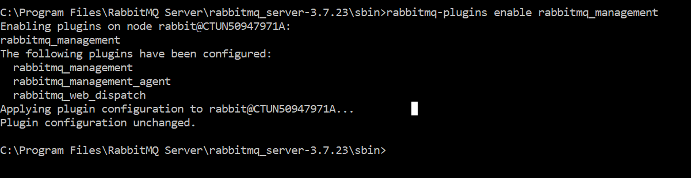
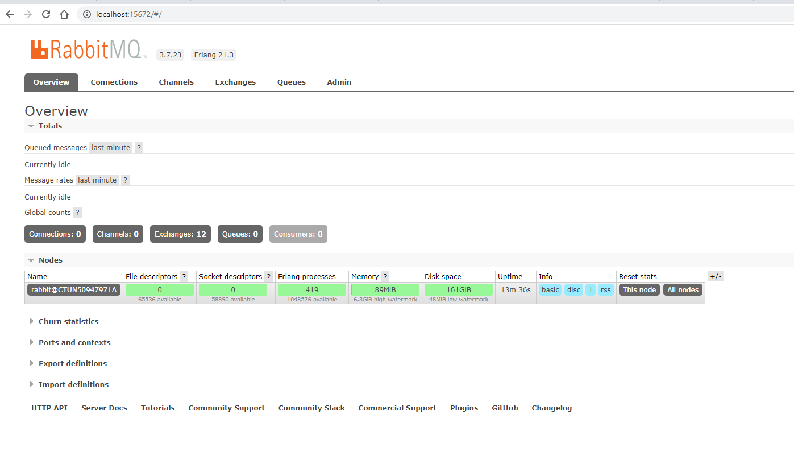
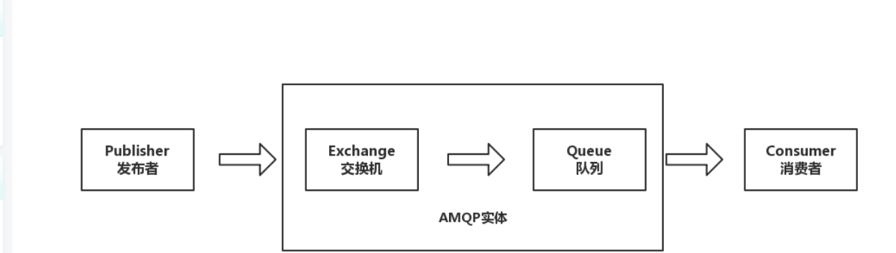
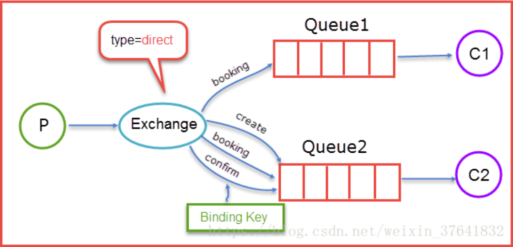
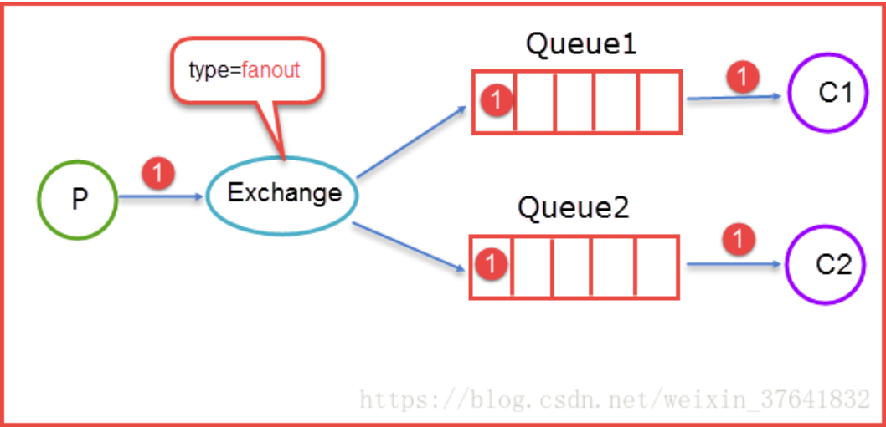
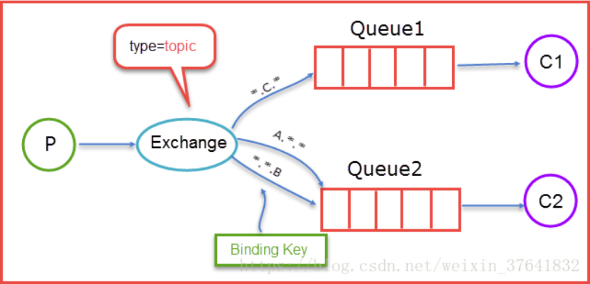

# RabbitMQ

[安装](#安装)

[运行](#运行)

## 安装

- 软件
    - Erlang: esl-erlang_21.3_windows_amd64
    - rabbitmq-server-3.7.23.exe

- 配置环境变量
    - ERLANG_HOME:C:\Program Files\erl10.3
    - RABBITMQ_SERVER:C:\Program Files\RabbitMQ Server\rabbitmq_server-3.7.23
    - PATH中添加%RABBITMQ_SERVER$\sbin
- 修改hosts（C:\Windows\System32\drivers\etc）文件，添加映射主机名：127.0.0.1 CTUN50947971A

## 运行

- 以管理员身份运行运行cmd并且进入到rabbitMQ的sbin目录，执行：rabbitmq-service start


- 安装可视化界面：rabbitmq-plugins enable rabbitmq_management

    

- 浏览器输入:localhost:15672 通过用户名和秘密：guest/guest登录

    


## 常见面试题

### AMQP工作模型



- Publisher 发送消息-》 Exchange（交换机）通过路由表（路由规则) -> Queue, Consumer subscribe Queue，因此可以获取到相应的message进行消费。
- 由于网络等原因，消息在传输过程中还没有被consumer消费掉，就已经丢失掉了。因此AMQP模块里面引入了message acknowledgement(消息确认)的机制，message broker（消息代理）收到了consumer的ack，那么才会把queue里面的message给干掉。
- message broker
    - 消息代理：接收消息，并把消息发往目的地
        - 作用：routing & validation & transformation & storage	
- 消息放入**死信队列**里面

    - **消息不能被成功路由**
    - **消息过了TTL（time-to-live）存活时间**
    - **消息数量超过了消息队列最大数量**
- 死信队列
    - **绑定死信交换机（DLX:Dead Letter Exchange）的队列**
    - 死信队列应用场景
        - 在某些重要的业务场景中，消息没有被成功消费进而放入到死信队列里面，我们可以通过配置死信队列，把死信队列里面的消息发往另外一个队列，之后通过程序编码重新处理这条消息。

### 交换机

- AMQP 0-9-1 交换机类型
    - Direct exchange
    - Fanout exchange
    - Topic exchange
    - Headers exchange
- 交换机状态
    - Durable-持久化
        - message broker重启之后交换机还在
    - Transient-暂存
        - message broker重启之后交换机将丢失
- 默认交换机
    
- 名字为空字符串的直连交换机
    
- 直连交换机

    
    - 工作流程

        - 创建一个Queue: 名字，是否持久化（Server重启之后Queue还在），是否自动删除（Queue没有被使用会被Server删除）
        - 创建一个Binding，绑定了Queue和Routing Key
        - 携带了Routing Key的消息发往直连交换机 -》绑定的Queue

         

        ```java
        private void declare(AmqpAdmin admin, List<AmqpEndpointHolder> endpoints)
            {
                if (endpoints != null && !endpoints.isEmpty())
                {
                    for (AmqpEndpointHolder endpoint : endpoints)
                    {
                        AmqpExchangeHolder e = endpoint.getExchange();
        
                        //define direct exchange
                        DirectExchange exchange = new DirectExchange(e.getName(), e.isDurable(), e.isAutoDelete());//交换机也可以持久化
        
                        AmqpQueueHolder q = endpoint.getQueue();
        
                        //define queue
                        Queue queue = new Queue(q.getName(), q.isDurable(), q.isExclusive(), q.isAutoDelete());
        
                        //define binding
                        Binding binding = BindingBuilder.bind(queue).to(exchange).with(endpoint.getRouting());
        
                        admin.declareQueue(queue);
                        admin.declareExchange(exchange);
                        admin.declareBinding(binding);
                        if (logger.isInfoEnabled())
                        {
                            logger.info("Trace >>> : Bind queue [{}] to exchange [{}] with routing [{}]", q.getName(), e.getName(), endpoint.getRouting());
                        }
                    }
                }
            }
        ```

- 扇形交换机

    

    - **不需要创建Routing Key，通过广播的形式把所有的消息发送给绑定的队列。**
    - 应用场景：群聊/通知更新其他地方的缓存

- 主体交换机

    

    - 工作流程
        - 路由规则是模糊匹配，通过.来进行分隔。

- 头交换机
    - 通过message header里面的属性来进行匹配
    - 传过来header消息里面会有一个x-match的属性，如果该值为any，那么只要header里面任意属性的值匹配上就可以把数据发送Queue，如果是all，那么需要全部属性的值匹配上才可以把数据发往Queue。


- 消息持久化

    - 怎么持久化：创建消息的时候，加一个持久化的属性，new AMQPMessage("\$data","\$properties"), properties是一个数组，把里面的delivery_mode设置成2，表示消息开启持久化。	

    - 消息会被持久化到磁盘，如果Server重启，持久化的消息依然存在并不会丢失。

    - 持久化消息会有性能损耗

        

### 引入MQ的优缺点

- 优点：异步，削峰（减少高峰时期对服务器压力），解耦（降低系统耦合度）
- 缺点：
    - 系统的复杂度增加
        - 考虑MQ中数据是否被**重复消费**；**消费的顺序性;** **数据丢失了如何处理。**
    - 系统可用度降低
        - 万一MQ挂了，那么整个系统就不可用了

### Kafka和RabbitMQ的区别

- 吞吐量：Kafka比RabbitMQ吞吐量级别更高。
- 时效性：RabbitMQ是微妙级别，Kafka是ms级别
- 应用场景：Kafka更多的是用在大数据处理场景，比如说日志处理。而RabbitMQ更多的是用在订单处理系统，一个是低延时，在一个是数据丢失的可能性极小（消息可靠性）。

### 怎么保证消息可靠传输的，消息丢失了怎么办

- 生产者 -> MQ
    - 由于网络波动等原因，数据从生产者发往MQ的过程中丢失了。那么可以在**生产者这边开启Confirm模式**，数据每次发往MQ，MQ处理的消息则会返回ack的response给生产者，如果MQ没能处理这个消息，会返回一个nack给sender，然后你可以重试。	
    - 也可以在**生产者这边开启事务**（channel.txSelect），如果消息被MQ成功处理，则提交事务（channel.txCommit）。如果消息没能被MQ处理，则进行回滚(channel.txRollback)。
    - 事务机制和Confirm模式最大区别是：事务是同步的，Confirm是异步的，Confirm机制效率更高。
- 消息丢失发生在MQ
    - 这个时候Server挂了，MQ中消息并没有做持久化的操作。因此我们需要对**交换机，队列（Durable=true）和消息（消息发送出去的时候property -》delivery_mode=2）都要做持久化的操作**，把数据持久化到磁盘。即使Server挂了，那么等到Server重启成功之后，也会从磁盘里面恢复这些数据。
- MQ -> 消费者或者消费者本身
    - **由于网络波动，消息丢失掉，或者消费者收到了消息，但是消费者还没有处理完消息MQ就挂了。**
    - 我们需要关闭MQ的自动消息确认机制（消费者收到了消息就会从队列里面把消息删除），改为手动确认，也就是消费者真正处理完消息之后，返回一个ack给MQ，MQ收到ack才表明消息被真正的处理完。

### 怎么保证消息消费的顺序性

- 一个消息1-》2-》3 的顺序投递进队列，如何保证在消费掉时候也是1-》2-》3的进行消费?
    - 一个Queue对应一个Consumer，队列是FIFO，怎么样的顺序入队就是怎么样的顺序消费。

### 怎么保证消息不被重复消费，如何保证消息幂等性

- 生产者这边：消息从生产者发往MQ，MQ已经收到了消息，但是由于网络波动原因，导致生产者没有收到MQ的消息确认。因此生产者会重新发送消息给MQ，导致了消息重发。
- 消费者这边：MQ把消息发送给消费者，消费者这边已经收到并且处理完毕了，消费者这边会发送一个消息确认给MQ，这时，由于网络波动导致MQ没有收到消费者的消息确认，因此MQ会重发消息给消费者进行消费，从而导致了消息被重复消费。
- 怎么解决：每个消息携带了全局唯一的ID，通过这个ID去数据库里面查询一次，如果有则直接丢弃该消息。如果没有则插入该消息。

### RabbitMQ如何保证高可用性

- **减少高峰时期对服务器压力。**：**多台机器启动多个RabbitMQ的实例**，每个实例都有相同的Queue的信息。每次消息发完Queue的时候，也会在其他机器上同步Queue里面的数据，这样的话，及时某一台服务器挂了，消费者也可以从其他可用的服务器中MQ进行消费消息。
    - 缺点：系统开销太大，消息需要同步到所有的机器上。

### 消息积压怎么解决

- 消费者的消费速度跟不上生产者的生产速度
    - 增加消费者的数量
- 消费者异常，导致无法接收新的消息
    - 通过程序去排查具体的问题

### RabbitMQ里面消息丢失怎么办

- 设置了TTL时间，导致消息丢失
    - 丢失的消息在死信队列里面，可以通过程序把死信队列里面的数据发往**新的交换机**上，从而把数据发往新的队列。再创建Consumer去订阅前面创建的队列，从而过期的消息能够被正常消费掉。