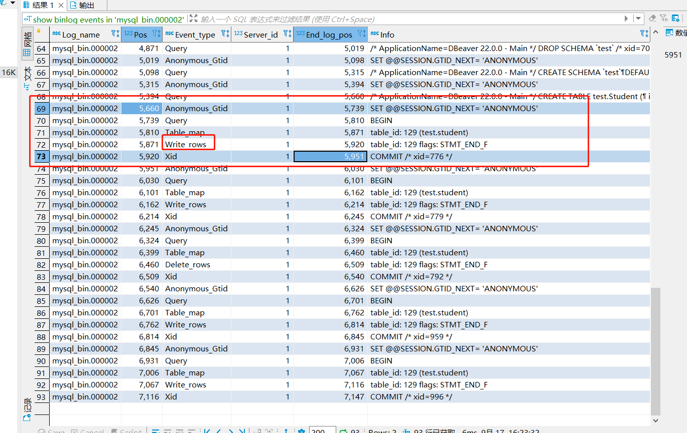

# Mysql

## windows安装

- 下载社区版本 [download](http://dev.mysql.com/downloads/)

- 如果已经安装了版本需要重新安装，那么需要卸载之前的mysql service

  - sc delete MySQL

- MySql主目录创建my.ini文件

  ```
  [mysqld]
  log_bin = mysql_bin //开启bin log，启动事务，后续可以回滚
  basedir = D:\Leo_Install\mysql-8.0.32-winx64\mysql-8.0.32-winx64
  datadir = D:\Leo_Install\mysql-8.0.32-winx64\mysql-8.0.32-winx64\data
  port = 3306
  ```

- 在当前目录生成data目录

  - ```
    #方法一。使用该方法，第一次登陆 MySQL 时不需要密码。
    ./mysqld --initialize-insecure
    ```

- 安装MySql Service
  - mysqld -install

- 把Mysql主目录加入Path环境变量，后续可以直接全局使用mysqld命令

- 启动Mysql

  - net start mysql

- 无密码登录mysql

  - mysql -u root -p

- 添加用户并为其设置密码

  ```
  ALTER USER 'root'@'localhost' IDENTIFIED BY 'liyong';
  ```

- 查看Mysql版本
  - select version();

## 可视化工具DBeaver连接数据库


## 常用SQL

```sql
select count(*) FROM test.ini_holder_detail


delete FROM test.ini_holder_detail
where EndDate between '2017-01-01' and '2017-12-31'

SELECT count(*) FROM test.ini_holder_detail

select count(*) from test.ini_holder_detail ihd where ihd.Symbol='300585'

select count(distinct symbol) from test.ini_holder_detail;

update test.secondboard  set 证券代码 = REPLACE(证券代码,'.SZ','')


create view test.SecondBoardHolderDetailView as
(
	
	select Symbol,ShareHolderID,CategoryCode,EndDate,HoldProportion,Holdshares,IndustryCode,IndustryName,LastEndDate,LastHoldProportion,LastHoldshares,LastPrice,LastShareHolderID,
	Price,RightsRatio,ShareHolderName,Source,Status,Systematics,SystematicsID
	from test.ini_holder_detail holder_detail inner join test.secondboard sb on holder_detail.Symbol = sb.证券代码 and RightsRatio=1 and status<>0
)
 use test;
create view test.SecondBoardHolderDetailGreaterThan5View as 
(
	select t.Symbol,t.ShareHolderID,t.CategoryCode,t.EndDate,t.HoldProportion,t.Holdshares,t.IndustryCode,t.IndustryName,t.LastEndDate,t.LastHoldProportion,t.LastHoldshares,t.LastPrice,t.LastShareHolderID,
	t.Price,t.RightsRatio,t.ShareHolderName,t.Source,t.Status,t.Systematics,t.SystematicsID,d.CirculationMarketValue, d.PublishRule, d.WindIndustry  from 
		( select * from test.ini_holder_detail t where t.Symbol in 
			(select holder_detail.Symbol from test.ini_holder_detail holder_detail inner join test.secondboard sb on holder_detail.Symbol = sb.Symbol and RightsRatio=1  group by holder_detail.Symbol having count(*) >=5) and Status<>0 ) t 
				inner join test.secondboard d on d.Symbol = t.Symbol 
)


create view test.SecondBoardHolderDetailGreaterThan5View as 
(
	(select Symbol from test.ini_holder_detail holder_detail inner join test.secondboard sb on holder_detail.Symbol = sb.证券代码 and RightsRatio=1  group by Symbol having count(*) >=5) and Status<>0
)

select count(*) from test.SecondBoardHolderDetailGreaterThan5View where Status <>0
select count(*) from test.SecondBoardHolderDetailGreaterThan5View 


create view test.SecondBoardHolderDetailGreaterThan5_2018View as
(
	select * from test.SecondBoardHolderDetailGreaterThan5View where EndDate between "2018-01-01" and "2018-12-31"
);

create view test.SecondBoardHolderDetailGreaterThan5_2019View as
(
	select * from test.SecondBoardHolderDetailGreaterThan5View where EndDate between "2019-01-01" and "2019-12-31"
);

create view test.SecondBoardHolderDetailGreaterThan5_2020View as
(
	select * from test.SecondBoardHolderDetailGreaterThan5View where EndDate between "2020-01-01" and "2020-12-31"
);

create view test.SecondBoardHolderDetailGreaterThan5_2021View as
(
	select * from test.SecondBoardHolderDetailGreaterThan5View where EndDate between "2021-01-01" and "2021-12-31"
);

create view test.SecondBoardHolderDetailGreaterThan5_2022View as
(
	select * from test.SecondBoardHolderDetailGreaterThan5View where EndDate between "2022-01-01" and "2022-12-31"
);

select count(*) from test.SecondBoardHolderDetailGreaterThan5_2018View t where t.Symbol ='301297'
select count(*) from test.SecondBoardHolderDetailGreaterThan5_2019View
select count(*) from test.SecondBoardHolderDetailGreaterThan5_2020View
select count(*) from test.SecondBoardHolderDetailGreaterThan5_2021View
select count(*) from test.SecondBoardHolderDetailGreaterThan5_2022View


select count(*) from test.SecondBoardHolderDetailGreaterThan5View where status=3 and EndDate between "2022-01-01" and "2022-03-31"
select count(*) from test.SecondBoardHolderDetailGreaterThan5View where status=3 and EndDate between "2022-04-01" and "2022-06-30"
select count(*) from test.SecondBoardHolderDetailGreaterThan5View where status=3 and EndDate between "2022-07-01" and "2022-09-30"
select count(*) from test.SecondBoardHolderDetailGreaterThan5View where status=3 and EndDate between "2022-10-01" and "2022-12-31"


insert into test.student values ("1", "26", "M", "leo")
insert into test.student values ("2", "2", "F", "maggie");
insert into test.student values ("3", "27", "M", "wade")
insert into test.student values ("4", "28", "M", "shirley")
insert into test.student values ("5", "28", "M", "leo")
insert into test.student values ("6", "28", "M", "leo")


insert into test.person values ("leo", "185", "75")
insert into test.person values ("maggie", "155", "45")

select * from test.person p 

select * from
(select count(s.name) as num, s.name from test.student s inner join test.person p on p.name = s.name group by s.name having count(*)>1 ) t inner join test.student s1 on t.name=s1.name

select t.age, t.gender,t.name,p.height from (select *  from test.student s1 where s1.name in (select s.name from test.student s inner join test.person p on p.name = s.name group by s.name having count(*)>1 )) t inner join test.person p on p.name = t.name;

select t.name from (select s.`no` ,s.name ,s.age ,s.gender,height from test.student s inner join test.person p on p.name = s.name) t group by t.name having count(*)>1

select distinct symbol from test.SecondBoardHolderDetailGreaterThan5_2018View order by symbol ASC

SELECT DISTINCT 发行制度 FROM test.secondboard
select count(*) from test.secondboard

select max(t.`流通市值(百万元)`), min(t.`流通市值(百万元)`)  from test.secondboard t

select count(*) from test.secondboard

select count(distinct t.证券代码 , t.`流通市值(百万元)` ) from test.secondboard  t

select t.Symbol  from test.SecondBoardHolderDetailGreaterThan5View t where t.PublishRule  ='注册制'


select count(*) from test.HM;


update test.HM hm
	set hm.TradeType = (
		case 
			when hm.P > hm.EP then '0'
		 	when hm.P < hm.EP then '1'
		 	when hm.P = hm.EP then '2'
	 	end
	)
end

select * from test.hm hm where hm.TradeType=2


select count(*) from  test.resset r where r.Nobs is null
select count(*) from  test.resset

SHOW VARIABLES LIKE '%local%';
set global local_infile=1;

select version();


load data local infile 'E:\Leo\Personal\Personal\LEO\wang\数据\数据\毕业\毕业\大论文\数据\深交所股票60分钟行情\RESSET_STKSZ2019_60_1.csv'
into table test.resset
FIELDS TERMINATED BY ',' 
LINES TERMINATED BY '\r\n' 
IGNORE 1 ROWS;

select * from test.resset r where r.Nobs is null

select r.QTime, r.Nobs  from test.resset r where r.Nobs = 4750059
select count(*) from (select date_format(r.QTime, '%H:%i') qtime, r.Nobs  from test.resset r where qtime not between date_format('09:30',  '%H:%i') and date_format('11:30',  '%H:%i')) t

delete FROM test.resset r where r.Qdate between '2019-08-01' and '2019-08-23'

select count(*) from test.resset where Qdate < '2019-08-24'
delete FROM test.resset where Qdate < '2019-08-24'
select count(*) from test.resset where Qdate < '2019-08-24'
delete FROM test.resset where Qdate between '2019-08-01' and '2019-08-23'
delete FROM test.resset where Qdate >= '2021-08-25'
select r.Nobs,r.Qdate from test.resset r where r.Qdate between '2021-08-25' and '2021-09-01'

select * from test.resset r where r.Nobs=3380

select * from (select distinct(date_format(r.QTime, '%H:%i')) t , count(*) from test.resset r group by t) p where ( p.t not between '09:30' and '11:30') and (p.t  not between '13:00' and '14:57')
select count(*) from (select count(distinct(date_format(r.QTime, '%H:%i'))) from test.resset r where (date_format(r.QTime, '%H:%i') not between '09:30' and '11:30') and (date_format(r.QTime, '%H:%i') not between '13:00' and '14:57')) t
delete FROM test.resset where (date_format(QTime, '%H:%i') not between '09:30' and '11:30') and (date_format(QTime, '%H:%i') not between '13:00' and '14:57')

'在2019-08-24到2020-08-24时间段，去重过后的股票交易日并且小于20天的删除掉'
select * from (select p.Code_Mkt, count(*) as num from (select t.Code_Mkt,t.Qdate, count(*) as num from (select * from test.resset r where r.Qdate between '2019-08-24' and '2020-08-24') t group by t.Code_Mkt, t.Qdate ) p group by p.Code_Mkt) s where s.num<20;
delete from test.resset where Code_Mkt in (select s.Code_Mkt from (select p.Code_Mkt, count(*) as num from (select t.Code_Mkt,t.Qdate, count(*) as num from (select * from test.resset r where r.Qdate between '2019-08-24' and '2020-08-24') t group by t.Code_Mkt, t.Qdate ) p group by p.Code_Mkt) s where s.num<20) and  Qdate between '2019-08-24' and '2020-08-24'
delete from test.resset where Code_Mkt in (select s.Code_Mkt from (select p.Code_Mkt, count(*) as num from (select t.Code_Mkt,t.Qdate, count(*) as num from (select * from test.resset r where r.Qdate between '2020-08-25' and '2021-08-24') t group by t.Code_Mkt, t.Qdate ) p group by p.Code_Mkt) s where s.num<20) and  Qdate between '2020-08-25' and '2021-08-24'

'一天交易笔数小于 50的股票样本'
select * from (select t.Code_Mkt,t.Qdate,sum(t.TDealsAccu1) as total from test.resset t  group by t.Code_Mkt, t.Qdate) p where p.total<50
select count(*) from test.resset r,(select p.Code_Mkt,p.Qdate from (select t.Code_Mkt,t.Qdate,sum(t.TDealsAccu1) as total from test.resset t  group by t.Code_Mkt, t.Qdate) p where p.total<50) s where r.Code_Mkt=s.Code_Mkt and r.Qdate=s.Qdate;
delete r from test.resset r,(select p.Code_Mkt,p.Qdate from (select t.Code_Mkt,t.Qdate,sum(t.TDealsAccu1) as total from test.resset t  group by t.Code_Mkt, t.Qdate) p where p.total<50) s where r.Code_Mkt=s.Code_Mkt and r.Qdate=s.Qdate;

'删除2019年8月份的数据'
select count(*) from test.resset r where r.Qdate between '2019-08-01' and '2019-08-31'
delete from test.resset where Qdate between '2019-08-01' and '2019-08-31'
'删除2021年8月份的数据'
select count(*) from test.resset r where r.Qdate between '2021-08-01' and '2021-08-31'
delete from test.resset where Qdate between '2021-08-01' and '2021-08-31'


select * from test.resset r where r.Code="300557" 

select count(*) from test.secondboard s where s.Symbol in (select distinct Code  from test.resset) 

select count(*) from test.trd;


create table test.student_copy as select * from test.student 

create table test.resset_remove_registry as select * from test.resset;

select count(*) from test.secondboard s where s.PublishRule ='注册制';
select count(*) from test.secondboard s;
select count(*) from test.resset_remove_registry;

select count(*) from test.resset_remove_registry where Code in (select s.Symbol from test.secondboard s where s.PublishRule ='注册制')
select count(*) from test.resset_remove_registry

delete from test.resset_remove_registry where Code in (select s.Symbol from test.secondboard s where s.PublishRule ='注册制')

create table test.price_updown_lessthan_5 as select * from test.resset;

select * from test.price_updown_lessthan_5 t where t.Code = '2793'
select count(*) from test.price_updown_lessthan_5 pul ;

create table test.resset_1 as select * from test.resset;
select count(*) from test.resset_1;

select * from test.resset_acquire_quantity_lessthan_20w t where t.Askvol1>=200000 and t.Askvol2>=200000 and t.Askvol3>=200000 and t.Askvol4>=200000 and t.Askvol5>=200000
and t.Bidvol1>=200000 and t.Bidvol2>=200000 and t.Bidvol3>=200000 and t.Bidvol4>=200000 and t.Bidvol5>=200000

delete from test.resset_acquire_quantity_lessthan_20w where Askvol1>=200000 and Askvol2>=200000 and Askvol3>=200000 and Askvol4>=200000 and Askvol5>=200000 and Bidvol1>=200000 and Bidvol2>=200000 and Bidvol3>=200000 and Bidvol4>=200000 and Bidvol5>=200000

select * from test.resset r where r.Bidpr1 > r.Askpr1 * 1.02 or r.Bidpr2 > r.Askpr1 * 1.02 or r.Bidpr3 > r.Askpr1 * 1.02  or r.Bidpr4 > r.Askpr1 * 1.02  or r.Bidpr5 > r.Askpr1 * 1.02 

select * from test.resset r where r.Bidpr1 =0 or r.Bidpr1 is null

select * from test.resset r where r.Bidpr1 =0 and r.Askpr1 = 0 and 
ALTER TABLE test.resset_price_cage ADD `Sequence` INTEGER AUTO_INCREMENT PRIMARY KEY not NULL;
select count(*) from test.resset_price_cage;

delete from test.resset_price_cage where Askvol1>=200000 and Askvol2>=200000 and Askvol3>=200000 and Askvol4>=200000 and Askvol5>=200000 and Bidvol1>=200000 and Bidvol2>=200000 and Bidvol3>=200000 and Bidvol4>=200000 and Bidvol5>=200000
delete from test.resset_registry where Askvol1>=200000 and Askvol2>=200000 and Askvol3>=200000 and Askvol4>=200000 and Askvol5>=200000 and Bidvol1>=200000 and Bidvol2>=200000 and Bidvol3>=200000 and Bidvol4>=200000 and Bidvol5>=200000

select count(*) from test.resset_registry rr where rr.Askpr2 = null or 
select * from test.resset_registry rr where rr.Bidpr1 = null  

select count(*) from test.resset_registry rr 

select avg(bm.Rmt),avg(bm.CSAD)  from test.bf_mhead bm where bm.Trddt between "2022-01-01" and "2022-01-31"
select avg(bm.Rmt),avg(bm.CSAD)  from test.bf_mhead bm where bm.Trddt between "2022-02-01" and "2022-02-28"
select avg(bm.Rmt),avg(bm.CSAD)  from test.bf_mhead bm where bm.Trddt between "2022-03-01" and "2022-03-31"
select avg(bm.Rmt),avg(bm.CSAD)  from test.bf_mhead bm where bm.Trddt between "2022-04-01" and "2022-04-30"
select avg(bm.Rmt),avg(bm.CSAD)  from test.bf_mhead bm where bm.Trddt between "2022-05-01" and "2022-05-31"
select avg(bm.Rmt),avg(bm.CSAD)  from test.bf_mhead bm where bm.Trddt between "2022-06-01" and "2022-06-30"
select avg(bm.Rmt),avg(bm.CSAD)  from test.bf_mhead bm where bm.Trddt between "2022-07-01" and "2022-07-31"
select avg(bm.Rmt),avg(bm.CSAD)  from test.bf_mhead bm where bm.Trddt between "2022-08-01" and "2022-08-31"
select avg(bm.Rmt),avg(bm.CSAD)  from test.bf_mhead bm where bm.Trddt between "2022-09-01" and "2022-09-30"
select avg(bm.Rmt),avg(bm.CSAD)  from test.bf_mhead bm where bm.Trddt between "2022-10-01" and "2022-10-31"
select avg(bm.Rmt),avg(bm.CSAD)  from test.bf_mhead bm where bm.Trddt between "2022-11-01" and "2022-11-30"
select avg(bm.Rmt),avg(bm.CSAD)  from test.bf_mhead bm where bm.Trddt between "2022-12-01" and "2022-12-31"

select count(*) from test.stock_return sr ;

select count(distinct code) from test.stock_return sr 
select count(distinct code)  from test.stock_return sr2 where sr2.`date` ="2018-01-02"
select count(*) from test.stock_return sr2 where sr2.`date` ="2018-12-28"

select * from test.secondboard s where s.Symbol = '300001';
select * from test.secondboard s where s.Symbol = '300028';
select * from test.secondboard s where s.Symbol = '300176';
select count(distinct Symbol) from test.secondboard s

select * from test.stock_return sr where sr.code = "300716";

select CirculationMarketValue from test.secondboard s order by CirculationMarketValue asc;


select Symbol from test.secondboard s where s.证券简称 like '%st%';

delete from test.stock_return_by_day 

select count(*) from test.stock_return_by_day 

'从trading表里面删除含有ST的股票'
delete from trading where Code in ( select s.Symbol from test.secondboard s where s.证券简称 like '%st%')
'创建trading_1，删除数据以日维度的'
create table test.trading_1 as select * from test.resset;
select count(*) from test.resset_1;

select count(*) from test.stock_return sr 
select count(*) from test.stock_return_by_day srbd
select count(distinct code) from test.stock_return sr where markettype = 16
select count(*) from test.stock_return sr where markettype = 16


'2018-01-01到2022-12-31之间删除交易日小于20天的股票，按照每年来删'
select * from (select code,count(*) as num from ( select * from test.stock_return sr where sr.date between '2018-01-01' and '2018-12-31') t group by t.code) as p where p.num < 20
delete from stock_return where code in (select code from (select code,count(*) as num from ( select * from test.stock_return sr where sr.date between '2018-01-01' and '2018-12-31') t group by t.code) as p where p.num < 20) and date between '2018-01-01' and '2018-12-31'
delete from stock_return where code in (select code from (select code,count(*) as num from ( select * from test.stock_return sr where sr.date between '2019-01-01' and '2019-12-31') t group by t.code) as p where p.num < 20) and date between '2019-01-01' and '2019-12-31'
delete from stock_return where code in (select code from (select code,count(*) as num from ( select * from test.stock_return sr where sr.date between '2020-01-01' and '2020-12-31') t group by t.code) as p where p.num < 20) and date between '2020-01-01' and '2020-12-31'
delete from stock_return where code in (select code from (select code,count(*) as num from ( select * from test.stock_return sr where sr.date between '2021-01-01' and '2021-12-31') t group by t.code) as p where p.num < 20) and date between '2021-01-01' and '2021-12-31'
delete from stock_return where code in (select code from (select code,count(*) as num from ( select * from test.stock_return sr where sr.date between '2022-01-01' and '2022-12-31') t group by t.code) as p where p.num < 20) and date between '2022-01-01' and '2022-12-31'

'删除code & date一样的记录，只保留sequence是基数的一条记录'
select code, date, num from (select code, date, count(*) as num from (select * from test.stock_return sr where sr.date between '2017-12-01' and '2018-12-31' ) t  group by t.code,t.date ) as p where p.num>1
delete from stock_return where seq in ( select * from (select x.`seq` from test.stock_return x, (select code,date,num from (select code, date, count(*) as num from (select * from test.stock_return sr where sr.date between '2017-01-01' and '2018-12-31' ) t  group by t.code,t.date ) as p where p.num>1) s where x.code=s.code and x.`date` = s.date and x.`seq`%2=0 order by x.code asc) z )

select count(distinct code) from stock_return t


ALTER TABLE test.stock_return ADD `seq` BIGINT AUTO_INCREMENT PRIMARY KEY not NULL;
select * from test.stock_return sr where sr.date between '2018-10-07'  and '2018-10-09'  and code='1'

select count(*) from stock_return sr where sr.markettype = 16


select count(*) from trading_2018 sr
select count(*) from trading_2019 sr
select count(*) from trading_2020 sr
select count(*) from trading_2021 sr
select count(*) from trading_2022 sr

truncate table trading_2019;


create table test.trading_2019 as
(
	select * from test.trading_2018
);

create table test.trading_2020 like test.trading_2019
create table test.trading_2021 like test.trading_2019 
create table test.trading_2022 like test.trading_2019 
create table test.trading_2022 like test.trading_2019
(
	select * from test.trading_2019
);
create table test.trading_2022 as
(
	select * from test.trading_2019
);

'保留连续竞价时间的交易数据,只保留9:30-11:30；13:00-14:57'
select count(*) from test.trading_2018
select count(*) from test.trading_2019
select count(*) from test.trading_2020
select count(*) from test.trading_2021
select count(*) from test.trading_2022
select count(*) from test.trading_2018 r where (date_format(r.QTime, '%H:%i') not between '09:30' and '11:30') and (date_format(r.QTime, '%H:%i') not between '13:00' and '14:57')
select * from test.trading_2018 r where (date_format(r.QTime, '%H:%i') not between '09:30' and '11:30') and (date_format(r.QTime, '%H:%i') not between '13:00' and '14:57')
delete from test.trading_2018 where (date_format(QTime, '%H:%i') not between '09:30' and '11:30') and (date_format(QTime, '%H:%i') not between '13:00' and '14:57')
delete from test.trading_2019 where (date_format(QTime, '%H:%i') not between '09:30' and '11:30') and (date_format(QTime, '%H:%i') not between '13:00' and '14:57')
delete from test.trading_2020 where (date_format(QTime, '%H:%i') not between '09:30' and '11:30') and (date_format(QTime, '%H:%i') not between '13:00' and '14:57')
delete from test.trading_2021 where (date_format(QTime, '%H:%i') not between '09:30' and '11:30') and (date_format(QTime, '%H:%i') not between '13:00' and '14:57')
delete from test.trading_2022 where (date_format(QTime, '%H:%i') not between '09:30' and '11:30') and (date_format(QTime, '%H:%i') not between '13:00' and '14:57')

'Code,QDate去重过后的股票交易日并且小于20天的删除掉'
select * from (select p.Code, count(*) as num from (select t.Code,t.Qdate, count(*) as num from test.trading_2018 t group by t.Code, t.Qdate) p group by p.Code) s where s.num<20;
delete from trading_2018 where Code in (select code from (select p.Code, count(*) as num from (select t.Code,t.Qdate, count(*) as num from test.trading_2018 t group by t.Code, t.Qdate) p group by p.Code) as p where p.num < 20)
delete from trading_2019 where Code in (select code from (select p.Code, count(*) as num from (select t.Code,t.Qdate, count(*) as num from test.trading_2019 t group by t.Code, t.Qdate) p group by p.Code) as p where p.num < 20)
delete from trading_2020 where Code in (select code from (select p.Code, count(*) as num from (select t.Code,t.Qdate, count(*) as num from test.trading_2020 t group by t.Code, t.Qdate) p group by p.Code) as p where p.num < 20)
delete from trading_2021 where Code in (select code from (select p.Code, count(*) as num from (select t.Code,t.Qdate, count(*) as num from test.trading_2021 t group by t.Code, t.Qdate) p group by p.Code) as p where p.num < 20)
delete from trading_2022 where Code in (select code from (select p.Code, count(*) as num from (select t.Code,t.Qdate, count(*) as num from test.trading_2022 t group by t.Code, t.Qdate) p group by p.Code) as p where p.num < 20)

'做价格笼子规则用到'
ALTER TABLE test.trading_2018 ADD `Sequence` INTEGER AUTO_INCREMENT PRIMARY KEY not NULL;
ALTER TABLE test.trading_2019 ADD `Sequence` INTEGER AUTO_INCREMENT PRIMARY KEY not NULL;
ALTER TABLE test.trading_2020 ADD `Sequence` INTEGER AUTO_INCREMENT PRIMARY KEY not NULL;
ALTER TABLE test.trading_2021 ADD `Sequence` INTEGER AUTO_INCREMENT PRIMARY KEY not NULL;
ALTER TABLE test.trading_2022 ADD `Sequence` INTEGER AUTO_INCREMENT PRIMARY KEY not NULL;

select distinct markettype from stock_return sr 
select count(*) from stock_return sr where date between '2018-01-01' and '2018-12-31'
select count(*) from stock_return sr where date between '2019-01-01' and '2019-12-31'
select count(*) from (select * from stock_return sr where date between '2018-01-01' and '2018-12-31') t where (t.markettype != 16) or (t.`change` <= 0.05 and t.markettype = 16)

select count(*) from trading_2018 t
select count(*) from secondboard s2  where Symbol =null
select count(distinct `Sequence`) from trading_2018
select count(distinct Symbol) from secondboard s3 
select count(*) from trading_2018 t, secondboard s where t.Code = s.Symbol
select count(distinct `Sequence`) from trading_2018 t where t.Code in (select Symbol from secondboard)
select count(*) from (select * from trading_2018 t, secondboard s where t.Code = s.Symbol) p where p. 

select count(*) from (select Code, Qdate, count(*) from test.trading_2018 t where t.Code  in (select Symbol from secondboard s ) group by Code, Qdate) t ;


select count(*) from trading_2019 t 

select count(*) from test.secondboard s where s.PublishRule = '注册制'


'2023.09.03'
select count(*) from test.ini_holder_detail ihd 
select count(distinct Symbol) from test.ini_holder_detail ihd order by Symbol desc;
select distinct Symbol from test.ini_holder_detail ihd  where Symbol like '3%' order by Symbol desc;
select distinct EndDate from test.ini_holder_detail ihd

'RightsRatio（送转增配股） != 1 的持股数据，剔除'
select count(*) from test.ini_holder_detail ihd where RightsRatio != 1
delete  from test.ini_holder_detail where RightsRatio != 1
'每个季度交易机构数<5的股票的持股数据，剔除'
select Symbol, count(Symbol) as num from (select * from test.ini_holder_detail ihd where EndDate = '2018-03-31' and Status != 0) p group by p.Symbol ;
select * from test.ini_holder_detail ihd2 where ihd2.Symbol = '000713' and EndDate = '2018-03-31'
delete from test.ini_holder_detail where Symbol  in (select Symbol from (select * from test.ini_holder_detail ihd where EndDate = '2018-03-31' and Status != 0) p group by p.Symbol having count(*)<5) and EndDate = '2018-03-31'
ALTER TABLE test.ini_holder_detail ADD `Seq` INTEGER AUTO_INCREMENT PRIMARY KEY not NULL;
delete from test.ini_holder_detail where Seq in (select * from (select Seq from test.ini_holder_detail where Symbol  in (select Symbol from (select * from test.ini_holder_detail ihd where EndDate = '2018-03-31' and Status != 0) p group by p.Symbol having count(*)<5) and EndDate = '2018-03-31') x );
delete from test.ini_holder_detail where Seq in (select * from (select Seq from test.ini_holder_detail where Symbol  in (select Symbol from (select * from test.ini_holder_detail ihd where EndDate = '2018-06-30' and Status != 0) p group by p.Symbol having count(*)<5) and EndDate = '2018-06-30') x );
delete from test.ini_holder_detail where Seq in (select * from (select Seq from test.ini_holder_detail where Symbol  in (select Symbol from (select * from test.ini_holder_detail ihd where EndDate = '2018-09-30' and Status != 0) p group by p.Symbol having count(*)<5) and EndDate = '2018-09-30') x );
delete from test.ini_holder_detail where Seq in (select * from (select Seq from test.ini_holder_detail where Symbol  in (select Symbol from (select * from test.ini_holder_detail ihd where EndDate = '2018-12-31' and Status != 0) p group by p.Symbol having count(*)<5) and EndDate = '2018-12-31') x );
delete from test.ini_holder_detail where Seq in (select * from (select Seq from test.ini_holder_detail where Symbol  in (select Symbol from (select * from test.ini_holder_detail ihd where EndDate = '2019-03-31' and Status != 0) p group by p.Symbol having count(*)<5) and EndDate = '2019-03-31') x );
delete from test.ini_holder_detail where Seq in (select * from (select Seq from test.ini_holder_detail where Symbol  in (select Symbol from (select * from test.ini_holder_detail ihd where EndDate = '2019-06-30' and Status != 0) p group by p.Symbol having count(*)<5) and EndDate = '2019-06-30') x );
delete from test.ini_holder_detail where Seq in (select * from (select Seq from test.ini_holder_detail where Symbol  in (select Symbol from (select * from test.ini_holder_detail ihd where EndDate = '2019-09-30' and Status != 0) p group by p.Symbol having count(*)<5) and EndDate = '2019-09-30') x );
delete from test.ini_holder_detail where Seq in (select * from (select Seq from test.ini_holder_detail where Symbol  in (select Symbol from (select * from test.ini_holder_detail ihd where EndDate = '2019-12-31' and Status != 0) p group by p.Symbol having count(*)<5) and EndDate = '2019-12-31') x );
delete from test.ini_holder_detail where Seq in (select * from (select Seq from test.ini_holder_detail where Symbol  in (select Symbol from (select * from test.ini_holder_detail ihd where EndDate = '2020-03-31' and Status != 0) p group by p.Symbol having count(*)<5) and EndDate = '2020-03-31') x );
delete from test.ini_holder_detail where Seq in (select * from (select Seq from test.ini_holder_detail where Symbol  in (select Symbol from (select * from test.ini_holder_detail ihd where EndDate = '2020-06-30' and Status != 0) p group by p.Symbol having count(*)<5) and EndDate = '2020-06-30') x );
delete from test.ini_holder_detail where Seq in (select * from (select Seq from test.ini_holder_detail where Symbol  in (select Symbol from (select * from test.ini_holder_detail ihd where EndDate = '2020-09-30' and Status != 0) p group by p.Symbol having count(*)<5) and EndDate = '2020-09-30') x );
delete from test.ini_holder_detail where Seq in (select * from (select Seq from test.ini_holder_detail where Symbol  in (select Symbol from (select * from test.ini_holder_detail ihd where EndDate = '2020-12-31' and Status != 0) p group by p.Symbol having count(*)<5) and EndDate = '2020-12-31') x );
delete from test.ini_holder_detail where Seq in (select * from (select Seq from test.ini_holder_detail where Symbol  in (select Symbol from (select * from test.ini_holder_detail ihd where EndDate = '2021-03-31' and Status != 0) p group by p.Symbol having count(*)<5) and EndDate = '2021-03-31') x );
delete from test.ini_holder_detail where Seq in (select * from (select Seq from test.ini_holder_detail where Symbol  in (select Symbol from (select * from test.ini_holder_detail ihd where EndDate = '2021-06-30' and Status != 0) p group by p.Symbol having count(*)<5) and EndDate = '2021-06-30') x );
delete from test.ini_holder_detail where Seq in (select * from (select Seq from test.ini_holder_detail where Symbol  in (select Symbol from (select * from test.ini_holder_detail ihd where EndDate = '2021-09-30' and Status != 0) p group by p.Symbol having count(*)<5) and EndDate = '2021-09-30') x );
delete from test.ini_holder_detail where Seq in (select * from (select Seq from test.ini_holder_detail where Symbol  in (select Symbol from (select * from test.ini_holder_detail ihd where EndDate = '2021-12-31' and Status != 0) p group by p.Symbol having count(*)<5) and EndDate = '2021-12-31') x );
delete from test.ini_holder_detail where Seq in (select * from (select Seq from test.ini_holder_detail where Symbol  in (select Symbol from (select * from test.ini_holder_detail ihd where EndDate = '2022-03-31' and Status != 0) p group by p.Symbol having count(*)<5) and EndDate = '2022-03-31') x );
delete from test.ini_holder_detail where Seq in (select * from (select Seq from test.ini_holder_detail where Symbol  in (select Symbol from (select * from test.ini_holder_detail ihd where EndDate = '2022-06-30' and Status != 0) p group by p.Symbol having count(*)<5) and EndDate = '2022-06-30') x );
delete from test.ini_holder_detail where Seq in (select * from (select Seq from test.ini_holder_detail where Symbol  in (select Symbol from (select * from test.ini_holder_detail ihd where EndDate = '2022-09-30' and Status != 0) p group by p.Symbol having count(*)<5) and EndDate = '2022-09-30') x );
delete from test.ini_holder_detail where Seq in (select * from (select Seq from test.ini_holder_detail where Symbol  in (select Symbol from (select * from test.ini_holder_detail ihd where EndDate = '2022-12-31' and Status != 0) p group by p.Symbol having count(*)<5) and EndDate = '2022-12-31') x );

'每个季度交易机构数<5的股票的持股数据，剔除,这里特指的包含所有Status的数量'
delete from test.ini_holder_detail where Seq in (select * from (select Seq from test.ini_holder_detail where Symbol  in ( select Symbol from (select * from test.ini_holder_detail ihd where EndDate = '2018-03-31' ) t group by Symbol having count(*) < 5 ) and EndDate = '2018-03-31') x );
delete from test.ini_holder_detail where Seq in (select * from (select Seq from test.ini_holder_detail where Symbol  in ( select Symbol from (select * from test.ini_holder_detail ihd where EndDate = '2018-06-30' ) t group by Symbol having count(*) < 5 ) and EndDate = '2018-06-30') x );
delete from test.ini_holder_detail where Seq in (select * from (select Seq from test.ini_holder_detail where Symbol  in ( select Symbol from (select * from test.ini_holder_detail ihd where EndDate = '2018-09-30' ) t group by Symbol having count(*) < 5 ) and EndDate = '2018-09-30') x );
delete from test.ini_holder_detail where Seq in (select * from (select Seq from test.ini_holder_detail where Symbol  in ( select Symbol from (select * from test.ini_holder_detail ihd where EndDate = '2018-12-31' ) t group by Symbol having count(*) < 5 ) and EndDate = '2018-12-31') x );
delete from test.ini_holder_detail where Seq in (select * from (select Seq from test.ini_holder_detail where Symbol  in ( select Symbol from (select * from test.ini_holder_detail ihd where EndDate = '2019-03-31' ) t group by Symbol having count(*) < 5 ) and EndDate = '2019-03-31') x );
delete from test.ini_holder_detail where Seq in (select * from (select Seq from test.ini_holder_detail where Symbol  in ( select Symbol from (select * from test.ini_holder_detail ihd where EndDate = '2019-06-30' ) t group by Symbol having count(*) < 5 ) and EndDate = '2019-06-30') x );
delete from test.ini_holder_detail where Seq in (select * from (select Seq from test.ini_holder_detail where Symbol  in ( select Symbol from (select * from test.ini_holder_detail ihd where EndDate = '2019-09-30' ) t group by Symbol having count(*) < 5 ) and EndDate = '2019-09-30') x );
delete from test.ini_holder_detail where Seq in (select * from (select Seq from test.ini_holder_detail where Symbol  in ( select Symbol from (select * from test.ini_holder_detail ihd where EndDate = '2019-12-31' ) t group by Symbol having count(*) < 5 ) and EndDate = '2019-12-31') x );

delete from test.ini_holder_detail where Seq in (select * from (select Seq from test.ini_holder_detail where Symbol  in ( select Symbol from (select * from test.ini_holder_detail ihd where EndDate = '2020-03-31' ) t group by Symbol having count(*) < 5 ) and EndDate = '2020-03-31') x );
delete from test.ini_holder_detail where Seq in (select * from (select Seq from test.ini_holder_detail where Symbol  in ( select Symbol from (select * from test.ini_holder_detail ihd where EndDate = '2020-06-30' ) t group by Symbol having count(*) < 5 ) and EndDate = '2020-06-30') x );
delete from test.ini_holder_detail where Seq in (select * from (select Seq from test.ini_holder_detail where Symbol  in ( select Symbol from (select * from test.ini_holder_detail ihd where EndDate = '2020-09-30' ) t group by Symbol having count(*) < 5 ) and EndDate = '2020-09-30') x );
delete from test.ini_holder_detail where Seq in (select * from (select Seq from test.ini_holder_detail where Symbol  in ( select Symbol from (select * from test.ini_holder_detail ihd where EndDate = '2020-12-31' ) t group by Symbol having count(*) < 5 ) and EndDate = '2020-12-31') x );

delete from test.ini_holder_detail where Seq in (select * from (select Seq from test.ini_holder_detail where Symbol  in ( select Symbol from (select * from test.ini_holder_detail ihd where EndDate = '2021-03-31' ) t group by Symbol having count(*) < 5 ) and EndDate = '2021-03-31') x );
delete from test.ini_holder_detail where Seq in (select * from (select Seq from test.ini_holder_detail where Symbol  in ( select Symbol from (select * from test.ini_holder_detail ihd where EndDate = '2021-06-30' ) t group by Symbol having count(*) < 5 ) and EndDate = '2021-06-30') x );
delete from test.ini_holder_detail where Seq in (select * from (select Seq from test.ini_holder_detail where Symbol  in ( select Symbol from (select * from test.ini_holder_detail ihd where EndDate = '2021-09-30' ) t group by Symbol having count(*) < 5 ) and EndDate = '2021-09-30') x );
delete from test.ini_holder_detail where Seq in (select * from (select Seq from test.ini_holder_detail where Symbol  in ( select Symbol from (select * from test.ini_holder_detail ihd where EndDate = '2021-12-31' ) t group by Symbol having count(*) < 5 ) and EndDate = '2021-12-31') x );

delete from test.ini_holder_detail where Seq in (select * from (select Seq from test.ini_holder_detail where Symbol  in ( select Symbol from (select * from test.ini_holder_detail ihd where EndDate = '2022-03-31' ) t group by Symbol having count(*) < 5 ) and EndDate = '2022-03-31') x );
delete from test.ini_holder_detail where Seq in (select * from (select Seq from test.ini_holder_detail where Symbol  in ( select Symbol from (select * from test.ini_holder_detail ihd where EndDate = '2022-06-30' ) t group by Symbol having count(*) < 5 ) and EndDate = '2022-06-30') x );
delete from test.ini_holder_detail where Seq in (select * from (select Seq from test.ini_holder_detail where Symbol  in ( select Symbol from (select * from test.ini_holder_detail ihd where EndDate = '2022-09-30' ) t group by Symbol having count(*) < 5 ) and EndDate = '2022-09-30') x );
delete from test.ini_holder_detail where Seq in (select * from (select Seq from test.ini_holder_detail where Symbol  in ( select Symbol from (select * from test.ini_holder_detail ihd where EndDate = '2022-12-31' ) t group by Symbol having count(*) < 5 ) and EndDate = '2022-12-31') x );


'金融行业上市公司的股票持股数据，剔除:IndustryCode的第一位字符=J，则为金融业'
select count(*) from test.ini_holder_detail ihd where IndustryCode like 'J%'
delete from test.ini_holder_detail where IndustryCode like 'J%'

'ST、ST* 、ST＊＊ 、PT股票，剔除'
update test.stock_info set Code = REPLACE(Code,'.SZ','')
update test.stock_info set Code = REPLACE(Code,'.BJ','')
update test.stock_info set Code = REPLACE(Code,'.SH','')
select count(*) from stock_info 
delete from test.ini_holder_detail where Symbol in ( select Code from test.stock_info t where t.Name like '%ST%' or  t.Name like '%PT%')

delete from test.ini_holder_detail where Seq  in (select * from (select Seq from test.ini_holder_detail ihd where Symbol in ( select Code from test.stock_info t where t.Name like '%ST%' or  t.Name like '%PT%')) t ) 

'核心变量（symbol、enddate、持股机构id、status=空；rightsratio=0）为空的数据，剔除'
select * from test.ini_holder_detail ihd where Symbol = null
select count(*) from test.ini_holder_detail ihd where Symbol = ''
select count(*) from test.ini_holder_detail ihd where EndDate = null
select count(*) from test.ini_holder_detail ihd where EndDate = ''
select count(*) from test.ini_holder_detail ihd where ShareHolderID = null


select distinct Symbol


select * from test.ini_holder_detail ihd where ihd.Symbol = '000159' and EndDate = '2018-03-31'
select * from test.ini_holder_detail ihd where ihd.Symbol = '000301' and EndDate = '2018-03-31'


'SystematicsID=P9409、P9410的数据，剔除'
select   from test.ini_holder_detail where SystematicsID = 'P9409' or SystematicsID = 'P9410'

select count(*) from test.stock_info si 
select count(distinct Code) from test.stock_info si
select count(*) from test.ini_holder_detail

'剔除上市公司的股票'
delete from test.ini_holder_detail where Seq in ( select * from (select Seq from test.ini_holder_detail detail where detail.Symbol in ( select Code from test.stock_info si where StartDate between '2018-01-01' and '2018-12-31')  and EndDate between '2018-01-01' and '2018-12-31') t )
delete from test.ini_holder_detail where Seq in ( select * from (select Seq from test.ini_holder_detail detail where detail.Symbol in ( select Code from test.stock_info si where StartDate between '2019-01-01' and '2019-12-31')  and EndDate between '2019-01-01' and '2019-12-31') t )
delete from test.ini_holder_detail where Seq in ( select * from (select Seq from test.ini_holder_detail detail where detail.Symbol in ( select Code from test.stock_info si where StartDate between '2020-01-01' and '2020-12-31')  and EndDate between '2020-01-01' and '2020-12-31') t )
delete from test.ini_holder_detail where Seq in ( select * from (select Seq from test.ini_holder_detail detail where detail.Symbol in ( select Code from test.stock_info si where StartDate between '2021-01-01' and '2021-12-31')  and EndDate between '2021-01-01' and '2021-12-31') t )
delete from test.ini_holder_detail where Seq in ( select * from (select Seq from test.ini_holder_detail detail where detail.Symbol in ( select Code from test.stock_info si where StartDate between '2022-01-01' and '2022-12-31')  and EndDate between '2022-01-01' and '2022-12-31') t )


select distinct EndDate from test.ini_holder_detail ihd where ihd.EndDate between '2018-01-01' and '2018-12-31'
select * from test.ini_holder_detail ihd where ihd.EndDate between '2018-01-01' and '2018-12-31'

select * from test.ini_holder_detail ihd where ihd.EndDate = '2018-03-31' and Symbol = '000022'

select distinct EndDate from test.ini_holder_detail


'剔除一个季度交易数量小于10的股票信息'
create view test.ini_holder_detail_greaterthan_10 as
(
	select * from test.ini_holder_detail
);

select *  from test.ini_holder_detail

select count(*) from test.ini_holder_detail_greaterthan_10
delete from test.ini_holder_detail_greaterthan_10

show binary logs

select version()

```


## MySql数据被误删了怎么恢复

- 首先你得提前开启了Mysql的BIN LOG功能，否则就没法恢复了

  - 开启BIN LOG,在配置文件里面添加

    - ```
      [mysqld]
      log_bin = mysql_bin
      ```

  - 查看最近的BIN LOG 日志，日志文件在data目录

    - ```
      show master logs;
      show master status;
      ```

  - 日志文件可能较大，因此找到最近生成的日志文件（mysql_bin.000002）导出来

    - ```
      D:\Leo_Install\mysql-8.0.32-winx64\mysql-8.0.32-winx64\data>mysqlbinlog --set-charset=utf-8 mysql_bin.000002 > backup.sql
      ```

  - 根据查看导出的 sql 文件，精准确定是哪一步执行的删除语句，然后记录好时间区间和 pos 点的区间，进行如下的数据恢复。

    - 其实就是误删了哪条记录，之后在binlog里面执行对应的sql语句

    - ```
      1、按pos点
      ./mysqlbinlog --start-position=开始点 --stop-position=结束点 --database=数据库 /binlog路径/mysql-bin.000001 | ./mysql -u用户名 -p密码 -v 数据库
      2、按时间
      ./mysqlbinlog  --start-datetime="2022-12-30 10:00:00" --stop-datetime="2022-12-30 18:00:00" --database=demo5_p2p7_cn /www/server/data/mysql-bin.000038 | ./mysql -uroot -p12345 -v datebase;
      
      例子：
      mysqlbinlog --start-position=5660 --stop-position=5951 --database=test mysql_bin.000002 | mysql -u root -p
      ```

    - 

### 常见错误

-  Variable pseudo_slave_mode cannot be changed by a client that owns a GTID. The client owns ANONYMOUS. Ownership is released on COMMIT or ROLLBACK
  - 恢复删除的数据的时候，起始pos和结束pos点并不是一条完整的mysql事务开启事务结束语