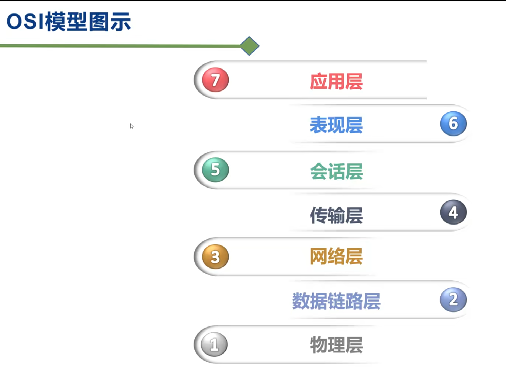
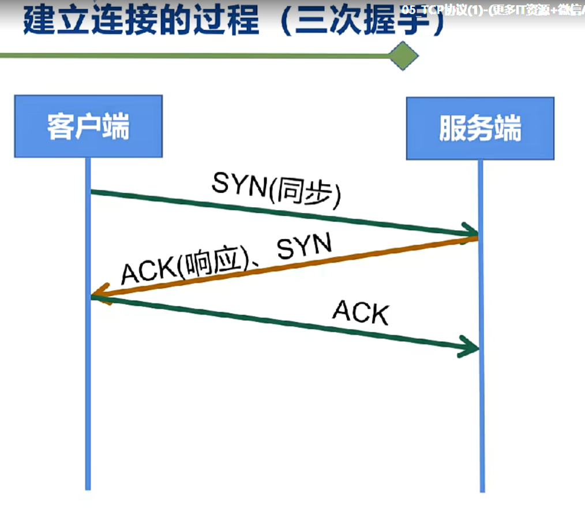
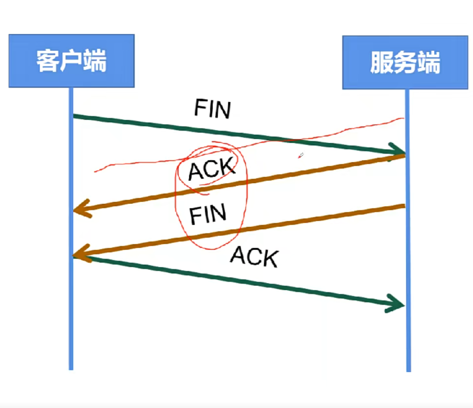
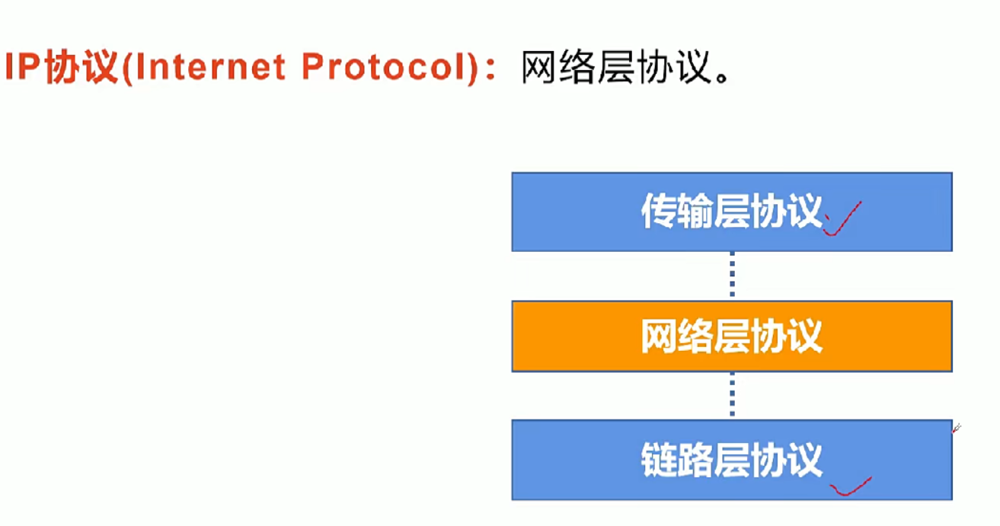
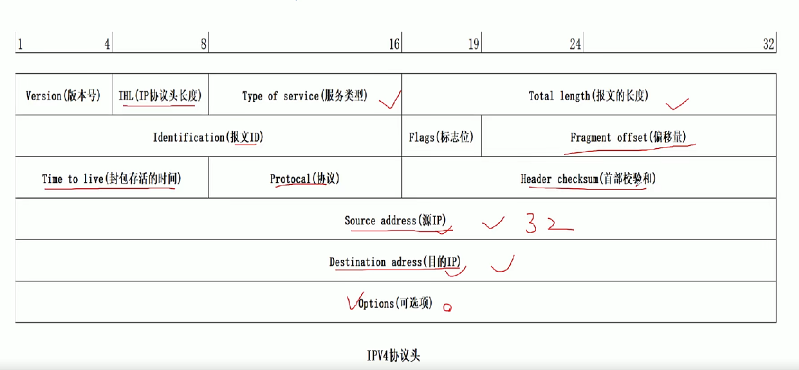
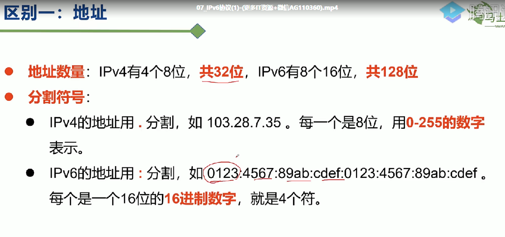
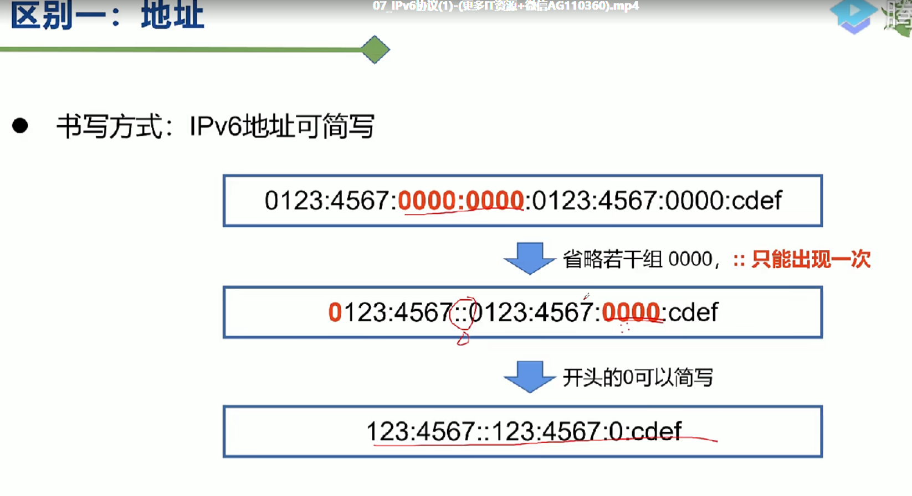
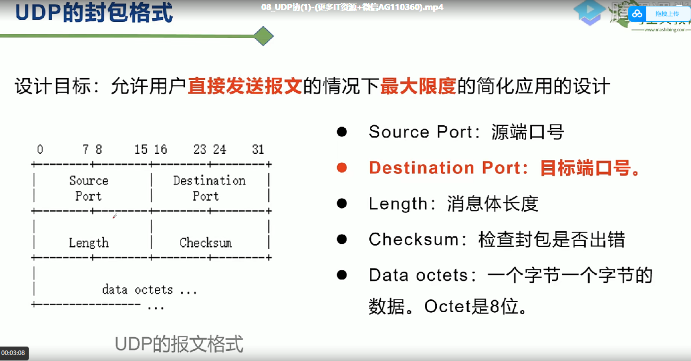
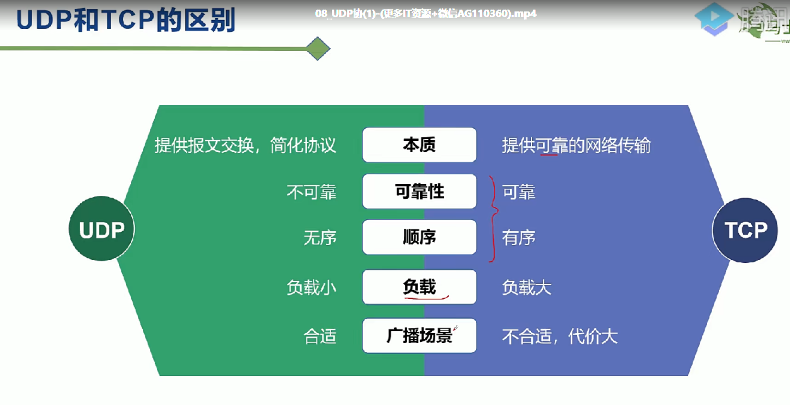

# 计算机网络

## OSI 7层模型

- Open  System Interconnection Reference Model,开放式系统互联模型
- 网络规范标准框架

- 物理层 -> 数据链路层 ->网络层 ->传输层 -》会话层-》表现层 -》 应用层
- 应用层
  - 关心**业务逻辑**
- 表现层
  - 数据格式转换
  - 

- 会话层
  - **负责两个连网实体的连接**

- 传输层
  - 数据从一个实体传输到另一个实体，**负责数据的拆分和封包**，不负责传输。
    - 数据拆分和重组
    - 纠错
    - 管理连接
    - 流量控制
    - 端口寻址
- 网络层
  - 把**一个封包**从一个ip地址**传输**到另一个ip地址，网络传输
    - 路由
- 数据链路层
  - 确保**两个临近设备之间的数据传输**，并隐藏底层实现细节
    - 帧纠错
- 物理层
  - 真正对传输介质
    - 光纤，电缆，双绞线，蓝牙

### OSI 7层模型缺点

- 优点
  - 建立了规范，统一了网络传输标准模型

- 分层臃肿，并非每一层都必要
  - 例子
    - 开发一个ping应用，没必要使用会话层，得到对方恢复即可，没比较建立会话连接。
    - 也没必要使用表现层，由于回来的数据量小，没有必要做数据压缩，数据转换之类的操作。

## TCP/IP 5层模型

- 应用层 -> 数据从一个应用发往另一个应用
- 传输层 -> 主机到主机之间的传输
- 网络层 -> 提供路由和寻址
- 数据链路层 -》设备之间的连接
- 物理层 -》 负责0-1信号的传输

### TCP协议

- TCP是一个提供可靠传输，支持全双工，连接导向的协议。在客户端和服务端之间传输数据的时候需要先建立连接
- 连接
  - 也称为会话，能让两个通讯的程序保证彼此在线，会消耗更多的资源
- 单工
  - 数据只能单向传输 A -》B，不能B -》A
- 半双工
  - 允许数据在两个方向传输，但是在某一时刻，只允许数据在某个方向传输。

- 双工
  - 任何时刻，数据都能在两个方向传输，因此至少需要两条线路

#### TCP协议工作过程

- TCP协议工作过程

  - 建立连接的过程（3次握手），客户端和服务端建立连接三次握手

    - 

    - client -> syn(同步) ->server

    - server -> syn & ack -> client

    - client -> ack -> server

      

  - 为什么client还要发送一次确认呢？可以二次握手吗

    - 因为client发送syn给server的过程中，可能会丢失，因此如果只有两次握手就建立连接的话，中间丢失的信息突然发送到server，server向client发送ack就建立好连接，但此时客户端没有任何数据发往server端，导致server这边一直等待，造成资源的浪费。

  - 断开连接（4次挥手）

    - 

    - client -> FIN(FINISH) -> Server
    - Server -> ACK 我收到你的消息了，正在处理我手上的消息，处理完之后再关闭
    - Server -> FIN -》client ,关闭server端连接
    - client -》ack -》server，server端收到ack就断开连接，如果client等待2MSL之后还没有收到server端的回复，那么就关闭自己的连接

- 为什么连接的时候是三次握手，关闭的时候却是四次挥手
  - 因为server端收到client的FIN之后需要等server端所有报文都发送完之后才能发送FIN，因此FIN和ACK不能一起发送，因此会有四次的挥手

- TCP数据传输
  - 数据拆分
    - 应用层数据太大无法一次传输完，因此需要进行拆分，拆分之后进行并行传输
  - 可靠传输
    - 数据从发送方顺序发出，经过拆分并行传输后，乱序达到接收方，因此接收方那边还做了数据排序，保证了数据的顺序性
  - 纠错和CheckSum
    - 通过16bit的checkSum字段，能够知道数据在TCP协议传输过程中有没有变化，保证数据的正确性

### IP协议

- 传输层 -> 网络层 -》数据链路层

#### IP协议架构

- IPV4 

  - 

  - 工作原理
    - IP协议-》数据分片 -》拆成一个一个封包 -》 封包增加IP头-》寻址-》路由-》数据发送到具体的设备

- IPV6

  - 由于IPV4协议最多只能支持43亿台设备使用，因此地址不够用
  - 8个16位组成
    - 

  -  ipv6地址可以省略
    - 
    - IPV6优点
      - 相比IPV4，有**更大的地址空间**
      - 由于IPV6路由表更小，因此**数据传输的速度更快**
      - **数据更加安全**

## UDP协议

- 建立在IP协议之上，速度很快
- 允许用户直接发送报文，最大限度的简化设计
  - 

- UDP & TCP区别
  - 
  - UDP适合场景
    - 音视频，打电话放视频可以允许丢少部分包，对整体功能影响不大。
    - 广播
  - HTTP3.0建立在UDP上

## WhireShark抓包

- 可以分析自己的API接口信息
