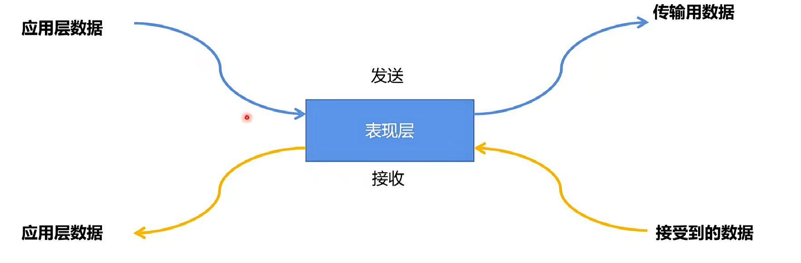
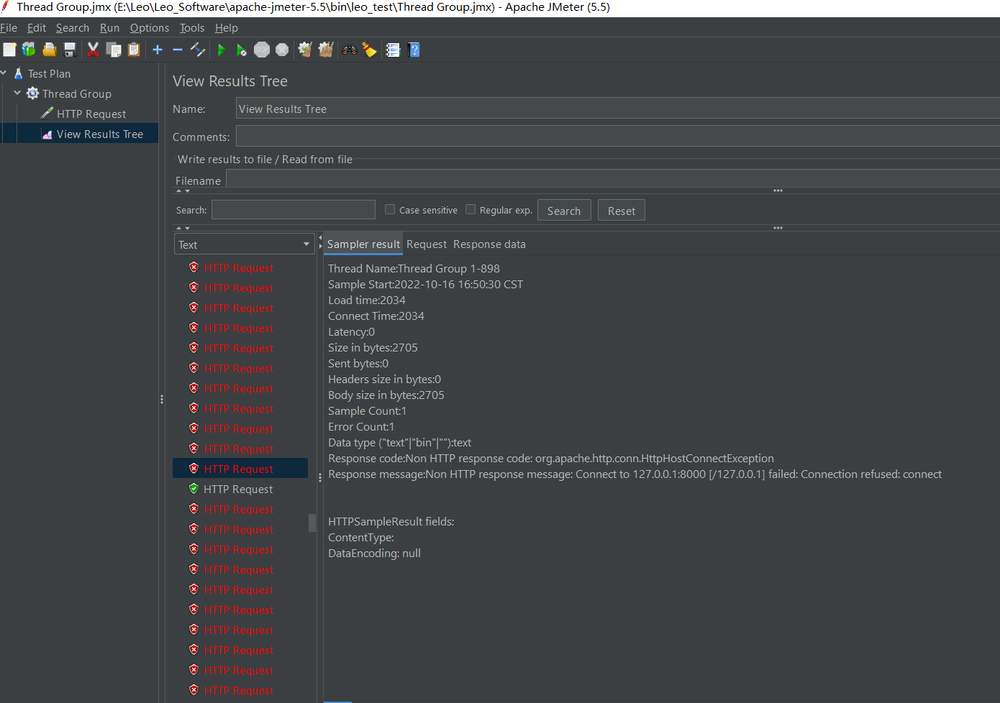
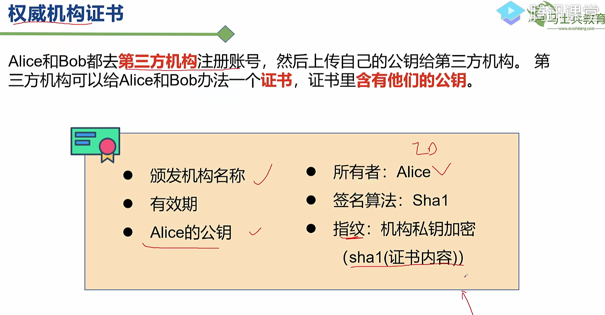

# 计算机网络

- [OSI-7层模型](#OSI-7层模型)
- [OSI-7层模型缺点](#OSI-7层模型缺点)
- [TCP/IP-5层模型](#TCP/IP-5层模型)
  - [TCP协议](#TCP协议)
    - [TCP协议工作过程](#TCP协议工作过程)
  - [IP协议](#IP协议)
    - [IP协议架构](#IP协议架构)
- [UDP协议](#UDP协议)
- [Socket编程](#Socket编程)
  - [BIO](#BIO)
  - [NIO](#NIO)
- [HTTP协议](#HTTP协议)
  - [HTTP方法](#HTTP方法)
  - [HTTP状态码](#HTTP状态码)
  - [DNS](#DNS)
    - [DNS分级缓存](#DNS分级缓存)
  - [CDN](#CDN)
- [加密解密](#加密解密)
- [HTTP1.0 & HTTP2.0](#HTTP1.0 & HTTP2.0)
- [同源策略](#同源策略)
- [面试题目](#面试题目)
  - [TCP/IP协议群做了哪些事情](#TCP/IP协议群做了哪些事情)
  - [TCP协议为什么是3次握手4次挥手](#TCP协议为什么是3次握手4次挥手)
  - [IPv4&IPv6区别](#IPv4&IPv6区别)
  - [TCP和UDP不同之处](#TCP和UDP不同之处)
  - [TCP怎么保证数据传输的顺序性](#TCP怎么保证数据传输的顺序性)
  - [CDN怎么更换图片，缓存怎么更新](#CDN怎么更换图片，缓存怎么更新)
  - [NIO优势](#NIO优势)
  - [一次DNS查询最快和最慢差距多大](#一次DNS查询最快和最慢差距多大)
  - [HTTP keep-alive & http2.0的多路复用有什么区别](#HTTP keep-alive & http2.0的多路复用有什么区别)
  - [正向代理和反向代理的区别](#正向代理和反向代理的区别)

## OSI-7层模型

- Open  System Interconnection Reference Model,开放式系统互联模型
- 网络规范标准框架


- 物理层 -> 数据链路层 ->网络层 ->传输层 -》会话层-》表现层 -》 应用层

  

- 应用层
  
  - 关心**业务逻辑**
  
- 表现层
  - 数据格式转换
  - 

- 会话层
  
- **负责两个连网实体的连接**
  
- 传输层
  - 数据从一个实体传输到另一个实体，**负责数据的拆分和封包**，不负责传输。
    - 数据拆分和重组
    - 纠错
    - 管理连接
    - 流量控制
    - 端口寻址
  
- 网络层
  - 把**一个封包**从一个ip地址**传输**到另一个ip地址，网络传输
    - 路由
  
- 数据链路层
  - 确保**两个临近设备之间的数据传输**，并隐藏底层实现细节
    - 帧纠错
  
- 物理层
  - 真正对传输介质
    - 光纤，电缆，双绞线，蓝牙

### OSI-7层模型缺点

- 优点
  - 建立了规范，统一了网络传输标准模型

- 分层臃肿，并非每一层都必要
  - 例子
    - 开发一个ping应用，没必要使用会话层，等到对方恢复即可，没比较建立会话连接。
    - 也没必要使用表现层，由于回来的数据量小，没有必要做数据压缩，数据转换之类的操作。

## TCP/IP-5层模型

- 应用层 -> 数据从一个应用发往另一个应用
- 传输层 -> 主机到主机之间的传输
- 网络层 -> 提供路由和寻址
- 数据链路层 -》设备之间的连接
- 物理层 -》 负责0-1信号的传输

### TCP协议

- TCP是一个提供可靠传输，支持全双工，连接导向的协议。在客户端和服务端之间传输数据的时候需要先建立连接
- 连接
  - 也称为会话，能让两个通讯的程序保证彼此在线，会消耗更多的资源
- 单工
  - 数据只能单向传输 A -》B，不能B -》A
- 半双工
  - 允许数据在两个方向传输，但是在某一时刻，只允许数据在某个方向传输。

- 双工
  - 任何时刻，数据都能在两个方向传输，因此至少需要两条线路

#### TCP协议工作过程

- TCP协议工作过程

  - 建立连接的过程（3次握手），客户端和服务端建立连接三次握手

    - 

    - client -> syn(同步) ->server

    - server -> syn & ack -> client

    - client -> ack -> server

      

  - 为什么client还要发送一次确认呢？可以二次握手吗

    - 因为client发送syn给server的过程中，可能会丢失，因此如果只有两次握手就建立连接的话，中间丢失的信息突然发送到server，server向client发送ack就建立好连接，但此时客户端没有任何数据发往server端，导致server这边一直等待，造成资源的浪费。

  - 断开连接（4次挥手）

    - 

    - client -> FIN(FINISH) -> Server
    - Server -> ACK 我收到你的消息了，正在处理我手上的消息，处理完之后再关闭
    - Server -> FIN -》client ,准备关闭server端连接
    - client -》ack -》server，server端收到ack就断开连接，如果client等待2MSL之后还没有收到server端的回复，那么就关闭自己的连接

- 为什么连接的时候是三次握手，关闭的时候却是四次挥手
  
- 因为server端收到client的FIN之后需要等server端所有报文都发送完之后才能发送FIN，因此FIN和ACK不能一起发送，因此会有四次的挥手
  
- TCP数据传输
  - 数据拆分
    - 应用层数据太大无法一次传输完，因此需要进行拆分，拆分之后进行并行传输
  - 可靠传输
    - 数据从发送方顺序发出，经过拆分并行传输后，乱序达到接收方，因此接收方那边还做了数据排序，保证了数据的顺序性
  - 纠错和CheckSum
    - 通过16bit的checkSum字段，能够知道数据在TCP协议传输过程中有没有变化，保证数据的正确性

### IP协议


- 传输层 -> 网络层 -》数据链路层

#### IP协议架构

- IPV4 

  - 

  - 工作原理
    - IP协议-》数据分片 -》拆成一个一个封包 -》 封包增加IP头-》寻址-》路由-》数据发送到具体的设备

- IPV6

  - 由于IPV4协议最多只能支持43亿台设备使用，因此地址不够用
  - 8个16位组成
    - 

  -  ipv6地址可以省略
    - 
    - IPV6优点
      - 相比IPV4，有**更大的地址空间**
      - 由于IPV6路由表更小，因此**数据传输的速度更快**
      - **数据更加安全**

## UDP协议

- 建立在IP协议之上，速度很快
- 允许用户直接发送报文，最大限度的简化设计
  - 

- UDP & TCP区别
  - 
  - UDP适合场景
    - 音视频，打电话放视频可以允许丢少部分包，对整体功能影响不大。
    - 广播
  - HTTP3.0建立在UDP上

## WhireShark抓包

- 可以分析自己的API接口信息

  

## Socket编程


#### BIO

- Server端代码

  ```java
  package org.example.bio;
  
  import org.apache.commons.lang3.StringUtils;
  
  import java.io.*;
  import java.net.ServerSocket;
  import java.net.Socket;
  
  public class RawHttpServer
  {
      public static void main(String[] args) throws IOException
      {
          ServerSocket serverSocket = new ServerSocket(8000);
          while(true)
          {
              //Listens for a connection to be made to this socket and accepts it.
              //The method blocks until a connection is made. 
              //等待客户端连接
              Socket socket = serverSocket.accept();
              System.out.println("A socket was created.");
  
              BufferedReader bufferedReader = new BufferedReader(new InputStreamReader(socket.getInputStream()));
              String line = null;
              while(StringUtils.isNotEmpty(line = bufferedReader.readLine()))
              {
                  System.out.println("server received: " + line);
              }
  
              //把消息写给客户端
              BufferedWriter bufferedWriter = new BufferedWriter(new OutputStreamWriter(socket.getOutputStream()));
              bufferedWriter.write("HTTP/1.1 200 ok \n\n Hello World.\n");
              bufferedWriter.flush();;
              socket.close();;
          }
      }
  }
  	
  ```

- client发起get请求

  - ```shell
    curl http://localhost:8000
    ```

    

- 优化第一个server 端程序

  ```java
  package org.example.bio;
  
  import org.apache.commons.lang3.StringUtils;
  
  import java.io.*;
  import java.net.ServerSocket;
  import java.net.Socket;
  import java.util.Optional;
  import java.util.function.Function;
  
  public class OptimizedServer
  {
      ServerSocket serverSocket;
  
  	//第一个参数是input,第二个是output
      Function<String, String> handler;
  
      public OptimizedServer(Function<String, String> handler)
      {
          this.handler = handler;
      }
  
      public void listen(int port) throws IOException
      {
          serverSocket = new ServerSocket(port);
          while(true)
          {
              this.accept();
          }
      }
  
      public void accept() throws IOException
      {
          //Listens for a connection to be made to this socket and accepts it.
          //The method blocks until a connection is made.
          Socket socket = serverSocket.accept();
          System.out.println("A socket was created.");
  
          BufferedReader bufferedReader = new BufferedReader(new InputStreamReader(socket.getInputStream()));
          String line = null;
          while(StringUtils.isNotEmpty(line = bufferedReader.readLine()))
          {
              System.out.println("server received: " + line);
          }
  
          BufferedWriter bufferedWriter = new BufferedWriter(new OutputStreamWriter(socket.getOutputStream()));
          String response = this.handler.apply("");
          bufferedWriter.write(response);
          bufferedWriter.flush();;
          socket.close();;
      }
  
      public static void main(String[] args) throws IOException
      {
          OptimizedServer server = new OptimizedServer(req -> {
                  return "HTTP/1.1 200 ok \n\n Hello World.";
          });
          server.listen(8000);
  
      }
  }
  
  ```

- 程序问题

  - server端只有一个线程处理客户端的请求，并且也是同一个线程把数据发送给client

  - 并发高的情况下，pending queue会满，会拒绝后续请求

  - 

  - 解决

    - 每次来一个请求，server端都创建一个线程去处理请求，这样提高程序的一个处理效率

    - ```java
      package org.example.bio;
      
      import org.apache.commons.lang3.StringUtils;
      
      import java.io.*;
      import java.net.ServerSocket;
      import java.net.Socket;
      import java.util.Optional;
      import java.util.function.Function;
      
      public class OptimizedServer
      {
          ServerSocket serverSocket;
      
          Function<String, String> handler;
      
          public OptimizedServer(Function<String, String> handler)
          {
              this.handler = handler;
          }
      
          public void listen(int port) throws IOException
          {
              serverSocket = new ServerSocket(port);
              while(true)
              {
                  accept();
              }
          }
      
          public void accept() throws IOException
          {
              //Listens for a connection to be made to this socket and accepts it.
              //The method blocks until a connection is made.
              //只有请求来了server端才会创建一个线程去处理请求
              Socket socket = serverSocket.accept();
              new Thread(()->{
                  try
                  {
                      this.handle(socket);
                  } catch (IOException e)
                  {
                      e.printStackTrace();
                  }
              }).start();
          }
          public void handle(Socket socket) throws IOException
          {
              System.out.println("A socket was created.");
              BufferedReader bufferedReader = new BufferedReader(new InputStreamReader(socket.getInputStream()));
              String line = null;
              while(StringUtils.isNotEmpty(line = bufferedReader.readLine()))
              {
                  System.out.println("server received: " + line);
              }
      
              BufferedWriter bufferedWriter = new BufferedWriter(new OutputStreamWriter(socket.getOutputStream()));
              String response = this.handler.apply("");
              bufferedWriter.write(response);
              bufferedWriter.flush();;
              socket.close();;
          }
      
          public static void main(String[] args) throws IOException
          {
              OptimizedServer server = new OptimizedServer(req -> {
                  try
                  {
                      //模拟访问db需要花费的时间
                      Thread.sleep(10);
                  } catch (InterruptedException e)
                  {
                      e.printStackTrace();
                  }
                  return "HTTP/1.1 200 ok \n\n Hello World.";
              });
              server.listen(8000);
          }
      }
      
      ```

      - 结果：5000个并发扛得住，之前500都扛不住，这种方式的并发度还是跟机器配置有关。
        - 

  - 再优化

    - ```java
      package org.example.bio;
      
      import org.apache.commons.lang3.StringUtils;
      
      import java.io.*;
      import java.net.ServerSocket;
      import java.net.Socket;
      
      public class Optimized2Server
      {
          ServerSocket serverSocket;
      
          IHandlerInterface handler;
      
          public Optimized2Server(IHandlerInterface handler)
          {
              this.handler = handler;
          }
      
          public void listen(int port) throws IOException
          {
              serverSocket = new ServerSocket(port);
              while(true)
              {
                  accept();
              }
          }
      
          public void accept() throws IOException
          {
              //Listens for a connection to be made to this socket and accepts it.
              //The method blocks until a connection is made.
              Socket socket = serverSocket.accept();
              new Thread(()->{
                  try
                  {
                      this.handle(socket);
                  } catch (IOException e)
                  {
                      e.printStackTrace();
                  }
              }).start();
          }
      
          public void handle(Socket socket) throws IOException
          {
              Request request = new Request(socket);
              Response response = new Response(socket);
              this.handler.handle(request, response);
          }
      
          public static void main(String[] args) throws IOException
          {
              Optimized2Server server = new Optimized2Server((request, response) -> {
                  response.send("HTTP/1.1 200 ok \n\n Hello World");
              });
              server.listen(8000);
          }
      }
      
      ```

      ```java
      package org.example.bio;
      
      import org.apache.commons.lang3.StringUtils;
      
      import java.io.BufferedReader;
      import java.io.IOException;
      import java.io.InputStreamReader;
      import java.net.Socket;
      
      public class Request
      {
          public Request(Socket socket) throws IOException
          {
              handle(socket);
          }
      
          public void handle(Socket socket) throws IOException
          {
              System.out.println("A socket was created.");
              BufferedReader bufferedReader = new BufferedReader(new InputStreamReader(socket.getInputStream()));
              String line;
              while(StringUtils.isNotEmpty(line = bufferedReader.readLine()))
              {
                  System.out.println("server received: " + line);
              }
          }
      }
      
      ```

      ```java
      package org.example.bio;
      
      import java.io.BufferedWriter;
      import java.io.IOException;
      import java.io.OutputStreamWriter;
      import java.net.Socket;
      
      public class Response
      {
      
          Socket socket;
          public Response(Socket socket) throws IOException
          {
              this.socket = socket;
          }、
          public void send(String msg) throws IOException
          {
              BufferedWriter bufferedWriter = new BufferedWriter(new OutputStreamWriter(socket.getOutputStream()));
              bufferedWriter.write(msg);
              bufferedWriter.flush();;
              socket.close();;
          }
      }
      ```

###### 缺点

- 一个请求就需要创建一个线程，再高并发的场景下，会消耗过多的内存资源。

#### NIO


- 

###### 优点

- **服务端采用一个线程，通过selector多路复用器，轮询的去读取客户端发往缓冲区的数据**。这样的话就减少了服务端创建多线程导致的资源消耗。

```java
package org.example.nio;

import java.io.BufferedReader;
import java.io.IOException;
import java.net.InetSocketAddress;
import java.nio.ByteBuffer;
import java.nio.channels.*;
import java.nio.charset.StandardCharsets;
import java.util.Set;

public class NIOServer
{
    ServerSocketChannel serverSocketChannel;
    public static void main(String[] args) throws IOException
    {
        NIOServer nioServer = new NIOServer();
        nioServer.listen(8000);
    }


    public void listen(int port) throws IOException
    {
        serverSocketChannel = ServerSocketChannel.open();
        serverSocketChannel.bind(new InetSocketAddress(port));
        //Reactor
        serverSocketChannel.configureBlocking(false);

        Selector selector = Selector.open();
        serverSocketChannel.register(selector, serverSocketChannel.validOps(), null);

        ByteBuffer byteBuffer = ByteBuffer.allocate(1024*16);
        for(;;)
        {
            int numOfKeys = selector.select();
            Set<SelectionKey> selectedKey = selector.selectedKeys();
            for (SelectionKey selectionKey : selectedKey)
            {
                //处理连接事件
                if(selectionKey.isAcceptable())
                {
                    SocketChannel channel = serverSocketChannel.accept();
                    if(null == channel)
                    {
                        continue;
                    }
                    //Kernel -> map(Buffer) -> Channel -> User(Buffer)
                    channel.configureBlocking(false);
                    channel.register(selector, SelectionKey.OP_READ);
                }
                else
                {
                    //处理读写事件
                    SocketChannel selectableChannel = (SocketChannel)selectionKey.channel();
                    byteBuffer.clear();
                    selectableChannel.read(byteBuffer);
                    //Logic
                    String request = new String(byteBuffer.array());


                    byteBuffer.clear();
                    byteBuffer.put("HTTP/1.1 200 ok \n\n Hello World.".getBytes(StandardCharsets.UTF_8));
                    byteBuffer.flip();
                    selectableChannel.write(byteBuffer);
                    selectableChannel.close();;
                }
            }
        }
    }
}

```


## HTTP协议

- Request
  - Header
  - Body
- Response
  - Header
  - Body
- Header
  - Content-Length
    - 发送、接收Body内容的字节数
  - User-Agent
    - 记录用了什么浏览器，操作系统。
  - Content-Type
    - 数据类型
      - text/html -> HTML格式
      - text/css -> CSS文本
      - application/json: JSON格式数据
      - image/jpeg: jpg图片格式
      - text/plain: 纯文本格式
  - Origin
    - 请求来源地址
  - Accept
    -  建议服务器返回何种格式数据
      - application/json,text/javascript,* / *
      - */ * 代表任何类型 。
  - Referer
    - 打开当前页面的前一页面的URL
  - Connection
    - 决定当前HTTP连接是否在当前事务完成后关闭。
  - keep-alive: 多次请求复用一个TCP连接
    - Keep-Alive: timeout=5,max=1000(最多复用1千次)
    - keep-alive是不是长连接
    -  不是，基于websocket才是长连接

### HTTP方法

- GET/POST/PUT/DELETE
- OPTION
  - 跨域部分讲解
- TRACE
  - 用于显示调试信息，多数网站不支持
- CONNECT
  - 代理部分讲解
- PATCH
  - 对资源进行部分更新（极少用）

### HTTP状态码

- 1XX
  - 提供信息
- 2XX
  - 成功
  - 200 -》OK
  - 201 -》创建成功
  - 202 -》 Accepted 已接收
  - 203 -》 非权威内容，比如：可能访问的是缓存中的内容
  - 204 -》没有内容
  - 205 -》 内容重置
  - 206 -》服务端发了部分内容
- 3XX
  - 重定向

- 4XX
  - 客户端错误
- 5XX
  - 服务端错误


### DNS

- 域名解析系统


#### DNS分级缓存


### CDN

- Content Delivery Network: 内容分发网络
  - 将请求分发到全世界各地，分发流量，加快访问速度
  - 缺点
    - 无法部署业务逻辑，更新慢，无法保持一致性。
  - 适合
    - 部署静态资源，比如图片，视频，脚本文件。

## 加密解密

- 对称加密

  - 加密解密**都用一个密钥**，加密方和解密方都知道这个密钥，比如3DES
  - 缺点：密钥泄漏，很危险

- 非对称加密

  - 加密用一个密钥，解密用另一个密钥，公钥加密，私钥解密
  - 特点：加密安全性高，但是速度慢，比如RSA算法

- 摘要算法

  - 将原文和摘要同时传给接收方

  - md5,sha

    

  





## HTTP1.0 & HTTP2.0

- HTTP1.1
  - 多个请求复用一个TCP连接，如果其中一个请求阻塞，那么后续的请求也会被阻塞
- HTTP2.0
  - 采用多路复用技术，一个请求被阻塞，其他请求依然能够被处理


## 同源策略

- 同源

  - 域名，端口和协议相同的为同源

- 同源策略

  - 拒绝非同源的脚本或者文件进行交互，防止恶意文件的攻击

- 如果想要访问不同源的数据，怎么解决

  - JsonP

  - CORS（跨域资源共享）

    - 浏览器端先**发一个预检请求到服务端**，如果成功返回的话，下一次再发真正的请求到服务端

      

- 代理
  
  - 相比于CORS更快，因为不需要做一次预检

## 面试题目

### TCP/IP协议群做了哪些事情

- 报文拆分 -》增加协议头 -》数据传输-》路由和寻址-》数据重组

### TCP协议为什么是3次握手4次挥手

- 三次握手建立连接
  - client -> SYNC-> Server
  - Server -》ACK & SYNC ->Client
  - Clint -> ACK -> Server
- 4次挥手
  - Client -> FIN ->Server
  - Server -> ACK -> Client
  - Server -》FIN -》 Client
    - 要等服务端处理完数据之后，才会发送一个FIN给client
  - Client -》ACK -》Server

### IPv4&IPv6区别

- 地址不同
  - IPv4是32位构成，地址大约有43亿，而IPv6是128位组成，IP地址范围大很多
- 地址的格式不同
  - IPv4是点分隔，IPv6是冒号分隔
- 寻址方式不同
  - IPv4是通过子网掩码计算网络地址，而IPv6是通过特定的方式对网络进行划分
- DNS不同

### TCP和UDP不同之处

- 面向连接 vs 无连接

- 可靠传输 vs 不可靠传输
- 头的大小不同（大 vs 小）
- 会话 vs 无会话
- 面向字节流 vs 面向报文

- 适用场景
  - UDP：视频会议，IP电话
  - TCP: 文件传输

### TCP怎么保证数据传输的顺序性

- TCP在数据传输的时候把数据拆分成一个个小的块，每个块由heade & payload组成，并在header上设置好序号，这样在接收的时候通过header上的序号对块进行重组排序，这样就保证了数据的顺序性。
- 如果检查到数据完整，接收端就会发送一个ACK给发送端，否则不发送ACK，让发送端重新发送丢失的内容。

### CDN怎么更换图片，缓存怎么更新

- CDN是内容分发网络，目的是去中心化，client去找最近的服务器获取资源
- 图片一般都是有缓存的，并且是按天计算，我们肯定等不及，那么我们只能用一张图片，换个URL去访问。
- 把请求发往到某台服务器，通过中间服务器去慢慢更新其他服务器的缓存信息。

### LRU

- 缓存置换算法：当缓存数量满了的时候，再创建新的缓存条目，会删除最旧的那条缓存条目。

### NIO优势

- NIO 
  - 非阻塞IO：
    - 响应式模型+非阻塞设计方式**，一个线程通过selector多路复用器，采用轮询的方式处理客户端请求**，减少了线程之间的切换 
    - 内核级别拷贝内存到JVM，减少了系统调用

### 一次DNS查询最快和最慢差距多大

- DNS采用**分级缓存策略**

- 最快
  - 本地浏览器缓存命中，期望80%以上命中
- 最慢
  - ISP（服务商）-》Root服务器 -》顶级域名服务器找 -》全为域名服务器找

### HTTP keep-alive & http2.0的多路复用有什么区别

- keep-alive是复用TCP连接，减少握手和挥手的时间，本质是串行
- Http2.0采用多路复用技术，数据被拆分成多个小块发送，是并行的。

### 正向代理和反向代理的区别

- 正向代理发送方指导目标服务器的地址
- 反向代理不知道真实的目标服务器的地址，可以把代理服务器和目标资源看成是一个整体