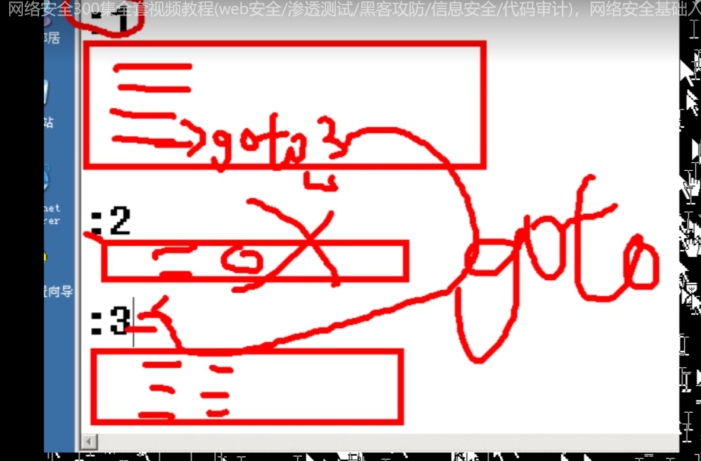

# 网络安全

## 子网掩码

- 通信规则：在一个局域网中，所有ip地址必须在同一网段中才能通信

- IP地址构成：网络位+主机位（网络位相同的ip地址为同一网段，网络位可以为IP地址前三个数字中任意1,2或3位）

  - 子网掩码如何确定网络位：与255对应的数字是网络位，与0对应的数字是主机位

  - ```
    255.0.0.0; 255.255.0.0; 255.255.255.0; 
    ```

    

- 有效ip地址：主机位不能全为255和0

## 批处理命令-Windows系统

- @echo off
- pause
- echo.  //换行

- :1
- goto
  - 

- 命令 > nul
  - 屏蔽出错的信息，成功的还是会显示
- 2>nul
  - 屏蔽操作失败的信息，成功的依旧会显示
- **1>nul**
  - 无论成功还是失败都不显示


## 用户和权限

### 概述

- 每个用户登录到服务器拥有不同的操作权限
- 没有账户有自己的SID（安全标志符），类似于身份证号

### 用户

#### 内置账户

- 给人使用的账户
  - administrator #管理员账户
  - guest               #来宾账户

#### 计算机服务组件相关的系统账号

- system				#系统账号 == 权限至高无上
- local services     #本地服务账户 == 权限等于普通账户

- network service  #网络服务账户 == 权限等于普通账户

#### 命令行管理用户

```
net user #查看所有用户
net user micha #查看micha用户详细信息
net user micha 1 #给micha用户修改密码为1，只能在administrator才能修改密码
net user test 123 /add #新建一个账户abc，账户秘密是123
net user abc /del
```

### 组

#### 作用

- 简化权限的赋予

#### 赋予权限的方式

- 用户 - 组 - 赋权限
- 用户 - 赋权限

#### 内置组

- administrator       #管理员组
- guest                     #来宾组
- users	                  #普通用户组，默认新用户
- network                #网络配置组
- print                      #打印机组
- Remote Desktop  #远程桌面组

#### 命令行

```
net localgroup    #服务器上的用户组有哪些
net localgroup administrators #查看该组下面的用户有哪些
net localgroup administrators leo /add #把leo加入到管理员权限组
net localgroup administrators leo /del  #把leo从管理员权限组移除
net localgroup CEO /add   #添加CEO用户组，下面没有任何用户
net user micha /active:no #禁用micha账户，该账户登录不进去
```

## 服务器远程管理

### 管理类型

#### 远程桌面

- ping 目标服务器地址看网络是否通畅
- target机器开启远程控制服务
- 给某个**用户赋予远程访问权限**（ Remote User Desktop）进行远程访问目标及其 
- source 机器  -》 mstsc -》 调出远程桌面连接

#### telnet - 命令行

- ping 目标服务器地址看网络是否通畅
- target机器开启telnet服务
- 给某个**用户赋予远程访问权限**（Telnet  Clients）进行远程访问目标及其 
- source机器 -》telnet 192.168.1.1 -》 输入用户名和密码登录

#### 查看开放的端口号

- netstat -an
  - 0.0.0.0:23 -> telnet 服务端口
  - 远程桌面协议RDP：3389

## NTFS权限

- 作用：给不同的文件和文件夹设置不同权限，让不同用户可以访问不同的文件和文件夹

### 文件系统

#### 什么是文件系统

- 文件用什么格式存储的
  - FAT      #windows
  - NTFS   #windows
  - EXT     #linux

### NTFS优点

- 提高磁盘读写性能
- 可靠性
  - 加密文件系统
  - ACL：访问控制列表
- 磁盘利用率
  - 压缩
  - 磁盘配额：给某个用户只能使用指定大小的空间
- 支持单个文件大于4G存储

### 怎么修改NTFS文件权限

#### 实验

- 场景：A用户和B用户，能够访问不同的文件夹


-