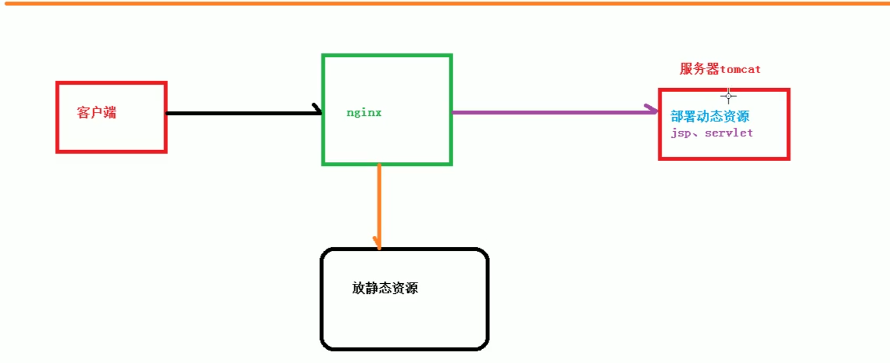
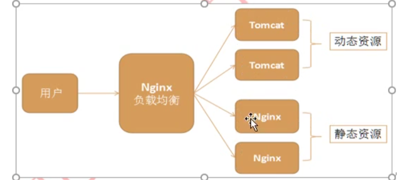
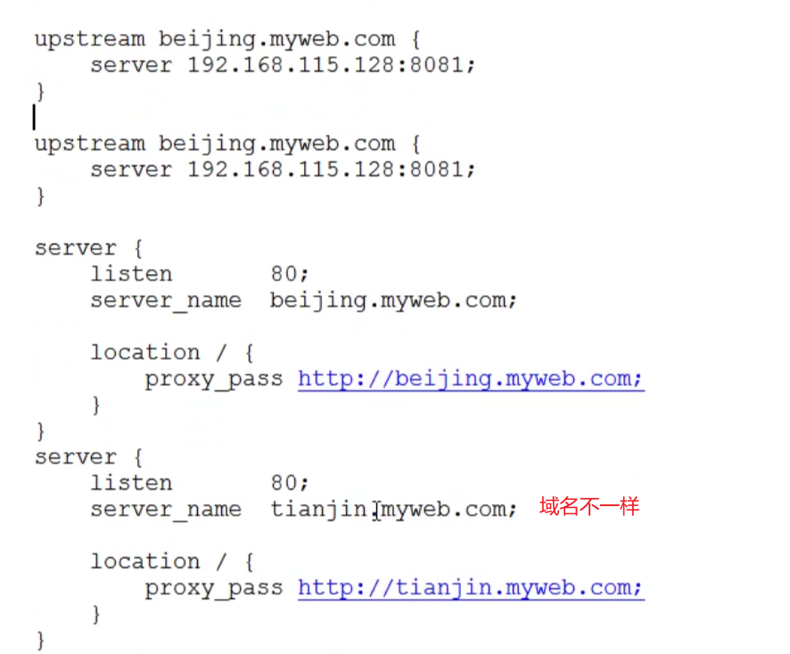

# Nginx


## 简介

- 高性能的HTTP的反向代理服务器
- 能支持5w个并发连接数

### 反向代理

- 客户端把请求发往反向代理服务器，通过反向代理服务器去访问目标服务器的资源。可以把目标服务器和反向代理服务器看成是一个服务器。
- 特点：**隐藏了目标服务器的真实地址。**

#### 正向代理

- Chinese User A -> google 访问不了
  - User A -> proxy(www.abc.com) -> google 可以访问
- 正向代理：在客户端配置代理服务器，通过代理服务器对目标网路进行访问

### 负载均衡

- 客户端大量的请求发往Nginx代理服务器，Nginx会把请求分均的发往多台服务器中。

### 动静分离



- 动态资源和静态资源分开存储

## 安装Nginx

### 通过apt-get安装

```shell
切换至root用户
sudo su root
apt-get install nginx

查看nginx是否安装成功

nginx -v

启动nginx

service nginx start

重启

service nginx restart

停止

service nginx stop

启动后，在网页重输入ip地址，即可看到nginx的欢迎页面。至此nginx安装成功
nginx文件安装完成之后的文件位置：

/usr/sbin/nginx：主程序
/etc/nginx：存放配置文件
/usr/share/nginx：存放静态文件
/var/log/nginx：存放日志

Nginx设置全局变量
vim /etc/profile
export NGINX_PATH=/usr/sbin
export PATH=$PATH:${NGINX_PATH}
source /etc/profile #让文件立即生效
```

### Nginx配置文件

- 全局块

  - 文件开始到events之间，全局指令

  - Nginx的并发 = worker_processes *  worker_connections

    ```shell
    user www-data;
    worker_processes auto; #worker的数量；一般设置成CPU的核数或者CPU核数*2
    pid /run/nginx.pid; 
    include /etc/nginx/modules-enabled/*.conf;
    ```

- events块

  ```
  events {
          worker_connections 768; # 每个worker进程连接数
          # multi_accept on;
  }
  ```

- http块

  ```
  
  http {
  
          ##
          # Basic Settings
          ##
          tcp_nopush on;
          tcp_nodelay on;
          keepalive_timeout 65; #长连接超时时间，单位是秒
  
          # server_names_hash_bucket_size 64;
          # server_name_in_redirect off;
  
          include /etc/nginx/mime.types; #支持哪些媒体类型
          default_type application/octet-stream; #默认文件类型：流类型，支持所有类型
  
          ##
          # SSL Settings
          ##
  
          ssl_prefer_server_ciphers on;
  
          ##
          # Logging Settings
          ##
  
          access_log /var/log/nginx/access.log;
          # Gzip Settings
          ##
  
          gzip on; #开启gzip压缩模式
  
          # gzip_vary on;
          # gzip_proxied any;
          # gzip_comp_level 6;
          # gzip_buffers 16 8k;
          # gzip_http_version 1.1;
          # gzip_types text/plain text/css application/json application/javascript text/xml application/xml application/xml+rss text/javascript;
  
          ##
          # Virtual Host Configs
          ##
          server
          {
          	listen 80;
          	server_name localhost;
          	location / #当访问路径中有/，会被匹配到这里处理
          	{
          		root html;
          		index index.html index.htm;
          	}
          	#精确匹配
          	location = /50.html
          	{
          		root html;
          	}
          
          }
  
          include /etc/nginx/conf.d/*.conf;
          include /etc/nginx/sites-enabled/*;
  }
  ```

## Nginx主要应用

### 静态网站部署

- Nginx是一个Http Web服务器，可以将服务器上的静态资源html,css,图片通过Http协议返给客户端

- 修改Nginx默认端口为8888，并修改默认网页：vim /etc/nginx/sites-available/default

  ```shell
  server {
          listen 8888 default_server;
          listen [::]:8888 default_server;
  
          # SSL configuration
          #
          # listen 443 ssl default_server;
          # listen [::]:443 ssl default_server;
          #
          # Note: You should disable gzip for SSL traffic.
          # See: https://bugs.debian.org/773332
          #
          # Read up on ssl_ciphers to ensure a secure configuration.
          # See: https://bugs.debian.org/765782
          #
          # Self signed certs generated by the ssl-cert package
          # Don't use them in a production server!
          #
          # include snippets/snakeoil.conf;
  
  #       root /var/www/html;
          root /etc/nginx/leo;
  
          # Add index.php to the list if you are using PHP
          index index.html index.htm index.nginx-debian.html;
  
          server_name _;
  
          location / {
                  # First attempt to serve request as file, then
                  # as directory, then fall back to displaying a 404.
          listen [::]:8888 default_server;
  
          # SSL configuration
          #
          # listen 443 ssl default_server;
          # listen [::]:443 ssl default_server;
          #
          # Note: You should disable gzip for SSL traffic.
          # See: https://bugs.debian.org/773332
          #
          # Read up on ssl_ciphers to ensure a secure configuration.
          # See: https://bugs.debian.org/765782
          #
          # Self signed certs generated by the ssl-cert package
          # Don't use them in a production server!
          #
          # include snippets/snakeoil.conf;
  
  #       root /var/www/html;
          root /etc/nginx/leo;
  
          # Add index.php to the list if you are using PHP
          index index.html index.htm index.nginx-debian.html;
  
          server_name _;
  
          location / {
                  # First attempt to serve request as file, then
                  # as directory, then fall back to displaying a 404.
                  try_files $uri $uri/ =404;
          }
  
  ```

  

### 负载均衡

- 修改config配置文件实现服务端负载均衡

  ```shell
  upstream www.myweb.com
  {
  	server 192.168.75.133:8001;
      server 192.168.75.133:8002;
  }
  
  location /myweb
  {
  	proxy_pass http://www.myweb.com;
  
  }
  ```

- **负载策略**

  - 默认采用轮询策略
    - **适用于每台机器的配置，性能差别不大的情况**

- **权重**

  - 根据权重按照比率进行请求的分发处理
  - 适用于机器性能配置不同的场景

  ```
  upstream backendServer
  {
  	server ip:port weight1;
      server ip:port weight2;
  	
  }
  ```

- **最小连接数**

  - 请求发往连接数最小的那台服务器

  ```shell
  upstream backServer
  {
  	least conn;
  	server ip:port;
      server ip:port;
  }
  ```

- **IP hash**

  - IP%服务器的数量

    - 优点：**能够解决用户Session不一致的问题**，因为Nginx服务器的IP地址不会变，后段server数量不变，因此求模之后的结果是不变的，总是在一台机器上。
    - 缺点：**所有请求都在一台服务器上处理，可能处理不过来。**

    ```
    upstream backServer
    {
    	ip_hash;
    	server ip:port;
        server ip:port;
    }
    ```

    

### 静态代理

- 

### 动静分离

- 静态资源放到Nginx里面去，比如：html,css,js等。

- 动态资源放到Tomcat里面去。

  

### 虚拟主机



- 一台物理主机映射成多台虚拟主机


# 问题

## Nginx特点，应用场景

- **支持反向代理**
- **支持高并发场景，能够支持5w的并发**
- **动静分离**，Nginx服务器存储静态资源（HTML，CSS，JS），真实服务器存储动态资源。
- **虚拟主机**
- **支持服务端负载均衡**

## 为什么Nginx性能那么高

- **网络IO模型采用epoll模型**，异步非阻塞，基于事件驱动处理的机制。当有读写事件发生时才去处理相应的请求。

## Location作用

- 用来匹配客户端的URL，把请求转发到真实的服务器的地址。

## Nginx怎么做限流

- 限制单位时间间隔内客户端访问次数
- 限制并发连接数

### 为什么要做动静分离

- **Nginx很适合处理静态资源**，但是不适合处理动态资源（JSP，Servlet），因此需要做动静分离。

## Nginx和Ribbon的区别

- Nginx是服务端负载均衡
- Ribbon是客户端负载均衡
