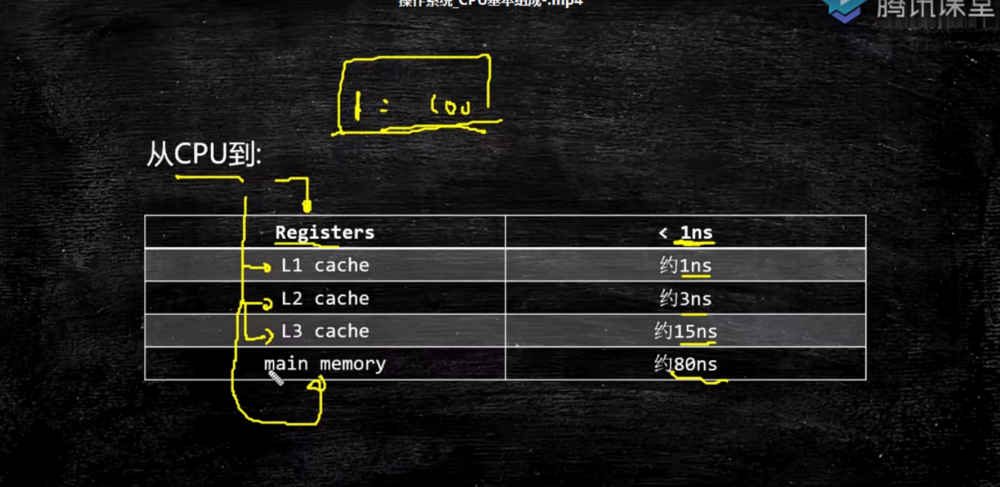

# 操作系统

## 硬件基础知识

- CPU通过**针脚接收高低平的电信号，从内存里面读取数据进行计算**
- 汇编语言
  - 用助记符代替机器指令
    - 机器指令：1000100111011000  汇编指令：mov ax,bx

## 计算机组成

- PC
  - 程序指令该执行哪条命令
- Register
  - 寄存器，存储cpu计算所需的数据。速度比内存更快。
- ALU
  - 算术逻辑运算单元，用来做计算的
- MMU
  - 内存管理单元
    - 逻辑地址到内存地址的转换
    - 修改CPU对内存的访问级别
    - MMU只是在读内存和写内存完成地址变换，以及更改CPU的访问级别
- CU
  - 控制单元，控制程序运行的自动化
- Cache

### CPU指令执行

- CPU指令执行是乱序的

  - **为啥DCL需要加volatile**

    - 对象在初始化过程中可能会存在指令重排，**其他线程可能会获取到半初始化的对象，然而这个对象还没有完全初始化，直接使用会有问题**。

    

    

    

- 防止CPU指令乱序执行

  - 加内存屏障

    - CPU层面
      - 硬件层面：intel -> 原语（mfence,lfence,sfence）或者锁总线

    

    - JVM层面
      - volatile & synchronized -> lock指令锁
      - 

### CPU-合并写技术

- write combining  buffer
  - 一般是4个字节
  - 由于ALU速度太快，所以在写入L1的同时，写入一个WC Buffer，写满了之后，再直接更新到L2
  - 

###  NUMA

- non uniform memory accesss
- ZGC - NUMA Aware
  - 分配内存会优先分配该线程所在CPU的最近的内存

#### UMA

## 计算机启动

- 《《30天自制操作系统》》

- 计算机通电 -》bios 芯片工作 -》自检 -》到硬盘固定位置加载bootloader -》 读取可配置信息 -》CMOS

## 操作系统基础知识

- 《《linux内核设计与实现》》

- 管理硬件
- 管理软件

- cpu区分不同指令级别
  - 用户态 & 内核态
    - linux内核跑在ring 0级别，用户程序跑在ring 3级别，对于系统的关键访问，需要经过Kernel的同意，这样才能保证系统的健壮性
    - 内核执行的操作 -》 200多个系统调用，eg：sendFile，read, write，pork，pthread

## 进程-线程-纤程-中断

- 进程和线程
  - 进程是OS分配资源的基本单位，分配的资源最重要的**独立的内存空间**
  - **线程是执行调度的基本单位**
  - 线程共享进程的内存空间，线程没有自己独立的内存空间
  - linux系统线程
    - fork函数创建一个线程，也就是一个普通进程，共享进程的内存空间

- 纤程

  - **跑在用户空间的线程**，是线程里面的线程，一个线程对应一个或者多个纤程。
  - **切换和调度不需要经过操作系统**
  - 优点
    - 占用资源少，线程1M，Fiber（纤程）4K
    - 切换比较简单
    - 可以启动10W+
  - 支持纤程的语言
    - Kotlin，Go，Python，Scala，Java

  - 应用场景
    - **很短的计算任务**，不需要和内核打交道，并发量高

### 僵尸进程

- 父进程创建号子进程，会维护号子进程的PCB（进程控制块），子进程执行完退出，父进程没有释放，那么子进程就会变成僵尸进程，一个空壳。

### 孤儿进程

- 父进程先执行完，子进程还在，孤儿进程会成为init的进程的孩子，由1号进程维护。

## 进程调度

-  采用CFS（Completely Fair Scheduler）调度策略, 也即是完全公平调度器，
  - 按照优先级分配时间的比例执行
- 默认调度策略
  - 实时进程采用FIFO ——》RR（Round Robin）-》普通

## 中断

- 操作系统和硬件通信的一种机制
- 

- 硬中断
  - 硬件给的中断：键盘，网卡，打印机
- 软中断
  - 软件给的中断：调用系统内核的函数，系统调用
  - 0x80函数打头，里面包含几百个函数
    - read
    - write
    - fork
- 中断处理过程
  - 敲入键盘一个字符 -》中断控制器 -》CPU固定位置执行固定程序 -》通知操作系统内核说执行程序来了 -》

## 内存管理

- 内存管理系统
  - 虚拟地址，分页，软硬件结合
    - 内存中分成固定大小的页框（4K），把程序（硬盘上）分成4k大小的块，用到哪一块就进行加载。
    - 加载过程中，如果内存满了，会把最不常用的一块加载到swap分区，把最新的一块把程序加载进来，也就是LRU（最不常用）算法。

- 

### 虚拟地址空间

- 分页解决了内存不够用的问题，内存满了用LRU算法（hash表+双向链表实现）
- 避免程序使用相同的地址空间，避免进程之间冲突，用虚拟地址
- 虚拟地址大小
  - 2^64 bit
- 站在虚拟的角度，进程是独享整个系统和CPU
- 作用
  - 保护物理内存，防止恶意程序对物理内存的访问

#### 内存地址映射

- 把逻辑地址映射成物理地址
- 内存映射：偏移量 +段的基地址=线性地址（虚拟空间）
- 线性地址通过os+MMU（硬件Memory Management Unit）
- 
- 

## ZGC

- 新一代垃圾收集器
  - 支持TB级别的内存
  - GC时间控制在10ms内
  - 对系统的吞吐量影响低于15%