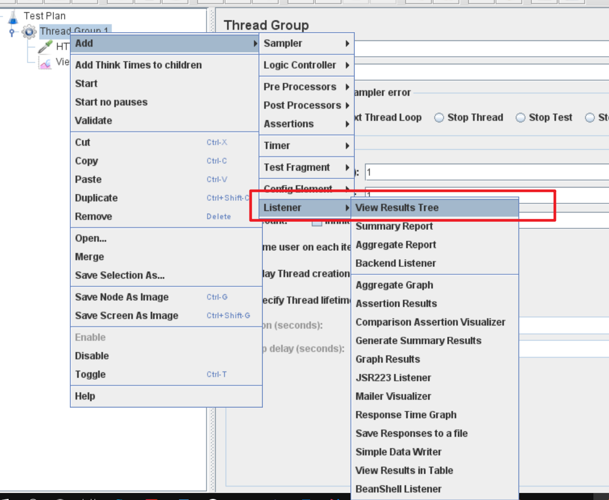
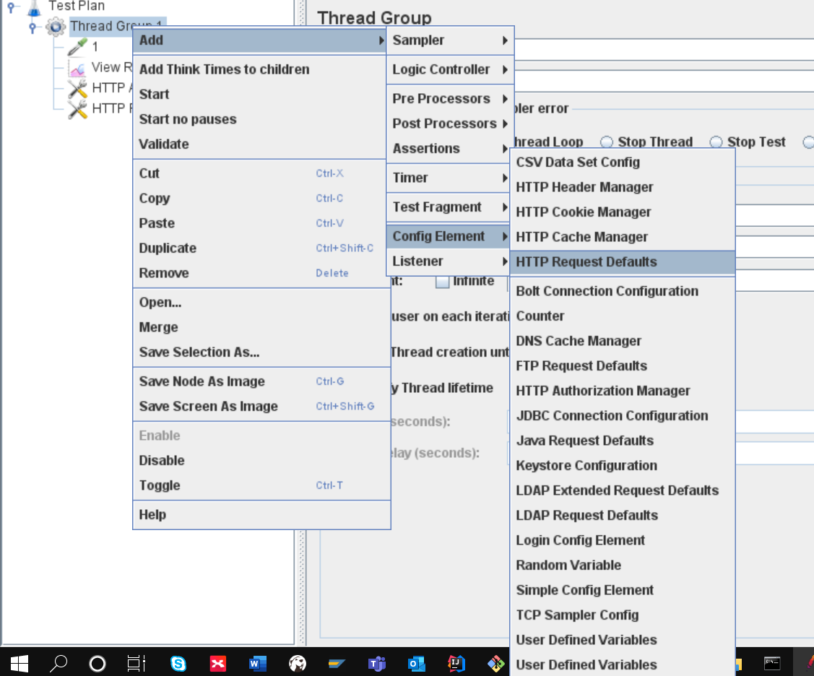
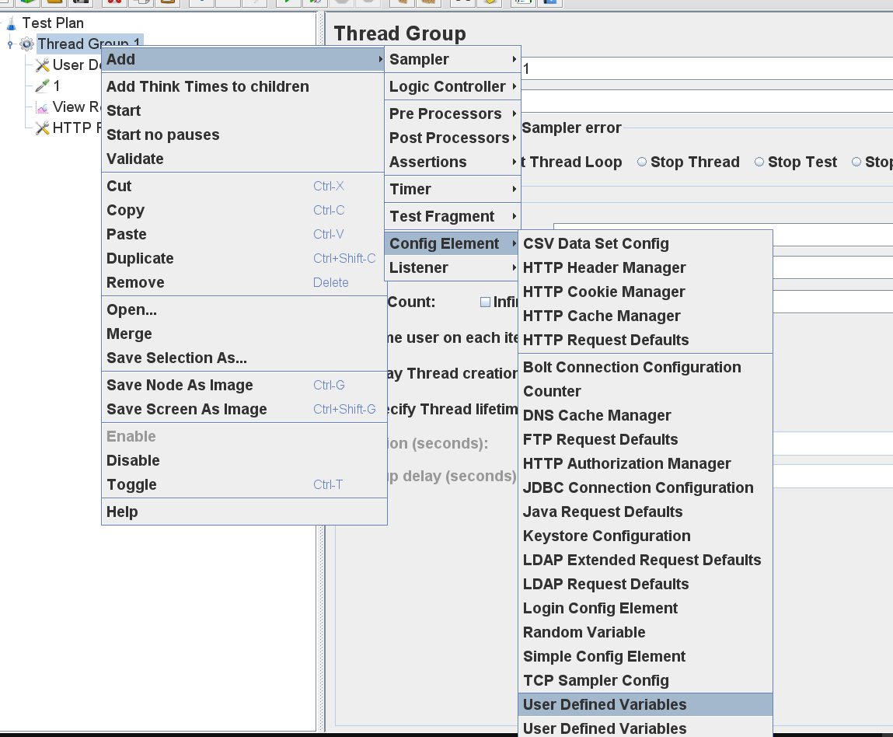
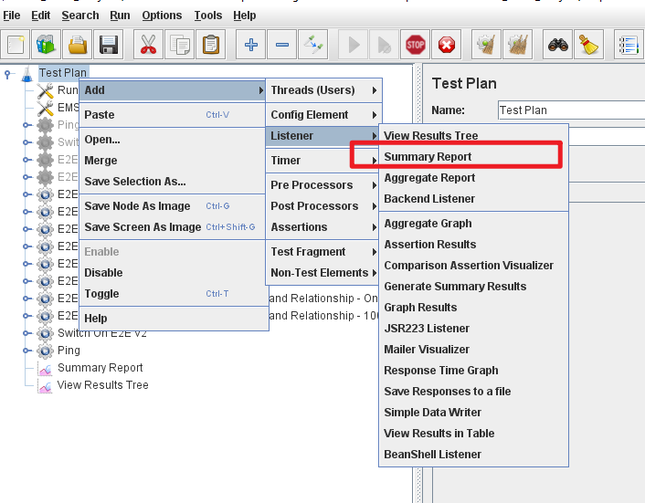
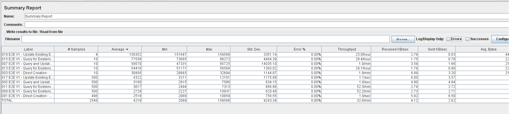
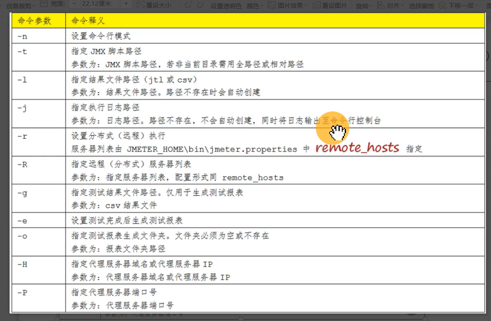

# JMeter

是什么：压力测试工具

## 测试领域

- 接口测试
- 数据库压力测试
- 批量产生测试数据

## UI运行JMeter

- Windows环境：{JMETER_HOME}/bin/jmeter-server.bat
- Linux环境：{JMETER_HOME}/bin/jmeter.sh &

## 如何发起一个HTTP Get请求

- 创建线程组 -》添加一个HTTP Get请求：填写域名/IP, 地址,请求参数等等信息 -》执行

- 如何查看结果：在线程组里面添加结果树

    

## 如何添加HTTP请求默认值

- 线程组右键 -》配置元件 -》HTTP Request Defaults

    

- 作用：放在所有HTTP Request前面，默认所有的HTTP Request都共有的值。如果说值修改了话，那么我们只需要修改一处即可。

## JMeter请求元件之用户自定义变量

- 就像postman里面的变量一样，请求前面定义，后面引用

    

## JMeter请求元件之foreach循环控制器

## JMeter压力测试场景

- 比较常用的业务场景
- 单业务场景/多业务场景（贴近用户的使用情况）
- 项目要求做的业务场景

### 压力测试并发是多少

- 有预期的数值？一次性达到多少？有上次性能测试的结果值？
- 无预期的数值？可以参考在线用户数20%作为

### 关注哪些参数

- 响应时间 1 3 5/ 2 5 8 -> 在性能测试的结果基础上进行调整
- TPS: 越高越好，有极限值。**根据并发数去调整。**
- 错误率：越低越好，90%的正确率是ok的。如果是金融业务，必须达到100%正确率。
- cpu和内存,队列，磁盘的使用情况：cpu不要超过80%, 内存不要超过80%，队列<1, **磁盘读写操作频率不要过高，过高的话，相应时间增加**。

## JMeter查看压力测试结果

- 重点关注指标
    - Average：平均响应时间（针对单个请求）
    - Median：中位数，50%用户的响应时间（针对用户而言）
    - Min：最小响应时间
    - Max：最大响应时间
    - Error%：本次测试中错误数/请求总数
    - Throughput：每秒处理的请求数

## JMeter命令行模式跑脚本

- 指定结果文件和日志路径
    - jmeter -n -t test.jmx -l report\01_result.csv -j report\01_log.log
        - 结果文件类型为jtl或csv，可以通过JMeter的聚合报告查看文件，最终结果。

### JMeter命令行生成HTML报告

- JMeter性能测试结束之后，自动生成本次测试的HTML图形化报告
- 使用一个已有的结果文件（jtl,csv）来生成此次结果的HTML图形化报告

#### 生成报告的命令

- jmeter -n -t <test JMX file> -l <test log file> -e -o <Path to output folder>
    - -e: 脚本结束后生成HTML报告
    - -o: 保存HTML报告的路径，此文件夹为空或者不存在