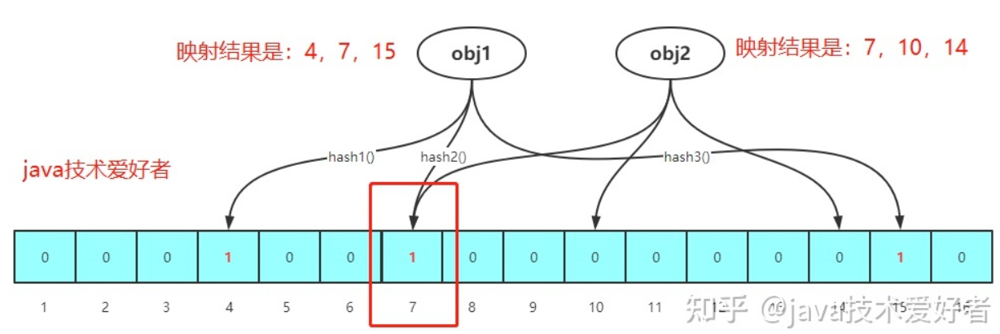

[TOC]

## Redis

#### 传统的RDBMS和NoSQL

1. RDBMS: 结构化数据；数据和关系存在表中；支持基础的事务。
2. Nosql: Not only SQL.
   - Nosql没有行列的概念，用key-value形式来存储数据。分类：列存储数据库，键值对存储数据库，文档类型数据库，图形数据库。

#### Redis是什么以及其作用

1. Remote Directory Server：原远程字典服务。
2. 作用：
   - Key-Value存储的系统
   - 支持高速缓存
   - 数据持久化
   - 支持发布订阅系统
3. 特性
   - 支持多种数据类型
   - 持久化
   - 集群
   - 事务

#### Redis 安装

1. Redis for windows

```
https://github.com/MicrosoftArchive/redis/releases
```

2. 下载Windows版本


3. 安装完成之后，启动服务器端和客户端，分别点击：redis-server.exe/redis-cli.exe


4. 测试客户端是或连接上服务器端


5. 关闭Redis服务：shutdown

#### Redis基础知识

1. DB：默认有16个DB
2. Redis是单线程还是多线程，为什么它能这么快？
3. 五种数据类型
   - String
   - List
   - Set
   - Hash
   - Zset

#### Redis常用命令

```
127.0.0.1:6379> set name leo	#设置key
OK
127.0.0.1:6379> keys *			#查看所有key
1) "name"
127.0.0.1:6379> get name		#获取key的value
"leo"
127.0.0.1:6379> exists name		#是否存在key
(integer) 1
127.0.0.1:6379> exists leo
(integer) 0
127.0.0.1:6379> expire name 10	#设置key过期时间，10s
(integer) 1
127.0.0.1:6379> ttl name		#查看key即将过期时间
(integer) 7
127.0.0.1:6379> ttl name
(integer) 3
127.0.0.1:6379> ttl name
(integer) 0
127.0.0.1:6379> get name
(nil)
127.0.0.1:6379> set age 27
OK
127.0.0.1:6379> keys *
1) "age"
127.0.0.1:6379> move age 1		#移除key
(integer) 1
127.0.0.1:6379> keys *
(empty list or set)
127.0.0.1:6379> type age		#查看key的类型
string
127.0.0.1:6379> type name
string
```

#### 五大数据类型


​	

##### String

- 常用的命令
  - getrange key start end
  - getset key value
  - mget key1 key2
  - mset key1 value1 key2 value2
  - setex key milisecounds value
  - setnx key value
  - strlen key
  - incr key
  - incrby key increment
  - decr key
  - decrby key decrement
  - append key value

```
127.0.0.1:6379> keys *
1) "age"
2) "name"
127.0.0.1:6379> get name
"leo"
127.0.0.1:6379> getrange name 0 2 	#从start到end,位置获取Key的值,闭区间
"leo"
127.0.0.1:6379> getset name LEO 	#获取key的值并显示，最后用新值替换旧值
"leo"
127.0.0.1:6379> get name
"LEO"
127.0.0.1:6379> getset gender female #获取key的值并显示，最后用新值替换旧值
(nil)
127.0.0.1:6379> get gender
"female"
127.0.0.1:6379> mget name gender	#获取多个key的值
1) "LEO"
2) "female"
127.0.0.1:6379> setex name 10 bbb 	设置key的值为bbb并在10s后过期
OK
127.0.0.1:6379> get name
"bbb"
127.0.0.1:6379> ttl name
(integer) 5
127.0.0.1:6379> ttl name
(integer) 2
127.0.0.1:6379> get name
(nil)
127.0.0.1:6379> setnx name BBB	#当key不存在的时候，才创建其值
(integer) 1
127.0.0.1:6379> get name
"BBB"
127.0.0.1:6379> setnx name bbb
(integer) 0
127.0.0.1:6379> get name
"BBB"
127.0.0.1:6379> mset key1 value1 key2 value2	#同时创建或者更新多个key-value键值对
OK
127.0.0.1:6379> mget key1 key2
1) "value1"
2) "value2"
127.0.0.1:6379> strlen key1			#获取key的值的长度
(integer) 6
127.0.0.1:6379> get age
"2"
127.0.0.1:6379> incr age		# key对应的value值加1自增
(integer) 3
127.0.0.1:6379> incr age
(integer) 4
127.0.0.1:6379> decr age		# key对应的value值减1自减
(integer) 3
127.0.0.1:6379> decr age
(integer) 2
127.0.0.1:6379> incrby age 10	# key对应的value值按照指定步长增长
(integer) 12
127.0.0.1:6379> incrby age 10
(integer) 22
127.0.0.1:6379> decrby age 10	# key对应的value值按照指定步长减少
(integer) 12
127.0.0.1:6379> decrby age 10
(integer) 2
127.0.0.1:6379> get name
"BBB"
127.0.0.1:6379> append name CCC		#key对应的value值最后添加新的内容
(integer) 6
127.0.0.1:6379> get name
"BBBCCC"
```

##### String应用场景

- 单值缓存 set key value; get key

- 对象缓存

    - set user:1 value(json 格式数据)

    - mset user:1:name zhuge user:1:balance 2000

    - mget user:1:name user:1:balance

        

- 分布式锁

    - setnx：如果key不存在就创建，存在就忽略

    ```
    setnx product:10001 true //返回1表示获取锁成功
    setnx product:10001 false //返回0表示获取锁成功
    执行业务操作
    del product:10001 //操作完释放锁
    set product:10001 true ex 10 nx //设置过期时间，防止程序异常导致死锁
    ```

- **文章的阅读量：**incr article:readCount:101(101文章id)
- **分布式系统全局序列号**
    - incrby oderid 1000
    - 高并发情况下创建订单，订单的id由redis生成，每次id自增。Redis可以一次生成1000个序列号，订单的id直接从生成的1000个序列号里面获取，没有的话再创建1000个序列号。这样可以提升系统的性能。

##### List


- 数据结构：采用**双向链表存储数据**
- 常用命令：
  - lpush list value [value1 ...]
  - lrange list start end 
  - linsert list before value value1
  - linsert list after value value1
  - lindex list index
  - lpop list
  - rpop list
  - ltrim list start end
  - lset list index value

```bash
127.0.0.1:6379> lpush key 1 2 3		#从左边插入元素
(integer) 3
127.0.0.1:6379> keys *
1) "key"
127.0.0.1:6379> lrange key 0 -1		#查看列表中所以元素
1) "3"
2) "2"
3) "1"
127.0.0.1:6379> linsert key after 1 0	#往列表中的1元素的后面插入0
(integer) 4
127.0.0.1:6379> lrange key 0 -1
1) "3"
2) "2"
3) "1"
4) "0"
127.0.0.1:6379> linsert key before 3 4		#往列表key中的3的前面插入4
(integer) 5
127.0.0.1:6379> lrange key 0 -1
1) "4"
2) "3"
3) "2"
4) "1"
5) "0"
127.0.0.1:6379> lindex key 4		#获取列表中第4个元素的下标
"0"
127.0.0.1:6379> lpop key			#弹出列表中最左边的元素
"4"
127.0.0.1:6379> lrange key 0 -1
1) "3"
2) "2"
3) "1"
4) "0"
127.0.0.1:6379> lrange key 0 -1
1) "3"
2) "2"
3) "1"
127.0.0.1:6379> ltrim key 0 1		#按照范围修剪列表
OK
127.0.0.1:6379> lrange key 0 -1
1) "3"
2) "2"
127.0.0.1:6379> lset key 0 0		#修改指定下标元素值
OK
127.0.0.1:6379> lrange key 0 -1		
1) "0"
2) "2"
```

##### List应用场景

- **粉丝列表**

##### Set

- 数据结构：hashtable + inset来实现；inset底层是一个数组。

1.  数据结构以及特性：通过哈希表实现；因此**Set集合中元素不会重复出现**，并且元素是**无序**的。查找删除元素的时间复杂度是O(1).
2.  常用命令
   -    sadd key value1 [value2...]
   -    smembers key
   -    ​    sismember key
   -    ​    srem key value1 [value2...]
   -    ​    scard key
   -    spop key
   -    srandmember key [count] 
   -    smove source destination value
   -    sdiffstore destination key1 key2 [key3...]
   -    sinter key1 key2
   -    sunion key1 key2

```bash
127.0.0.1:6379> sadd myset key1 key2 key3 #往set集合中添加元素
(integer) 3
127.0.0.1:6379> smembers myset			#查看set集合中所有元素
1) "key3"
2) "key2"
3) "key1"
127.0.0.1:6379> sismember myset key3	#查看某元素是否在set集合中
(integer) 1
127.0.0.1:6379> srem myset key3 key2	#删除set集合中某个元素
(integer) 2
127.0.0.1:6379> smembers myset
1) "key1"
127.0.0.1:6379> scard myset			#查看set集合中元素个数
(integer) 1
127.0.0.1:6379> srandmember myset	#随机获取set集合中的元素
"key3"
127.0.0.1:6379> srandmember myset 2 #随机获取set集合中2个元素
1) "key3"
2) "key2"
127.0.0.1:6379> srandmember myset 2
1) "key1"
2) "key4"
127.0.0.1:6379> spop myset		#弹出set集合中
"key6"
127.0.0.1:6379> smove myset mysetCopy key5 #把元素key5从Set集合1移动到Set集合2中
(integer) 1
127.0.0.1:6379> smembers mysetCopy
1) "key5"
127.0.0.1:6379> smembers myset
1) "key2"
2) "key3"
3) "key1"
4) "key4"
127.0.0.1:6379> sadd myset2 key5 key6 key7
(integer) 3
127.0.0.1:6379> sadd myset2 key4
(integer) 1
127.0.0.1:6379> smembers myset2
1) "key5"
2) "key4"
3) "key7"
4) "key6"
127.0.0.1:6379> sdiffstore myDiffSet myset myset2 #比较两个集合的差集（以第一个元素为基准），并把结果存放的myDiffSet中
(integer) 3
127.0.0.1:6379> smembers myDiffSet
1) "key3"
2) "key1"
3) "key2"
127.0.0.1:6379> sinter myset myset2		#计算两个集合的交集
1) "key4"
127.0.0.1:6379> sunion myset myset2		#计算两个集合的并集
1) "key6"
2) "key7"
3) "key2"
4) "key3"
5) "key5"
6) "key1"
7) "key4"
```

##### Set应用场景

- 共同好友
- 利用为理性，统计网站的所有ip

##### Hash-字典

- 存储结构：ziplist & hashtable

- hset myhash k1 v1

- hmset myhash k1 v1 k2 v2
- hget myhash k1
- hmget myhash k1 k2
- hgetall myhash
- hdel myhash key1 [key2...]
- hlen myhash 
- hexists myhash k1
- hkeys myhash
- hvals myhash 
- hincrby myhash k1 1
- hsetnx myhahs k1 v1

```bash
127.0.0.1:6379> hset myhash key1 value1			#设置myhash表的key-value
(integer) 1
127.0.0.1:6379> hmset myhash k1 v1 k2 v2		#批量设置myhash表的key-value
OK
127.0.0.1:6379> hset myhash k1 vv				
(integer) 0
127.0.0.1:6379> hget myhash k1					#通过key获取myhash的value		
"vv"
127.0.0.1:6379> hmget myhash k1 k2				#通过key批量获取myhash的value
1) "vv"
2) "v2"
127.0.0.1:6379> hgetall myhash					#获取myhash表中所有的键值对
1) "key1"
2) "value1"
3) "k1"
4) "vv"
5) "k2"
6) "v2"
127.0.0.1:6379> hdel myhash key1
(integer) 1
127.0.0.1:6379> hgetall myhash
1) "k1"
2) "vv"
3) "k2"
4) "v2"
127.0.0.1:6379> hdel myhash k0 k1 k2		#通过key删除myhash表中所有的value
(integer) 2
127.0.0.1:6379> hgetall myhash
(empty list or set)
127.0.0.1:6379> hmset myhash k1 v1 k2 v2 k3 v3	#获取myhash表中键值对个数
OK
127.0.0.1:6379> hlen myhash
(integer) 3
127.0.0.1:6379> hexists myhash k1			#查看myhash表中k1是否存在
(integer) 1
127.0.0.1:6379> hexists myhash k0		
(integer) 0
127.0.0.1:6379> hkeys myhash				#获取myhash表中所有的key
1) "k1"
2) "k2"
3) "k3"
127.0.0.1:6379> hvals myhash				#获取myhash表中所有的value
1) "v1"
2) "v2"
3) "v3"
127.0.0.1:6379> hincrby myhash k1 1			
(error) ERR hash value is not an integer
127.0.0.1:6379> hgetall myhash
1) "k1"
2) "v1"
3) "k2"
4) "v2"
5) "k3"
6) "v3"
127.0.0.1:6379> hset myhash k1 1			
(integer) 0
127.0.0.1:6379> hincrby myhash k1 1			#myhash表key对应value值增加1
(integer) 2
127.0.0.1:6379> hget myhash k1
"2"
127.0.0.1:6379> hsetnx myhash k1 1
(integer) 0
127.0.0.1:6379> hgetall myhash
1) "k1"
2) "2"
3) "k2"
4) "v2"
5) "k3"
6) "v3"
127.0.0.1:6379> hsetnx myhash k4 v4		#往myhash表中添加元素，如果key存在则添加失败
(integer) 1
127.0.0.1:6379> hgetall myhash
1) "k1"
2) "2"
3) "k2"
4) "v2"
5) "k3"
6) "v3"
7) "k4"
8) "v4"
```

##### Hash应用场景

- 数据结构类似于HashMap

- 对象缓存 hset table pk:column1 value1 pk:column2 value2

    - hset user 1:name leo 1:balance 1000

- **电商购物车**

    - 用户id为key
    - 商品id为field
    - 商品数量为value
        - hset cart:i337040 10001 1 //用户i337040往购物车添加1件商品10001
        - hincreby cart:i337040 10001 1//用户i337040往购物车添加1件商品10001
        - hgetall cart:i337040 //查看i337040用户购物车

- 优点：相比于String来说，查询效率更高，存储的空间更少

- 缺点：**在集群模式下**，hash算法没有设计好，多个hash key都落在一台结点上，会导致**数据倾斜**。这样违背了集群架构设计的初衷，集群架构设计目的是为了数据尽可能的均衡的存储在各个结点上。

    

##### ZSet

- 有序集合，往集合里面添加元素，前面会加一个score，通过score对集合元素排序

- zadd key score memeber[]

- 存储结构

    - ziplist（压缩列表）: 特殊编码，一块连续的内存组成的数据结构，**Redis为了节约内存空间而引入的**。里面通过**entry结点来存储**元素。

        - 底层就是一个链表

        - 元素个数小于128

        - 所有元素长度小于64字节

            

    - skiplist（跳表）

        

        - 在链表的基础上建立的多级索引，从而提高查询/更新元素的效率，设计思想是根据二分查找来的
        - 查询更新删除时间复杂度：log(n)
        - 插入和删除元素的过程中，索引结构会不断的变化，通过随机函数来决定元素插入在哪一层。

###### Redis中ZSet没什么不用红黑树来实现

- 跳表实现简单，红黑树更加复杂
- 对于范围查询来说，跳表的时间复杂度更低

##### ZSet应用场景

- **微博热度排行榜** -> 通过score来决定排行榜

#### 三种特殊类型

- Geo地址位置

  - 底层数据结构：采用ZSet有序集合存储数据
  - 命令
    - geoadd key logtitude latitude member [key2 longtitude latitude member2]
    - geodist key member1 member2
    - geopos key member
    - georadius key longtitude latitude radius m|km|ft|mi
    - geodiusbymember key member radius m|km|ft|mi
    - geohash key memeber [member1...]

  ```bash
  127.0.0.1:6379> geoadd cities 116.23128 40.22077 beijing  121.48941 31.40527 shanghai #往地理位置集合中添加坐标
  (integer) 2
  127.0.0.1:6379> geodist cities beijing shanghai #计算两个坐标的距离
  "1088644.3544"
  127.0.0.1:6379> geoadd cities 104.10194 30.65984 chengdu  106.54041 29.40268 chongqing
  (integer) 2
  127.0.0.1:6379> geopos cities chengdu	#查看地址位置坐标：经度和纬度
  1) 1) "104.101941883564"
     2) "30.65983886217613"
  127.0.0.1:6379> georadius cities 104 30 100 km	#在地址位置集合中查找给定坐标在指定半径的坐标
  1) "chengdu"
  127.0.0.1:6379> georadius cities 104 30 1000 km
  1) "chongqing"
  2) "chengdu"
  127.0.0.1:6379> georadiusbymember cities chengdu 500 km #在地址位置集合中查找给定元素在指定半径的元素
  1) "chongqing"
  2) "chengdu"
  127.0.0.1:6379> geohash cities chengdu #经纬度经过geohash运算后得到的base32编码的字符串
  1) "wm6n2vkwx00"
  127.0.0.1:6379> zrange cities 0 -1 #Geo底层数据结构就是使用ZSet来进行存储的
  1) "chongqing"
  2) "chengdu"
  3) "shanghai"
  4) "beijing"
  ```


-    Hyperloglog

     - 作用：用来做基数统计，集合不重复元素
     - 优点：输入的数据量特别大，比如说传统的用Java程序去基数统计，需要用到for循环比较，相比于Java程序处理而言，Hyperloglog只需要占用12KB就能够处理当前任务。但这个基数统计有0.81%的误差。
     - 应用场景：页面访问量
     - 命令
       - pfadd key value1 [value2...]
       - pfcount key
       - pfmerge key key1 key2 [key3...]

     ```bash
     127.0.0.1:6379> pfadd mylog 1 2 3 4 5	#将元素添加到Hyperloglog中
     (integer) 1
     127.0.0.1:6379> pfadd mylog 56789
     (integer) 1
     127.0.0.1:6379> pfadd mylog 5 6 7 8 9
     (integer) 1
     127.0.0.1:6379> pfcount mylog		#计算Hyperloglog数量
     (integer) 10
     127.0.0.1:6379> pfadd mylog1 1 2 3
     (integer) 1
     127.0.0.1:6379> pfmerge mylog3 mylog1 mylog2
     OK
     127.0.0.1:6379> pfcount mylog3
     (integer) 3
     127.0.0.1:6379> pfmerge mylog3 mylog mylog1	#将多个Hyperloglog合并成一个新的Hyperloglog
     OK
     127.0.0.1:6379> pfcount mylog3
     (integer) 10
     ```

- BItmap

   - 用一位(bit)来表示元素的状态。
   - 应用场景：用户签到/用户是否在线
   - 命令
     - setbit key offset value #注意offset只能在0-2^32之间
     - getbit key offset
     - bitcount key

### Redis事务

- 通过四个命令来支持事务操作。

  - MULTI/DISCARD/EXEC/WATCH

- 所有任务都放在队列里面等待执行

- 不具备原子性：Redis性能非常高效，每秒10万次IO读写，因此它为了追求性能而放弃事务回滚机制，所以它不具备原子性。当然如果在编译阶段，Redis开启了事务，有一批命令，其中检测到某条命令有语法错误，那么这个时候编译就通不过，整个事务都会执行失败。

  - 编译期间出错

  - ```bash
    #编译期间出错，那么队列里面所有的命令都将放弃执行
    127.0.0.1:6379> multi
    OK
    127.0.0.1:6379> set k1 v1
    QUEUED
    127.0.0.1:6379> set k2 v2
    QUEUED
    127.0.0.1:6379> setget k3 v3
    (error) ERR unknown command 'setget'
    127.0.0.1:6379> exec
    (error) EXECABORT Transaction discarded because of previous errors.
    ```

  - 运行期间出错

    - ```bash
      127.0.0.1:6379> set k1 v1
      QUEUED
      127.0.0.1:6379> set k2 v2
      QUEUED
      127.0.0.1:6379> incr k1	#由于前面k1的值是string类型，因此该命令会执行失败
      QUEUED
      127.0.0.1:6379> set k3 v3
      QUEUED
      127.0.0.1:6379> exec
      1) OK
      2) OK
      3) (error) ERR value is not an integer or out of range
      4) OK
      127.0.0.1:6379> get k1	#前面命令会执行失败并不会影响其他命令的正确执行
      "v1"
      127.0.0.1:6379> get k3
      "v3"
      ```

- 乐观锁

  - 通过watch命令来实现乐观锁机制
  - 使用：watch key。来监视当前key是否被其他客户端或者事务修改掉，如果没有修改那么当前事务成功执行，如果被修改了，那么服务器拒绝执行当前事务并返回一个nil(空)的回复。

```bash
127.0.0.1:6379> watch k1
OK
127.0.0.1:6379> multi
OK
127.0.0.1:6379> get k1
QUEUED
127.0.0.1:6379> set k2 vv2
QUEUED
127.0.0.1:6379> set k3 vv3
QUEUED
127.0.0.1:6379> exec	#服务器拒绝执行当前事务，因为其他事务修改了k1的值
(nil)
```
### Jedis

- 常用的命令

  - 导入依赖

  - ```
    <dependency>
      <groupId>redis.clients</groupId>
      <artifactId>jedis</artifactId>
      <version>3.2.0</version>
    </dependency>
    ```

  - ```java
    Jedis jedis = new Jedis("127.0.0.1", 6379);
    jedis.flushAll();
    jedis.set("k1","v1");
    jedis.set("k2","v2");
    jedis.get("k1");
    ```

- Jedis操作事务

  - ```java
    package org.example;
    
    import redis.clients.jedis.Jedis;
    import redis.clients.jedis.Transaction;
    
    /**
     * Hello world!
     *
     */
    public class App 
    {
        public static void main( String[] args )
        {
            Jedis jedis = new Jedis("127.0.0.1", 6379);
            jedis.flushAll();
            Transaction transaction = null;
            try
            {
                transaction = jedis.multi();
                //jedis.incr("k1");
                transaction.set("k2","v2");
                transaction.set("k1","v1");
                int i = 1/0;	//编译期间异常会导致队列中所有操作都失败
              					//如果修改成transction.incr("k1");那么不影响其他指令的运行
                System.out.println(transaction.get("k1"));;
                System.out.println(transaction.get("k2"));;
                transaction.exec();
            }
            catch (Exception ex)
            {
                transaction.discard();
                System.out.println("transaction was discarded.");
                transaction.close();;
                //jedis.disconnect();;
            }
    
        }
    }
    ```

### SpringBoot整合

1. 源码

   ```java
   @Bean
   @ConditionalOnMissingBean(name = "redisTemplate") //当前bean不存在那么才会创建
   												//我们可以自定义RedisTemplate
   public RedisTemplate<Object, Object> redisTemplate(
     RedisConnectionFactory redisConnectionFactory)
     throws UnknownHostException {
     RedisTemplate<Object, Object> template = new RedisTemplate<Object, Object>();
     template.setConnectionFactory(redisConnectionFactory);
     return template;
   }
   
   @Bean
   @ConditionalOnMissingBean(StringRedisTemplate.class)
   public StringRedisTemplate stringRedisTemplate(RedisConnectionFactory redisConnectionFactory) 	//由于Redis中我们常用的类型是String类型
     						//因此单独提供了一个StringRedisTemplate
     throws UnknownHostException {
     StringRedisTemplate template = new StringRedisTemplate();
     template.setConnectionFactory(redisConnectionFactory);
     return template;
   }
   ```

   2.整合

   - 导入依赖

     ```
     <dependency>
       <groupId>org.springframework.boot</groupId>
       <artifactId>spring-boot-starter-data-jpa</artifactId>
     </dependency>
     <dependency>
       <groupId>org.springframework.boot</groupId>
       <artifactId>spring-boot-starter-data-redis</artifactId>
     </dependency>
     ```

   - 修改配置文件

   - ```
     spring.redis.host=127.0.0.1
     spring.redis.port=6379
     ```

   - 通过单测进行测试

### 持久化

1.为什么要有持久化的功能？

- 因为我们的Redis是内存数据，数据存放在内存中，会存在断电即失的情况。因此Redis需要相应的持久化的功能来保证我们的数据不会被丢失。

2.有哪些持久化机制？

- RDB和AOF

3.谈谈你对RDB持久化机制的理解？

- 总述：RDB持久化它是把数据集通过**快照的形式保存到我们磁盘**上。

- 触发机制：

  - 手动触发：

    - save

    - bgsave：主要命令

      | 命令    | save                             | bgsave（主）                 |
      | ----- | -------------------------------- | ------------------------- |
      |       | 同步                               | 异步                        |
      | 阻塞    | 是（在持久化过程中，其他redis client的命令会被阻塞） | 是（只发生在主进程fork子进程的过程）      |
      | 时间复杂度 | O(n)                             | O(n)                      |
      | 优点    | 不会消耗额外的内存                        | 不会阻塞其他客户端的命令              |
      | 缺点    | 阻塞客户端命令，有可能时间比较长                 | 调用fork命令，需要消耗额外内存空间去创建子进程 |

  - 自动触发：通过Redis配置文件，在**指定时间内key修改了多少次就会触发bgsave持久化操作**。

  优点：

  - rdb机制数据恢复速度比aof更快。
  - rdb文件内容为**二进制**的数据，占用内存小，更加的紧凑，适合作为备份文件。

  缺点：

  - **存在数据丢失的风险**。我们知道数据持久化操作是需要在一定的时间间隔，如果这段时间间隔内Redis宕机了，那么数据会被丢失。

4.AOF

- 如何开启：配置文件中默认是不开启AOF持久化操作，如果我们想要开启该功能，需要设置appendonly yes

- 流程：比如说我们通过执行Redis命令写入一条数据，那么这条命令首先被追加到AOF缓冲区，之后通过Redis文件中配置的同步机制(no,always,everysec)来决定何时将你的命令从缓冲区同步到appendonly.aof文件中。

- AOF三种同步机制：

  - no：什么时候进行同步是根据**操作系统来决定**的。可能存在大量命令指令丢失，**是不安全的**。
  - always：**每次数据变更会立即同步到磁盘**，**性能最差**，但是数据完整性最好。
  - everysec：AOF持久化操作默认的同步机制。**每隔一秒做一次同步，可能存在丢失一秒数据的情况**。

- 文件重写：

  - 随着时间的推移，那么AOF文件会越来越大，会存在两个问题

    - 问题1：磁盘占用空间越来越大。
    - 问题2：会造成以后**Redis宕机**了，Redis恢复之后，需要通过**AOF文件里面的命令**来还原Redis宕机之前数据库里面的数据，这个还原的过程就比较耗时。因此这个AOF文件不是越大越好，所以我们需要对文件进行重写。

  - 重写规则：Redis会创建一个新的AOF文件来替换掉旧的AOF文件，但是这两个文件的**数据库中保存的数据是一致**的。但是新的AOF文件会比旧的AOF文件体积小很多。

  - 重写原理：从数据库中度取出某个键的值，**通过一条命令来替换掉多条命令**。从而减少了AOF文件的体积。

  - 重写流程：异步操作

    - Redis进程会创建一个子进程，通过子进程对AOF文件进行重写。
    - 从创建**子进程**开始，**父进程**不仅要将命令写入**AOF缓冲区**，还需要将命令写入**重写缓冲区**。写入重写缓冲区的目的是：在子进程重写AOF文件的过程中，父进程接收的命令可能会对数据库进行修改，从而导致当前数据库的数据和重写后的AOF文件所保存的数据库里面的数据不一致。
    - 当子进程处理完毕之后，会**通知父进程**其处理完毕。这个时候**父进程会将AOF重写缓冲区里面的数据写到新的AOF文件**中，这样就保证了新的AOF文件所保存的数据和当前数据库的数据一致。
    - 新的AOF文件会替换掉就的AOF文件。

  - 同步触发机制：

    - 手动：bgrewriteaof

    - 配置文件

      ```
      auto-aof-rewrite-percentage 100
      auto-aof-rewrite-min-size 64mb
      #解释配置文件：当前AOF文件大于64MB，并且比上次重写的时候的体积大了一倍。
      #如果说之前没有重写过，那么上次重写时候的体积就是Redis启动的时候aof文件的大小。
      
      # This is how it works: Redis remembers the size of the AOF file after the
      # latest rewrite (if no rewrite has happened since the restart, the size of
      # the AOF at startup is used).
      ```

### RDB和AOF区别

1.实现方式

- RDB是将某个**时间点的数据集以快照的形式持久化到RDB文件中**
- AOF把Redis所有写命令持久化道AOF文件中

2.文件体积

- **RDB记录的是二进制的数据集，而AOF记录的是过程**，因此AOF在后期文件会越来越大。但是针对AOF文件越来越大的问题，Redis提供了AOF文件重写机制来减小文件体积。

3.安全性

- **AOF持久化的安全性比RDB更高**，因为它丢失的数据更少。

4.**优先级**

- 如果Redis开启了AOF持久化功能，**会优先使用AOF文件来还原数据**。如果说没有开启AOF持久化功能，那么会使用RDB文件来还原数据。因此AOF优先级比RDB更高。

### Redis发布订阅

- 应用场景：订阅微信公账号，接收微信公众号的推送信息。实时的消息系统，比如及时聊天和群聊。
- 是一种消息通信模式。发送者通过channel发送消息给接收者，接受者者通过才channel接收消息。一个channel可以被多个接收者订阅，同样一个接受者可以订阅多个channel。订阅了同一个Channel的接收者会组成一个链表，那么发送者发送消息给channel，那么可以通过链表找到订阅了该channel的所有接收者。
- 常用命令：publish, subscribe, unsubscribe.
- 与消息队列区别：
  - 持久化：MQ支持持久化操作，数据从生产者发送给消费者之前，会持久到本地磁盘，当消费者消费完数据之后持久化到DB之后再告诉生产者把该条记录删除掉。而Redis发布订阅模型不支持持久化操作，数据可能丢失。
  - 消息保障：Redis没有Ack机制，不保证可靠传输，可能会因为网络原因导致数据丢失，MQ不会。

### Redis主从复制

1.高可用集群：我们知道单节点Redis服务，一旦服务down掉，那么整个Redis服务就不可用了。因此我们需要搭建高可用Redis服务集群，一般是一台主服务器，多台slave服务器。master负责写操作，而slave负责读的操作。

2.主从复制：

- 全量复制

  - 当master结点进行初始化的时候（或者主结点重启），从结点会把master的数据全部复制一份。

  - 流程

    - 从结点向主结点发送一个psync命令给主结点进行全量复制。

    - 主结点收到命令之后，执行bgsave在后台生成RDB文件，并且在生成RDB文件的过程中能够接收新的写命令，并把写命令追加到复制缓冲区。

    - 主结点执行完bgsave之后，将RDB文件发送给从节点。从结点收到RDB文件之后并解析其内容，把相应数据持久化。

    - 主结点会把复制缓冲区里面的写命令发送给从结点，**从结点会执行这些命令从而达到了主从服务器数据一致的效果。**

      


    - 全量复制缺点：
      - 主结点调用bgsave去fork一个子进程，通过子进程去生成RDB文件。这个过程非常消耗CPU，内存和磁盘空间。
      - 主结点发送RDB文件给从结点，如果文件内容比较大，那么会占用较大的网络带宽。
      - 从结点清除旧的数据，载入新的RDB文件的过程是阻塞的，也就是这个期间从结点不能做其他事情。效率比较低下。

- 增量复制

  - 由于全量复制在数据量很大情况下效率低下，在Redis2.8以后引入了增量复制，也就是主结点初始化完成之后，新写入的部分命令，这部分命令才会被同步到所有的从结点。
  - 增量复制的实现依赖于3个概念：
    - 复制偏移量（OffsetID）
      - 主从结点都会维护一个复制偏移量，当主结点向从结点同步了N字节数据之后，主结点的偏移量就变成Offset+N，从结点接收到N字节数据之后它的偏移量变成Offset+N。这样通过比较主从结点的偏移量是否一致来判定他们的数据库状态是否一致。
    - 服务器ID(RunID)：每台服务器启动的时候对应的ID，主结点会将自己的ID发送给从结点，从结点会保存主结点id，每次数据同步就是根据id来判断同步的进度。
    - 复制积压缓冲区
      - 主结点维护了一个队列作为复制积压缓冲区，默认大小为1MB。主结点在命令传播时，不仅会将写命令发送给从结点还会将命令复制到复制积压缓冲区中。

- 从结点怎么判断何时采用增量复制还是全量复制呢？

  - 从结点发送psync给主结点，里面携带了runid,offsetId，主结点根据从结点的offsetid和需要同步的数据量判定其是否超过了复制积压缓冲区，如果超过了那么进行全量复制，如果没有，那么进行增量复制。


- 命令传播
  - 数据同步阶段完成之后，主结点会进入命令传播阶段。主结点接收到的新的写命令会发送给从结点，从结点收到写命令并执行从而保证了主从数据库状态一致。

3.主从复制作用：

-   高可用基石
-   故障恢复
-   负载均衡：主结点负责写，从结点负责读。

### Redis哨兵模式

1.什么是哨兵

-   它是一个分布式系统，它会对我们的Redis服务中的master和所有slave结点进行监控，当master宕机之后，它们会通过从slave节点中投票选举出新的master结点，并将slave结点连接到新的master结点。
-   作用
    -   监控：对master和slave进行监控，看他们是否正常运行。
    -   通知：被监控的结点如果出现故障，它会通知其他结点和其他哨兵。
    -   故障转移：master宕机之后，会选举一个slave作用新的master结点，让其复制写的操作。

2.为啥要引入哨兵模式

-   我们知道，Redis高可用集群如果说没有哨兵模式，当master结点down掉了，我们需要手动的触发，把其中一个slave结点作为master启动。
    -   造成问题：
        -   需要人工干预，费时费力，不智能。
        -   会造成一段时间服务不可用，master主要负责写，如果说master down掉，写操作就被block。

3.哨兵工作原理

-   监控阶段：每个哨兵会向master，slave以及其他的哨兵获取状态。sentinel之间通过发布订阅模型进行信息的同步共享。

-   通知阶段：

-   故障转移阶段：sentinel A向master发送信息，但是没有得到master的回复，经过指定时间过后，sentinel 标记为master 为s_down（主管下线）.这个时候其他的哨兵也会和master进行通信，如果说一半以上的哨兵都觉得它s_down掉了，那么这个时候master会从s-down变成o_down（客观下线），那么master确实是挂掉了。

    同样，哨兵之间会推选出一名哨兵从slave节点中选择其中一个slave结点成为master结点。怎么选呢？

    -   在线的slave

    -   剔除掉相应慢的slave

    -   与master断开连接的时长：越短越合适

    -   优先限制

        -   优先级：结点设置的priority越低，优先级越高
        -   偏移量：如果优先级一样，就比较Offerset，偏移量越大的表明该slave复制了更多的数据，它会被作为新的master结点。
        -   runid：如果上面两个条件都相同，runid越小越适合。

        

问题：

-   怎么判断master是否是宕机了
-   选择哪个slave来当新的master结点
-   如果说新的master已经选出来了，原来的master结点又恢复了怎么办？
-   哨兵间如何实现自动发现？
    -   https://my.oschina.net/u/4363146/blog/3759451/print


### Redis 缓存穿透，缓存击穿，缓存雪崩

1.缓存穿透

-   概念：**查询一个数据在缓存和数据库里面都不存在**
-   解决办法：
    -   **缓存空对象**：当查询结果既不在db也不在缓存中，那么我们就把该key的**value值设置成空对象保存到Redis，并设置一个过期时间**中，那么在下次该缓存过期之前被访问那么就可以不用查询db了，直接返回该key所对应的空对象。
        -   缓存空对象的缺点：Redis缓存中存在大量的空对象，占用Redis内存。

    -   [布隆过滤器](#布隆过滤器)：先把数据库里面的id存一份在布隆过滤器里面，下次大量的请求来了，只有在布隆过滤器添加了的id的请求才能发往db，这样大大降低db的负载。

2.缓存击穿

-   概念：**针对热点数据，缓存中没有（过期），db有。**
    -   解决：采用分布式锁，锁定粒度是某一条数据，而不是所有请求。比如说有1000个线程同时访问热点数据，那么先获取到锁的那个线程会去访问db，之后把该条数据加入缓存，后面999个线程依次从Redis里面通过key获取数据，而不用再去db获取数据，这样提高了访问效率并且大大减少了数据库的压力。
    -   分布式锁-互斥锁
    -   **热数据永不过期**

3.缓存雪崩

-   概念：缓存在**某一时间点大面积失效，或者Redis才启动起来还没有缓存任何的数据**，导致所有的请求都达到数据库上，数据库可能承受不了这么大的压力，导致down掉。
    -   给每一条数据加上一个**随机有效期**，可以有效防止缓存大面积失效。
    -   **缓存预热**：先往Redis里面插入一部分热数据。
    -   **互斥锁(setNx来实现)**：**对key加锁**，现获取到锁的线程去数据库里面获取数据，拿到数据之后放到Redis里面，其他排队的线程直接去Redis里面获取数据即可，不用再去访问数据库。
-   Redis挂掉；
    -   解决：分布式缓存。搭建Redis切片集群模式，也就是热点数据在每一台Redis服务器中各放一小部分，其中某一台挂了也不会造成缓存雪崩。如果说数据量不大的话，可以做副本集群模式，也就是数据全量复制，在每台机器上数据是一样的。
-   解决：服务降级，熔断

6.锁粒度

- JDK的锁粒度太大，会有性能方面问题，能否改进把锁定粒度变细

7.双缓存策略

#### Hash一致性算法

- 引入背景

    - 我们的有10万张图片分别存放在3台Redis服务器上，这个时候怎么去做才能够做到数据的均匀存储在3台服务上？因为每张图片都有其id，我们可以计算hash(id)/3（服务器数量）来决定数据存放在哪台服务器上。
    - 存在的问题：如果说我们新增一台结点，那么原先存放的缓存数据，我们根据原来的算法hash(id)/4，根本访问不到缓存中的数据，如果在高并发场景下，请求会直接打到db，db扛不住，就回出现缓存雪崩问题。

- 是什么，能够解决什么问题

    - 针对上述问题，我们可以采用Hash一致性算法。首先我们有一个hash环的概念，0~2^32-1组成。我们知道每台Redis服务器有个唯一的IP地址，hash(ip)/2^32，得到的值就是每台服务器在hash环中的位置。

        

    - 存放图片，hash(图片id)/2^32找到其在hash环中的位置，**那么该数据应该存放在顺时针方向，最近的一个Redis服务器结点**。

        

- 为什么hash取模的时候要对2^32进行取模

    - IPv4的地址是4组8位2进制数组成，所以用2^32可以保证每个IP地址会有唯一的映射。

- 扩展性和容错性

    - 如果说新增一台结点，有了hash一致性算法之后，我们可以不用修改数据存放在某个结点的算法，我们会顺时针查找并把数据存放在最近的一个Redis服务器里面，缓存不会失效，因此扩张性和容错性大大提高。

- Hash一致性算法会带来什么问题，怎么解决的

    - 数据倾斜问题，也就是说当大部分数据存放在其中某个Redis节点上，那么当该结点挂了，还是可能出现缓存雪崩

    - 怎么解决：创建虚拟节点，这样由于虚拟节点数的增多，那么数据就会尽可能均匀的分布在三台服务器上。

        

### 缓存带来的问题

- DB的数据和缓存的数据不一致

    - 产生原因：

        - 由于网络原因，更新数据库成功，但是更新缓存失败了
        - 更新缓存成功，更新数据库失败
        - 更 新数据库成功，但是缓存根据其淘汰策略原本会淘汰掉一批缓存，但是没有淘汰成功。

    - 怎么解决：

        | 方案             | 技术特点                                                     | 优点                 | 缺点                           | 适用场景                                                     |
        | ---------------- | ------------------------------------------------------------ | -------------------- | ------------------------------ | ------------------------------------------------------------ |
        | 数据实时同步更新 | 强一致性。更新数据库数据的时候，立刻更新换缓存，可以通过缓存工具类或者AOP（Spring Cache）实现。 | 不会出现缓存雪崩问题 | 代码耦合                       | 适合写操作频繁的业务，数据一致实时性要求很高的场景。比如：股票交易系统。 |
        | 数据精准更新     | 异步更新缓存，通过AOP或者MQ来做。                            | 与业务解耦           | 数据同步有较短的延迟           | 不适用：写操作频繁或者数据一致实时性很高的场景。             |
        | 缓存失效机制     | 弱一致性。基于缓存本身失效机制。                             | 实现简单，不影响业务 | 有一定延迟，存在缓存雪崩的问题 | 适合读多写少的场景。                                         |
        | 任务调度更新     | 最终一致性，采用任务调度框架，按照一定频率更新。             | 不影响正常业务       | 不保证一致性，代码复杂         | 对数据一致实时性要求低，比如：统计类数据                     |

    

### <span id="布隆过滤器">布隆过滤器</span>





1.布隆过滤器

-   什么场景下使用，引入的原因？
    -   **网址黑名单、垃圾邮件系统、缓存穿透场景**
-   底层数据结构：位数组-bitmap
-   设计思想：创建一个给定大小的位数组，默认所有的位都是0，当添加元素的时候，通过多个哈希函数对插入的数值进行运算，得到相应的哈希值，并通过哈希值所对应的内存地址的值修改为1.
-   保存的数据：数据库里面每条数据的id，由于布隆过滤器的数据是存放在内存中，如果说数据量存放较多的话，会造成内存紧张。但是我们可以通过布隆算法来解决内存紧张问题。
-   布隆算法：通过一定的错误率来换取空间。布隆算法是由于存在哈希碰撞所以存在错误率。
-   如何来降低哈希冲突(哈希碰撞)：
    -   增加数组长度
    -   增加哈希函数的个数：哈希函数的个数并不是越多越好，需要结合数组长度来考虑。
-   哈希错误率：
    -   错误率越低，匹配到精度越高，但需要的存储空间也就越大。
    -   **布隆算法说数据存在，那么大概率存在**，因为存在哈希碰撞。
    -   如果说数据不存在，那么一定不存在
-   优点：
    -   数据占用空间小，**1千万条数据，错误率为0.01，才占用6MB内存空间**。
-   缺点：
    -   由于存在hash碰撞，不支持删除数据。
-   手动实现布隆过滤器算法思想：（借助Redis的Bitmap实现）
    -   错误率和插入元素的个数来确定bit数组长度
    -   通过bit数组长度和插入元素个数来确定hash函数个数
        -   插入元素：通过设置Bitmap的key来创建Bitmap，插入的元素经过多个hash函数计算出该元素所在bit 数组的位置，并设置成1。
        -   判断元素是否存在：通过前面的key获取Bitmap，之后判断传过来的元素经过多个hash 函数运算，看返回的值是否存在0，如果是0那么表明该元素一定不存在，如果说全是1，那么只能表明该元素大概率存在。

### Redis内存淘汰策略（置换策略）

1.触发条件

- 当Redis使用的内存大小达到了你在redis.conf文件里面配置的maxmemory，那么会根据你配置的内存淘汰策略来决定是否要移除掉部分内存数据。

    ```bash
    # maxmemory <bytes>
    ```

2.内存淘汰策略：8种

- noevication（不移除）：默认的策略，写操作会报错，这样可以保证的内存数据不丢失。
- volatile-lru：从设置了过期时间的数据集里面挑选出**最近最少被访问数据**进行移除。
- volatile-lfu：从设置了过期时间的数据集中移除掉**使用频率**最低的数据。
- volatile-ttl：先移除即将要过期的数据
- volatile-random：从设置了过期时间的数据集里面随机挑选出数据进行移除。
- allkeys-lru：区别就是从所有数据集进行lru
- allkeys-lfu：区别就是从所有数据集进行lfu
- allkeys-random：区别就是从所有数据集random

3.内存淘汰策略如何工作

- 客户端执行一条写命令
- Redis会检查内存使用大小，如果说使用的内存已经达到了maxmemory，那么就触发内存淘汰机制
- 数据删除之后，在执行之前命令。


# 问题

## Redis为什么这么快

- 操作完全基于内存，不需要磁盘IO。

- 高效数据存储结构，哈希表，链表，跳表

- 采用多路复用机制，用单线程来处理大量的网络请求。

    - 多路复用：用一个线程来处理多个IO流，通过select和epoll来进行系统调用。有个线程监听事件，判断是读写还是建立连接，之后把事件让入到事件队列中交给不同的函数来处理。

        

    - 事件是如何找到相应的处理函数

        - 通过linux里面的**select和epoll检测到相应的套接字**，请求达到就会触发相应的事件。

- **单线程指的是网络请求用一个线程处理（一个线程处理所有请求），其他模块比如说rdb持久化和aof的重写都是用的多线程。**

## 为什么用Redis不用其他本地缓存

- 缓存数据一致性
    - 比如本地的Google Guava, 多实例情况下，数据不具备一致性，需要Spring Cloud Bus来实现多实例数据一致性
    - **Redis在可用的集群架构模式**下，通过主从复制来实现多实例之间的数据一致性
- 本地Service挂了，重启，重启之后本地缓存就没了，而Redis就有持久化的功能，重启之后缓存的数据还在
- 本地缓存如果**内存占用**太大，可能会报OOM。

## 主从复制原理


- 一般是一个master，多个slave节点。master负责写，slave负责读
- 根据图解释
- 通过主从复制，从而保证了数据的最终一致性。

## CAP理论/模型

- CAP理论在处理分布式系统中数据一致性问题所需要的考虑的理论
- C(Consistency)：一致性；集群架构模式下，一个节点修改了数据，其他节点能够读到最新修改后的数据。
- A(Availablity)：可用性；但出现单点故障的情况下，整个服务还是可用。
- P(Partition Torlance)：分区容错性；当出现网络分区故障的时候，仍能够提供一致性和可用性服务。

### CAP权衡

- 对于大多数互联网场景，**网络故障是常态，应该保证AP**
- 但是涉及到金融业务，应该保证CP。只读不能写，或者**服务不可用**。

## BASE理论

- 基本可以用（Basically Available）：分布式系统出现故障，允许损失部分可用性，而保证核心可用。比如双11.
- 软状态（ Soft State）：不同节点之间存在延时，数据不能强一致性
- 最终一致性（Eventual Consistency）：经过一定时间后，数据能够达到最终一致性
  - 目的：是对分布式系统中**数据一致性和高可用性**的一重妥协而引入的概念。分布式系统追求高可用，牺牲数据强一致性而换来数据的最终一致性。

## 分布式锁


- **Redis来实现**
  - setnx命令（互斥的操作）来实现，Redis是单线程的，不管部署多少台服务器，请求来到Redis这边都会去排队处理，现获取到锁的线程执行完，其他线程才能够执行。（在卖东西的时候才不会出现超卖）
  - Redisson: 底层实质上是通过redis 的setnx+锁续命来实现。
    - 
  - 缺点：没有并发，线程排队执行
    - 改进：可以采用分段锁的设计思想来做，比如说手机还剩下200太需要抢购，程序里面分为10段，每段有20台手机。通过负载均衡算法，线程获取到某一段的锁，其他线程可以获取不同段的锁，然后执行下单的操作，这样并发提高了10倍。
      - 
- Mysql
  - **select for update** -> 加互斥锁（行锁）
  - **字段加唯一索引**；同一条记录同时插入多次，那么只能第一次插入成功，其他的会失败，会抛出数据重复异常。
- Zookeeper

## 分布式系统数据一致性问题怎么解决


两阶段，3阶段提交，事务协调器，超时
tcc(try confirm cancel)

- **消息队列+定时任务+本地事件表**：A -> B ->C这种，服务数量少的情况下，为了保证分布式事务，数据一致性可以采用MQ:。
  - 

- 可靠消息服务：引入中间表，记录消息的状态
  - 

服务调用太多，调用太长的情况，分布式系统没法保证CAP，没法三个全部保证，没法保证数据一致性，只能人工手动的恢复数据，用两阶段或者3阶段提交。

