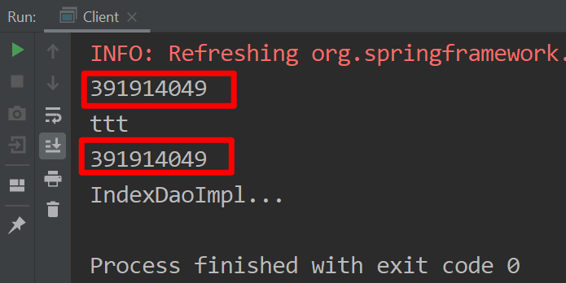

## Spring AOP

### What is AOP

AOP是相对于OOP而言，OOP是传统的面向对象编程，关注主业务流程。而在主业务流程中会产生一些横切性问题，横切性问题并不会影响主业务流程，但它会散落在代码个各个部分，难以维护。AOP就是处理这些横切性问题的一种编程思想，主要是把这些横切性问题和主业务逻辑解耦，使得代码重用性和开发效率更高

关键点：OOP；AOP处理横切性问题的一种编程思想；解耦，代码重用性更高。

### AOP应用场景

- 自定义注解，消息异步处理，在controller层的方法上添加自定义注解@EnableAsyncProcess
  - @EnableAsyncProcess
    - 定义一个切面，切面里面定义切点，该切点的切点表达式去匹配自定义注解@EnableAsyncProcess，匹配到的话就执行增强的环绕通知，增强的逻辑为数据发往RabbitMQ。RabbitMQ是生产者和消费者模型，producer那一方通过设置消息规则和routing key发往consumer进行消费。

  ```java
  @Configuration
  @Import(AsyncProcessMessagePublisher.class)
  @Aspect
  public class EnableAsyncProcessAspect
  {
      private Logger logger = LoggerFactory.getLogger(getClass());

      @Autowired
      private AsyncProcessMessagePublisher publisher;

      @Autowired
      private HttpServletRequest request;

      @Resource(name = "defaultInboundTransactionServiceImpl")
      private IInboundTransactionService defaultInboundTransactionService;

      @Pointcut("@annotation(com.sap.csc.ems.api.common.annotation.EnableAsyncProcess)")
      public void pointCut()
      {

      }

      @Around("pointCut()")
      public Object requestIntercept(ProceedingJoinPoint pjp) throws Throwable
      {
          String mode = EMSHeaderUtil.getHeader(AsyncProcess.X_EMS_REQUEST_MODE, request);

          if (AsyncProcess.REQUEST_MODE_ASYNC.equals(mode))
          {
              String xTraceId = EMSHeaderUtil.getHeader(AsyncProcess.X_EMS_TRACE_ID, request);

              Signature signature = pjp.getSignature();

              if (signature instanceof MethodSignature)
              {
                  MethodSignature methodSignature = (MethodSignature) signature;

                  EnableAsyncProcess asyncProcess = methodSignature.getMethod().getAnnotation(EnableAsyncProcess.class);

                  if (asyncProcess != null)
                  {
                      if (xTraceId != null && xTraceId.length() > 14)
                      {
                          logger.error("Max length of x-ems-trace-id is 14 characters");
                          throw new EMSTechnicalException();
                      }

                      String transactionGuid = ThreadLocalCache.transactionGuid.get();
                      if (StringUtils.isBlank(transactionGuid))
                      {
                          logger.error("inbound transaction guid is missing.");
                          throw new EMSTechnicalException();
                      }
                      publisher.publishMessage(asyncProcess.exchange(), asyncProcess.routing(), xTraceId, transactionGuid,
                          new AsyncProcessMessagePayload());
                      return ApiResponseUtil.getAcceptedApiResponse();
                  }
              }
          }
          return pjp.proceed();
      }

  }
  ```
  ​


### AOP概念

- 切面
  - 切面包含了切点，连接点，通知等的集合

- 连接点：目标对象中的方法。它主要关注增强的方法，也就是我们要作用的点。

- 切点：连接点的集合。通过Spring AOP表达式(within,execution等)告知连接点在哪儿？同时切点决定了连接点的数量。

- 通知：在连接点附近做哪些业务逻辑。
  - 通知类型
    - Before:在连接点执行之前，要做什么事情？

    ```java
    //定义切点，匹配com.sap.leo.test.service.impl.IndexDaoImpl这种类型下的所有方法（连接点）
    @Pointcut("within(com.sap.leo.test.service.impl.IndexDaoImpl)")
    public void testWithin()
    {

    }
    //在哪里（切点）进行通知
    @Before("testWithin()")
    public void before()
    {
       System.out.println("before");
    }
    ```

    - After：连接点执行完过后，要做什么事情？

    - After throwing: 执行抛出异常

    - After (finally): 无论连接点是否正常执行，最终都会执行通知。

    - Around: 围绕连接点执行，比如方法调用。这是最有用的切面方式，around通知可以在连接点执行前后自定义行为， 
      - 如果Before Advice能够解决问题的话，那么就不要使用Around.

      ```java
      //定义切点，切点表达式为：匹配com.sap.leo.test.service包及其子包下的方法返回为void的任意方法
      @Pointcut("execution(void com.sap.leo.test.service..*(..))")
      public void testExecution()
      {

      }

      //定义环绕通知，在testExecution()切点处进行通知
      @Around("com.sap.leo.test.model.NotVeryUsefulAspect.testExecution()")
      public void round(ProceedingJoinPoint pjp) throws Throwable
      {
        //对传入的参数进行处理
         Object[]  args = pjp.getArgs();
         for (int i = 0; i < args.length; i++)
         {
            args[i] += " Leo";
         }
        //目标对象的方法调用前输出b
         System.out.println("b");
        //调用目标对象方法
         Object object = pjp.proceed(args);
        //目标对象的方法调用后输出a
         System.out.println("a");
      }
      ```

- 目标对象

- AOP代理对象：包含了原始对象的代码和增加代码后的对象

- 织入：把代理逻辑加入到目标对象上的过程。

### ProceedingJoinPoint和JoinPoint关系

- ProceedingJoinPoint继承了JoinPoint
- pjp可以调用proceed方法继续执行连接点（调用目标对象的方法）；可以得到目标对象，目标对象的方法签名，方法返回类型，方法参数，得到代理对象等。

### Spring AOP和AspectJ关系

Spring AOP和AspectJ都是AOP的实现方式，Spring AOP借用了AspectJ的语法，但底层实现还是Spring AOP自己的。

### 切点修饰符(指示符) Pointcut Designators

**execution**:Spring AOP最主要的修饰符，用来配置连接点的。

- ```
  格式：execution(modifiers-pattern? ret-type-pattern declaring-type-pattern?name-pattern(param-pattern) throws-pattern?)
  ```

解释：modifiers-pattern表示方法的修饰符:public/private/protected，不是必须的

- ret-type-pattern：方法返回类型，必须的
- declaring-type-pattern：方法所在类的全路径，不是必须的
- name-pattern：方法名，必须
- param-pattern：方法参数个数以及类型，必须
- throws-pattern：方法抛出异常类型，非必须

eg:

- 匹配任意公共方法

```java
execution(public * *(..))
```

- 匹配任意以set打头的方法名

```java
execution(* set*(..))
```

- 匹配在service包下的任意方法

```java
execution(* com.xyz.service.*.*(..))
```

总结：我们尽量使用execution表达式，因为它的匹配粒度更细，能够精确到方法级别，而within精确粒度在类级别。同样为了性能考虑我们应该尽量把匹配粒度写细点，这样匹配的时间更少。

**within**：通过特定类型去限定匹配的连接点。

- 匹配service包及其子包下的连接点

  ```java
  within(com.xyz.service..*)
  ```


- 匹配特定类型的连接点

```
within(com.sap.leo.test.service.impl.IndexDaoImpl)
```

**this**:代理对象。

- 匹配代理对象实现了IndexDao接口的连接点

```
this(com.sap.leo.test.repository.IndexDao)
```

**target**:目标对象。

- 匹配目标对象实现了IndexDao接口的连接点

  ```
  target(com.sap.leo.test.service.impl.IndexDaoImpl)
  ```

**args**:匹配参数类型及个数一致的连接点

```
@Pointcut("args(..)")
```

**@target**:

**@args**:

**@within**:

**@annotation**:

- 匹配自定义注解，增强该自定义注解上的连接点

  ```java
  @annotation(com.sap.leo.test.service.Init)
  ```


### Spring Introductions

通过注解@DeclareParents来声明引用，意思通过表达式匹配上的class或者是interface，它们有新的父类。

```java
//在com.sap.leo.test.repository包及其子包下的接口，它们去实现TestDao
@DeclareParents(value="com.sap.leo.test.repository.*+", defaultImpl= TestDaoImpl.class)
public TestDao testDao;
```

```java
AnnotationConfigApplicationContext annotationConfigApplicationContext = new AnnotationConfigApplicationContext(AppConfig.class);
//com.sap.leo.test.repository包下面的IndexDao可以强转成TestDao，向上转型
TestDao testDao = (TestDao) annotationConfigApplicationContext.getBean(IndexDao.class);
testDao.say("BBB");
```

### Aspect Instantiation Models(切面模型/切面实例模型)

默认情况下，切面是单例模式的。当然，我们也可以改变其lifecycle.

- 单例模式

```
public class Client
{

	public static void main(String[] args) throws Exception
	{
		AnnotationConfigApplicationContext annotationConfigApplicationContext = new AnnotationConfigApplicationContext(AppConfig.class);
		IndexDao indexDao = annotationConfigApplicationContext.getBean(IndexDao.class);
		//point cut
		indexDao.sayTest("ttt");
		//point cut
		indexDao.saySomething("", 0);
	}
}
```

```java
@Component("aspect")
@Aspect
public class NotVeryUsefulAspect
{
   @Pointcut("within(com.sap.leo.test.service.impl.IndexDaoImpl)")
   public void testWithin()
   {

   }
   @Before("testWithin()")
   public void before()
   {
   System.out.println(this.hashCode());
   }
}
```

```java
@Service
public class IndexDaoImpl implements IndexDao
{

   @Override
   public void saySomething(String bbb,int aaa)
   {
      System.out.println("IndexDaoImpl...");
   }

   @Override
   public void sayTest(String abc)
   {
      System.out.println(abc);
   }
}
```

output：



- 原型模式

  ​