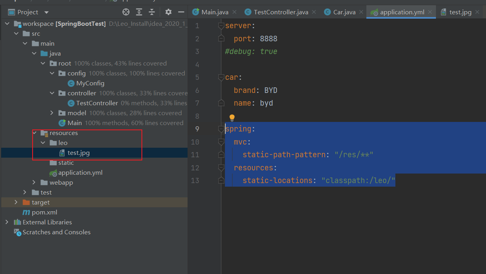
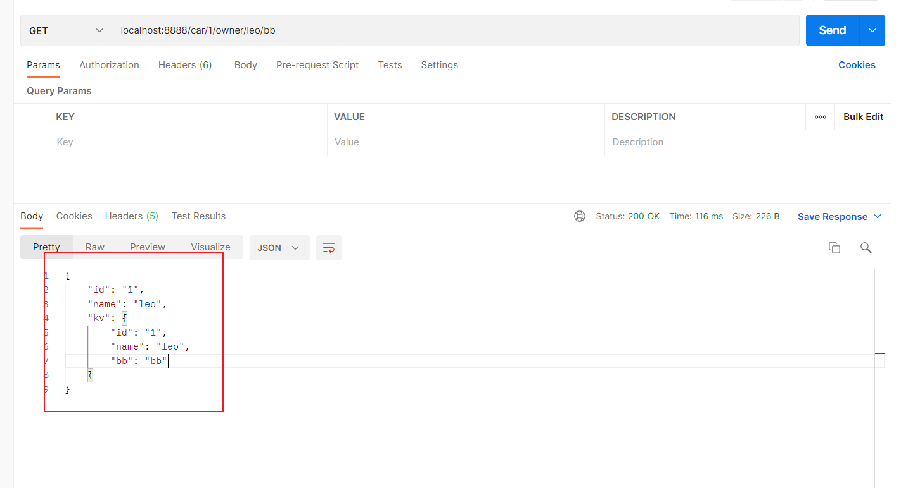
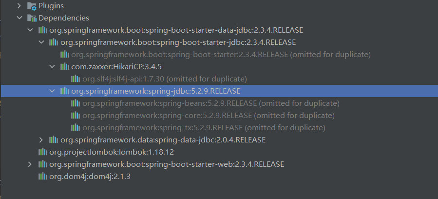

# SpringBoot 

- 是什么：整合了Spring生态圈的框架，不需要写配置文件，能够快速构建生产级别项目。
- 优点
  - 内嵌Tomcat Web服务器，不需要把war包部署到远端服务器
  - 自动starter依赖，简化配置。

## SpringBoot基础知识

### SpringBoot2.0 相比SpringBoot1做了哪些调整

- 基于Java8，可以用Java8的一些新特性
- 响应式编程


### 快速搭建SpringBoot项目

- pom.xml

  ```xml
  <?xml version="1.0" encoding="UTF-8"?>
  <project xmlns="http://maven.apache.org/POM/4.0.0"
           xmlns:xsi="http://www.w3.org/2001/XMLSchema-instance"
           xsi:schemaLocation="http://maven.apache.org/POM/4.0.0 http://maven.apache.org/xsd/maven-4.0.0.xsd">
      <modelVersion>4.0.0</modelVersion>
  
      <groupId>org.example</groupId>
      <artifactId>test1</artifactId>
      <version>1.0-SNAPSHOT</version>
  
      <properties>
          <maven.compiler.source>8</maven.compiler.source>
          <maven.compiler.target>8</maven.compiler.target>
      </properties>
  
      <parent>
          <groupId>org.springframework.boot</groupId>
          <artifactId>spring-boot-starter-parent</artifactId>
          <version>2.3.4.RELEASE</version>
      </parent>
  
      <dependencies>
          <dependency>
              <groupId>org.springframework.boot</groupId>
              <artifactId>spring-boot-starter-web</artifactId>
          </dependency>
      </dependencies>
  
      <!-- 本地打成jar包，本地运行的-->
      <build>
          <plugins>
              <plugin>
                  <groupId>org.springframework.boot</groupId>
                  <artifactId>spring-boot-maven-plugin</artifactId>
              </plugin>
          </plugins>
      </build>
  </project>
  ```

- Main方法

  - Main方法不能直接写在src/main/java目录下

  ```java
  package root;
  
  import org.springframework.boot.SpringApplication;
  import org.springframework.boot.autoconfigure.SpringBootApplication;
  
  @SpringBootApplication
  public class Main {
      public static void main(String[] args) {
          SpringApplication.run(Main.class, args);
      }
  }
  
  ```

- Controller

  ```java
  package root.controller;
  
  import org.springframework.web.bind.annotation.RequestMapping;
  import org.springframework.web.bind.annotation.RestController;
  
  @RestController
  public class MyApplication {
  
      @RequestMapping("/")
      String home() {
          return "Hello World!";
      }
  }
  ```

- application.yml

  - 修改服务默认端口

  ```yaml
  server:
    port: 8888
  ```

### SpringBoot特点

- 依赖管理

  - 通过spring-boot-starter统一管理依赖版本

  ```xml
  <parent>
      <groupId>org.springframework.boot</groupId>
      <artifactId>spring-boot-starter-parent</artifactId>
      <version>2.3.4.RELEASE</version>
  </parent>
  
  ```

- 自动配置
  - 配置好了SpringMVC
  - 自动扫描主程序目录及其子目录
    - 如果**想修改默认扫描目录**：@SpringBootApplication(scanBasePackages = "root")
  - 各种配置拥有默认值
  - 按需加载所有自动配置项

### 容器功能

#### @Configuration

- Full模式和Lite模式（proxyBeanMethods -> true/false）
  - 最佳实践
    - 配置类组件之间没有**依赖关系**就用Lite模式，容器启动快，减少判断(proxyBeanMethods -> true)
    - 配置类组件之间有依赖，方法会被调用前得到单实例组件，用full模式(proxyBeanMethods -> false)

```java
package root.config;

import org.springframework.context.annotation.Bean;
import org.springframework.context.annotation.Configuration;
import root.model.Pet;
import root.model.User;

@Configuration(proxyBeanMethods = false) // this is a config class ;true:统一从容器里面获取Bean
										// false: 统一从容器里面获取Bean
public class MyConfig
{

    @Bean
    public User createUser()
    {
        User user = new User("leo", 28);
        user.setPet(createPet()); // User依赖Pet
        return user;
    }

    @Bean
    public Pet createPet()
    {
        return new Pet("tom");
    }
}

```

```java
package root.model;

public class User
{
    private String name;

    private int age;

    private Pet pet;

    public String getName() {
        return name;
    }

    public void setName(String name) {
        this.name = name;
    }

    public int getAge() {
        return age;
    }

    public void setAge(int age) {
        this.age = age;
    }

    public User(String name, int age) {
        this.name = name;
        this.age = age;
    }

    public User()
    {
        super();
    }

    public Pet getPet() {
        return pet;
    }

    public void setPet(Pet pet) {
        this.pet = pet;
    }
}
```


```java
package root;

import org.springframework.boot.SpringApplication;
import org.springframework.boot.autoconfigure.SpringBootApplication;
import org.springframework.context.ConfigurableApplicationContext;
import root.model.Pet;
import root.model.User;

@SpringBootApplication(scanBasePackages = "root")
public class Main {
    public static void main(String[] args)
    {
        ConfigurableApplicationContext context = SpringApplication.run(Main.class, args);
        for (String beanDefinitionName : context.getBeanDefinitionNames()) {
            System.out.println(beanDefinitionName);
        }
        User user1 = context.getBean("createUser", User.class);
        User user2 = context.getBean("createUser", User.class);

        System.out.println(user1 == user2); //true

        Pet pet1 = user1.getPet();
        Pet pet2 = context.getBean("createPet", Pet.class);
        Pet pet3 = context.getBean("createPet", Pet.class);
        System.out.println(pet1 == pet2); //false
        System.out.println(pet3 == pet2); //true

    }
}

```

#### @Import

- **往容器中添加对象**，默认调用无参构造器创建
- `@Import`的优先于本身的的类定义加载

```java
package root.config;

import ch.qos.logback.core.db.DBHelper;
import org.springframework.context.annotation.Bean;
import org.springframework.context.annotation.Configuration;
import org.springframework.context.annotation.Import;
import root.model.Pet;
import root.model.User;

@Import({User.class, DBHelper.class})
@Configuration(proxyBeanMethods = false) // this is a config class
public class MyConfig
{

    @Bean
    public User createUser()
    {
        User user = new User("leo", 28);
        user.setPet(createPet());
        return user;
    }

    @Bean
    public Pet createPet()
    {
        return new Pet("tom");
    }
}

```

#### @Conditional

- @ConditionalOnBean(Pet.class):如果**作用在config class上**，那么**class内部所有的bean和class对象本身**创建都依赖于Pet.class，如果容器中没有Pet对象，那么该class内部所有的Bean都不会创建

- 如果作用在**方法级别**，如下，user对象能否创建成功依赖于tom是否创建成功。

  ```java
  package root.config;
  
  import ch.qos.logback.core.db.DBHelper;
  import org.springframework.boot.autoconfigure.condition.ConditionalOnBean;
  import org.springframework.context.annotation.Bean;
  import org.springframework.context.annotation.Conditional;
  import org.springframework.context.annotation.Configuration;
  import org.springframework.context.annotation.Import;
  import root.model.Pet;
  import root.model.User;
  
  @Import({User.class, DBHelper.class})
  @Configuration(proxyBeanMethods = false) // this is a config class
  public class MyConfig
  {
      @Bean(name = "tom")
      public Pet createPet()
      {
          return new Pet("tom");
      }
  
      @ConditionalOnBean(Pet.class)
      @Bean("user")
      public User createUser()
      {
          User user = new User("leo", 28);
          user.setPet(createPet());
          return user;
      }
  
  
  }
  ```

#### @ImportResource

- 通过指定的配置文件导入Bean对象

  ```java
  @ImportResource("classpath:beans.xml")=
  ```

#### @ConfigurationProperties & @EnableConfigurationProperties

- 从配置文件中加载Bean，并设置值，并放入容器中]

- @ConfigurationProperties要生效必须要搭配@Component或者@EnableConfigurationProperties

  ```yaml
  mycar:
    brand: BYD
    price: 10000
  ```

  ```java
  @Component
  @ConfigurationProperties(prefix = "mycar")
  public class Car
  {
      private String price;
      private String brand;
      //getter & setter
  }
  ```

  ```java
  Car car = context.getBean("car", Car.class);
  System.out.println(car);
  ```

- @EnableConfigurationProperties

  - 开启Car的属性绑定功能
  - 再把Car自动注入到容器中

  ```java
  @Configuration(proxyBeanMethods = false) // this is a config class
  @EnableConfigurationProperties(Car.class)
  public class MyConfig
  {
      @Bean(name = "tom")
      public Pet createPet()
      {
          return new Pet("tom");
      }
  
      @Bean("user")
      public User createUser()
      {
          User user = new User("leo", 28);
          user.setPet(createPet());
          return user;
      }
  }
  ```

  ```java
  @ConfigurationProperties("mycar")
  public class Car
  {
      private String price;
      private String brand;
  
      public String getPrice()
      {
          return price;
      }
  ```

  ```java
  @RestController
  public class MyApplication {
  
      @Autowired
      private Car car;
  
      @RequestMapping("/")
      public String home() {
          return "Hello World!";
      }
  
      @RequestMapping("/car")
      public Car getCar() {
          return car;
      }
  }
  ```

### 自动配置功能

- 自动装配流程
  - xxxAutoConfiguration -> 组件 -> xxxProperties里面获取值 -> application.properties 获取值

- @SpringBootApplication

  ```java
  @SpringBootConfiguration
  @EnableAutoConfiguration
  @ComponentScan(excludeFilters = { @ComponentScan.Filter(type = FilterType.CUSTOM, classes = TypeExcludeFilter.class),
          @ComponentScan.Filter(type = FilterType.CUSTOM, classes = AutoConfigurationExcludeFilter.class) })
  ```

  - @SpringBootConfiguration ：表明当前类是一个配置类

  - @ComponentScan：扫描哪些包

  - @EnableAutoConfiguration

    ```java
    @AutoConfigurationPackage
    @Import(AutoConfigurationImportSelector.class)
    public @interface EnableAutoConfiguration {}
    ```

    - @AutoConfigrationPackage:自动装配包

      ```java
      @Import(AutoConfigurationPackages.Registrar.class)
      public @interface AutoConfigurationPackage {}
      ```

      - AutoConfigurationPackages.Registrar

        - 指定默认包的规则
        - 利用Registrar给容器导包，把main方法所在的包及其子包所有的组件都导入到容器中

        ```java
        	/**
        	 * {@link ImportBeanDefinitionRegistrar} to store the base package from the importing
        	 * configuration.
        	 */
        	static class Registrar implements ImportBeanDefinitionRegistrar, DeterminableImports {
        
        		@Override
        		public void registerBeanDefinitions(AnnotationMetadata metadata, BeanDefinitionRegistry registry) {
        			register(registry, new PackageImports(metadata).getPackageNames().toArray(new String[0]));
        		}
        
        		@Override
        		public Set<Object> determineImports(AnnotationMetadata metadata) {
        			return Collections.singleton(new PackageImports(metadata));
        		}
        
        	}
        ```

    - AutoConfigurationImportSelector.class

      ```java
      利用protected AutoConfigurationEntry getAutoConfigurationEntry(AnnotationMetadata annotationMetadata) 批量给容器导入组件
      List<String> configurations = getCandidateConfigurations(annotationMetadata, attributes); 通过它来获取到需要导入到容器的组件
      Map<String, List<String>> loadSpringFactories(@Nullable ClassLoader classLoader)利用工厂来加载组件
      public static final String FACTORIES_RESOURCE_LOCATION = "META-INF/spring.factories"; 从制定配置文件加载
      spring-boot-autoconfigure-2.3.4.RELEASE.jar包里面也有META-INF/spring.factories
      有127个配置类要加载
      ```

### 按需加载

- 虽然前面127个配置类要加载，但是还**需要按需加载**

### 最佳实践

- 引入场景依赖
- 查看自动配置了哪些组件
  - 配置文件中debug=true开启自动配置报告，Negative部分表示部分不生效组件，Positive表示生效的组件。
- 是否需要修改
  - 参考文档修改配置项
    - https://docs.spring.io/spring-boot/docs/current/reference/html/application-properties.html#appendix.application-properties
  - 自定义加入或者修改组件

### @Lombok

- 简化Bean的构造，不需要写getter & setting & constructor

  ```java
  @Data //不需要写getter & setter
  @AllArgsConstructor //全参构造器
  @NoArgsConstructor //无参构造器
  @ToString //重写toString
  @EqualsAndHashCode //重写Equals & HashCode方法
  public class Car
  {
      private String name;
      private String brand;
  }
  ```

  ```java
  @Configuration
  public class MyConfig
  {
      @Bean(name = "car")
      public Car createSingletonCar()
      {
          return new Car("DZ", "dz");
      }
  }
  ```

### dev-tools

```xml
<dependency>
    <groupId>org.springframework.boot</groupId>
    <artifactId>spring-boot-devtools</artifactId>
    <optional>true</optional>
</dependency>
```

- 自动重启

### SpringInitializer

- 以后我们开发项目都用SpringInitializer创建项目，引入依赖。


## SpringBoot核心功能

### 配置文件

- yaml文件

  - 大小写敏感
  - 缩进表示层级关系
  - 只允许空格
  - #表示注释

- 数据类型

  - 字面量

    ```yaml
    k:v
    ```

    对象

    ```yaml
    #行内写法: k: {k1:v1, k2:v2}
    k:
      k1:v1
      k2:v2
    ```

  - 数组

    ```yaml
    #行内写法：k: [v1, v2,v3]
    k:
      - v1
      - v2
      - v3
    ```

  

#### spring-boot-configuration-processor

- 作用：通过配置文件给Bean对象赋值的时候，配置文件能够给出提示

```xml
<dependency>
  <groupId>org.springframework.boot</groupId>
  <artifactId>spring-boot-configuration-processor</artifactId>
</dependency>
```

### Web开发

- 静态资源访问

  - 默认找`/static` (or `/public` or `/resources` or `/META-INF/resources`) in the classpath，默认是映射/**

  - 先去Controller找，有没有相应的映射，没有的话最后去静态资源文件里面查找

  - 调整静态资源访问的前缀路径，得在请求的URL上加上res才能够访问到需要访问的静态资源

    ```yaml
    spring:
      mvc:
        static-path-pattern: "/res/**"
    ```

    

  - 调整静态资源的路径

    ```yaml
    spring:
      mvc:
        static-path-pattern: "/res/**"
      resources:
        static-locations: "classpath:/leo/"
    ```

    

#### 静态资源配置原理

- SpringBootApplication启动的时候默认加载xxxAutoConfiguration类

- SpringMVC自动装配类WebMvcAutoConfiguration

  ```java
  @Configuration(proxyBeanMethods = false)
  @ConditionalOnWebApplication(type = Type.SERVLET)
  @ConditionalOnClass({ Servlet.class, DispatcherServlet.class, WebMvcConfigurer.class })
  @ConditionalOnMissingBean(WebMvcConfigurationSupport.class)
  @AutoConfigureOrder(Ordered.HIGHEST_PRECEDENCE + 10)
  @AutoConfigureAfter({ DispatcherServletAutoConfiguration.class, TaskExecutionAutoConfiguration.class,
  		ValidationAutoConfiguration.class })
  public class WebMvcAutoConfiguration {
      
  }
  ```

#### 请求处理

- 如果是前端表单发起REST请求

  - 请求被Filter拦截，根据装饰者模式，把请求的method进行封装，并返回请求

    ```java
    @Bean
    	@ConditionalOnMissingBean(HiddenHttpMethodFilter.class)
    	@ConditionalOnProperty(prefix = "spring.mvc.hiddenmethod.filter", name = "enabled", matchIfMissing = false)
    	public OrderedHiddenHttpMethodFilter hiddenHttpMethodFilter() {
    		return new OrderedHiddenHttpMethodFilter();
    	}
    ```

    

    ```java
    public class HiddenHttpMethodFilter extends OncePerRequestFilter {
    
    	private static final List<String> ALLOWED_METHODS =
    			Collections.unmodifiableList(Arrays.asList(HttpMethod.PUT.name(),
    					HttpMethod.DELETE.name(), HttpMethod.PATCH.name()));
    
    	/** Default method parameter: {@code _method}. */
    	public static final String DEFAULT_METHOD_PARAM = "_method";
    
    	private String methodParam = DEFAULT_METHOD_PARAM;
    
    
    	/**
    	 * Set the parameter name to look for HTTP methods.
    	 * @see #DEFAULT_METHOD_PARAM
    	 */
    	public void setMethodParam(String methodParam) {
    		Assert.hasText(methodParam, "'methodParam' must not be empty");
    		this.methodParam = methodParam;
    	}
    
    	@Override
    	protected void doFilterInternal(HttpServletRequest request, HttpServletResponse response, FilterChain filterChain)
    			throws ServletException, IOException {
    
    		HttpServletRequest requestToUse = request;
    
    		if ("POST".equals(request.getMethod()) && request.getAttribute(WebUtils.ERROR_EXCEPTION_ATTRIBUTE) == null) {
    			String paramValue = request.getParameter(this.methodParam);
    			if (StringUtils.hasLength(paramValue)) {
    				String method = paramValue.toUpperCase(Locale.ENGLISH);
    				if (ALLOWED_METHODS.contains(method)) {
    					requestToUse = new HttpMethodRequestWrapper(request, method);
    				}
    			}
    		}
    
    		filterChain.doFilter(requestToUse, response);
    	}
    
    
    	/**
    	 * Simple {@link HttpServletRequest} wrapper that returns the supplied method for
    	 * {@link HttpServletRequest#getMethod()}.
    	 */
    	private static class HttpMethodRequestWrapper extends HttpServletRequestWrapper {
    
    		private final String method;
    
    		public HttpMethodRequestWrapper(HttpServletRequest request, String method) {
    			super(request);
    			this.method = method;
    		}
    
    		@Override
    		public String getMethod() {
    			return this.method;
    		}
    	}
    
    }
    ```

    

- 如果客户端是Postman这种，则不会

#### 请求映射

- 请求 -> DispatcherServlet  dispatch -> HandlerMapping -> Handler ->Modle & View

#### 常用参数注解

- @PathVariable:路径映射

  ```java
   @RequestMapping("/car/{id}/owner/{name}/{bb}")
      public Map<String, Object> test(@PathVariable("id") String id, @PathVariable("name")String name,
                                      @PathVariable Map<String,String> kv)
      {
          Map<String, Object> result = new LinkedHashMap<>();
          result.put("id", id);
          result.put("name", name);
          result.put("kv", kv);
          return result;
      }
  ```

  

- @RequestHeader: header映射

- @RequestParam: 参数映射

- @CookieValue：获取cookie值

- @RequestBody: 获取requset body内容

- @ReqestAttribute：获取request中的attribute值

- @MaxVariable：矩阵变量（特殊的search规则）

#### 数据Formatter

- 数据source按照自己想要的格式进行解析并返回

```java
@Configuration
public class MyConfig
{

    @Bean
    public WebMvcConfigurer crossConfigure() {
        return new WebMvcConfigurer() {
            @Override
            public void addCorsMappings(CorsRegistry registry) {
                registry.addMapping("/*")
                        .allowedOrigins("*")
                        .allowCredentials(true)
                        .allowedMethods("GET", "POST", "DELETE", "PUT","PATCH")
                        .maxAge(3600);
            }
            @Override
            public void addFormatters(FormatterRegistry registry)
            {
                registry.addConverter(new Converter<String, Object>()
                {
                    @Override
                    public Object convert(String source)
                    {
                        return null;
                    }
                });

            }
        };
    }
```


### 数据访问

#### 数据源的自动配置

- jdbc

  ```xml
  <dependency>
      <groupId>org.springframework.boot</groupId>
      <artifactId>spring-boot-starter-data-jdbc</artifactId>
  </dependency>
  ```

  

- 如果要连接mysql，那么需要导入mysql驱动，并且驱动的版本号要和数据库的版本号对应

  ```xml
   <dependency>
       <groupId>mysql</groupId>
       <artifactId>mysql-connector-java</artifactId>
       <version>5.1.49</version>
   </dependency>
  ```

  ```yaml
  spring:
    datasource:
      url: jdbc:mysql://localhost:3306/test
      username: root
      password: liyong
      driverClassName: com.mysql.jdbc.Driver
  ```

  

### 单元测试

### 指标属性

### 原理解析

- SpringBoot原理
  - 启动过程
    - 创建SpringApplication
    - 启动SpringApplication
  - Application  Events & Listeners

# 题目

## SpringBoot启动流程

- main方法是程序的主方法，main方法的class被@SpringBootApplication注解修饰
- @SpringBootApplication
  - @ComponentScan
    - 定义了包扫描路径，默认扫描main方法所在文件夹及其子文件夹。
  - @SpringBootConfiguration
    - 表明Class是一个配置类
  - @EnableAutoConfiguration
    - 通过Registrar把我们main方法文件夹及其子文件夹下面定义的Bean加载到容器中。
    - 通过Selector把META-INF/spring.factories所有的自动安装类按需加载，加载到容器中。
  - 容器启动

## SpringBoot运行方式

- main方法运行
- 通过maven插件/Gradle插件运行
- 达成war包，放在服务器上运行

## SpringBoot如何解决跨域问题

- 源（origin）
  - 就是协议、域名和端口号。
- 跨域
  - URL由协议、域名、端口和路径组成，如果两个URL的协议、域名和端口全部相同，则表示他们同源。否则，只要协议、域名、端口有任何一个不同，就是跨域。

解决

- 通过WebMvcConfigurer，重写addCorsMappings即可

  ```java
  @Configuration
  public class MyConfig
  {
  
      @Bean
      public WebMvcConfigurer crossConfigure() {
          return new WebMvcConfigurer() {
              @Override
              public void addCorsMappings(CorsRegistry registry) {
                  registry.addMapping("/*")
                          .allowedOrigins("*")
                          .allowCredentials(true)
                          .allowedMethods("GET", "POST", "DELETE", "PUT","PATCH")
                          .maxAge(3600);
              }
          };
      }
  }
  ```

  

