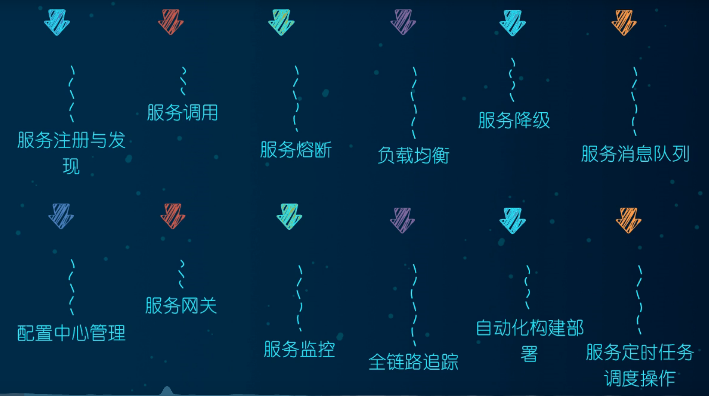

# SpringCloud

[微服务](#微服务)

[搭建父工程](#搭建父工程)

- **[dependency和dependencyManagement区别](#dependency和dependencyManagement区别)**
- [如何创建微服务模块](#如何创建微服务模块)
- [重构微服务模块](#重构微服务模块)

[RestTemplate](#RestTemplate)

[Eureka](#Eureka)

- [创建Eureka_Server模块](#创建Eureka_Server模块)
- [创建Eureka_Client模块](#创建Eureka_Client模块)
- [高可用集群](#高可用集群)
- [通过RestTemplate实现客户端负载均衡](#通过RestTemplate实现客户端负载均衡)
- [Eureka自我保护机制](#Eureka自我保护机制)

[Zookeeper替换Eureka](#Zookeeper替换Eureka)

[Consul](#Consul)

- [Eureka/Zookeeper/Consul三者区别](#Eureka/Zookeeper/Consul三者区别)
    - [CAP](#CAP)

[Ribbon](#Ribbon)

- [轮询算法](#轮询算法)
- [如何修改默认轮询策略](#如何修改默认轮询策略)

[OpenFeign](#OpenFeign)

[Hystrix](#Hystrix)

- [服务降级](#服务降级)
    - [针对单个方法](#针对单个方法)
    - [@DefaultProperties](#@DefaultProperties)
    - [FeignCall Service实现类统一处理降级方法](#FeignCall Service实现类统一处理降级方法)
- [熔断](#熔断)
- [限流](#限流)

[Gateway](#Gateway)

[SpringCloud Config](#SpringCloud Config)

- [动态刷新配置](#动态刷新配置)

[消息总线](#消息总线)

[消息驱动](#消息驱动)

[遇到的问题](#遇到的问题)

- [新建的子模块-Maven项目是灰色的](#新建的子模块-Maven项目是灰色的)
- [application.yml前面没有叶子标志](#application.yml前面没有叶子标志)
- [@Slf4j如何在idea中使用](#@Slf4j如何在idea中使用)
- [idea中如何查看多个微服务](idea中如何查看多个微服务)
- [微服务之间call不同提示奇怪错误](#微服务之间call不同提示奇怪错误)

[微服务面试题目](#微服务面试题目)

## 微服务

概念：相比于单体架构而言，微服务是把一个应用程序划分成多个小的服务，每个服务运行在独立的进程当中，服务之间通过Restful API进行通信，相互协作。同样，每个服务都根据自己的业务进行相应的构建并且部署到生产环境当中。




## 搭建父工程

```xml
<properties>
    <project.build.sourceEncoding>UTF-8</project.build.sourceEncoding>
    <maven.compiler.source>12</maven.compiler.source>
    <maven.compiler.target>12</maven.compiler.target>
    <junit.version>4.12</junit.version>
    <lombok.version>1.18.10</lombok.version>
    <log4j.version>1.2.17</log4j.version>
    <mysql.version>5.7.25</mysql.version>
    <druid.version>1.1.20</druid.version>
    <mybatis.spring.boot.version>2.1.1</mybatis.spring.boot.version>
  </properties>

  <dependencyManagement>
  <dependencies>
  <dependency>
    <groupId>org.apache.maven.plugins</groupId>
    <artifactId>maven-project-info-reports-plugin</artifactId>
    <version>3.0.0</version>
  </dependency>
  <!--spring boot 2.2.2-->
  <dependency>
    <groupId>org.springframework.boot</groupId>
    <artifactId>spring-boot-dependencies</artifactId>
    <version>2.2.2.RELEASE</version>
    <type>pom</type>
    <scope>import</scope>
  </dependency>
  <!--spring cloud Hoxton.SR1-->
  <dependency>
    <groupId>org.springframework.cloud</groupId>
    <artifactId>spring-cloud-dependencies</artifactId>
    <version>Hoxton.SR1</version>
    <type>pom</type>
    <scope>import</scope>
  </dependency>
  <dependency>
    <groupId>com.alibaba.cloud</groupId>
    <artifactId>spring-cloud-alibaba-dependencies</artifactId>
    <version>2.1.0.RELEASE</version>
    <type>pom</type>
    <scope>import</scope>
  </dependency>
  <!--mysql-->
  <dependency>
    <groupId>mysql</groupId>
    <artifactId>mysql-connector-java</artifactId>
    <version>${mysql.version}</version>
    <scope>runtime</scope>
  </dependency>
  <!-- druid-->
  <dependency>
    <groupId>com.alibaba</groupId>
    <artifactId>druid</artifactId>
    <version>${druid.version}</version>
  </dependency>
    <dependency>
      <groupId>org.mybatis.spring.boot</groupId>
      <artifactId>mybatis-spring-boot-starter</artifactId>
      <version>${mybatis.spring.boot.version}</version>
    </dependency>
    <!--junit-->
    <dependency>
      <groupId>junit</groupId>
      <artifactId>junit</artifactId>
      <version>${junit.version}</version>
    </dependency>
    <!--log4j-->
    <dependency>
      <groupId>log4j</groupId>
      <artifactId>log4j</artifactId>
      <version>${log4j.version}</version>
    </dependency>
  </dependencies>
  </dependencyManagement>
```

### dependency和dependencyManagement区别

- dependencyManagement一般用在Maven聚合项目中的父pom中，**主要作用是让子项目引用一个依赖而不用显示指定版本号。**方便版本的管理。
- **需要注意的是：dependencyManagement只声明依赖，不引入实现即不引入jar包，因此子项目需要显示的声明需要用到的依赖。**
- **如果子项目使用了版本号，那么就用子项目中的版本，否则用父项目中的版本。**

### 如何创建微服务模块

- 创建module
- 改POM
- 写YML
- 主启动类
- 业务类

### 重构微服务模块

- 多个子模块有共同部分，比如有相同的实体类，那么可以再创建一个common模块，专门用来存放公共部分代码，或者工具类。

- 建好之后，需要在其他子模块中引用common模块，把common模块作为一个jar包导入到其他子模块中，这样其他子模块就可以使用common模块中的代码了。

    ```
    <dependency>
        <groupId>com.sap</groupId>
        <artifactId>common</artifactId>
        <version>${parent.version}</version>
    </dependency>
    ```

    

## RestTemplate

- 概念：**用来访问远端Http服务的方法，是Spring用于访问Rest服务的客户端模板工具。**

    ```java
    @Configuration
    public class AppConfig
    {
        @Bean
        public RestTemplate restTemplate()
        {
            return  new RestTemplate();
        }
    }
    
    @RestController
    @Slf4j
    public class ConsumerController
    {
        @Autowired
        private RestTemplate restTemplate;
    
        private final String PAYMENT_URL = "http://localhost:8001";
    
    
        @PostMapping("/consumer/create")
        public Map<T, T> createPayment(@RequestBody  PaymentDto paymentDto)
        {
            log.info("**********************consumer create....****************");
            HttpHeaders headers = new HttpHeaders();
            headers.setContentType(MediaType.APPLICATION_JSON);
            HttpEntity<PaymentDto> httpEntity = new HttpEntity<>(paymentDto, headers);
            ResponseEntity<Map> responseEntity = restTemplate.postForEntity(PAYMENT_URL+"/payment/create", httpEntity, Map.class);
            return responseEntity.getBody();
        }
        
        @GetMapping("/consumer/get/{id}")
        public Map<T, T> getPayment(@PathVariable("id") Long id)
        {
            log.info("**********************consumer get....****************");
            ResponseEntity<Map> responseEntity = restTemplate.getForEntity(PAYMENT_URL + "/payment/get/" + id , Map.class);
            return responseEntity.getBody();
        }
    }
    ```

- 需要注意的是@Resource是默认byName来注入，而@Autowired默认是按照byType来注入的。

- 注意上述RestTemplate的使用

## Eureka

- Eureka：服务发现与注册中心
- Eureka分为两个组件：Eureka Server，Eureka Client。
    - Eureka Server：提供服务注册功能，其他的微服务启动以后，会注册到Eureka Server上。
    - Eureka Client：通过注册中心进行访问

### 创建Eureka_Server模块

- pom.xml

    ```xml
    <?xml version="1.0" encoding="UTF-8"?>
    <project xmlns="http://maven.apache.org/POM/4.0.0"
             xmlns:xsi="http://www.w3.org/2001/XMLSchema-instance"
             xsi:schemaLocation="http://maven.apache.org/POM/4.0.0 http://maven.apache.org/xsd/maven-4.0.0.xsd">
        <parent>
            <artifactId>springcloud</artifactId>
            <groupId>com.sap</groupId>
            <version>1.0-SNAPSHOT</version>
        </parent>
        <modelVersion>4.0.0</modelVersion>
    
        <artifactId>server7001</artifactId>
    
        <dependencies>
            <dependency>
                <groupId>org.springframework.cloud</groupId>
                <artifactId>spring-cloud-starter-netflix-eureka-server</artifactId>
                <version>2.2.3.RELEASE</version>
            </dependency>
            <dependency>
                <groupId>com.sap</groupId>
                <artifactId>common</artifactId>
                <version>${project.version}</version>
            </dependency>
            <dependency>
                <groupId>org.springframework.boot</groupId>
                <artifactId>spring-boot-starter-web</artifactId>
            </dependency>
            <dependency>
                <groupId>org.springframework.boot</groupId>
                <artifactId>spring-boot-starter-actuator</artifactId>
            </dependency>
            <dependency>
                <groupId>org.springframework.boot</groupId>
                <artifactId>spring-boot-devtools</artifactId>
                <scope>runtime</scope>
                <optional>true</optional>
            </dependency>
            <dependency>
                <groupId>org.projectlombok</groupId>
                <artifactId>lombok</artifactId>
            </dependency>
            <dependency>
                <groupId>org.springframework.boot</groupId>
                <artifactId>spring-boot-starter-test</artifactId>
                <scope>test</scope>
            </dependency>
            <dependency>
                <groupId>junit</groupId>
                <artifactId>junit</artifactId>
            </dependency>
        </dependencies>
    </project>
    
    ```

- application.yml

    ```yaml
    server:
      port: 7001
    eureka:
      instance:
        hostname: localhost #eureka服务端实例名字
      client:
        register-with-eureka: false #不注册自己
        fetch-registry: false #表示自己就是注册中心，职责是维护服务实例，并不需要去检索服务
        service-url:
          defaultZone: http://${eureka.instance.hostname}:${server.port}/eureka/ #设置与eureka server交互的地址查询服务和注册服务都需要依赖这个地址
    ```

- Bootstrap.java文件添加：@EnableEurekaServer

    ```java
    @SpringBootApplication
    @EnableEurekaServer
    public class Bootstrap
    {
        public static void main(String[] args)
        {
            SpringApplication.run(Bootstrap.class, args);
        }
    }
    ```

### 创建Eureka_Client模块

- 修改pom.xml

    ```xml
    <dependency>
        <groupId>org.springframework.cloud</groupId>
        <artifactId>spring-cloud-starter-netflix-eureka-client</artifactId>
        <version>2.2.3.RELEASE</version>
    </dependency>
    ```

- 修改application.yml

    ```yaml
    eureka:
      client:
        fetch-registry: true
        register-with-eureka: true
        service-url:
          defaultZone: http://localhost:7001/eureka
    ```

- 修改Bootstrap.java

    ```java
    @SpringBootApplication
    @EnableEurekaClient
    public class Bootstrap
    {
        public static void main(String[] args)
        {
            SpringApplication.run(Bootstrap.class, args);
        }
    }
    ```

    

### 高可用集群

- 微服务RPC远程服务调用最核心的是什么

    - 高可用

- Eureka server搭建高可用集群

    - 互相注册

    - application.yml

        ```yaml
        #只写了7002需要注册到7001上，反之，同理
        server:
          port: 7002
        eureka:
          instance:
            hostname: eureka7002.com #eureka服务端实例名字
          client:
            register-with-eureka: false #不注册自己
            fetch-registry: false #表示自己就是注册中心，职责是维护服务实例，并不需要去检索服务
            service-url:
              defaultZone: http://eureka7001.com:7001/eureka/ #设置与eureka server交互的地址查询服务和注册服务都需要依赖这个地址
        ```

- Eureka Client注册到两台集群上

    - application.yml

    ```yaml
    server:
      port: 8000
    spring:
      application:
        name: consumer8000
      datasource:
        driver-class-name: com.mysql.jdbc.Driver
        url: jdbc:mysql://localhost:3306/test?useUnicode=true&characterEncoding=utf-8&useSSL=false
        username: root
        password: liyong
    eureka:
      client:
        fetch-registry: true
        register-with-eureka: true
        service-url:
          defaultZone: http://eureka7001.com:7001/eureka/,http://eureka7002.com:7002/eureka/
    ```

- 修改host文件

    ```
    127.0.0.1 eureka7001.com
    127.0.0.1 eureka7002.com
    ```

    

### 通过RestTemplate实现客户端负载均衡

- 修改RestTemplate配置

```java
@Configuration
public class AppConfig
{
    @LoadBalanced
    @Bean
    public RestTemplate restTemplate()
    {
        return  new RestTemplate();
    }
}
```

```java
@RestController
@Slf4j
public class ConsumerController<T>
{
    @Resource(name = "restTemplate")
    private RestTemplate restTemplate;

    private final String PAYMENT_URL = "http://PAYMENT"; //写成service的名字，不要再写死地址了。同一个application name可以对应多个instance。

    @PostMapping("/consumer/create")
    public Map<T, T> createPayment(@RequestBody  PaymentDto paymentDto)
    {
        log.info("**********************consumer create....****************");
        HttpHeaders headers = new HttpHeaders();
        headers.setContentType(MediaType.APPLICATION_JSON);
        HttpEntity<PaymentDto> httpEntity = new HttpEntity<>(paymentDto, headers);
        ResponseEntity<Map> responseEntity = restTemplate.postForEntity(PAYMENT_URL+"/payment/create", httpEntity, Map.class);
        return responseEntity.getBody();
    }

    @GetMapping("/consumer/get/{id}")
    public Map<T, T> getPayment(@PathVariable("id") Long id)
    {
        log.info("**********************consumer get....****************");
        ResponseEntity<Map> responseEntity = restTemplate.getForEntity(PAYMENT_URL + "/payment/get/" + id , Map.class);
        return responseEntity.getBody();
    }
}
```

- 修改payment8001，payment8002 application name，都改成PAYMENT

    ```yaml
    server:
      port: 8001
    spring:
      application:
        name: PAYMENT #
      datasource:
        driver-class-name: com.mysql.jdbc.Driver
        url: jdbc:mysql://localhost:3306/test?useUnicode=true&characterEncoding=utf-8&useSSL=false
        username: root
        password: liyong
    eureka:
      client:
        fetch-registry: true
        register-with-eureka: true
        service-url:
          defaultZone: http://eureka7001.com:7001/eureka/,http://eureka7002.com:7002/eureka/
    
    ```

### Eureka自我保护机制

- 概念：某个时刻一个微服务不可用了，Eureka不会立刻清理掉，还是会保留该服务的信息。因为它认为有可能是网络原因导致服务没法和server端进行心跳通信。默认情况：心跳的话客户端每30s会发送一次，如果90s内还没有收到客户端的心跳通信，那么Eureka Server会把相应的Client给剔除掉。

- 服务端配置

    ```yaml
    server:
      port: 7001
    eureka:
      instance:
        hostname: eureka7001.com #eureka服务端实例名字
      client:
        register-with-eureka: false #不注册自己
        fetch-registry: false #表示自己就是注册中心，职责是维护服务实例，并不需要去检索服务
        service-url:
          defaultZone: http://eureka7002.com:7002/eureka/ #设置与eureka server交互的地址查询服务和注册服务都需要依赖这个地址
      server:
        enable-self-preservation: false #关闭自我保护机制
        eviction-interval-timer-in-ms: 3000 # 服务端3s内还没有收到客户端的心跳，那么会把相应的服务剔除掉
    ```

- 客户端

    ```yaml
    server:
      port: 8001
    spring:
      application:
        name: PAYMENT
      datasource:
        driver-class-name: com.mysql.jdbc.Driver
        url: jdbc:mysql://localhost:3306/test?useUnicode=true&characterEncoding=utf-8&useSSL=false
        username: root
        password: liyong
    eureka:
      instance:
        instance-id: payment8001
        prefer-ip-address: true
        lease-renewal-interval-in-seconds: 1 # 每隔一秒发一次心跳，默认是30s
        lease-expiration-duration-in-seconds: 3 # 3秒内还没有和服务端通信，那么会被剔除掉；默认是90s
      client:
        fetch-registry: true
        register-with-eureka: true
        service-url:
          defaultZone: http://eureka7001.com:7001/eureka/
    
    ```

## Consul

- [官网](https://www.consul.io/docs/intro)
- 点击consul.exe文件安装
- 能做什么
    - 服务发现
    - 健康检查
    - 键值对存储
    - 多数据中心

- 服务端启动

    ```
    consul agent -dev
    ```
    - 微服务注册到Consul上

        ```yaml
        server:
          port: 8006
        spring:
          application:
            name: CONSUL-PAYMENT
          cloud:
            consul:
              host: localhost # consul主机名
              port: 8500   # consul端口号
              discovery:
                service-name: ${spring.application.name}
        
        ```

### Eureka/Zookeeper/Consul三者区别

#### CAP

- CAP
    - C: 一致性
    - A: 可用性
    - P: 分区容错性
    - 注意：**分布式系统里面CAP不能同时保证，要么CP，要么AP**

- Eureka保证AP
    - Eureka的自我保护机制，不要求数据最终一致性，允许部分Service挂掉之后Eureka还记录相应Service信息。
- Zookeeper和Consul保证CP
    - 保证数据的最终一致性。

## Ribbon

- **作用：客户端的负载均衡和RPC调用。**
- 客户端负载均衡调用如何实现：@LoadBalanced修饰RestTemplate + RPC
- 负载均衡算法：默认采用轮询
    - 轮询
    - 随机
    - 重试
    - 根据相应时间分配权重

### 轮询算法

- 实际调用哪台服务实例 = 第几次请求 % 服务器实例数量。
- 注意：每次重启服务，请求数都从1开始。

### 如何修改默认轮询策略

- 修改consumer8000工程的启动类,通过自定义规则进行负载均衡操作。

    ```java
    package com.sap.springcloud;
    
    import com.sap.myrule.MySelfRule;
    import org.springframework.boot.SpringApplication;
    import org.springframework.boot.autoconfigure.SpringBootApplication;
    import org.springframework.cloud.client.discovery.EnableDiscoveryClient;
    import org.springframework.cloud.netflix.ribbon.RibbonClient;
    
    @SpringBootApplication
    @EnableDiscoveryClient
    @RibbonClient(name = "PAYMENT", configuration = MySelfRule.class)
    public class Bootstrap
    {
        public static void main(String[] args)
        {
            SpringApplication.run(Bootstrap.class, args);
        }
    }
    
    ```

- 新建MySelfRule类

    ```java
    package com.sap.springcloud.config;
    
    import com.netflix.loadbalancer.IRule;
    import com.netflix.loadbalancer.RandomRule;
    import org.springframework.context.annotation.Bean;
    import org.springframework.stereotype.Component;
    
    @Component
    public class MySelfRule
    {
        @Bean
        public IRule myRule()
        {
            return new RandomRule();
        }
    }
    
    ```

## OpenFeign

- 作用：用于客户端服务调用的,底层还是通过Ribbon来调用的

- 使用：接口+@FeignClient

    - 修改主启动类

    ```java
    package com.sap.springcloud;
    
    import org.springframework.boot.SpringApplication;
    import org.springframework.boot.autoconfigure.SpringBootApplication;
    import org.springframework.cloud.client.discovery.EnableDiscoveryClient;
    import org.springframework.cloud.openfeign.EnableFeignClients;
    
    @EnableDiscoveryClient
    @SpringBootApplication
    @EnableFeignClients //启用Feign Call
    public class Bootstrap
    {
        public static void main(String[] args)
        {
            SpringApplication.run(Bootstrap.class, args);
        }
    }
    
    ```

    - 新建FeignService用于访问其他service

        ```java
        @FeignClient(name = "PAYMENT") //微服务的名字
        public interface PaymentFeignService
        {
            @GetMapping(value = "/payment/get/{id}")
            Object getPaymentById(@PathVariable("id") Long id);
        
            @GetMapping(value = "/consumer/timeout/get/{id}")
            Object getTimeout(@PathVariable("id") Long id);
        }
        ```

    - 修改controller层

        ```java
        package com.sap.springcloud.controller;
        
        import com.netflix.discovery.converters.Auto;
        import com.sap.springcloud.model.CommonResult;
        import com.sap.springcloud.service.PaymentFeignService;
        import org.springframework.beans.factory.annotation.Autowired;
        import org.springframework.http.ResponseEntity;
        import org.springframework.web.bind.annotation.GetMapping;
        import org.springframework.web.bind.annotation.PathVariable;
        import org.springframework.web.bind.annotation.RestController;
        
        import java.util.Map;
        
        @RestController
        public class ConsumerFeignController
        {
            @Autowired
            private PaymentFeignService paymentFeignService;
        
        
            @GetMapping(value = "/consumer/get/{id}")
            public Object getPayment(@PathVariable("id") Long id)
            {
                return paymentFeignService.getPaymentById(id);
            }
        
            @GetMapping(value = "/consumer/timeout/get/{id}")
            public Object timeoutPayment(@PathVariable("id") Long id)
            {
                return paymentFeignService.getTimeout(id);
            }
        
        }
        
        ```

    - x修改applicaiton.yml ，设置ribbon的超时时间

        ```yaml
        server:
          port: 8100
        eureka:
          client:
            register-with-eureka: true
            service-url:
              defaultZone: http://eureka7001.com:7001/eureka, http://eureka7002.com:7002/eureka
        spring:
          application:
            name: consumer_feign8100
        ribbon:
          ReadTimeout: 5000
          ConnectTimeout: 5000
        
        ```

## Hystrix

- 作用：服务降级，熔断，限流

### 服务降级

- 概念：A调用B service 某个方法，请求call不通，为了防止大量请求堆积，即防止雪崩效应，立即返回一个友好提示。
- 触发条件：超时，程序异常

#### 针对单个方法

- pom.xml

    ```xml
    <dependency>
        <groupId>org.springframework.cloud</groupId>
        <artifactId>spring-cloud-starter-netflix-hystrix</artifactId>
    </dependency>
    ```

- 主启动类

    ```java
    @SpringBootApplication
    @EnableDiscoveryClient
    @EnableFeignClients
    @RibbonClient(name = "PAYMENT", configuration = MySelfRule.class)
    @EnableHystrix
    public class Bootstrap
    {
        public static void main(String[] args)
        {
            SpringApplication.run(Bootstrap.class, args);
        }
    }
    ```

- Controller

    ```java
    @HystrixCommand(fallbackMethod = "paymentInfo_TimeOutHandler",
            commandKey = "paymentInfo_TimeOut",
            commandProperties = {
            @HystrixProperty(name="execution.timeout.enabled", value="true"),
            @HystrixProperty(name = "execution.isolation.thread.timeoutInMilliseconds", value = "3000") })
        @GetMapping("/consumer/hystrix/timeout/{id}")
        public String paymentInfo_TimeOut(@PathVariable("id") Integer id)
        {
            String result = paymentHystrixService.paymentInfo_TimeOut(id);
            return result;
        }
    
    	//consumer call payment系统3秒还没有响应，那么会立即执行当前降级方法
        public String paymentInfo_TimeOutHandler(Integer id)
        {
            return "system is busy...";
        }
    ```

    - 问题：这样的话在针对每个方法都会单独写一个降级方法，如果不是特殊需要那么会导致代码量特别大，代码冗余。业务处理的代码和降级的代码写在一起，可读性差。

#### @DefaultProperties

- 改进：

    - FeignCall调用异常情况下，默认走兜底的方法。Controller层加上@DefaultProperties并指定兜底方法

        ```java
        @DefaultProperties( defaultFallback = "timeoutGlobalHandler")
        public class ConsumerController<T>
        {
            //不指定某个方法处理程序异常情况
            @HystrixCommand(commandProperties = { @HystrixProperty(name = "execution.timeout.enabled", value = "true"),
                @HystrixProperty(name = "execution.isolation.thread.timeoutInMilliseconds", value = "3000") })
            @GetMapping("/consumer/hystrix/fallback/{id}")
            public String paymentInfo_Fallback(@PathVariable("id") Integer id)
            {
                String result = paymentHystrixService.paymentInfo_TimeOut(id);
                return result;
            }
            
            public String timeoutGlobalHandler()
            {
                return "timeoutGlobalHandler: system is busy...";
            }
        }
        ```

#### FeignCall Service实现类统一处理降级方法

- 在实际开发过程中，我们不建议在Controller层使用，应该在为每个FeignCall Service实现一个类，在类里面写每个FeignCall的降级方法

    ```java
    @Component
    @FeignClient(value = "PAYMENT", fallback = PaymentHystrixServiceFallback.class)
    public interface PaymentHystrixService
    {
        @GetMapping("/payment/hystrix/ok/{id}")
        String paymentInfo_OK(@PathVariable("id") Integer id);
    
        @GetMapping("/payment/hystrix/timeout/{id}")
        String paymentInfo_TimeOut(@PathVariable("id") Integer id);
    }
    ```

    ```java
    @Component
    public class PaymentHystrixServiceFallback implements PaymentHystrixService
    {
        @Override
        public String paymentInfo_OK(Integer id)
        {
            return "paymentInfo_OK: System is busy...";
        }
    
        @Override
        public String paymentInfo_TimeOut(Integer id)
        {
            return "paymentInfo_TimeOut: System is busy...";
        }
    }
    ```

    ```java
    @RestController
    @Slf4j
    public class ConsumerController<T>
    {
        
        @Autowired
        private PaymentHystrixService paymentHystrixService;
    
        private final String PAYMENT_URL = "http://PAYMENT";
        
    	@GetMapping("/consumer/hystrix/ok/{id}")
        public String paymentInfo_OK(@PathVariable("id") Integer id)
        {
            String result = paymentHystrixService.paymentInfo_OK(id);
            return result;
        }
    
        @GetMapping("/consumer/hystrix/timeout/{id}")
        public String paymentInfo_TimeOut(@PathVariable("id") Integer id)
        {
            String result = paymentHystrixService.paymentInfo_TimeOut(id);
            return result;
        }
    }
    ```

### 熔断

- 雪崩效应：分布式微服务架构系统中，某一个服务不可用，而导致大量请求失败，从而引发雪崩效应。
- 熔断
    - 它是一种应对服务雪崩的保护机制，当服务不可用，它会进行**服务降级**，进而熔断该节点微服务的调用，**快速返回错误信息**。隔一段时间，尝试着发送少量的请求到后端看能否处理，当检测到该微服务可以正常调用的时候，又可以**恢复调用链路**。
    - 指定时间内，指定数量的请求达到一定的失败率，则触发熔断。

- 断路器三种状态：关闭，打开，半开。
    - 关闭：默认状态
    - 打开：当请求达到阈值，那么会使得断路器打开，接下来一段时间内（默认5s）**所有请求**都没法发往到后端，直接放回报错信息。
    - 半开：一段时间之后，断路器会进入半开状态，这时允许少量请求发往后端看是否能够调用成功，如果能call通，则回到关闭状态，如果不能，则回到打开状态。
- 服务降级 -> 熔断 -> 恢复调用链路

### 限流

- 限流算法
  - 固定窗口
    - 固定时间内，设定请求阈值，如果超过阈值，请求被丢弃。	
  - 滑动窗口
    - 基于固定窗口算法，1h -》 60mins -》 1min -> 1 bucket, 会计算当前时间点的请求数和前59个桶的请求数有没有超过阈值，如果有则丢弃，没有则请求通过。有一个滑动的感觉。
  - 漏桶算法（整流算法）
    - 请求经过我这边，后续的请求处理都是均匀处理的，超过阈值，请求被丢弃。
    - 缺点：先入先出，先处理老的请求，新的可能被丢弃。
  - 令牌桶算法
    - 概念：有个桶，桶里面装的是令牌，只有拿到桶里面的令牌之后才能处理请求
      - 固定速度往桶里面填充令牌
      - 超过桶容量的令牌被丢弃
      - 请求来了，往桶里面获取令牌处理请求，如果能够获取到令牌，则请求被成功处理，如果不能获取到令牌，则请求被拒绝。
    - Bucket4j 包

## Gateway


- 概念；Spring Gateway在Zuul1基础之上进行升级，Zuul 1.x采用的是同步IO处理请求，而Gateway通过Netty采用异步IO处理请求，更加的高效。
- 功能：在每个请求达到服务之前，做一些特殊处理，比如说鉴权。
    - 三大特性：断言，路由，过滤器
- 应用场景
    - 鉴权，流量控制，熔断

## SpringCloud Config


- 问题：随着我们服务越来越多，配置文件也会也来越多，某一天我们DB连接信息修改了，那么我们会修改每一个微服务的yml文件，这样工作量太大！
- 概念：用来解决上述问题的，在**统一的地方进行管理配置，即Config Server配置中心**，所有的微服务用该配置文件。**配置中心用来存放每个微服务共用的配置，私有的配置就写在每个微服务里面。**
- 模块：分为客户端和服务端
    - 服务端：一个单独的微服务，用来存放各个客户端**共有的配置文件内容**
    - 客户端：每个微服务
    -  
- 功能：
    - 统一管理配置文件内容
    - **动态加载配置文件内容**；当配置中心的内容发生改变时，不需要重启服务，每个服务可以感知到配置的变化而进行应用。
    - 配置信息以Rest接口暴露

### 动态刷新配置

- @RefreshScope

- 解决问题：避免每次修改Config Server配置之后，都需要重启每台微服务
- 如何实现：利用消息总线实现

## 消息总线

- 功能：全局广播和定点通知
- 原理：Config Client都会去订阅同一个Topic（默认是Spring Cloud Bus），当Config Server刷新数据的时候，那么会把最新的数据发往该Topic，接下来订阅了该Topic的所有Client都会受到通知，从而去更新自身的配置。

## 消息驱动

- 作用：屏蔽各种消息中间件底层的差异，统一消息的编程模型。
- P87

## 分布式链路调用

- Sleuth
  - 可视化的界面查看服务调用链路


## 遇到的问题

### 新建的子模块-Maven项目是灰色的


### application.yml前面没有叶子标志


### @Slf4j如何在idea中使用

- https://plugins.jetbrains.com/plugin/6317-lombok 下载lombok插件
- 重启idea即可使用

### idea中如何查看多个微服务


### 微服务之间call不同提示奇怪错误

错误信息

```
java.net.ConnectException: Connection timed out: connect (local port 64469 to address 0:0:0:0:0:0:0:0, remote port 8002 to address 192.168.31.236)
```

**解决：关闭本地防火墙**


# SpringCloud Alibaba

### Nacos

- 注册中心+配置中心，Nacos = Eureka + Config + Bus
- [Nacos](#https://github.com/alibaba/Nacos)
- 整合了Ribbon，客户端默认采用轮询方式进行负载均衡
- 注册中心不同点
  - 


- **Nacos支持AP和CP模式切换**，如果CP模式中，注册实例前得先注册服务，如果服务不存在会报错。
  - 

#### 配置中心

- Nacos同Spring Cloud Config一样，在项目启动的时候，要保证先从配置中心进行配置拉取，拉取配置之后，才能够保证项目的正常启动。
- SpringBoot中配置文件加载优先级是bootstrap高于application
- **动态刷新配置文件**

## Sentinel

- 服务降级，熔断，限流

### 限流

#### 流控规则

- 基于QPS: 每秒请求数量
  - 当请求该API的QPS达到阈值的时候进行限流
  - 

- 基于线程数
  - 当调用该api的线程数量达到阈值的时候进行限流

#### 流控模式

- 直接
  - 当api达到限流条件的时候，就直接限流
- 关联
  - 当关联的资源达到阈值时候，就限流自己
  - 
  - 
  - /testB接口达到阈值，/testA接口失败
    - 场景：订单调支付接口，支付接口达到阈值，订单接口报错。
- 链路
  - **针对指定链路的请求进行限流**
    - 只希望统计从/test2进入到/common的请求，对/test2 进行限流
      

#### 流控效果

- 快速失败
  - 直接报错，拒绝请求
- warm up
  - 系统慢慢得提高吞吐量，用于秒杀系统，秒杀系统开启的瞬间可能把系统打死，预热为了保护系统，**慢慢得把流量放进来进行处理**
  - 
- 排队等待
  - 采用**漏桶算法**，不管前面的请求有多少进来，进入api的请求被处理都是匀速的。
  - 没来得及处理的线程进行排队等候处理，排队超时时间也可以设置。
  - 

### 降级

- RT（平均相应时间）
  - 触发规则：**一秒内大于5个请求，（QPS>5）并且请求的平均响应时间大于阈值，在接下来的时间窗口期内，触发服务降级操作**
  - 
- 异常比例
  - **当QPS>5且每秒异常请求数百分比大于阈值**，在接下来的时间窗口期内，触发服务降级。
- 异常数
  - 在指定时间窗口内，异常数达到阈值，触发熔断
  - 

### 热点key限流

- 热点数据

  - 对某个商品的查询频率很高，需要做限流
  - 

  - 

# 微服务面试题目

## SpringCloud有哪些组件

- Eureka
  - 注册中心，实现服务的自动注册与发现功能
- Ribbon
  - 客户端负载均衡
- Feign/OpenFeign
  - 基于接口的服务调用客户端
- Hystrix
  - 断路器，服务容错处理
- Zuul/Gateway
  - 服务网关，鉴权，过滤和路由
- Spring Cloud Config
  - 分布式配置中心
- Spring Cloud Bus
  - 消息总线
- Nacos
  - 分布式配置中心和注册中心
- Sentinel
  - 服务熔断，限流和降级
- Seata
  - 分布式事务	

## SpringCloud和Dubbo有什么区别

- SpringCloud是一个微服务框架，里面有很多组件，而Dubbo是RPC调用框架，Dubbo解决服务调用的问题，两则可以结合使用。

## 什么是Hystrix，简述其机制

- 分布式容错框架
  - 防止服务雪崩，实现熔断
  - 快速失败，实现优先降级
  - 提供实时的监控和告警
- 资源隔离
  - 线程隔离
    - 线程各自有独立的线程池使用，互不影响。
  - 信号量隔离
    - 发出去的请求只有获取到信号量才可以真正发起调用，否则请求会被拒绝，防止服务雪崩发生。

## 你们项目中怎么保证敏捷开发的

- git作为代码管理工具
- jira
  - 例会过进度，PO和测试不用单独问每个人的进度
- 环境
  - 开发环境，测试环境，压测环境，打补丁环境，生产环境

## 持续集成怎么做的

- SpringBoot -> Maven(package) -> Jenkins(trigger job run pr) -> check code issue(JUnit, Solar & Fortify issue) -> deploy service.

## 链路追踪

- 了。基于日志形成全局事务ID -》 ELK（ElasticSearch/Logstash/Kibana）日志处理平台处理

## AB发布

- 蓝绿发布
- 灰度发布

## SOA，分布式，微服务有什么区别

- SOA
  - 面向服务的架构，系统所有服务都注册在总线上，当调用服务的时候通过总线去查找，从而进行调用
- 分布式
  - 对单体架构进行拆分，部署到不同的机器上
- 微服务
  - 系统的功能拆分成一个一个小的服务。

## 什么是服务雪崩，什么时候服务限流

- 服务雪崩
  - 在分布式调用调用链路中， A ->B -》C，C服务发生故障，导致B这边请求没法及时的相应，可能导致整个系统的资源耗尽
  - 解决办法是服务限流，降级，熔断
- 服务限流
  - 为了保护系统不被大量请求打垮，在指定时间内，只允许制定数量的请求进行访问，超过则拒绝。

、