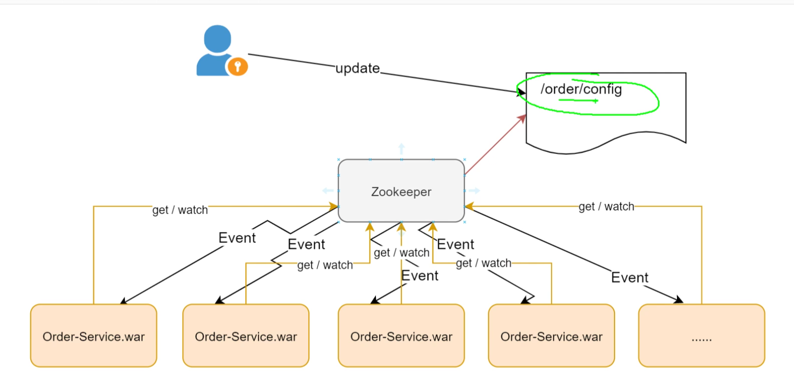
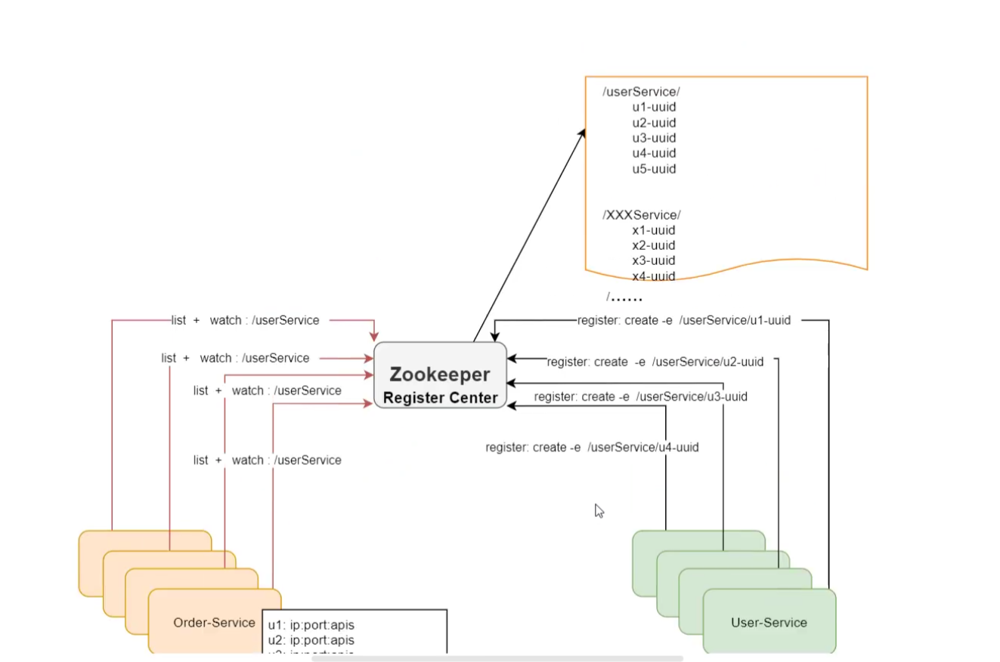
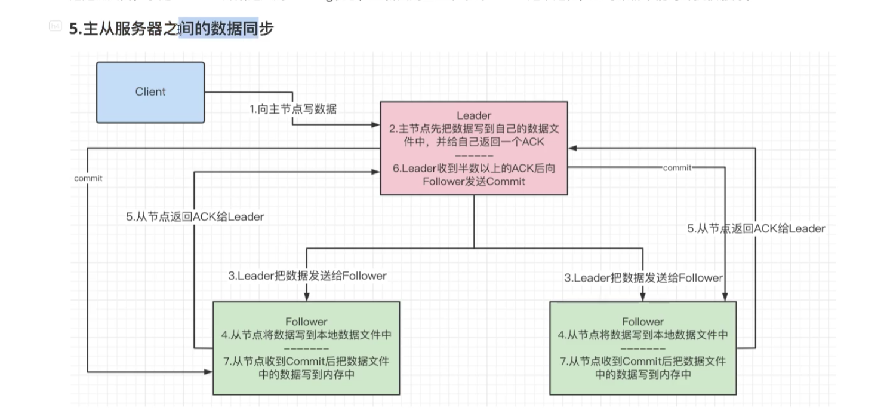
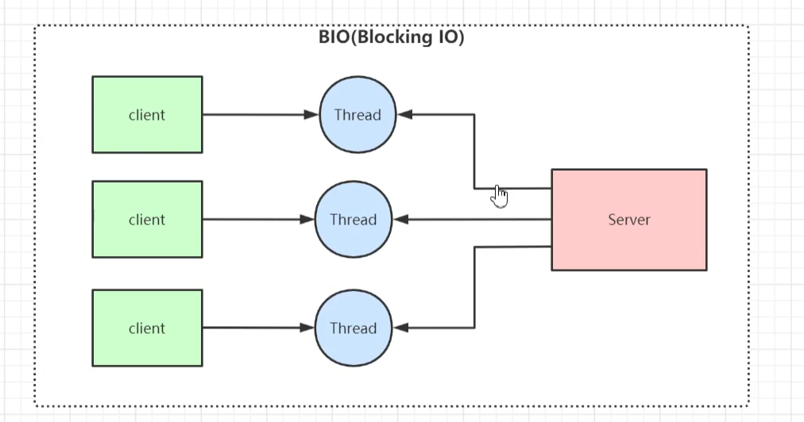
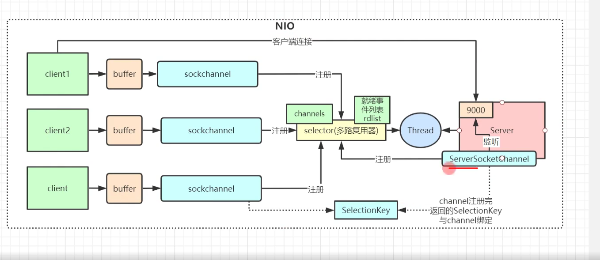
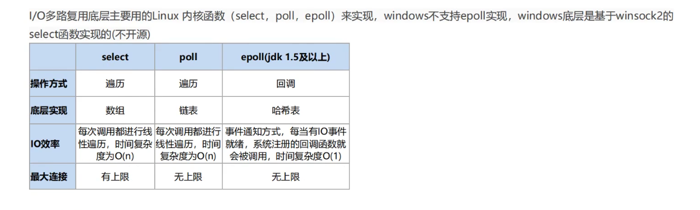

# Zookeeper

作用

- 分布式配置中心

  - create /order/config  

    - ZK创建一个节点，其他应用对这个结点进行监听，当这个结点进行修改时，通过ZK watch机制，会通知应用配置内容进行了修改。**其他Service不需要重启。**

      

- 服务注册与发现

  - 各个服务把自己的ip地址和端口号，api接口信息注册到ZK上（创建临时结点, create -e xxx），A  -> B Service，可以通过ZK获取地址信息(ls -w)。

  - 某台机器移除掉了，ZK这边也会自动更新

    

- 分布式协调组件

- 分布式锁


## 安装启动

## 数据结构

- 结构
  - 树形结构，目录结构
- 结点：ZNode表示
- ZNode
  - 数据
  - 访问权限
  - 结点的元数据信息
  - 子节点

### ZNode类型

- 持久结点

  - 会话结束后，数据依然存在

- 临时结点

  - 会话结束之后自动删除，通过此特性可以实现**服务注册与发现功能**。

    

- 容器结点：当容器结点下面没有任何子节点容器结点会被删除。
- TTL结点：设置TTL存活时间，到期后会被ZK删除。

## 持久化机制

- 事务日志
- 快照

## Curator

- 作用：Netflix开源的Zookeeper客户端框架，封装了大部分Zookeeper功能，比如leader选举，分布式锁等


## ZK实现分布式锁


- **利用ZK不能够重复创建一个临时节点来获取分布式锁**
  - 多个线程竞争创建临时结点，比如第一个线程创建临时结点成功，获取到锁，执行业务逻辑。
  - 其他线程会监听这个结点，是否有锁释放。获取到锁的线程处理完之后释放锁，或者过了锁的TTL时间，也会释放掉锁。
  - 其他线程抢占锁（非公平锁）去创建临时结点，获取到锁，执行业务逻辑
- 缺点
  - **羊群效应**
    - 监听当前节点的所有线程都会收到通知，都会去抢占锁，去创建结点，导致ZK的负载很重，压力很大。
  - 解决羊群效应
    - 
    - 在结点下面创建**临时有序**的节点
    - 判断自己是不是节点下面最小的节点
      - 是 -> 获取锁，加锁成功
      - 不是，加锁失败，对前面的节点进行监听
    - 获取到锁，执行业务逻辑，处理完释放掉锁，通知id最小的节点去获取锁依次类推。**链式监听的方式，而从避免了羊群效应对ZK负载过大的问题**

###  读锁

- 大家都可以读，上读锁的前提是没有写锁
- **如何上读锁**
  - 创建一个**临时序号节点**，节点的数据是read，表示读锁
  - 或者zk中序号比自己小的所有的节点
  - 判断最小节点是否是读锁
    - 是 -》加锁成功
    - 不是，加锁失败，为最小节点设置监听。阻塞等待，zk的watch机制监听到最小节点发生变化的时候通知当前节点，释放锁，当前节点再获取锁进行数据的读取。

### 写锁

- 只有获取到写锁的线程才可以写数据。要想上写锁的前提是之前没有任何线程获取到锁。
- **如何上写锁**
  - 创建一个**临时序号节点**
  - 通过链式监听判断前面的节点是否有加锁，如果有，则获取写锁失败。监听前面一个线程，前面线程获取到锁执行完以后，释放锁，当前节点获取写锁继续执行。

### ZK的Watch机制


- 客户端对某个ZNode节点进行监听，如果该节点发生了create/update/delete操作，**会异步发送事件给客户端。**

- zkCli客户端命令

  ```
  create /test  xxx
  get -w /test 	一次性监听节点
  ls -w /test 	监听目录，创建和删除子节点会触发相应的事件。子节点中新增节点不会收到通知
  ls -R -w /test 	对test目录下的所有节点都监听
  
  
  ```

## Zookeeper集群

- Leader：读和写
- Follower：只读，参与Leader选举
- Observer：只读，不参与Leader选举

## ZAB协议

- 原子广播协议：保证分布式系统数据一致性，解决了Zookeeper的崩溃恢复和数据同步的问题

### ZAB协议节点四种状态

- Looking：选举状态
- Following：Follower节点的状态
- Leading：Leader节点的状态
- Observing：Observer节点的状态

### Leader选举过程

#### 服务器启动的Leader选举


- 3台服务依次启动，至少两台服务器才能够开始选举
- 选票格式(myid, zxid) 
- Server1 -> （1,0）; Server2 -> (2,0); 先为自己生成一张选票，再把选票发给其他服务器。
  - Server1收到Server2的选票，先比较Zxid，谁更大就保留谁的，再比较myid，谁更大就保留谁的。
  - Server1保留（2,0）的选票并把投递到选票中，Server2保留自己的选票投递到选票箱中，第一轮选举结束
- 由于有3台服务器，至少得有两张选票，因此还得继续投票
- 第二轮投票，每台服务器会把自己手上最大的选票投递出去。Server1收到(2,0)，Server2也收到（2,0），比较，把（2,0）选票投递到自己的投递箱中，第二轮投票结束。
- 查看投票箱的票数，已经超过了3/2（**票数过半**），从而选举出Server2为Leader。

#### 服务器在运行过程中的选举（运行期间无法和Leader通信）

- Leader挂了，Follower会把自己的状态由Following改为Looking，进入投票选举
- 第一轮投票投给自己，没有选举出新的Leader
- 第二轮投票开始，跟服务启动时候的选举一致

## 主从数据同步



- Client 向Leader写数据，Leader会把数据先写入磁盘，收到ACK表明数据写完。
- Leader通过广播的方式，让所有的Follower写数据到磁盘，Follower写完之后会发送ACK给Leader
- Leader收到集群数量过半的ACK表明Follower写完数据，Leader发送Commit给Follower
- Follower收到Commit之后会把磁盘里面的内容写到内存里面。

## 集群脑裂

- 集群脑裂：多个数据中心，数据中心之间无法通信，导致某个数据中心内部会选举出一个新的Leader，这样就会有两个Leader。通信恢复之后，造成数据的不一致性。

- Quorums：集群中某个节点得到票数要超过集群中节点数的一半才可以选举成Leader。

## ZK中BIO和NIO

- NIO
  - 客户端开启Watch机制，监听某个节点，使用的是NIO
- BIO
  - 集群选举，Follower之间投票，使用的是BIO进行通信

## CAP理论

- C:一致性
  - 数据一定是最新的

- A:可用性
  - 强调服务可用，但是数据可能不是最新的。

- P:分区容错性
  - **出现网络分区（不同的Data Center）故障**，整个服务还是可用。

### ZK追求的一致性

- CP
- 数据同步的时候追求的不是数据强一致性，而是顺序一致性（事务ID递增）

## BASE理论

- 是对CAP的理论的延伸
  - Basic Available
    - 服务基本可用
  - Soft status
    - 中间状态
  - Eventually Consistency
    - 数据的最终一致性

## BIO,NIO,AIO

- BIO

  

  - **同步阻塞**
  - Client -> Server通信，建立好socket链接，如果Server端是单线程的话，Server端不能够和其他Client进行链接，要一直等待Client发送数据过来。
  - 缺点
    - 如果想支持并发读写，那么每来一个Client和Server端通信，Server就需要创建一个线程和其维持通信，这样的话会出现**C10K的问题**。这就是BIO的问题。
  - 应用场景
    - 适用于**并发小，架构简单**的场景。

- NIO

  

  - 同步非阻塞
  - Non-Blocking IO. 相比BIO而言，客户端和服务端建立好链接之后，服务端不用等着客户端发送数据过来，服务端可以做其他的是事情。
  - 
  - 底层通过**epoll**来实现的。
  - 应用场景
    - **连接数目多，并且连接较短的架构，比如聊天服务器**。

- AIO
  - 异步非阻塞

## IO多路复用

- 用一个线程来处理多个客户端的读写操作
- 客户端和服务端都会注册到**Selector多路复用器**上，并对客户端进行监听，如果客户端有IO操作，那么会触发相应事件通知


## select,poll,epoll区别



